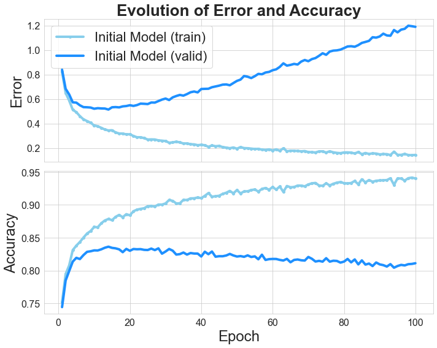

# Evaluation of regularization techniques on a simple Neural Network architecture trained on the Balanced EMNIST dataset
During this study we will explore the dfferent regularisation methods that can be used to address the problem of overfitting in a given Neural Network architecture, using the balanced EMNIST dataset. We will first identify the problem by varying the number of Hidden Units (width) and the number of Hidden Layers (depth) of the network, in order to understand the impact of overfitting for different Network Shapes. Subsequently, we will run different experiments to understand how to solve the initial problem adding Dropout, L1 and L2 Regularisation to a Baseline Model of fixed architecture and hyperparameters. These experiments will all be compared to the Baseline Model in order to find the regularisation method that provides the Baseline Model with the highest Accuracy and lowest overfitting.

## The balanced EMNIST benchmark dataset
All of these experiments will be done on the benchmark balanced EMNIST dataset [(Cohen et al., 2017)](https://arxiv.org/pdf/1702.05373.pdf). This dataset contains 131,600 28x28 px images of 47 different handwritten digits. The training set counts with 100,000 images, the validation set counts 15,800 images, and the test set counts with 15,800 images. At each experiment, the networks will be fed the training set, validated and fine-tuned in the validation set, and the best network will be evaluated on the test set. More on this [here](https://www.nist.gov/itl/products-and-services/emnist-dataset).

## The MLP machine learning framework
For constructing our Neural Network architectures we use the MLP ML Framework, since this study was done within the context of the Machine Learning Practical Course at the University of Edinburgh. The framework is not made available due to school licensing purposes.

## Structure of the post
  - Evaluation_of_Regularisation_Techniques.pdf : This file represents the main file of the post, and we strongly encourage the reader to start by giving it a quick read to understand the project better. If the reader is still curios as to _how_ the results in the study were obtained, we encourage the reader to checkout the next two files.
  - Training-w-mlp-framework.md : this file, accompanied by its ```.ipynb``` version in the ```notebooks``` folder, will walk the reader through the bulding of the Neural Network architectures and the training of these networks with Dropout, L1 Regularisation, and L2 Regularisation. It will also include the hyperparameter search for the best model, and the training and testing of it.
  - Training-Results-Visualizer.mp : this file, accompanied by its ```.ipynb``` version in the ```notebooks``` folder, will go through the plotting and brief analysis of the training results, as well as reporting the test results from the last best model.
 
 ## A sneak peak at some results
Our first network, purposedly designed to show bad generalization performance is a Network for 100 Epochs, using Stocahstic Gradient Descent and Adam optimizer with a mini-batch size of 100, with one Affine Layer composed of 100 Hidden Units followed by a ReLu non-linearity, with learnng rate of 0.001 and all biases and weights initialised to 0. The generalization problem is evident as illustrated by the following figure.



