# Visualizing the results from each group of experiments
This blogpost will focus on overlapping the results from each block of experiments done in ```Training-w-mlp-framework.ipynb```. We will look at the training progress of the models, as well as the final accuracies and losses, which will allow us to choose the best models.

## Initialization of input data and MLP framework
We import the mlp framework which will allow us to process the training and validation data we will use to fine-tune our models. We also import the different blocks that will allow us to build our Neural Network architectures, as well as the weight Initialization techniques, error function, learning rules and optimiser.


```python
import pandas as pd
import matplotlib.pyplot as plt
import numpy as np
import seaborn as sns
sns.set_style("whitegrid")
```

We also define some helper functions that will allow us to train our model and organise the output from this training. We will use the ```export_values``` function to export the training progress of our networks to a ```.csv``` file.


```python
def prepare_results_table(df_list, model_names):
    df_results = pd.concat([df.tail(1) for df in df_list], axis=0)
    df_results.rename(columns={'Unnamed: 0':'Neural Network Model'}, inplace=True)
    df_results.iloc[:,0] = model_names
    df_results = df_results.reset_index(drop=True)
    
    return df_results

def return_results_barplot(df_list):
    train_errors = [list(df['error(train)'])[-1] for df in df_list]
    valid_errors = [list(df['error(valid)'])[-1] for df in df_list]
    train_accuracy = [list(df['acc(train)'])[-1] for df in df_list]
    valid_accuracy = [list(df['acc(valid)'])[-1] for df in df_list]
    
    train_results = [train_errors, train_accuracy]
    valid_results = [valid_errors, valid_accuracy]
    
    return [train_results, valid_results]
```

## 1. Experiments to identify the generalization problem in a Neural Network
We now start by training a very simple Network to identify the generalization problem in the Network. We will first train a model with a single hidden layer and 100 hidden units, but in the following part of the section we will also experiment with usinh 32, 62, and 128 hidden units, as well as 1, 2, and 3 hidden layers.


```python
init_results = pd.read_csv('Results/Baseline_experiments/init_train_valid.csv', index_col=None)
```


```python
def plot_acc_error_evolution(dataset_list):
    fig, axes = plt.subplots(2, 1, figsize = (10,8), sharex=True)

    # Get epoch number for x axis
    epoch_n = range(1, len(dataset_list[0])+1)

    titles = ['Evolution of Error and Accuracy', None]
    acc_error = ['error', 'acc']
    ylabels = ['Error', 'Accuracy']

    for i in range(len(axes)):
        # Plot lines
        axes[i].plot( epoch_n, acc_error[i]+'(train)', data=dataset_list[0], marker='.', markerfacecolor='skyblue', markersize=8, color='skyblue', linewidth=4, label = 'Initial Model (train)')
        axes[i].plot( epoch_n, acc_error[i]+'(valid)', data=dataset_list[0], marker='', color='dodgerblue', linewidth=4, label = 'Initial Model (valid)')
        axes[i].tick_params(axis='both', which='major', labelsize=16)
        axes[i].set_ylabel(ylabels[i], fontsize=24)
        axes[i].set_title(titles[i], fontweight="bold", fontsize=26)
    axes[0].legend(loc='best', prop={'size': 22})
    axes[1].set_xlabel('Epoch', fontsize=24)
    plt.tight_layout()
    plt.show()
```


```python
plot_acc_error_evolution([init_results])
```


    

    


## Understanding the influence of network width and depth on generalization performance of a vanilla Neural network
Let's continue our study by varying the shape of our network, in order to understand how this influences its performance.

### Varying the width of our network
Let's start by varying the number of hidden units.


```python
# Import DataFrames
hu_32_results = pd.read_csv('Results/Baseline_experiments/hu_32_train_valid.csv', index_col=None)
hu_64_results = pd.read_csv('Results/Baseline_experiments/hu_64_train_valid.csv', index_col=None)
hu_128_results = pd.read_csv('Results/Baseline_experiments/hu_128_train_valid.csv', index_col=None)
hu_df_list = [hu_32_results, hu_64_results, hu_128_results]

# Get final results
width_results = prepare_results_table(hu_df_list, 
                                     model_names = ['32 Hidden Units', '64 Hidden Units', '128 Hidden Units'])
width_results
```


<div>
<style scoped>
    .dataframe tbody tr th:only-of-type {
        vertical-align: middle;
    }

    .dataframe tbody tr th {
        vertical-align: top;
    }

    .dataframe thead th {
        text-align: right;
    }
</style>
<table border="1" class="dataframe">
  <thead>
    <tr style="text-align: right;">
      <th></th>
      <th>Neural Network Model</th>
      <th>error(train)</th>
      <th>error(valid)</th>
      <th>acc(train)</th>
      <th>acc(valid)</th>
      <th>runtime</th>
    </tr>
  </thead>
  <tbody>
    <tr>
      <th>0</th>
      <td>32 Hidden Units</td>
      <td>0.481339</td>
      <td>0.663353</td>
      <td>0.83941</td>
      <td>0.798291</td>
      <td>286.767047</td>
    </tr>
    <tr>
      <th>1</th>
      <td>64 Hidden Units</td>
      <td>0.252922</td>
      <td>0.772615</td>
      <td>0.90462</td>
      <td>0.812342</td>
      <td>357.017928</td>
    </tr>
    <tr>
      <th>2</th>
      <td>128 Hidden Units</td>
      <td>0.093742</td>
      <td>1.589502</td>
      <td>0.96235</td>
      <td>0.815127</td>
      <td>495.028269</td>
    </tr>
  </tbody>
</table>
</div>


## Barplots of final accuracy and loss


```python
def barplot_plotter_width(train_results, valid_results, titles):
    N = len(train_results[0])

    ind = np.arange(N)  # the x locations for the groups
    width = 0.35       # the width of the bars

    fig, axes = plt.subplots(1, 2, figsize = (15,7))

    ylabels = ['Error', 'Accuracy']
    
    for i in range(len(axes)):
        rects1 = axes[i].bar(ind, train_results[i], width, color='skyblue')
        rects2 = axes[i].bar(ind + width, valid_results[i], width, color='dodgerblue')

        # add some text for labels, title and axes ticks
        axes[i].set_ylabel(ylabels[i], fontsize=26)
        axes[i].set_xlabel('Number of Hidden Units', fontsize=26)
        axes[i].set_title(titles[i], fontweight="bold", fontsize=28)
        axes[i].set_xticks(ind + width / 2)
        axes[i].tick_params(axis='both', which='major', labelsize=26)
        axes[i].set_xticklabels(('32', '64', '128'))
    axes[0].legend((rects1[0], rects2[0]), ('Train', 'Validation'), loc='upper left', prop={'size': 24})
    plt.show()
```


```python
results = return_results_barplot(df_list = hu_df_list)

barplot_plotter_width(results[0], results[1], 
                      titles=['Train and Validation \nError', 
                       'Train and Validation \nAccuracy'])
```


    
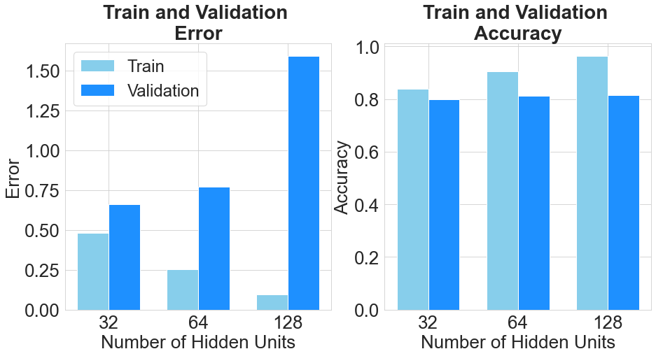
    


## Lineplots of evolution of training and validation error and accuracy


```python
def plot_acc_error_evolution(dataset_list):
    fig, axes = plt.subplots(1, 2, figsize = (15,7))

    # Get epoch number for x axis
    epoch_n = range(1, len(dataset_list[0])+1)

    titles = ['Evolution of Error for different Hidden Units', 'Evolution of Accuracy for different Hidden Units']
    acc_error = ['error', 'acc']
    ylabels = ['Error', 'Accuracy']

    for i in range(len(axes)):
        # Plot lines
        axes[i].plot( epoch_n, acc_error[i]+'(train)', data=dataset_list[0], marker='.', markerfacecolor='lightblue', markersize=8, color='skyblue', linewidth=3, label = '32 Hidden Units (train)')
        axes[i].plot( epoch_n, acc_error[i]+'(valid)', data=dataset_list[0], marker='', color='dodgerblue', linewidth=3, label = '32 Hidden Units(valid)')
        axes[i].plot( epoch_n, acc_error[i]+'(train)', data=dataset_list[1], marker='.', markerfacecolor='orange', markersize=8, color='peachpuff', linewidth=3, label = '64 Hidden Units (train)')
        axes[i].plot( epoch_n, acc_error[i]+'(valid)', data=dataset_list[1], marker='', color='orange', linewidth=3, label = '64 Hidden Units (valid)')
        axes[i].plot( epoch_n, acc_error[i]+'(train)', data=dataset_list[2], marker='.', markerfacecolor='green', markersize=8, color='darkseagreen', linewidth=3, label ='128 Hidden Units(train)')
        axes[i].plot( epoch_n, acc_error[i]+'(valid)', data=dataset_list[2], marker='', color='green', linewidth=3, label = '128 Hiden Units (valid)')
        axes[i].legend(loc='best', prop={'size': 13})
        axes[i].tick_params(axis='both', which='major', labelsize=12)
        axes[i].set_ylabel(ylabels[i], fontsize=14)
        axes[i].set_xlabel('Epoch', fontsize=14)
        axes[i].set_title(titles[i], fontweight="bold", fontsize=14)

    plt.show()
```


```python
plot_acc_error_evolution([hu_32_results, hu_64_results, hu_128_results])
```


    
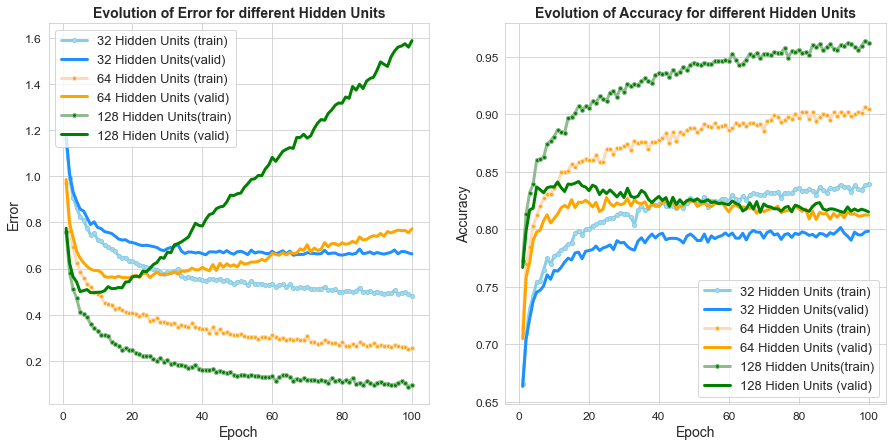
    


### Varying the depth of our network
We can now focus on varying the depth of our network, or the number of hidden layers that we have in the network. We will keep the number of hidden units to 100 throughout this phase of experiments.


```python
hl_1_results = pd.read_csv('Results/Baseline_experiments/hl_1_train_valid.csv', index_col=None)
hl_2_results= pd.read_csv('Results/Baseline_experiments/hl_2_train_valid.csv', index_col=None)
hl_3_results = pd.read_csv('Results/Baseline_experiments/hl_3_train_valid.csv', index_col=None)
hl_df_list = [hl_1_results, hl_2_results, hl_3_results]
```


```python
depth_results = prepare_results_table(df_list=hl_df_list, model_names=['1 Hidden Layer', '2 Hidden Layers',
                                                                      '3 Hidden Layers'])
depth_results
```


<div>
<style scoped>
    .dataframe tbody tr th:only-of-type {
        vertical-align: middle;
    }

    .dataframe tbody tr th {
        vertical-align: top;
    }

    .dataframe thead th {
        text-align: right;
    }
</style>
<table border="1" class="dataframe">
  <thead>
    <tr style="text-align: right;">
      <th></th>
      <th>Neural Network Model</th>
      <th>error(train)</th>
      <th>error(valid)</th>
      <th>acc(train)</th>
      <th>acc(valid)</th>
      <th>runtime</th>
    </tr>
  </thead>
  <tbody>
    <tr>
      <th>0</th>
      <td>1 Hidden Layer</td>
      <td>0.096132</td>
      <td>1.537700</td>
      <td>0.96183</td>
      <td>0.817405</td>
      <td>491.026577</td>
    </tr>
    <tr>
      <th>1</th>
      <td>2 Hidden Layers</td>
      <td>0.125876</td>
      <td>1.698157</td>
      <td>0.95426</td>
      <td>0.818481</td>
      <td>612.023386</td>
    </tr>
    <tr>
      <th>2</th>
      <td>3 Hidden Layers</td>
      <td>0.121309</td>
      <td>1.397960</td>
      <td>0.95440</td>
      <td>0.823797</td>
      <td>705.784438</td>
    </tr>
  </tbody>
</table>
</div>


## Barplots of final accuracy and loss


```python
def barplot_plotter_depth(train_results, valid_results, titles):
    N = len(train_results[0])

    ind = np.arange(N)  # the x locations for the groups
    width = 0.35       # the width of the bars

    fig, axes = plt.subplots(1, 2, figsize = (15,7))

    ylabels = ['Error', 'Accuracy']
    
    for i in range(len(axes)):
        rects1 = axes[i].bar(ind, train_results[i], width, color='skyblue')
        rects2 = axes[i].bar(ind + width, valid_results[i], width, color='dodgerblue')

        # add some text for labels, title and axes ticks
        axes[i].set_ylabel(ylabels[i], fontsize=26)
        axes[i].set_xlabel('Number of Hidden Layers', fontsize=26)
        axes[i].set_title(titles[i], fontweight="bold", fontsize=28)
        axes[i].set_xticks(ind + width / 2)
        axes[i].tick_params(axis='both', which='major', labelsize=26)
        axes[i].set_xticklabels(('1', '2', '3'))
    
    axes[0].legend((rects1[0], rects2[0]), ('Train', 'Validation'), loc='upper left', prop={'size': 24})
    plt.show()
```


```python
results = return_results_barplot(df_list = hl_df_list)
barplot_plotter_depth(results[0], results[1], 
                     ['Train and Validation \nError',
                      'Train and Validation \nAccuracy'])
```


    
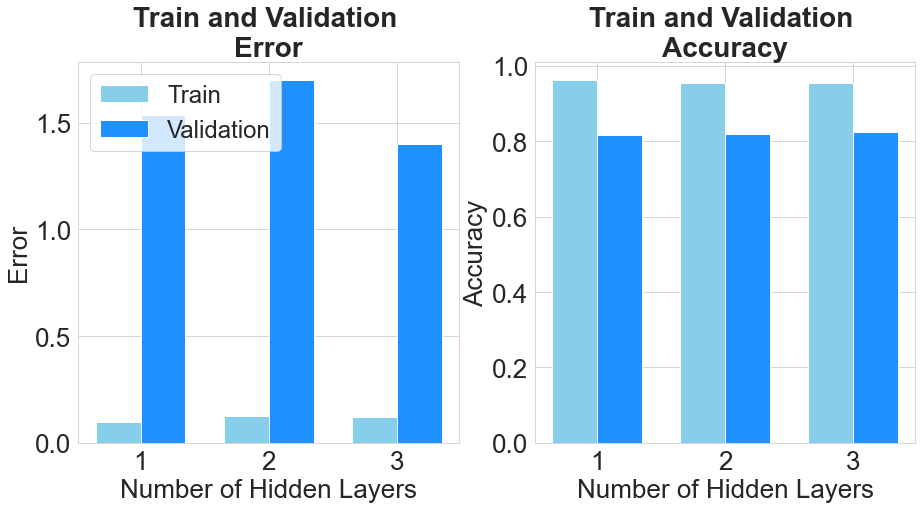
    


## Lineplots of evolution of training and validation error and accuracy


```python
def plot_acc_error_evolution(dataset_list):
    fig, axes = plt.subplots(1, 2, figsize = (15,7))

    # Get epoch number for x axis
    epoch_n = range(1, len(dataset_list[0])+1)

    titles = ['Evolution of Error for different Hidden Layers', 'Evolution of Accuracy for different Hidden Layers']
    acc_error = ['error', 'acc']
    ylabels = ['Error', 'Accuracy']

    for i in range(len(axes)):
        # Plot lines
        axes[i].plot( epoch_n, acc_error[i]+'(train)', data=dataset_list[0], marker='.', markerfacecolor='lightblue', markersize=8, color='skyblue', linewidth=3, label = '1 Hidden Layer( train)')
        axes[i].plot( epoch_n, acc_error[i]+'(valid)', data=dataset_list[0], marker='', color='dodgerblue', linewidth=3, label = '1 Hidden Layer (validation)')
        axes[i].plot( epoch_n, acc_error[i]+'(train)', data=dataset_list[1], marker='.', markerfacecolor='orange', markersize=8, color='peachpuff', linewidth=3, label = '2 Hidden Layers (train)')
        axes[i].plot( epoch_n, acc_error[i]+'(valid)', data=dataset_list[1], marker='', color='orange', linewidth=3, label = '2 Hidden Layers (validation)')
        axes[i].plot( epoch_n, acc_error[i]+'(train)', data=dataset_list[2], marker='.', markerfacecolor='green', markersize=8, color='darkseagreen', linewidth=3, label ='3 Hidden Layers (train)')
        axes[i].plot( epoch_n, acc_error[i]+'(valid)', data=dataset_list[2], marker='', color='green', linewidth=3, label = '3 Hidden Layers(validation)')
        axes[i].legend(loc='best', prop={'size': 13})
        axes[i].tick_params(axis='both', which='major', labelsize=12)
        axes[i].set_ylabel(ylabels[i], fontsize=14)
        axes[i].set_xlabel('Epoch', fontsize=14)
        axes[i].set_title(titles[i], fontweight="bold", fontsize=14)

    plt.show()
```


```python
plot_acc_error_evolution([hu_32_results, hu_64_results, hu_128_results])
```


    
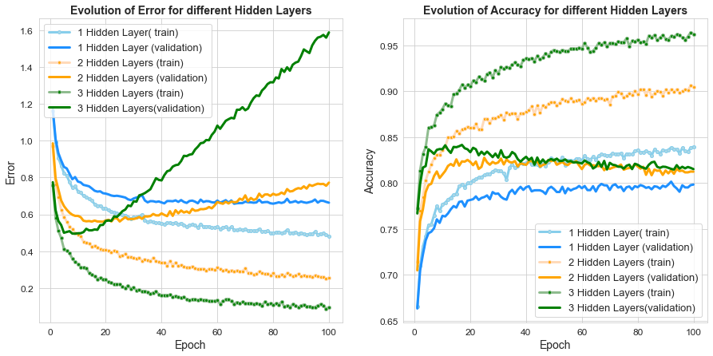
    


## 2. Experiments to mitigate the problem using Dropout 
We now look at the effect of Dropout in our Baseline model. For this, we define three models with different Dropout inclusion probabilites at each time.

### Import results from Baseline Experiments


```python
baseline_df = pd.read_csv('Results/EMNIST_experiments/bl_train_valid.csv', index_col=None)
```

### Get best results from all Dropout models


```python
d_02_results = pd.read_csv('Results/EMNIST_experiments/Dropout/d_02_train_valid.csv', index_col=None)
d_05_results = pd.read_csv('Results/EMNIST_experiments/Dropout/d_05_train_valid.csv', index_col=None)
d_decf_results = pd.read_csv('Results/EMNIST_experiments/Dropout/d_decf_train_valid.csv', index_col=None)

d_df_list = [d_02_results, d_05_results, d_decf_results, baseline_df]
dropout_results = prepare_results_table(df_list = d_df_list, model_names = ['Inclusion Probability = 0.2', 
                                                                           'Inclusion Probability = 0.5', 
                                                                            'Decreasing Inclusion Probability', 
                                                                           'Baseline Model'])
dropout_results
```


<div>
<style scoped>
    .dataframe tbody tr th:only-of-type {
        vertical-align: middle;
    }

    .dataframe tbody tr th {
        vertical-align: top;
    }

    .dataframe thead th {
        text-align: right;
    }
</style>
<table border="1" class="dataframe">
  <thead>
    <tr style="text-align: right;">
      <th></th>
      <th>Neural Network Model</th>
      <th>error(train)</th>
      <th>error(valid)</th>
      <th>acc(train)</th>
      <th>acc(valid)</th>
      <th>runtime</th>
    </tr>
  </thead>
  <tbody>
    <tr>
      <th>0</th>
      <td>Inclusion Probability = 0.2</td>
      <td>2.446614</td>
      <td>2.475923</td>
      <td>0.27379</td>
      <td>0.266456</td>
      <td>1178.973976</td>
    </tr>
    <tr>
      <th>1</th>
      <td>Inclusion Probability = 0.5</td>
      <td>0.979093</td>
      <td>1.046985</td>
      <td>0.69619</td>
      <td>0.678734</td>
      <td>1045.238297</td>
    </tr>
    <tr>
      <th>2</th>
      <td>Decreasing Inclusion Probability</td>
      <td>0.920588</td>
      <td>1.042988</td>
      <td>0.71094</td>
      <td>0.688418</td>
      <td>1108.892405</td>
    </tr>
    <tr>
      <th>3</th>
      <td>Baseline Model</td>
      <td>0.127733</td>
      <td>1.452153</td>
      <td>0.95193</td>
      <td>0.824304</td>
      <td>673.939135</td>
    </tr>
  </tbody>
</table>
</div>


## Barplots of final accuracy and loss


```python
def barplot_plotter_width(train_results, valid_results, titles):
    N = len(train_results[0])
    
    ind = np.arange(N)  # the x locations for the groups
    width = 0.35       # the width of the bars

    fig, axes = plt.subplots(1, 2, figsize = (15,7))

    ylabels = ['Error', 'Accuracy']
    
    for i in range(len(axes)):
        rects1 = axes[i].bar(ind, train_results[i], width, color='skyblue')
        rects2 = axes[i].bar(ind + width, valid_results[i], width, color='dodgerblue')
        
        rects1[-1].set_color('darkgrey')
        rects2[-1].set_color('lightgrey')

        # add some text for labels, title and axes ticks
        axes[i].set_ylabel(ylabels[i], fontsize=26)
        axes[i].set_title(titles[i], fontweight="bold", fontsize=28)
        axes[i].set_xticks(ind + width / 2)
        axes[i].set_xticklabels(('Model 1', 'Model 2', 'Model 3', 'Baseline\nModel'), rotation= 45)
        axes[i].tick_params(axis='both', which='major', labelsize=26)
    axes[0].legend((rects1[0], rects2[0]), ('Train', 'Validation'), loc='best', prop={'size': 24})
        

    plt.show()
```


```python
results = return_results_barplot(df_list = d_df_list)

barplot_plotter_width(results[0], results[1], 
                      ['Train and Validation \nError', 
                       'Train and Validation \nAccuracy'])
```


    
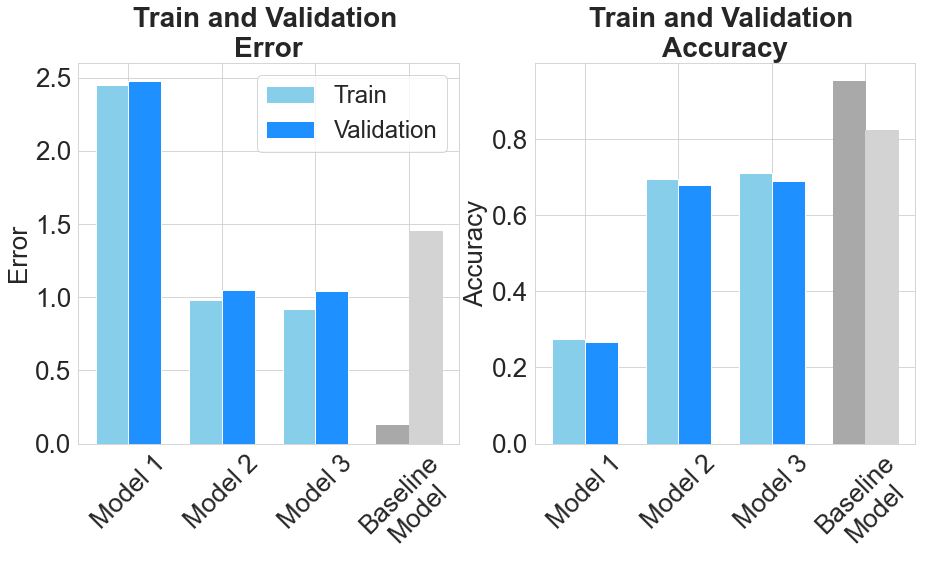
    


## Lineplots of evolution of training and validation error and accuracy


```python
def plot_acc_error_evolution(dataset_list):
    fig, axes = plt.subplots(1, 2, figsize = (15,7))

    # Get epoch number for x axis
    epoch_n = range(1, len(dataset_list[0])+1)

    titles = ['Evolution of Error and Accuracy with Dropout', 
              None]
    acc_error = ['error', 'acc']
    ylabels = ['Error', 'Accuracy']

    for i in range(len(axes)):
        # Plot lines
        axes[i].plot( epoch_n, acc_error[i]+'(train)', data=dataset_list[0], marker='.', markerfacecolor='lightblue', markersize=8, color='skyblue', linewidth=4, label = '0.2(train)')
        axes[i].plot( epoch_n, acc_error[i]+'(valid)', data=dataset_list[0], marker='', color='dodgerblue', linewidth=4, label = '0.2(valid)')
        axes[i].plot( epoch_n, acc_error[i]+'(train)', data=dataset_list[1], marker='.', markerfacecolor='orange', markersize=8, color='peachpuff', linewidth=4, label = '0.5(train)')
        axes[i].plot( epoch_n, acc_error[i]+'(valid)', data=dataset_list[1], marker='', color='orange', linewidth=4, label = '0.5(valid)')
        axes[i].plot( epoch_n, acc_error[i]+'(train)', data=dataset_list[2], marker='.', markerfacecolor='green', markersize=8, color='darkseagreen', linewidth=4, label ='DF(train)')
        axes[i].plot( epoch_n, acc_error[i]+'(valid)', data=dataset_list[2], marker='', color='green', linewidth=4, label = 'DF(valid)')
        axes[i].plot( epoch_n, acc_error[i]+'(train)', data=dataset_list[3], marker='.', markerfacecolor='lightgrey', markersize=8, color='lightgrey', linewidth=4, label ='BM(train)')
        axes[i].plot( epoch_n, acc_error[i]+'(valid)', data=dataset_list[3], marker='', color='darkgrey', linewidth=4,label = 'BM(valid)')
        axes[i].tick_params(axis='both', which='major', labelsize=20)
        axes[i].set_ylabel(ylabels[i], fontsize=20)
        axes[i].set_title(titles[i], fontweight="bold", fontsize=20)
    
    axes[0].legend(prop={'size': 20}, loc='upper left',)
    axes[1].set_xlabel('Epoch', fontsize=20)
    plt.tight_layout()
    plt.show()
```


```python
plot_acc_error_evolution(d_df_list)
```


    
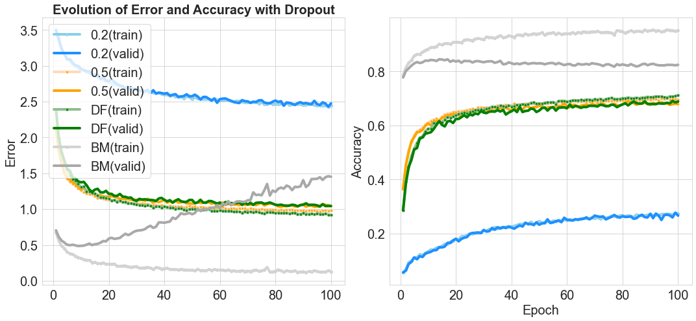
    


# Analysis and Plotting of L1 Regularisation Experiments compared to Baseline

## Analysis of results from varying the width of the network compared to initial network


```python
L1_1e_4_results = pd.read_csv('Results/EMNIST_experiments/L1_reg/L1_1e_4_train_valid.csv', index_col=None)
L1_1e_2_results = pd.read_csv('Results/EMNIST_experiments/L1_reg/L1_1e_2_train_valid.csv', index_col=None)
L1__incf_results = pd.read_csv('Results/EMNIST_experiments/L1_reg/L1_incf_train_valid.csv', index_col=None)

L1_df_list = [L1_1e_4_results, L1_1e_2_results, L1__incf_results, baseline_df]
L1_results = prepare_results_table(df_list = L1_df_list, model_names = ['Weight Penalty = 1e-4', 
                                                                           'Weight Penalty = 1e-2', 
                                                                            'Increasing Weight Penalty', 
                                                                           'Baseline Model'])
L1_results
```


<div>
<style scoped>
    .dataframe tbody tr th:only-of-type {
        vertical-align: middle;
    }

    .dataframe tbody tr th {
        vertical-align: top;
    }

    .dataframe thead th {
        text-align: right;
    }
</style>
<table border="1" class="dataframe">
  <thead>
    <tr style="text-align: right;">
      <th></th>
      <th>Neural Network Model</th>
      <th>error(train)</th>
      <th>error(valid)</th>
      <th>acc(train)</th>
      <th>acc(valid)</th>
      <th>runtime</th>
    </tr>
  </thead>
  <tbody>
    <tr>
      <th>0</th>
      <td>Weight Penalty = 1e-4</td>
      <td>0.325711</td>
      <td>0.433294</td>
      <td>0.87976</td>
      <td>0.852089</td>
      <td>801.795396</td>
    </tr>
    <tr>
      <th>1</th>
      <td>Weight Penalty = 1e-2</td>
      <td>3.850118</td>
      <td>3.850548</td>
      <td>0.02175</td>
      <td>0.019810</td>
      <td>771.460007</td>
    </tr>
    <tr>
      <th>2</th>
      <td>Increasing Weight Penalty</td>
      <td>3.850121</td>
      <td>3.850513</td>
      <td>0.02174</td>
      <td>0.020127</td>
      <td>775.329974</td>
    </tr>
    <tr>
      <th>3</th>
      <td>Baseline Model</td>
      <td>0.127733</td>
      <td>1.452153</td>
      <td>0.95193</td>
      <td>0.824304</td>
      <td>673.939135</td>
    </tr>
  </tbody>
</table>
</div>


## Visualising the results

### Barplots of final accuracy


```python
def barplot_plotter_width(train_results, valid_results, titles):
    N = len(train_results[0])
    
    ind = np.arange(N)  # the x locations for the groups
    width = 0.35       # the width of the bars

    fig, axes = plt.subplots(1, 2, figsize = (15,7))

    ylabels = ['Error', 'Accuracy']
    
    for i in range(len(axes)):
        rects1 = axes[i].bar(ind, train_results[i], width, color='green')
        rects2 = axes[i].bar(ind + width, valid_results[i], width, color='darkseagreen')
        
        rects1[-1].set_color('darkgrey')
        rects2[-1].set_color('lightgrey')

        # add some text for labels, title and axes ticks
        axes[i].set_ylabel(ylabels[i], fontsize=14)
        axes[i].set_xlabel('Weight Penalty', fontsize=14)
        axes[i].set_title(titles[i], fontweight="bold", fontsize=15)
        axes[i].set_xticks(ind + width / 2)
        axes[i].set_xticklabels(('1e-4', '1e-2', 'Increasing Weight \nPenalty', 'Baseline Model'))
        axes[i].tick_params(axis='both', which='major', labelsize=12)
        axes[i].legend((rects1[0], rects2[0]), ('Train', 'Validation'), loc='best', prop={'size': 13})
        
    plt.show()
```


```python
results = return_results_barplot(df_list = L1_df_list)

barplot_plotter_width(results[0], results[1], 
                      ['Train and Validation Errors for L1 Regularisation\n with different Weight Penalties', 
                       'Train and Validation Accuracy for L1 Regularisation\n with different Weight Penalties'])
```


    
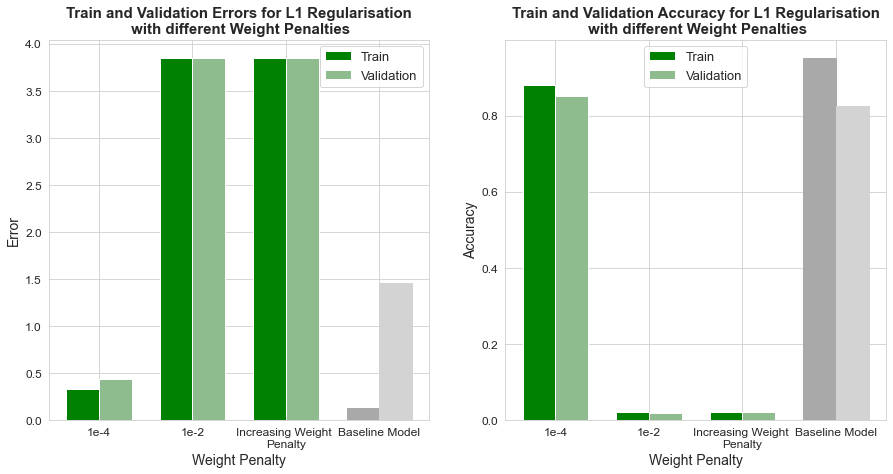
    


### Lineplots of evolution of training and validation error and accuracy


```python
def plot_acc_error_evolution(dataset_list):
    fig, axes = plt.subplots(1, 2, figsize = (15,7))

    # Get epoch number for x axis
    epoch_n = range(1, len(dataset_list[0])+1)

    titles = ['Evolution of Error for L1 Regularisation\n with different Weight Penalties', 
              'Evolution of Accuracy for L1 Regularisation\n with different Weight Penalties']
    acc_error = ['error', 'acc']
    ylabels = ['Error', 'Accuracy']

    for i in range(len(axes)):
        # Plot lines
        axes[i].plot( epoch_n, acc_error[i]+'(train)', data=dataset_list[0], marker='.', markerfacecolor='lightblue', markersize=8, color='skyblue', linewidth=3, label = '1e-4(train)')
        axes[i].plot( epoch_n, acc_error[i]+'(valid)', data=dataset_list[0], marker='', color='dodgerblue', linewidth=3, label = '1e-4(valid)')
        #axes[i].plot( epoch_n, acc_error[i]+'(train)', data=dataset_list[1], marker='.', markerfacecolor='orange', markersize=8, color='peachpuff', linewidth=3, label = '1e-2(train)')
        #axes[i].plot( epoch_n, acc_error[i]+'(valid)', data=dataset_list[1], marker='', color='orange', linewidth=3, label = '1e-2(valid)')
        #axes[i].plot( epoch_n, acc_error[i]+'(train)', data=dataset_list[2], marker='.', markerfacecolor='green', markersize=8, color='darkseagreen', linewidth=3, label ='IF(train)')
        #axes[i].plot( epoch_n, acc_error[i]+'(valid)', data=dataset_list[2], marker='', color='green', linewidth=3, label = 'IF(valid)')
        axes[i].plot( epoch_n, acc_error[i]+'(train)', data=dataset_list[3], marker='.', markerfacecolor='lightgrey', markersize=8, color='lightgrey', linewidth=3, label ='BM(train)')
        axes[i].plot( epoch_n, acc_error[i]+'(valid)', data=dataset_list[3], marker='', color='darkgrey', linewidth=2, label = 'BM(valid)')
        axes[i].legend(loc='best', prop={'size': 13})
        axes[i].tick_params(axis='both', which='major', labelsize=12)
        axes[i].set_ylabel(ylabels[i], fontsize=14)
        axes[i].set_xlabel('Epoch', fontsize=14)
        axes[i].set_title(titles[i], fontweight="bold", fontsize=14)

    plt.show()
```


```python
plot_acc_error_evolution(L1_df_list)
```


    
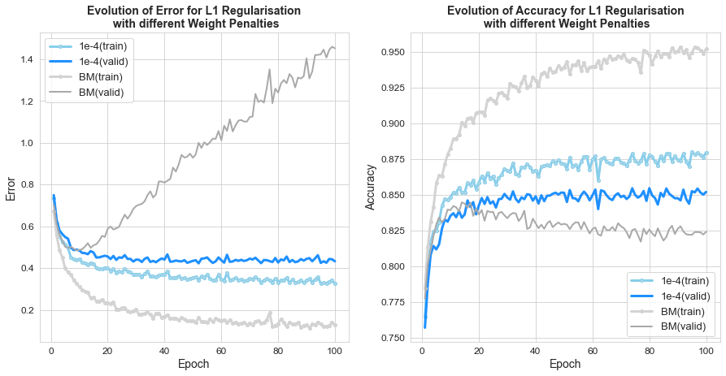
    


## 3. Experiments to mitigate the problem using L1 and L2 Regularisation techniques
We now use L2 Regularisation and L1 Regularisation to mitigate the problem.


```python
L1_1e_4_results = pd.read_csv('Results/EMNIST_experiments/L1_reg/L1_1e_4_train_valid.csv', index_col=None)
L1_1e_2_results = pd.read_csv('Results/EMNIST_experiments/L1_reg/L1_1e_2_train_valid.csv', index_col=None)
L1_incf_results = pd.read_csv('Results/EMNIST_experiments/L1_reg/L1_incf_train_valid.csv', index_col=None)
L2_1e_4_results = pd.read_csv('Results/EMNIST_experiments/L2_reg/L2_1e_4_train_valid.csv', index_col=None)
L2_1e_2_results = pd.read_csv('Results/EMNIST_experiments/L2_reg/L2_1e_2_train_valid.csv', index_col=None)
L2_incf_results = pd.read_csv('Results/EMNIST_experiments/L2_reg/L2_incf_train_valid.csv', index_col=None)

L12_df_list = [L1_1e_4_results, L1_1e_2_results, L1_incf_results, 
              L2_1e_4_results, L2_1e_2_results, L2_incf_results, baseline_df]
L12_results = prepare_results_table(df_list = L12_df_list, model_names = ['L1 WP = 1e-4','L1 WP = 1e-2', 
                                                                        'L1 Increasing WP','L2 WP = 1e-4','L2 WP = 1e-2', 
                                                                        'L2 Increasing WP', 'Baseline Model'])
L12_results
```


<div>
<style scoped>
    .dataframe tbody tr th:only-of-type {
        vertical-align: middle;
    }

    .dataframe tbody tr th {
        vertical-align: top;
    }

    .dataframe thead th {
        text-align: right;
    }
</style>
<table border="1" class="dataframe">
  <thead>
    <tr style="text-align: right;">
      <th></th>
      <th>Neural Network Model</th>
      <th>error(train)</th>
      <th>error(valid)</th>
      <th>acc(train)</th>
      <th>acc(valid)</th>
      <th>runtime</th>
    </tr>
  </thead>
  <tbody>
    <tr>
      <th>0</th>
      <td>L1 WP = 1e-4</td>
      <td>0.325711</td>
      <td>0.433294</td>
      <td>0.87976</td>
      <td>0.852089</td>
      <td>801.795396</td>
    </tr>
    <tr>
      <th>1</th>
      <td>L1 WP = 1e-2</td>
      <td>3.850118</td>
      <td>3.850548</td>
      <td>0.02175</td>
      <td>0.019810</td>
      <td>771.460007</td>
    </tr>
    <tr>
      <th>2</th>
      <td>L1 Increasing WP</td>
      <td>3.850121</td>
      <td>3.850513</td>
      <td>0.02174</td>
      <td>0.020127</td>
      <td>775.329974</td>
    </tr>
    <tr>
      <th>3</th>
      <td>L2 WP = 1e-4</td>
      <td>0.151262</td>
      <td>0.666996</td>
      <td>0.93947</td>
      <td>0.840380</td>
      <td>1363.591212</td>
    </tr>
    <tr>
      <th>4</th>
      <td>L2 WP = 1e-2</td>
      <td>0.774518</td>
      <td>0.789742</td>
      <td>0.76677</td>
      <td>0.762722</td>
      <td>758.966864</td>
    </tr>
    <tr>
      <th>5</th>
      <td>L2 Increasing WP</td>
      <td>0.440904</td>
      <td>0.519609</td>
      <td>0.85299</td>
      <td>0.827658</td>
      <td>1131.049237</td>
    </tr>
    <tr>
      <th>6</th>
      <td>Baseline Model</td>
      <td>0.127733</td>
      <td>1.452153</td>
      <td>0.95193</td>
      <td>0.824304</td>
      <td>673.939135</td>
    </tr>
  </tbody>
</table>
</div>


```python
best_L12_results = [L1_1e_4_results, L2_incf_results, baseline_df]
```

## Barplots of final accuracy and loss


```python
def barplot_plotter_width(train_results, valid_results, titles):
    N = len(train_results[0])
    
    ind = np.arange(N)  # the x locations for the groups
    width = 0.35       # the width of the bars

    fig, axes = plt.subplots(1, 2, figsize = (15,7))

    ylabels = ['Error', 'Accuracy']
    
    for i in range(len(axes)):
        rects1 = axes[i].bar(ind, train_results[i], width, color='skyblue')
        rects2 = axes[i].bar(ind + width, valid_results[i], width, color='dodgerblue')
        
        rects1[-1].set_color('darkgrey')
        rects2[-1].set_color('lightgrey')

        # add some text for labels, title and axes ticks
        axes[i].set_ylabel(ylabels[i], fontsize=26)
        axes[i].set_title(titles[i], fontweight="bold", fontsize=28)
        axes[i].set_xticks(ind + width / 2)
        axes[i].set_xticklabels(('Model 1', 'Model 6', 'Baseline\nModel'), rotation= 45)
        axes[i].tick_params(axis='both', which='major', labelsize=26)
    axes[0].legend((rects1[0], rects2[0]), ('Train', 'Validation'), loc='best', prop={'size': 26})
        
    plt.show()
```


```python
results = return_results_barplot(df_list = best_L12_results)

barplot_plotter_width(results[0], results[1], 
                      ['Train and Validation\nError', 
                       'Train and Validation\nAccuracy'])
```


    
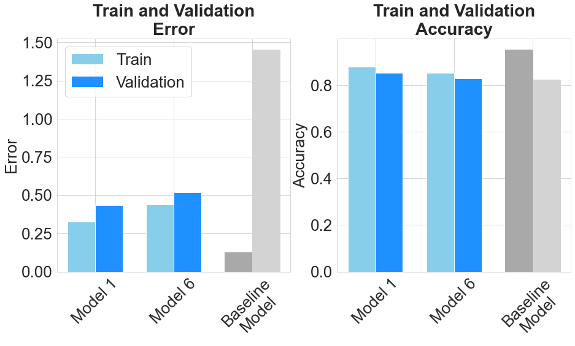
    


## Lineplots of evolution of training and validation error and accuracy


```python
def plot_acc_error_evolution(dataset_list):
    fig, axes = plt.subplots(2, 1, figsize = (13,13), sharex=True)

    # Get epoch number for x axis
    epoch_n = range(1, len(dataset_list[0])+1)

    titles = ['Evolution of Error for L2 Regularisation\n with different Weight Penalties', 
              'Evolution of Accuracy for L2 Regularisation\n with different Weight Penalties']
    acc_error = ['error', 'acc']
    ylabels = ['Error', 'Accuracy']

    for i in range(len(axes)):
        # Plot lines
        axes[i].plot( epoch_n, acc_error[i]+'(train)', data=dataset_list[0], marker='.', markerfacecolor='lightblue', markersize=10, color='skyblue', linewidth=3, label = 'Model 1 (train)')
        axes[i].plot( epoch_n, acc_error[i]+'(valid)', data=dataset_list[0], marker='', color='dodgerblue', linewidth=3, label = 'Model 1 (valid)')
        axes[i].plot( epoch_n, acc_error[i]+'(train)', data=dataset_list[1], marker='.', markerfacecolor='orange', markersize=10, color='peachpuff', linewidth=3, label = 'Model 6 (train)')
        axes[i].plot( epoch_n, acc_error[i]+'(valid)', data=dataset_list[1], marker='', color='orange', linewidth=3, label = 'Model 6 (valid)')
        axes[i].plot( epoch_n, acc_error[i]+'(train)', data=dataset_list[2], marker='.', markerfacecolor='grey', markersize=10, color='grey', linewidth=3, label ='Baseline Model (train)')
        axes[i].plot( epoch_n, acc_error[i]+'(valid)', data=dataset_list[2], marker='', color='darkgrey', linewidth=3, label = 'Baseline Model (valid)')
        axes[i].tick_params(axis='both', which='major', labelsize=24)
        axes[i].set_ylabel(ylabels[i], fontsize=24)
        
    axes[0].legend(loc='best', prop={'size': 20})
    axes[1].set_xlabel('Epoch', fontsize=26)
    axes[0].set_title('Evolution of Error and Accuracy\n for the best L1 and L2 models', fontweight="bold", fontsize=28)
    
    plt.tight_layout()
    plt.show()
    plt.show()
```


```python
plot_acc_error_evolution(best_L12_results)
```


    
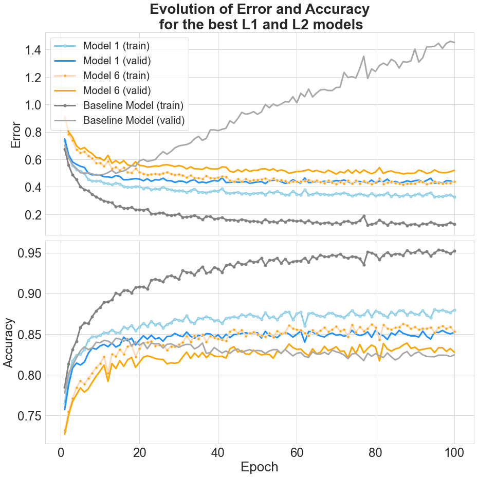
    


## 4. Experiments to mitigate the problem using L1 Regularisation and Dropout
For this part of the study, we use L1 Regularisation, since it shows better performance than L2 Regularisation, and we combine it with Dropout to investigate its effect on the generalization performance.


```python
d05_L1_1e4_results = pd.read_csv('Results/EMNIST_experiments/Dropout_L1/d05_L1_1e4_train_valid.csv', index_col=None)
d08_L1_1e2_results = pd.read_csv('Results/EMNIST_experiments/Dropout_L1/d08_L1_1e2_train_valid.csv', index_col=None)
ddecf_L1incf_results = pd.read_csv('Results/EMNIST_experiments/Dropout_L1/ddecf_L1incf_train_valid.csv', index_col=None)

d_L1_df_list = [d08_L1_1e4_results, d05_L1_1e2_results, ddecf_L1incf_results, baseline_df]
d_L1_results = prepare_results_table(df_list = d_L1_df_list, model_names = ['Inclusion Probability =0.8, Weight Penalty = 1e-2', 'Inclusion Probability =0.5, Weight Penalty = 1e-4', 
                                                                            'Decreasing Incl. Prob, Increasing Weight Penalty', 
                                                                           'Baseline Model'])
d_L1_results
```


<div>
<style scoped>
    .dataframe tbody tr th:only-of-type {
        vertical-align: middle;
    }

    .dataframe tbody tr th {
        vertical-align: top;
    }

    .dataframe thead th {
        text-align: right;
    }
</style>
<table border="1" class="dataframe">
  <thead>
    <tr style="text-align: right;">
      <th></th>
      <th>Neural Network Model</th>
      <th>error(train)</th>
      <th>error(valid)</th>
      <th>acc(train)</th>
      <th>acc(valid)</th>
      <th>runtime</th>
    </tr>
  </thead>
  <tbody>
    <tr>
      <th>0</th>
      <td>Inclusion Probability =0.8, Weight Penalty = 1e-2</td>
      <td>0.619626</td>
      <td>0.654141</td>
      <td>0.79530</td>
      <td>0.788101</td>
      <td>1442.671811</td>
    </tr>
    <tr>
      <th>1</th>
      <td>Inclusion Probability =0.5, Weight Penalty = 1e-4</td>
      <td>3.850118</td>
      <td>3.850460</td>
      <td>0.02175</td>
      <td>0.019810</td>
      <td>1389.823015</td>
    </tr>
    <tr>
      <th>2</th>
      <td>Decreasing Incl. Prob, Increasing Weight Penalty</td>
      <td>0.990167</td>
      <td>1.037622</td>
      <td>0.69222</td>
      <td>0.678228</td>
      <td>1147.760271</td>
    </tr>
    <tr>
      <th>3</th>
      <td>Baseline Model</td>
      <td>0.127733</td>
      <td>1.452153</td>
      <td>0.95193</td>
      <td>0.824304</td>
      <td>673.939135</td>
    </tr>
  </tbody>
</table>
</div>


```python
d_L1_results.to_latex('d_l1_table_results.txt')
```

## Barplots of final accuracy and loss


```python
def barplot_plotter_width(train_results, valid_results, titles):
    N = len(train_results[0])
    
    ind = np.arange(N)  # the x locations for the groups
    width = 0.35       # the width of the bars

    fig, axes = plt.subplots(1, 2, figsize = (15,7), sharex=True)

    ylabels = ['Error', 'Accuracy']
    
    for i in range(len(axes)):
        rects1 = axes[i].bar(ind, train_results[i], width, color='skyblue')
        rects2 = axes[i].bar(ind + width, valid_results[i], width, color='dodgerblue')
        
        rects1[-1].set_color('darkgrey')
        rects2[-1].set_color('lightgrey')

        # add some text for labels, title and axes ticks
        axes[i].set_ylabel(ylabels[i], fontsize=26)
        axes[i].set_title(titles[i], fontweight="bold", fontsize=28)
        axes[i].set_xticks(ind + width / 2)
        axes[i].set_xticklabels(('Model 1', 'Model 2', 'Model 3', 'Baseline Model'), rotation=40)
        axes[i].tick_params(axis='both', which='major', labelsize=26)
    axes[0].legend((rects1[0], rects2[0]), ('Train', 'Validation'), loc='best', prop={'size': 24})
        
    plt.show()
```


```python
results = return_results_barplot(df_list = d_L1_df_list)

barplot_plotter_width(results[0], results[1], 
                      ['Train and Validation\nErrors', 
                       'Train and Validation\nAccuracy'])
```


    
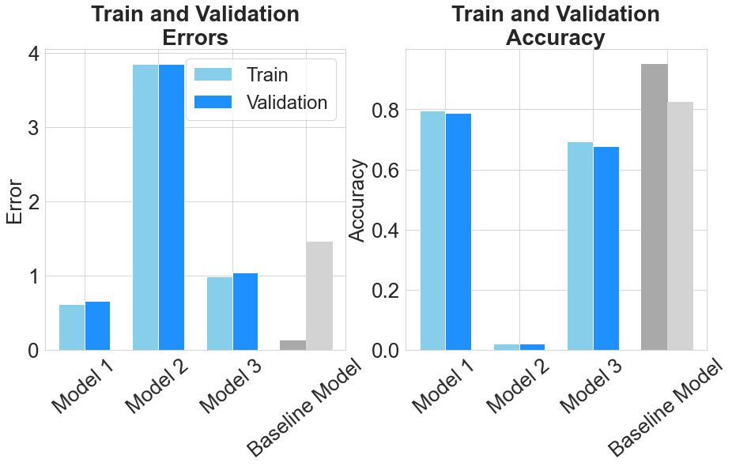
    


## Lineplots of evolution of training and validation error and accuracy


```python
def plot_acc_error_evolution(dataset_list):
    fig, axes = plt.subplots(1, 2, figsize = (20,7))

    # Get epoch number for x axis
    epoch_n = range(1, len(dataset_list[0])+1)

    titles = ['Evolution of Error for L2 Regularisation\n with Dropout', 
              'Evolution of Accuracy for L2 Regularisation\n with Dropout']
    acc_error = ['error', 'acc']
    ylabels = ['Error', 'Accuracy']

    for i in range(len(axes)):
        # Plot lines
        axes[i].plot( epoch_n, acc_error[i]+'(train)', data=dataset_list[0], marker='.', markerfacecolor='lightblue', markersize=10, color='skyblue', linewidth=3, label = '1e-3/0.2(train)')
        axes[i].plot( epoch_n, acc_error[i]+'(valid)', data=dataset_list[0], marker='', color='dodgerblue', linewidth=3, label = '1e-3/0.2(valid)')
        axes[i].plot( epoch_n, acc_error[i]+'(train)', data=dataset_list[1], marker='.', markerfacecolor='orange', markersize=10, color='peachpuff', linewidth=3, label = '1e-2/0.5(train)')
        axes[i].plot( epoch_n, acc_error[i]+'(valid)', data=dataset_list[1], marker='', color='orange', linewidth=3, label = '1e-2/0.5(valid)')
        axes[i].plot( epoch_n, acc_error[i]+'(train)', data=dataset_list[2], marker='.', markerfacecolor='green', markersize=10, color='darkseagreen', linewidth=3, label ='IF/DF(train)')
        axes[i].plot( epoch_n, acc_error[i]+'(valid)', data=dataset_list[2], marker='', color='green', linewidth=3, label = 'IF/DF(valid)')
        axes[i].plot( epoch_n, acc_error[i]+'(train)', data=dataset_list[3], marker='.', markerfacecolor='lightgrey', markersize=10, color='lightgrey', linewidth=3, label ='BM(train)')
        axes[i].plot( epoch_n, acc_error[i]+'(valid)', data=dataset_list[3], marker='', color='darkgrey', linewidth=3, label = 'BM(valid)')
        axes[i].legend(loc='best', prop={'size': 12})
        axes[i].tick_params(axis='both', which='major', labelsize=12)
        axes[i].set_ylabel(ylabels[i], fontsize=15)
        axes[i].set_xlabel('Epoch', fontsize=15)
        axes[i].set_title(titles[i], fontweight="bold", fontsize=16)

    plt.show()
```


```python
plot_acc_error_evolution(d_L2_df_list)
```


    
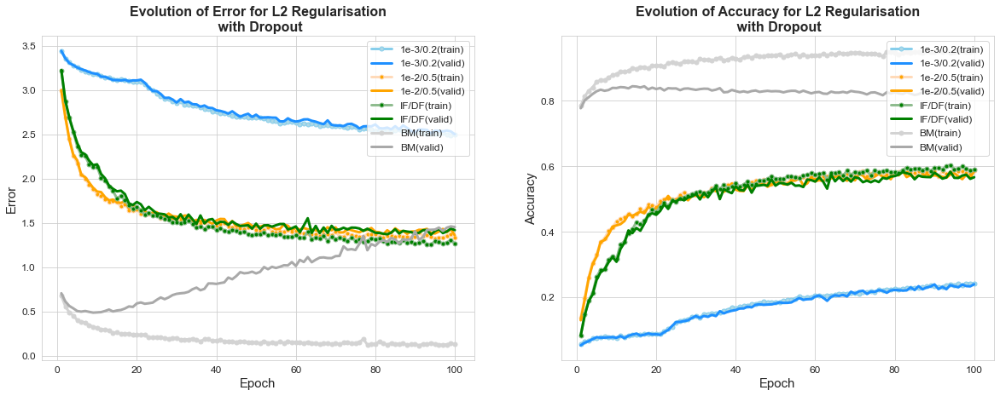
    


## 5. Training and testing the final model
We choose **Model 2** form the Dropout + L1 Regularisation to report our best results. We load the test data, and provide this one during training instead of the validation data


```python
test_results = pd.read_csv('Results/L1_ontest_1e_4_train_valid.csv', index_col=None)
bl_test_results = pd.read_csv('Results/baseline_ontest_train_valid.csv', index_col=None)

test_df_list = [test_results, bl_test_results, L1_1e_4_results]
test_results = prepare_results_table(df_list = test_df_list, model_names = ['L1 1e-4 on test', 'Baseline on test', 'L1 1e-4 on valid',])
test_results
```


<div>
<style scoped>
    .dataframe tbody tr th:only-of-type {
        vertical-align: middle;
    }

    .dataframe tbody tr th {
        vertical-align: top;
    }

    .dataframe thead th {
        text-align: right;
    }
</style>
<table border="1" class="dataframe">
  <thead>
    <tr style="text-align: right;">
      <th></th>
      <th>Neural Network Model</th>
      <th>error(train)</th>
      <th>error(valid)</th>
      <th>acc(train)</th>
      <th>acc(valid)</th>
      <th>runtime</th>
    </tr>
  </thead>
  <tbody>
    <tr>
      <th>0</th>
      <td>L1 1e-4 on test</td>
      <td>0.341184</td>
      <td>0.465621</td>
      <td>0.87644</td>
      <td>0.840316</td>
      <td>832.185097</td>
    </tr>
    <tr>
      <th>1</th>
      <td>Baseline on test</td>
      <td>0.119484</td>
      <td>1.540923</td>
      <td>0.95395</td>
      <td>0.813987</td>
      <td>902.812509</td>
    </tr>
    <tr>
      <th>2</th>
      <td>L1 1e-4 on valid</td>
      <td>0.325711</td>
      <td>0.433294</td>
      <td>0.87976</td>
      <td>0.852089</td>
      <td>801.795396</td>
    </tr>
  </tbody>
</table>
</div>


```python
test_results.to_latex('final_results.txt')
```


```python
def plot_acc_error_evolution(dataset_list):
    fig, axes = plt.subplots(2, 1, figsize = (11,9), sharex=True)

    # Get epoch number for x axis
    epoch_n = range(1, len(dataset_list[0])+1)

    titles = ['Evolution of Error and Accuracy\non Test Set', None]
    acc_error = ['error', 'acc']
    ylabels = ['Error', 'Accuracy']

    for i in range(len(axes)):
        # Plot lines
        axes[i].plot( epoch_n, acc_error[i]+'(train)', data=dataset_list[0], marker='.', markerfacecolor='skyblue', markersize=8, color='skyblue', linewidth=5, label = 'Final Model (train)')
        axes[i].plot( epoch_n, acc_error[i]+'(valid)', data=dataset_list[0], marker='', color='dodgerblue', linewidth=5, label = 'Final Model (test)')
        axes[i].plot( epoch_n, acc_error[i]+'(train)', data=dataset_list[1], marker='.', markerfacecolor='lightgrey', markersize=8, color='lightgrey', linewidth=2, label = 'Baseline Model (train)')
        axes[i].plot( epoch_n, acc_error[i]+'(valid)', data=dataset_list[1], marker='', color='grey', linewidth=2, label = 'Baseline Model (test)')
        axes[i].plot( epoch_n, acc_error[i]+'(train)', data=dataset_list[2], marker='.', markerfacecolor='peachpuff', markersize=8, color='lightgrey', linewidth=2, label = 'Final Model (train)')
        axes[i].plot( epoch_n, acc_error[i]+'(valid)', data=dataset_list[2], marker='', color='orange', linewidth=2, label = 'Final Model (valid)')
        axes[i].tick_params(axis='both', which='major', labelsize=16)
        axes[i].set_ylabel(ylabels[i], fontsize=24)
        axes[i].set_title(titles[i], fontweight="bold", fontsize=26)
    axes[0].legend(loc='best', prop={'size': 20})
    axes[1].set_xlabel('Epoch', fontsize=24)
    plt.tight_layout()
    plt.show()
```


```python
plot_acc_error_evolution(test_df_list)
```


    
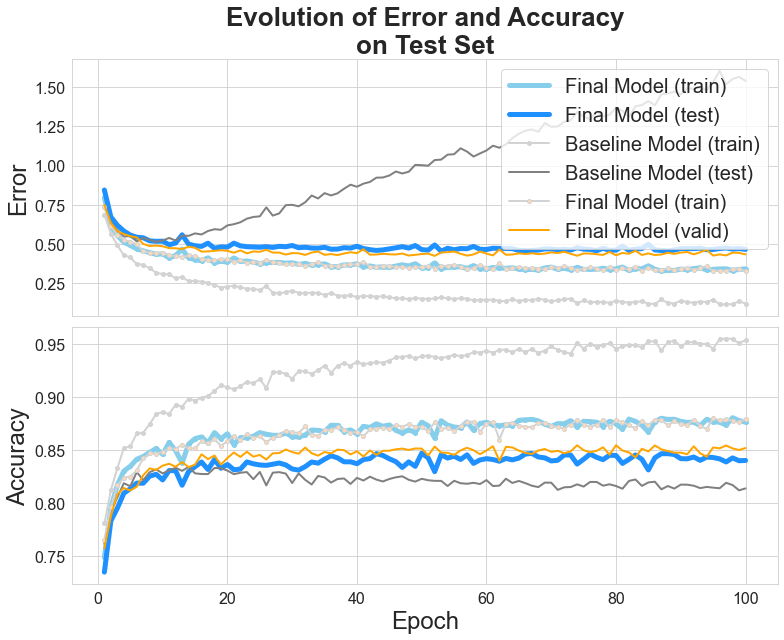
    


```python

```
