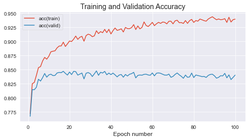

# Training of our models built using the MLP ML Framework 
This blogpost will focus in going through the code used to train all our models for this study. We will first train the initial model and output all results to a ```.csv``` file, these results from the training will be later analysed and visualised in the ```Training-Results-Visualizer.mp``` part of our study. This is going to be a group of experiments divided in the following manner:
- 1. Experiments to identify the generalization problem in a Neural Network
- 2. Experiments to mitigate the problem using Dropout 
- 3. Experiments to mitigate the problem using L1 and L2 Regularisation techniques
- 4. Experiments to mitigate the problem using L1 Regularisation and Dropout
- 5. Training and testing the final model

The same structure will be kept on the ```Training-Results-Visualizer.md``` file, but instead of training progress data, we will show plots that showcase the performance of the model.

Before anything, let's import all necessary libraries, including the MLP ML framework, as well as the EMNIST data.
## 

## Initialization of input data and MLP framework
We import the mlp framework which will allow us to process the training and validation data we will use to fine-tune our models. We also import the different blocks that will allow us to build our Neural Network architectures, as well as the weight Initialization techniques, error function, learning rules and optimiser.


```python
import numpy as np
import logging
import pandas as pd
from mlp.data_providers import MNISTDataProvider, EMNISTDataProvider

# Seed a random number generator
seed = 11102019 
rng = np.random.RandomState(seed)
batch_size = 100
# Set up a logger object to print info about the training run to stdout
logger = logging.getLogger()
logger.setLevel(logging.INFO)
logger.handlers = [logging.StreamHandler()]

# Create data provider objects for the MNIST data set
train_data = EMNISTDataProvider('train', batch_size=batch_size, rng=rng)
valid_data = EMNISTDataProvider('valid', batch_size=batch_size, rng=rng)

# Import mlp ML framework
from mlp.layers import AffineLayer, SoftmaxLayer, SigmoidLayer, ReluLayer
from mlp.errors import CrossEntropySoftmaxError
from mlp.models import MultipleLayerModel
from mlp.initialisers import ConstantInit, GlorotUniformInit
from mlp.learning_rules import AdamLearningRule
from mlp.optimisers import Optimiser
```

    KeysView(<numpy.lib.npyio.NpzFile object at 0x2afdec97d0a0>)
    KeysView(<numpy.lib.npyio.NpzFile object at 0x2afdec97d0a0>)


We also define some helper functions that will allow us to train our model and organise the output from this training. We will use the ```export_values``` function to export the training progress of our networks to a ```.csv``` file.


```python
import matplotlib.pyplot as plt
%matplotlib inline
plt.style.use('ggplot')

def output_organiser(init_dict):
    final_dict = {}
    dict_keys = init_dict[1].keys()
    for i,layer in enumerate(dict_keys):
        final_dict[i] = []
        for key in init_dict.keys():
            final_dict[i].append(init_dict[key][layer])
    
    return final_dict

def export_values(stats_, keys_, runtime_, activations_, name):
    # Output training information
    train_valid_stats = {'error(train)': stats_[1:, keys_['error(train)']], 
                         'error(valid)': stats_[1:, keys_['error(valid)']],
                         'acc(train)': stats_[1:, keys_['acc(train)']],
                         'acc(valid)': stats_[1:, keys_['acc(valid)']], 
                         'runtime':[runtime_]*len(stats_[1:, keys_['error(train)']])}

    df_train_valid = pd.DataFrame(data=train_valid_stats)
    weight_info_df = pd.DataFrame(data=activations_)

    # Output weight information
    path = r"Results/"+name
    df_train_valid.to_csv(path+'_train_valid.csv')
    weight_info_df.to_csv(path+'_activations.csv')

def main_train_model_and_plot_stats(
        model, error, learning_rule, train_data, valid_data, num_epochs, stats_interval, notebook=True):
    
    # As well as monitoring the error over training also monitor classification
    # accuracy i.e. proportion of most-probable predicted classes being equal to targets
    data_monitors={'acc': lambda y, t: (y.argmax(-1) == t.argmax(-1)).mean()}

    # Use the created objects to initialise a new Optimiser instance.
    optimiser = Optimiser(
        model, error, learning_rule, train_data, valid_data, data_monitors, notebook=notebook)

    # Run the optimiser for 5 epochs (full passes through the training set)
    # printing statistics every epoch.
    stats, keys, run_time, activations = optimiser.train(num_epochs=num_epochs, stats_interval=stats_interval)

    # Plot the change in the validation and training set error over training.
    fig_1 = plt.figure(figsize=(8, 4))
    ax_1 = fig_1.add_subplot(111)
    for k in ['error(train)', 'error(valid)']:
        ax_1.plot(np.arange(1, stats.shape[0]) * stats_interval, stats[1:, keys[k]], label=k)
    ax_1.legend(loc=0)
    ax_1.set_title('Training and Validation Loss')
    ax_1.set_xlabel('Epoch number')

    # Plot the change in the validation and training set accuracy over training.
    fig_2 = plt.figure(figsize=(8, 4))
    ax_2 = fig_2.add_subplot(111)
    for k in ['acc(train)', 'acc(valid)']:
        ax_2.plot(np.arange(1, stats.shape[0]) * stats_interval, stats[1:, keys[k]], label=k)
    ax_2.legend(loc=0)
    ax_2.set_title('Training and Validation Accuracy')
    ax_2.set_xlabel('Epoch number')
    
    activations_dict = output_organiser(activations)
    
    return stats, keys, run_time, activations_dict
```

## 1. Experiments to identify the generalization problem in a Neural Network
We now start by training a very simple Network to identify the generalization problem in the Network. We will first train a model with a single hidden layer and 100 hidden units, but in the following part of the section we will also experiment with usinh 32, 62, and 128 hidden units, as well as 1, 2, and 3 hidden layers.


```python
# Setup hyperparameters
learning_rate = 0.05
num_epochs = 100
stats_interval = 1
input_dim, output_dim, hidden_dim = 784, 47, 100

# Initialize weights and biases
weights_init = GlorotUniformInit(rng=rng)
biases_init = ConstantInit(0.)

# Define the Neural Network Model
model = MultipleLayerModel([
    AffineLayer(input_dim, hidden_dim, weights_init, biases_init), 
    ReluLayer(),
    AffineLayer(hidden_dim, hidden_dim, weights_init, biases_init), 
    ReluLayer(),
    AffineLayer(hidden_dim, output_dim, weights_init, biases_init)
])

# Define the error function
error = CrossEntropySoftmaxError()

# Use a basic gradient descent learning rule
learning_rule = AdamLearningRule()

# Remember to use notebook=False when you write a script to be run in a terminal
stats_init, keys_init, run_time_init, activation_dict_init = main_train_model_and_plot_stats(
    model, error, learning_rule, train_data, valid_data, num_epochs, stats_interval, notebook=True)

# Export values for further analysis
export_values(stats_init, keys_init, run_time_init, activation_dict_init, 'init')
```


    HBox(children=(HTML(value=''), FloatProgress(value=0.0), HTML(value='')))


    HBox(children=(HTML(value=''), FloatProgress(value=0.0, max=1000.0), HTML(value='')))


    


    Epoch 1: 3.0s to complete
        error(train)=8.21e-01, acc(train)=7.52e-01, error(valid)=8.39e-01, acc(valid)=7.44e-01


    HBox(children=(HTML(value=''), FloatProgress(value=0.0, max=1000.0), HTML(value='')))


    


    Epoch 2: 3.6s to complete
        error(train)=6.50e-01, acc(train)=7.95e-01, error(valid)=6.84e-01, acc(valid)=7.85e-01


    HBox(children=(HTML(value=''), FloatProgress(value=0.0, max=1000.0), HTML(value='')))


    


    Epoch 3: 3.6s to complete
        error(train)=5.87e-01, acc(train)=8.08e-01, error(valid)=6.37e-01, acc(valid)=7.99e-01


    HBox(children=(HTML(value=''), FloatProgress(value=0.0, max=1000.0), HTML(value='')))


    


    Epoch 4: 3.2s to complete
        error(train)=5.12e-01, acc(train)=8.31e-01, error(valid)=5.73e-01, acc(valid)=8.14e-01


    HBox(children=(HTML(value=''), FloatProgress(value=0.0, max=1000.0), HTML(value='')))


    


    Epoch 5: 3.1s to complete
        error(train)=4.93e-01, acc(train)=8.38e-01, error(valid)=5.71e-01, acc(valid)=8.19e-01


    HBox(children=(HTML(value=''), FloatProgress(value=0.0, max=1000.0), HTML(value='')))


    


    Epoch 6: 3.5s to complete
        error(train)=4.60e-01, acc(train)=8.44e-01, error(valid)=5.49e-01, acc(valid)=8.18e-01


    HBox(children=(HTML(value=''), FloatProgress(value=0.0, max=1000.0), HTML(value='')))


    


    Epoch 7: 3.5s to complete
        error(train)=4.34e-01, acc(train)=8.50e-01, error(valid)=5.34e-01, acc(valid)=8.24e-01


    HBox(children=(HTML(value=''), FloatProgress(value=0.0, max=1000.0), HTML(value='')))


    


    Epoch 8: 3.6s to complete
        error(train)=4.20e-01, acc(train)=8.56e-01, error(valid)=5.33e-01, acc(valid)=8.29e-01


    HBox(children=(HTML(value=''), FloatProgress(value=0.0, max=1000.0), HTML(value='')))


    


    Epoch 9: 3.6s to complete
        error(train)=4.06e-01, acc(train)=8.60e-01, error(valid)=5.30e-01, acc(valid)=8.29e-01


    HBox(children=(HTML(value=''), FloatProgress(value=0.0, max=1000.0), HTML(value='')))


    


    Epoch 10: 3.6s to complete
        error(train)=3.84e-01, acc(train)=8.66e-01, error(valid)=5.21e-01, acc(valid)=8.31e-01


    HBox(children=(HTML(value=''), FloatProgress(value=0.0, max=1000.0), HTML(value='')))


    


    Epoch 11: 3.4s to complete
        error(train)=3.78e-01, acc(train)=8.66e-01, error(valid)=5.25e-01, acc(valid)=8.31e-01


    HBox(children=(HTML(value=''), FloatProgress(value=0.0, max=1000.0), HTML(value='')))


    


    Epoch 12: 3.5s to complete
        error(train)=3.65e-01, acc(train)=8.72e-01, error(valid)=5.23e-01, acc(valid)=8.32e-01


    HBox(children=(HTML(value=''), FloatProgress(value=0.0, max=1000.0), HTML(value='')))


    


    Epoch 13: 3.6s to complete
        error(train)=3.51e-01, acc(train)=8.76e-01, error(valid)=5.22e-01, acc(valid)=8.35e-01


    HBox(children=(HTML(value=''), FloatProgress(value=0.0, max=1000.0), HTML(value='')))


    


    Epoch 14: 3.5s to complete
        error(train)=3.44e-01, acc(train)=8.79e-01, error(valid)=5.14e-01, acc(valid)=8.36e-01


    HBox(children=(HTML(value=''), FloatProgress(value=0.0, max=1000.0), HTML(value='')))


    


    Epoch 15: 3.4s to complete
        error(train)=3.45e-01, acc(train)=8.77e-01, error(valid)=5.33e-01, acc(valid)=8.35e-01


    HBox(children=(HTML(value=''), FloatProgress(value=0.0, max=1000.0), HTML(value='')))


    


    Epoch 16: 3.4s to complete
        error(train)=3.28e-01, acc(train)=8.82e-01, error(valid)=5.34e-01, acc(valid)=8.34e-01


    HBox(children=(HTML(value=''), FloatProgress(value=0.0, max=1000.0), HTML(value='')))


    


    Epoch 17: 3.4s to complete
        error(train)=3.19e-01, acc(train)=8.85e-01, error(valid)=5.32e-01, acc(valid)=8.32e-01


    HBox(children=(HTML(value=''), FloatProgress(value=0.0, max=1000.0), HTML(value='')))


    


    Epoch 18: 3.6s to complete
        error(train)=3.18e-01, acc(train)=8.81e-01, error(valid)=5.40e-01, acc(valid)=8.28e-01


    HBox(children=(HTML(value=''), FloatProgress(value=0.0, max=1000.0), HTML(value='')))


    


    Epoch 19: 3.6s to complete
        error(train)=3.12e-01, acc(train)=8.86e-01, error(valid)=5.43e-01, acc(valid)=8.33e-01


    HBox(children=(HTML(value=''), FloatProgress(value=0.0, max=1000.0), HTML(value='')))


    


    Epoch 20: 3.5s to complete
        error(train)=3.12e-01, acc(train)=8.84e-01, error(valid)=5.50e-01, acc(valid)=8.30e-01


    HBox(children=(HTML(value=''), FloatProgress(value=0.0, max=1000.0), HTML(value='')))


    


    Epoch 21: 3.3s to complete
        error(train)=2.99e-01, acc(train)=8.90e-01, error(valid)=5.44e-01, acc(valid)=8.33e-01


    HBox(children=(HTML(value=''), FloatProgress(value=0.0, max=1000.0), HTML(value='')))


    


    Epoch 22: 3.5s to complete
        error(train)=2.88e-01, acc(train)=8.93e-01, error(valid)=5.51e-01, acc(valid)=8.32e-01


    HBox(children=(HTML(value=''), FloatProgress(value=0.0, max=1000.0), HTML(value='')))


    


    Epoch 23: 3.4s to complete
        error(train)=2.88e-01, acc(train)=8.94e-01, error(valid)=5.62e-01, acc(valid)=8.33e-01


    HBox(children=(HTML(value=''), FloatProgress(value=0.0, max=1000.0), HTML(value='')))


    


    Epoch 24: 3.4s to complete
        error(train)=2.81e-01, acc(train)=8.95e-01, error(valid)=5.61e-01, acc(valid)=8.32e-01


    HBox(children=(HTML(value=''), FloatProgress(value=0.0, max=1000.0), HTML(value='')))


    


    Epoch 25: 3.5s to complete
        error(train)=2.70e-01, acc(train)=8.98e-01, error(valid)=5.59e-01, acc(valid)=8.31e-01


    HBox(children=(HTML(value=''), FloatProgress(value=0.0, max=1000.0), HTML(value='')))


    


    Epoch 26: 3.6s to complete
        error(train)=2.71e-01, acc(train)=8.98e-01, error(valid)=5.72e-01, acc(valid)=8.33e-01


    HBox(children=(HTML(value=''), FloatProgress(value=0.0, max=1000.0), HTML(value='')))


    


    Epoch 27: 3.5s to complete
        error(train)=2.70e-01, acc(train)=8.98e-01, error(valid)=5.71e-01, acc(valid)=8.31e-01


    HBox(children=(HTML(value=''), FloatProgress(value=0.0, max=1000.0), HTML(value='')))


    


    Epoch 28: 3.4s to complete
        error(train)=2.62e-01, acc(train)=9.01e-01, error(valid)=5.83e-01, acc(valid)=8.34e-01


    HBox(children=(HTML(value=''), FloatProgress(value=0.0, max=1000.0), HTML(value='')))


    


    Epoch 29: 3.6s to complete
        error(train)=2.60e-01, acc(train)=9.00e-01, error(valid)=5.95e-01, acc(valid)=8.26e-01


    HBox(children=(HTML(value=''), FloatProgress(value=0.0, max=1000.0), HTML(value='')))


    


    Epoch 30: 3.5s to complete
        error(train)=2.57e-01, acc(train)=9.02e-01, error(valid)=6.04e-01, acc(valid)=8.29e-01


    HBox(children=(HTML(value=''), FloatProgress(value=0.0, max=1000.0), HTML(value='')))


    


    Epoch 31: 3.4s to complete
        error(train)=2.44e-01, acc(train)=9.08e-01, error(valid)=5.92e-01, acc(valid)=8.33e-01


    HBox(children=(HTML(value=''), FloatProgress(value=0.0, max=1000.0), HTML(value='')))


    


    Epoch 32: 3.4s to complete
        error(train)=2.46e-01, acc(train)=9.06e-01, error(valid)=6.13e-01, acc(valid)=8.30e-01


    HBox(children=(HTML(value=''), FloatProgress(value=0.0, max=1000.0), HTML(value='')))


    


    Epoch 33: 3.8s to complete
        error(train)=2.52e-01, acc(train)=9.02e-01, error(valid)=6.25e-01, acc(valid)=8.24e-01


    HBox(children=(HTML(value=''), FloatProgress(value=0.0, max=1000.0), HTML(value='')))


    


    Epoch 34: 3.7s to complete
        error(train)=2.47e-01, acc(train)=9.02e-01, error(valid)=6.34e-01, acc(valid)=8.25e-01


    HBox(children=(HTML(value=''), FloatProgress(value=0.0, max=1000.0), HTML(value='')))


    


    Epoch 35: 3.7s to complete
        error(train)=2.37e-01, acc(train)=9.08e-01, error(valid)=6.28e-01, acc(valid)=8.27e-01


    HBox(children=(HTML(value=''), FloatProgress(value=0.0, max=1000.0), HTML(value='')))


    


    Epoch 36: 3.6s to complete
        error(train)=2.38e-01, acc(train)=9.07e-01, error(valid)=6.40e-01, acc(valid)=8.24e-01


    HBox(children=(HTML(value=''), FloatProgress(value=0.0, max=1000.0), HTML(value='')))


    


    Epoch 37: 3.6s to complete
        error(train)=2.31e-01, acc(train)=9.10e-01, error(valid)=6.55e-01, acc(valid)=8.27e-01


    HBox(children=(HTML(value=''), FloatProgress(value=0.0, max=1000.0), HTML(value='')))


    


    Epoch 38: 3.5s to complete
        error(train)=2.30e-01, acc(train)=9.10e-01, error(valid)=6.61e-01, acc(valid)=8.26e-01


    HBox(children=(HTML(value=''), FloatProgress(value=0.0, max=1000.0), HTML(value='')))


    


    Epoch 39: 3.5s to complete
        error(train)=2.24e-01, acc(train)=9.11e-01, error(valid)=6.54e-01, acc(valid)=8.26e-01


    HBox(children=(HTML(value=''), FloatProgress(value=0.0, max=1000.0), HTML(value='')))


    


    Epoch 40: 3.5s to complete
        error(train)=2.26e-01, acc(train)=9.10e-01, error(valid)=6.82e-01, acc(valid)=8.21e-01


    HBox(children=(HTML(value=''), FloatProgress(value=0.0, max=1000.0), HTML(value='')))


    


    Epoch 41: 3.7s to complete
        error(train)=2.23e-01, acc(train)=9.14e-01, error(valid)=6.83e-01, acc(valid)=8.29e-01


    HBox(children=(HTML(value=''), FloatProgress(value=0.0, max=1000.0), HTML(value='')))


    


    Epoch 42: 3.6s to complete
        error(train)=2.10e-01, acc(train)=9.18e-01, error(valid)=6.84e-01, acc(valid)=8.25e-01


    HBox(children=(HTML(value=''), FloatProgress(value=0.0, max=1000.0), HTML(value='')))


    


    Epoch 43: 3.2s to complete
        error(train)=2.21e-01, acc(train)=9.13e-01, error(valid)=6.96e-01, acc(valid)=8.29e-01


    HBox(children=(HTML(value=''), FloatProgress(value=0.0, max=1000.0), HTML(value='')))


    


    Epoch 44: 3.1s to complete
        error(train)=2.15e-01, acc(train)=9.13e-01, error(valid)=7.03e-01, acc(valid)=8.21e-01


    HBox(children=(HTML(value=''), FloatProgress(value=0.0, max=1000.0), HTML(value='')))


    


    Epoch 45: 3.5s to complete
        error(train)=2.17e-01, acc(train)=9.14e-01, error(valid)=7.09e-01, acc(valid)=8.22e-01


    HBox(children=(HTML(value=''), FloatProgress(value=0.0, max=1000.0), HTML(value='')))


    


    Epoch 46: 3.4s to complete
        error(train)=2.08e-01, acc(train)=9.17e-01, error(valid)=7.17e-01, acc(valid)=8.22e-01


    HBox(children=(HTML(value=''), FloatProgress(value=0.0, max=1000.0), HTML(value='')))


    


    Epoch 47: 3.2s to complete
        error(train)=2.03e-01, acc(train)=9.19e-01, error(valid)=7.19e-01, acc(valid)=8.23e-01


    HBox(children=(HTML(value=''), FloatProgress(value=0.0, max=1000.0), HTML(value='')))


    


    Epoch 48: 3.5s to complete
        error(train)=1.99e-01, acc(train)=9.21e-01, error(valid)=7.12e-01, acc(valid)=8.25e-01


    HBox(children=(HTML(value=''), FloatProgress(value=0.0, max=1000.0), HTML(value='')))


    


    Epoch 49: 3.7s to complete
        error(train)=2.05e-01, acc(train)=9.18e-01, error(valid)=7.30e-01, acc(valid)=8.23e-01


    HBox(children=(HTML(value=''), FloatProgress(value=0.0, max=1000.0), HTML(value='')))


    


    Epoch 50: 3.7s to complete
        error(train)=1.95e-01, acc(train)=9.23e-01, error(valid)=7.48e-01, acc(valid)=8.21e-01


    HBox(children=(HTML(value=''), FloatProgress(value=0.0, max=1000.0), HTML(value='')))


    


    Epoch 51: 3.6s to complete
        error(train)=2.08e-01, acc(train)=9.18e-01, error(valid)=7.58e-01, acc(valid)=8.22e-01


    HBox(children=(HTML(value=''), FloatProgress(value=0.0, max=1000.0), HTML(value='')))


    


    Epoch 52: 3.5s to complete
        error(train)=2.00e-01, acc(train)=9.21e-01, error(valid)=7.88e-01, acc(valid)=8.21e-01


    HBox(children=(HTML(value=''), FloatProgress(value=0.0, max=1000.0), HTML(value='')))


    


    Epoch 53: 3.8s to complete
        error(train)=1.98e-01, acc(train)=9.21e-01, error(valid)=7.82e-01, acc(valid)=8.23e-01


    HBox(children=(HTML(value=''), FloatProgress(value=0.0, max=1000.0), HTML(value='')))


    


    Epoch 54: 3.5s to complete
        error(train)=1.95e-01, acc(train)=9.23e-01, error(valid)=7.71e-01, acc(valid)=8.21e-01


    HBox(children=(HTML(value=''), FloatProgress(value=0.0, max=1000.0), HTML(value='')))


    


    Epoch 55: 3.5s to complete
        error(train)=1.92e-01, acc(train)=9.24e-01, error(valid)=7.86e-01, acc(valid)=8.22e-01


    HBox(children=(HTML(value=''), FloatProgress(value=0.0, max=1000.0), HTML(value='')))


    


    Epoch 56: 3.6s to complete
        error(train)=1.94e-01, acc(train)=9.20e-01, error(valid)=8.05e-01, acc(valid)=8.17e-01


    HBox(children=(HTML(value=''), FloatProgress(value=0.0, max=1000.0), HTML(value='')))


    


    Epoch 57: 3.7s to complete
        error(train)=1.87e-01, acc(train)=9.24e-01, error(valid)=8.02e-01, acc(valid)=8.24e-01


    HBox(children=(HTML(value=''), FloatProgress(value=0.0, max=1000.0), HTML(value='')))


    


    Epoch 58: 3.7s to complete
        error(train)=1.85e-01, acc(train)=9.26e-01, error(valid)=8.16e-01, acc(valid)=8.16e-01


    HBox(children=(HTML(value=''), FloatProgress(value=0.0, max=1000.0), HTML(value='')))


    


    Epoch 59: 3.7s to complete
        error(train)=1.89e-01, acc(train)=9.23e-01, error(valid)=8.21e-01, acc(valid)=8.17e-01


    HBox(children=(HTML(value=''), FloatProgress(value=0.0, max=1000.0), HTML(value='')))


    


    Epoch 60: 3.6s to complete
        error(train)=1.80e-01, acc(train)=9.27e-01, error(valid)=8.35e-01, acc(valid)=8.18e-01


    HBox(children=(HTML(value=''), FloatProgress(value=0.0, max=1000.0), HTML(value='')))


    


    Epoch 61: 3.6s to complete
        error(train)=1.89e-01, acc(train)=9.23e-01, error(valid)=8.42e-01, acc(valid)=8.18e-01


    HBox(children=(HTML(value=''), FloatProgress(value=0.0, max=1000.0), HTML(value='')))


    


    Epoch 62: 3.7s to complete
        error(train)=1.77e-01, acc(train)=9.28e-01, error(valid)=8.62e-01, acc(valid)=8.16e-01


    HBox(children=(HTML(value=''), FloatProgress(value=0.0, max=1000.0), HTML(value='')))


    


    Epoch 63: 3.4s to complete
        error(train)=1.98e-01, acc(train)=9.20e-01, error(valid)=8.91e-01, acc(valid)=8.15e-01


    HBox(children=(HTML(value=''), FloatProgress(value=0.0, max=1000.0), HTML(value='')))


    


    Epoch 64: 3.6s to complete
        error(train)=1.74e-01, acc(train)=9.29e-01, error(valid)=8.73e-01, acc(valid)=8.18e-01


    HBox(children=(HTML(value=''), FloatProgress(value=0.0, max=1000.0), HTML(value='')))


    


    Epoch 65: 3.5s to complete
        error(train)=1.78e-01, acc(train)=9.27e-01, error(valid)=8.78e-01, acc(valid)=8.13e-01


    HBox(children=(HTML(value=''), FloatProgress(value=0.0, max=1000.0), HTML(value='')))


    


    Epoch 66: 3.5s to complete
        error(train)=1.77e-01, acc(train)=9.27e-01, error(valid)=8.87e-01, acc(valid)=8.16e-01


    HBox(children=(HTML(value=''), FloatProgress(value=0.0, max=1000.0), HTML(value='')))


    


    Epoch 67: 3.7s to complete
        error(train)=1.76e-01, acc(train)=9.30e-01, error(valid)=8.82e-01, acc(valid)=8.17e-01


    HBox(children=(HTML(value=''), FloatProgress(value=0.0, max=1000.0), HTML(value='')))


    


    Epoch 68: 3.7s to complete
        error(train)=1.73e-01, acc(train)=9.29e-01, error(valid)=9.06e-01, acc(valid)=8.16e-01


    HBox(children=(HTML(value=''), FloatProgress(value=0.0, max=1000.0), HTML(value='')))


    


    Epoch 69: 3.6s to complete
        error(train)=1.75e-01, acc(train)=9.28e-01, error(valid)=9.18e-01, acc(valid)=8.15e-01


    HBox(children=(HTML(value=''), FloatProgress(value=0.0, max=1000.0), HTML(value='')))


    


    Epoch 70: 3.5s to complete
        error(train)=1.67e-01, acc(train)=9.31e-01, error(valid)=9.09e-01, acc(valid)=8.21e-01


    HBox(children=(HTML(value=''), FloatProgress(value=0.0, max=1000.0), HTML(value='')))


    


    Epoch 71: 3.5s to complete
        error(train)=1.66e-01, acc(train)=9.33e-01, error(valid)=9.26e-01, acc(valid)=8.18e-01


    HBox(children=(HTML(value=''), FloatProgress(value=0.0, max=1000.0), HTML(value='')))


    


    Epoch 72: 3.5s to complete
        error(train)=1.64e-01, acc(train)=9.34e-01, error(valid)=9.34e-01, acc(valid)=8.14e-01


    HBox(children=(HTML(value=''), FloatProgress(value=0.0, max=1000.0), HTML(value='')))


    


    Epoch 73: 3.4s to complete
        error(train)=1.73e-01, acc(train)=9.30e-01, error(valid)=9.53e-01, acc(valid)=8.15e-01


    HBox(children=(HTML(value=''), FloatProgress(value=0.0, max=1000.0), HTML(value='')))


    


    Epoch 74: 3.8s to complete
        error(train)=1.73e-01, acc(train)=9.29e-01, error(valid)=9.73e-01, acc(valid)=8.14e-01


    HBox(children=(HTML(value=''), FloatProgress(value=0.0, max=1000.0), HTML(value='')))


    


    Epoch 75: 3.7s to complete
        error(train)=1.63e-01, acc(train)=9.33e-01, error(valid)=9.61e-01, acc(valid)=8.19e-01


    HBox(children=(HTML(value=''), FloatProgress(value=0.0, max=1000.0), HTML(value='')))


    


    Epoch 76: 3.6s to complete
        error(train)=1.73e-01, acc(train)=9.30e-01, error(valid)=9.87e-01, acc(valid)=8.14e-01


    HBox(children=(HTML(value=''), FloatProgress(value=0.0, max=1000.0), HTML(value='')))


    


    Epoch 77: 3.6s to complete
        error(train)=1.65e-01, acc(train)=9.32e-01, error(valid)=9.95e-01, acc(valid)=8.15e-01


    HBox(children=(HTML(value=''), FloatProgress(value=0.0, max=1000.0), HTML(value='')))


    


    Epoch 78: 3.7s to complete
        error(train)=1.61e-01, acc(train)=9.34e-01, error(valid)=9.97e-01, acc(valid)=8.15e-01


    HBox(children=(HTML(value=''), FloatProgress(value=0.0, max=1000.0), HTML(value='')))


    


    Epoch 79: 3.7s to complete
        error(train)=1.58e-01, acc(train)=9.35e-01, error(valid)=1.00e+00, acc(valid)=8.12e-01


    HBox(children=(HTML(value=''), FloatProgress(value=0.0, max=1000.0), HTML(value='')))


    


    Epoch 80: 3.5s to complete
        error(train)=1.64e-01, acc(train)=9.33e-01, error(valid)=1.02e+00, acc(valid)=8.14e-01


    HBox(children=(HTML(value=''), FloatProgress(value=0.0, max=1000.0), HTML(value='')))


    


    Epoch 81: 3.6s to complete
        error(train)=1.64e-01, acc(train)=9.33e-01, error(valid)=1.03e+00, acc(valid)=8.18e-01


    HBox(children=(HTML(value=''), FloatProgress(value=0.0, max=1000.0), HTML(value='')))


    


    Epoch 82: 3.7s to complete
        error(train)=1.63e-01, acc(train)=9.33e-01, error(valid)=1.03e+00, acc(valid)=8.13e-01


    HBox(children=(HTML(value=''), FloatProgress(value=0.0, max=1000.0), HTML(value='')))


    


    Epoch 83: 3.6s to complete
        error(train)=1.56e-01, acc(train)=9.36e-01, error(valid)=1.03e+00, acc(valid)=8.17e-01


    HBox(children=(HTML(value=''), FloatProgress(value=0.0, max=1000.0), HTML(value='')))


    


    Epoch 84: 3.7s to complete
        error(train)=1.68e-01, acc(train)=9.31e-01, error(valid)=1.04e+00, acc(valid)=8.09e-01


    HBox(children=(HTML(value=''), FloatProgress(value=0.0, max=1000.0), HTML(value='')))


    


    Epoch 85: 3.6s to complete
        error(train)=1.50e-01, acc(train)=9.39e-01, error(valid)=1.06e+00, acc(valid)=8.16e-01


    HBox(children=(HTML(value=''), FloatProgress(value=0.0, max=1000.0), HTML(value='')))


    


    Epoch 86: 3.5s to complete
        error(train)=1.60e-01, acc(train)=9.34e-01, error(valid)=1.07e+00, acc(valid)=8.09e-01


    HBox(children=(HTML(value=''), FloatProgress(value=0.0, max=1000.0), HTML(value='')))


    


    Epoch 87: 3.6s to complete
        error(train)=1.52e-01, acc(train)=9.38e-01, error(valid)=1.07e+00, acc(valid)=8.11e-01


    HBox(children=(HTML(value=''), FloatProgress(value=0.0, max=1000.0), HTML(value='')))


    


    Epoch 88: 3.5s to complete
        error(train)=1.56e-01, acc(train)=9.35e-01, error(valid)=1.10e+00, acc(valid)=8.07e-01


    HBox(children=(HTML(value=''), FloatProgress(value=0.0, max=1000.0), HTML(value='')))


    


    Epoch 89: 3.5s to complete
        error(train)=1.55e-01, acc(train)=9.37e-01, error(valid)=1.10e+00, acc(valid)=8.12e-01


    HBox(children=(HTML(value=''), FloatProgress(value=0.0, max=1000.0), HTML(value='')))


    


    Epoch 90: 3.7s to complete
        error(train)=1.49e-01, acc(train)=9.37e-01, error(valid)=1.11e+00, acc(valid)=8.09e-01


    HBox(children=(HTML(value=''), FloatProgress(value=0.0, max=1000.0), HTML(value='')))


    


    Epoch 91: 3.7s to complete
        error(train)=1.51e-01, acc(train)=9.38e-01, error(valid)=1.13e+00, acc(valid)=8.08e-01


    HBox(children=(HTML(value=''), FloatProgress(value=0.0, max=1000.0), HTML(value='')))


    


    Epoch 92: 3.7s to complete
        error(train)=1.50e-01, acc(train)=9.38e-01, error(valid)=1.12e+00, acc(valid)=8.06e-01


    HBox(children=(HTML(value=''), FloatProgress(value=0.0, max=1000.0), HTML(value='')))


    


    Epoch 93: 3.6s to complete
        error(train)=1.43e-01, acc(train)=9.41e-01, error(valid)=1.12e+00, acc(valid)=8.10e-01


    HBox(children=(HTML(value=''), FloatProgress(value=0.0, max=1000.0), HTML(value='')))


    


    Epoch 94: 3.3s to complete
        error(train)=1.70e-01, acc(train)=9.31e-01, error(valid)=1.16e+00, acc(valid)=8.04e-01


    HBox(children=(HTML(value=''), FloatProgress(value=0.0, max=1000.0), HTML(value='')))


    


    Epoch 95: 3.1s to complete
        error(train)=1.45e-01, acc(train)=9.40e-01, error(valid)=1.14e+00, acc(valid)=8.07e-01


    HBox(children=(HTML(value=''), FloatProgress(value=0.0, max=1000.0), HTML(value='')))


    


    Epoch 96: 3.3s to complete
        error(train)=1.44e-01, acc(train)=9.40e-01, error(valid)=1.17e+00, acc(valid)=8.09e-01


    HBox(children=(HTML(value=''), FloatProgress(value=0.0, max=1000.0), HTML(value='')))


    


    Epoch 97: 3.3s to complete
        error(train)=1.52e-01, acc(train)=9.37e-01, error(valid)=1.17e+00, acc(valid)=8.08e-01


    HBox(children=(HTML(value=''), FloatProgress(value=0.0, max=1000.0), HTML(value='')))


    


    Epoch 98: 3.2s to complete
        error(train)=1.43e-01, acc(train)=9.41e-01, error(valid)=1.20e+00, acc(valid)=8.10e-01


    HBox(children=(HTML(value=''), FloatProgress(value=0.0, max=1000.0), HTML(value='')))


    


    Epoch 99: 3.7s to complete
        error(train)=1.42e-01, acc(train)=9.42e-01, error(valid)=1.19e+00, acc(valid)=8.10e-01


    HBox(children=(HTML(value=''), FloatProgress(value=0.0, max=1000.0), HTML(value='')))


    


    Epoch 100: 3.5s to complete
        error(train)=1.44e-01, acc(train)=9.40e-01, error(valid)=1.19e+00, acc(valid)=8.11e-01


    


    

    


    

    


## Understanding the influence of network width and depth on generalization performance of a vanilla Neural network
Let's continue our study by varying the shape of our network, in order to understand how this influences its performance.

### Varying the width of our network
Let's start by varying the number of hidden units. Our first model will have **32** hidden units, with the rest of the architecture intact.


```python
# Reset Data Providor
train_data.reset()
valid_data.reset()

# Setup hyperparameters
learning_rate = 0.05
num_epochs = 100
stats_interval = 1
input_dim, output_dim, hidden_dim = 784, 47, 32 # 32 Hidden Units fed into the ReLu activation function

# Initialize weights and biases
weights_init = GlorotUniformInit(rng=rng)
biases_init = ConstantInit(0.)

# Define Neural Network Model
model = MultipleLayerModel([
    AffineLayer(input_dim, hidden_dim, weights_init, biases_init), 
    ReluLayer(),
    AffineLayer(hidden_dim, hidden_dim, weights_init, biases_init), 
    ReluLayer(),
    AffineLayer(hidden_dim, output_dim, weights_init, biases_init)
])

# Define Error function
error = CrossEntropySoftmaxError()
# Use a basic gradient descent learning rule
learning_rule = AdamLearningRule()

# Remember to use notebook=False when you write a script to be run in a terminal
stats_hu_32, keys_hu_32, run_time_hu_32, activation_dict_hu_32 = main_train_model_and_plot_stats(
    model, error, learning_rule, train_data, valid_data, num_epochs, stats_interval, notebook=True)

# Output results for further anlysis
export_values(stats_hu_32, keys_hu_32, run_time_hu_32, activation_dict_hu_32, 'hu_32')
```


    HBox(children=(HTML(value=''), FloatProgress(value=0.0), HTML(value='')))


    HBox(children=(HTML(value=''), FloatProgress(value=0.0, max=1000.0), HTML(value='')))


    


    Epoch 1: 1.9s to complete
        error(train)=1.16e+00, acc(train)=6.65e-01, error(valid)=1.17e+00, acc(valid)=6.63e-01


    HBox(children=(HTML(value=''), FloatProgress(value=0.0, max=1000.0), HTML(value='')))


    


    Epoch 2: 1.9s to complete
        error(train)=9.92e-01, acc(train)=7.09e-01, error(valid)=1.01e+00, acc(valid)=7.05e-01


    HBox(children=(HTML(value=''), FloatProgress(value=0.0, max=1000.0), HTML(value='')))


    


    Epoch 3: 2.0s to complete
        error(train)=9.08e-01, acc(train)=7.31e-01, error(valid)=9.33e-01, acc(valid)=7.22e-01


    HBox(children=(HTML(value=''), FloatProgress(value=0.0, max=1000.0), HTML(value='')))


    


    Epoch 4: 1.8s to complete
        error(train)=8.65e-01, acc(train)=7.42e-01, error(valid)=8.93e-01, acc(valid)=7.37e-01


    HBox(children=(HTML(value=''), FloatProgress(value=0.0, max=1000.0), HTML(value='')))


    


    Epoch 5: 1.9s to complete
        error(train)=8.25e-01, acc(train)=7.54e-01, error(valid)=8.58e-01, acc(valid)=7.45e-01


    HBox(children=(HTML(value=''), FloatProgress(value=0.0, max=1000.0), HTML(value='')))


    


    Epoch 6: 1.9s to complete
        error(train)=8.10e-01, acc(train)=7.55e-01, error(valid)=8.50e-01, acc(valid)=7.47e-01


    HBox(children=(HTML(value=''), FloatProgress(value=0.0, max=1000.0), HTML(value='')))


    


    Epoch 7: 1.9s to complete
        error(train)=7.76e-01, acc(train)=7.65e-01, error(valid)=8.21e-01, acc(valid)=7.51e-01


    HBox(children=(HTML(value=''), FloatProgress(value=0.0, max=1000.0), HTML(value='')))


    


    Epoch 8: 1.9s to complete
        error(train)=7.45e-01, acc(train)=7.75e-01, error(valid)=7.91e-01, acc(valid)=7.60e-01


    HBox(children=(HTML(value=''), FloatProgress(value=0.0, max=1000.0), HTML(value='')))


    


    Epoch 9: 2.0s to complete
        error(train)=7.53e-01, acc(train)=7.69e-01, error(valid)=8.03e-01, acc(valid)=7.57e-01


    HBox(children=(HTML(value=''), FloatProgress(value=0.0, max=1000.0), HTML(value='')))


    


    Epoch 10: 2.0s to complete
        error(train)=7.26e-01, acc(train)=7.77e-01, error(valid)=7.78e-01, acc(valid)=7.64e-01


    HBox(children=(HTML(value=''), FloatProgress(value=0.0, max=1000.0), HTML(value='')))


    


    Epoch 11: 2.0s to complete
        error(train)=7.18e-01, acc(train)=7.79e-01, error(valid)=7.74e-01, acc(valid)=7.64e-01


    HBox(children=(HTML(value=''), FloatProgress(value=0.0, max=1000.0), HTML(value='')))


    


    Epoch 12: 2.0s to complete
        error(train)=7.01e-01, acc(train)=7.82e-01, error(valid)=7.60e-01, acc(valid)=7.67e-01


    HBox(children=(HTML(value=''), FloatProgress(value=0.0, max=1000.0), HTML(value='')))


    


    Epoch 13: 2.0s to complete
        error(train)=6.94e-01, acc(train)=7.84e-01, error(valid)=7.57e-01, acc(valid)=7.71e-01


    HBox(children=(HTML(value=''), FloatProgress(value=0.0, max=1000.0), HTML(value='')))


    


    Epoch 14: 2.0s to complete
        error(train)=6.83e-01, acc(train)=7.87e-01, error(valid)=7.52e-01, acc(valid)=7.75e-01


    HBox(children=(HTML(value=''), FloatProgress(value=0.0, max=1000.0), HTML(value='')))


    


    Epoch 15: 2.0s to complete
        error(train)=6.75e-01, acc(train)=7.88e-01, error(valid)=7.41e-01, acc(valid)=7.73e-01


    HBox(children=(HTML(value=''), FloatProgress(value=0.0, max=1000.0), HTML(value='')))


    


    Epoch 16: 2.0s to complete
        error(train)=6.55e-01, acc(train)=7.97e-01, error(valid)=7.28e-01, acc(valid)=7.79e-01


    HBox(children=(HTML(value=''), FloatProgress(value=0.0, max=1000.0), HTML(value='')))


    


    Epoch 17: 2.0s to complete
        error(train)=6.47e-01, acc(train)=7.98e-01, error(valid)=7.24e-01, acc(valid)=7.80e-01


    HBox(children=(HTML(value=''), FloatProgress(value=0.0, max=1000.0), HTML(value='')))


    


    Epoch 18: 2.0s to complete
        error(train)=6.48e-01, acc(train)=7.95e-01, error(valid)=7.25e-01, acc(valid)=7.74e-01


    HBox(children=(HTML(value=''), FloatProgress(value=0.0, max=1000.0), HTML(value='')))


    


    Epoch 19: 2.0s to complete
        error(train)=6.34e-01, acc(train)=8.00e-01, error(valid)=7.15e-01, acc(valid)=7.81e-01


    HBox(children=(HTML(value=''), FloatProgress(value=0.0, max=1000.0), HTML(value='')))


    


    Epoch 20: 1.9s to complete
        error(train)=6.31e-01, acc(train)=8.00e-01, error(valid)=7.13e-01, acc(valid)=7.82e-01


    HBox(children=(HTML(value=''), FloatProgress(value=0.0, max=1000.0), HTML(value='')))


    


    Epoch 21: 2.0s to complete
        error(train)=6.23e-01, acc(train)=8.03e-01, error(valid)=7.08e-01, acc(valid)=7.82e-01


    HBox(children=(HTML(value=''), FloatProgress(value=0.0, max=1000.0), HTML(value='')))


    


    Epoch 22: 2.0s to complete
        error(train)=6.14e-01, acc(train)=8.04e-01, error(valid)=7.02e-01, acc(valid)=7.85e-01


    HBox(children=(HTML(value=''), FloatProgress(value=0.0, max=1000.0), HTML(value='')))


    


    Epoch 23: 1.8s to complete
        error(train)=6.09e-01, acc(train)=8.06e-01, error(valid)=7.00e-01, acc(valid)=7.82e-01


    HBox(children=(HTML(value=''), FloatProgress(value=0.0, max=1000.0), HTML(value='')))


    


    Epoch 24: 1.7s to complete
        error(train)=6.07e-01, acc(train)=8.07e-01, error(valid)=7.01e-01, acc(valid)=7.84e-01


    HBox(children=(HTML(value=''), FloatProgress(value=0.0, max=1000.0), HTML(value='')))


    


    Epoch 25: 2.0s to complete
        error(train)=6.02e-01, acc(train)=8.09e-01, error(valid)=6.98e-01, acc(valid)=7.85e-01


    HBox(children=(HTML(value=''), FloatProgress(value=0.0, max=1000.0), HTML(value='')))


    


    Epoch 26: 2.0s to complete
        error(train)=5.97e-01, acc(train)=8.10e-01, error(valid)=6.95e-01, acc(valid)=7.86e-01


    HBox(children=(HTML(value=''), FloatProgress(value=0.0, max=1000.0), HTML(value='')))


    


    Epoch 27: 2.0s to complete
        error(train)=5.95e-01, acc(train)=8.10e-01, error(valid)=6.91e-01, acc(valid)=7.82e-01


    HBox(children=(HTML(value=''), FloatProgress(value=0.0, max=1000.0), HTML(value='')))


    


    Epoch 28: 1.7s to complete
        error(train)=5.85e-01, acc(train)=8.13e-01, error(valid)=6.81e-01, acc(valid)=7.90e-01


    HBox(children=(HTML(value=''), FloatProgress(value=0.0, max=1000.0), HTML(value='')))


    


    Epoch 29: 2.0s to complete
        error(train)=5.77e-01, acc(train)=8.14e-01, error(valid)=6.78e-01, acc(valid)=7.88e-01


    HBox(children=(HTML(value=''), FloatProgress(value=0.0, max=1000.0), HTML(value='')))


    


    Epoch 30: 2.0s to complete
        error(train)=5.83e-01, acc(train)=8.14e-01, error(valid)=6.86e-01, acc(valid)=7.89e-01


    HBox(children=(HTML(value=''), FloatProgress(value=0.0, max=1000.0), HTML(value='')))


    


    Epoch 31: 2.0s to complete
        error(train)=5.84e-01, acc(train)=8.13e-01, error(valid)=6.92e-01, acc(valid)=7.85e-01


    HBox(children=(HTML(value=''), FloatProgress(value=0.0, max=1000.0), HTML(value='')))


    


    Epoch 32: 2.0s to complete
        error(train)=5.89e-01, acc(train)=8.11e-01, error(valid)=6.96e-01, acc(valid)=7.83e-01


    HBox(children=(HTML(value=''), FloatProgress(value=0.0, max=1000.0), HTML(value='')))


    


    Epoch 33: 2.0s to complete
        error(train)=5.99e-01, acc(train)=8.04e-01, error(valid)=7.04e-01, acc(valid)=7.82e-01


    HBox(children=(HTML(value=''), FloatProgress(value=0.0, max=1000.0), HTML(value='')))


    


    Epoch 34: 2.0s to complete
        error(train)=5.69e-01, acc(train)=8.16e-01, error(valid)=6.75e-01, acc(valid)=7.90e-01


    HBox(children=(HTML(value=''), FloatProgress(value=0.0, max=1000.0), HTML(value='')))


    


    Epoch 35: 2.0s to complete
        error(train)=5.58e-01, acc(train)=8.20e-01, error(valid)=6.65e-01, acc(valid)=7.93e-01


    HBox(children=(HTML(value=''), FloatProgress(value=0.0, max=1000.0), HTML(value='')))


    


    Epoch 36: 2.0s to complete
        error(train)=5.64e-01, acc(train)=8.16e-01, error(valid)=6.72e-01, acc(valid)=7.88e-01


    HBox(children=(HTML(value=''), FloatProgress(value=0.0, max=1000.0), HTML(value='')))


    


    Epoch 37: 2.0s to complete
        error(train)=5.58e-01, acc(train)=8.19e-01, error(valid)=6.71e-01, acc(valid)=7.93e-01


    HBox(children=(HTML(value=''), FloatProgress(value=0.0, max=1000.0), HTML(value='')))


    


    Epoch 38: 2.0s to complete
        error(train)=5.53e-01, acc(train)=8.22e-01, error(valid)=6.67e-01, acc(valid)=7.96e-01


    HBox(children=(HTML(value=''), FloatProgress(value=0.0, max=1000.0), HTML(value='')))


    


    Epoch 39: 2.1s to complete
        error(train)=5.54e-01, acc(train)=8.21e-01, error(valid)=6.70e-01, acc(valid)=7.92e-01


    HBox(children=(HTML(value=''), FloatProgress(value=0.0, max=1000.0), HTML(value='')))


    


    Epoch 40: 2.0s to complete
        error(train)=5.52e-01, acc(train)=8.22e-01, error(valid)=6.65e-01, acc(valid)=7.95e-01


    HBox(children=(HTML(value=''), FloatProgress(value=0.0, max=1000.0), HTML(value='')))


    


    Epoch 41: 2.0s to complete
        error(train)=5.47e-01, acc(train)=8.24e-01, error(valid)=6.60e-01, acc(valid)=7.97e-01


    HBox(children=(HTML(value=''), FloatProgress(value=0.0, max=1000.0), HTML(value='')))


    


    Epoch 42: 2.0s to complete
        error(train)=5.54e-01, acc(train)=8.20e-01, error(valid)=6.72e-01, acc(valid)=7.91e-01


    HBox(children=(HTML(value=''), FloatProgress(value=0.0, max=1000.0), HTML(value='')))


    


    Epoch 43: 2.0s to complete
        error(train)=5.54e-01, acc(train)=8.20e-01, error(valid)=6.72e-01, acc(valid)=7.92e-01


    HBox(children=(HTML(value=''), FloatProgress(value=0.0, max=1000.0), HTML(value='')))


    


    Epoch 44: 2.0s to complete
        error(train)=5.50e-01, acc(train)=8.20e-01, error(valid)=6.71e-01, acc(valid)=7.92e-01


    HBox(children=(HTML(value=''), FloatProgress(value=0.0, max=1000.0), HTML(value='')))


    


    Epoch 45: 2.0s to complete
        error(train)=5.56e-01, acc(train)=8.19e-01, error(valid)=6.76e-01, acc(valid)=7.92e-01


    HBox(children=(HTML(value=''), FloatProgress(value=0.0, max=1000.0), HTML(value='')))


    


    Epoch 46: 2.0s to complete
        error(train)=5.45e-01, acc(train)=8.23e-01, error(valid)=6.68e-01, acc(valid)=7.91e-01


    HBox(children=(HTML(value=''), FloatProgress(value=0.0, max=1000.0), HTML(value='')))


    


    Epoch 47: 1.7s to complete
        error(train)=5.52e-01, acc(train)=8.18e-01, error(valid)=6.78e-01, acc(valid)=7.88e-01


    HBox(children=(HTML(value=''), FloatProgress(value=0.0, max=1000.0), HTML(value='')))


    


    Epoch 48: 1.8s to complete
        error(train)=5.43e-01, acc(train)=8.23e-01, error(valid)=6.67e-01, acc(valid)=7.94e-01


    HBox(children=(HTML(value=''), FloatProgress(value=0.0, max=1000.0), HTML(value='')))


    


    Epoch 49: 1.8s to complete
        error(train)=5.34e-01, acc(train)=8.27e-01, error(valid)=6.62e-01, acc(valid)=7.96e-01


    HBox(children=(HTML(value=''), FloatProgress(value=0.0, max=1000.0), HTML(value='')))


    


    Epoch 50: 2.0s to complete
        error(train)=5.40e-01, acc(train)=8.26e-01, error(valid)=6.73e-01, acc(valid)=7.93e-01


    HBox(children=(HTML(value=''), FloatProgress(value=0.0, max=1000.0), HTML(value='')))


    


    Epoch 51: 2.0s to complete
        error(train)=5.46e-01, acc(train)=8.22e-01, error(valid)=6.75e-01, acc(valid)=7.90e-01


    HBox(children=(HTML(value=''), FloatProgress(value=0.0, max=1000.0), HTML(value='')))


    


    Epoch 52: 2.0s to complete
        error(train)=5.40e-01, acc(train)=8.23e-01, error(valid)=6.69e-01, acc(valid)=7.90e-01


    HBox(children=(HTML(value=''), FloatProgress(value=0.0, max=1000.0), HTML(value='')))


    


    Epoch 53: 2.0s to complete
        error(train)=5.27e-01, acc(train)=8.28e-01, error(valid)=6.60e-01, acc(valid)=7.96e-01


    HBox(children=(HTML(value=''), FloatProgress(value=0.0, max=1000.0), HTML(value='')))


    


    Epoch 54: 2.0s to complete
        error(train)=5.48e-01, acc(train)=8.19e-01, error(valid)=6.80e-01, acc(valid)=7.89e-01


    HBox(children=(HTML(value=''), FloatProgress(value=0.0, max=1000.0), HTML(value='')))


    


    Epoch 55: 2.0s to complete
        error(train)=5.33e-01, acc(train)=8.25e-01, error(valid)=6.67e-01, acc(valid)=7.94e-01


    HBox(children=(HTML(value=''), FloatProgress(value=0.0, max=1000.0), HTML(value='')))


    


    Epoch 56: 1.7s to complete
        error(train)=5.34e-01, acc(train)=8.25e-01, error(valid)=6.72e-01, acc(valid)=7.92e-01


    HBox(children=(HTML(value=''), FloatProgress(value=0.0, max=1000.0), HTML(value='')))


    


    Epoch 57: 2.0s to complete
        error(train)=5.34e-01, acc(train)=8.24e-01, error(valid)=6.71e-01, acc(valid)=7.93e-01


    HBox(children=(HTML(value=''), FloatProgress(value=0.0, max=1000.0), HTML(value='')))


    


    Epoch 58: 2.0s to complete
        error(train)=5.29e-01, acc(train)=8.27e-01, error(valid)=6.66e-01, acc(valid)=7.94e-01


    HBox(children=(HTML(value=''), FloatProgress(value=0.0, max=1000.0), HTML(value='')))


    


    Epoch 59: 2.0s to complete
        error(train)=5.27e-01, acc(train)=8.26e-01, error(valid)=6.64e-01, acc(valid)=7.97e-01


    HBox(children=(HTML(value=''), FloatProgress(value=0.0, max=1000.0), HTML(value='')))


    


    Epoch 60: 2.0s to complete
        error(train)=5.34e-01, acc(train)=8.24e-01, error(valid)=6.75e-01, acc(valid)=7.94e-01


    HBox(children=(HTML(value=''), FloatProgress(value=0.0, max=1000.0), HTML(value='')))


    


    Epoch 61: 2.0s to complete
        error(train)=5.20e-01, acc(train)=8.29e-01, error(valid)=6.63e-01, acc(valid)=7.97e-01


    HBox(children=(HTML(value=''), FloatProgress(value=0.0, max=1000.0), HTML(value='')))


    


    Epoch 62: 2.0s to complete
        error(train)=5.30e-01, acc(train)=8.26e-01, error(valid)=6.70e-01, acc(valid)=7.92e-01


    HBox(children=(HTML(value=''), FloatProgress(value=0.0, max=1000.0), HTML(value='')))


    


    Epoch 63: 2.0s to complete
        error(train)=5.31e-01, acc(train)=8.25e-01, error(valid)=6.77e-01, acc(valid)=7.92e-01


    HBox(children=(HTML(value=''), FloatProgress(value=0.0, max=1000.0), HTML(value='')))


    


    Epoch 64: 2.0s to complete
        error(train)=5.21e-01, acc(train)=8.29e-01, error(valid)=6.64e-01, acc(valid)=7.97e-01


    HBox(children=(HTML(value=''), FloatProgress(value=0.0, max=1000.0), HTML(value='')))


    


    Epoch 65: 2.1s to complete
        error(train)=5.31e-01, acc(train)=8.26e-01, error(valid)=6.76e-01, acc(valid)=7.91e-01


    HBox(children=(HTML(value=''), FloatProgress(value=0.0, max=1000.0), HTML(value='')))


    


    Epoch 66: 2.0s to complete
        error(train)=5.16e-01, acc(train)=8.29e-01, error(valid)=6.58e-01, acc(valid)=7.96e-01


    HBox(children=(HTML(value=''), FloatProgress(value=0.0, max=1000.0), HTML(value='')))


    


    Epoch 67: 2.0s to complete
        error(train)=5.14e-01, acc(train)=8.31e-01, error(valid)=6.60e-01, acc(valid)=7.99e-01


    HBox(children=(HTML(value=''), FloatProgress(value=0.0, max=1000.0), HTML(value='')))


    


    Epoch 68: 2.1s to complete
        error(train)=5.18e-01, acc(train)=8.30e-01, error(valid)=6.61e-01, acc(valid)=7.97e-01


    HBox(children=(HTML(value=''), FloatProgress(value=0.0, max=1000.0), HTML(value='')))


    


    Epoch 69: 2.0s to complete
        error(train)=5.16e-01, acc(train)=8.30e-01, error(valid)=6.61e-01, acc(valid)=7.97e-01


    HBox(children=(HTML(value=''), FloatProgress(value=0.0, max=1000.0), HTML(value='')))


    


    Epoch 70: 2.0s to complete
        error(train)=5.20e-01, acc(train)=8.30e-01, error(valid)=6.69e-01, acc(valid)=7.92e-01


    HBox(children=(HTML(value=''), FloatProgress(value=0.0, max=1000.0), HTML(value='')))


    


    Epoch 71: 2.0s to complete
        error(train)=5.10e-01, acc(train)=8.32e-01, error(valid)=6.66e-01, acc(valid)=7.97e-01


    HBox(children=(HTML(value=''), FloatProgress(value=0.0, max=1000.0), HTML(value='')))


    


    Epoch 72: 2.0s to complete
        error(train)=5.13e-01, acc(train)=8.31e-01, error(valid)=6.65e-01, acc(valid)=7.99e-01


    HBox(children=(HTML(value=''), FloatProgress(value=0.0, max=1000.0), HTML(value='')))


    


    Epoch 73: 2.0s to complete
        error(train)=5.10e-01, acc(train)=8.32e-01, error(valid)=6.63e-01, acc(valid)=7.95e-01


    HBox(children=(HTML(value=''), FloatProgress(value=0.0, max=1000.0), HTML(value='')))


    


    Epoch 74: 2.0s to complete
        error(train)=5.12e-01, acc(train)=8.32e-01, error(valid)=6.65e-01, acc(valid)=7.96e-01


    HBox(children=(HTML(value=''), FloatProgress(value=0.0, max=1000.0), HTML(value='')))


    


    Epoch 75: 2.0s to complete
        error(train)=5.20e-01, acc(train)=8.27e-01, error(valid)=6.79e-01, acc(valid)=7.91e-01


    HBox(children=(HTML(value=''), FloatProgress(value=0.0, max=1000.0), HTML(value='')))


    


    Epoch 76: 2.0s to complete
        error(train)=5.06e-01, acc(train)=8.32e-01, error(valid)=6.64e-01, acc(valid)=7.95e-01


    HBox(children=(HTML(value=''), FloatProgress(value=0.0, max=1000.0), HTML(value='')))


    


    Epoch 77: 2.0s to complete
        error(train)=5.08e-01, acc(train)=8.31e-01, error(valid)=6.67e-01, acc(valid)=7.96e-01


    HBox(children=(HTML(value=''), FloatProgress(value=0.0, max=1000.0), HTML(value='')))


    


    Epoch 78: 2.0s to complete
        error(train)=5.10e-01, acc(train)=8.31e-01, error(valid)=6.67e-01, acc(valid)=7.93e-01


    HBox(children=(HTML(value=''), FloatProgress(value=0.0, max=1000.0), HTML(value='')))


    


    Epoch 79: 2.0s to complete
        error(train)=5.00e-01, acc(train)=8.35e-01, error(valid)=6.60e-01, acc(valid)=7.97e-01


    HBox(children=(HTML(value=''), FloatProgress(value=0.0, max=1000.0), HTML(value='')))


    


    Epoch 80: 2.0s to complete
        error(train)=4.97e-01, acc(train)=8.36e-01, error(valid)=6.58e-01, acc(valid)=7.95e-01


    HBox(children=(HTML(value=''), FloatProgress(value=0.0, max=1000.0), HTML(value='')))


    


    Epoch 81: 2.0s to complete
        error(train)=5.03e-01, acc(train)=8.34e-01, error(valid)=6.61e-01, acc(valid)=7.98e-01


    HBox(children=(HTML(value=''), FloatProgress(value=0.0, max=1000.0), HTML(value='')))


    


    Epoch 82: 2.1s to complete
        error(train)=5.02e-01, acc(train)=8.34e-01, error(valid)=6.65e-01, acc(valid)=7.97e-01


    HBox(children=(HTML(value=''), FloatProgress(value=0.0, max=1000.0), HTML(value='')))


    


    Epoch 83: 1.7s to complete
        error(train)=4.98e-01, acc(train)=8.35e-01, error(valid)=6.62e-01, acc(valid)=7.95e-01


    HBox(children=(HTML(value=''), FloatProgress(value=0.0, max=1000.0), HTML(value='')))


    


    Epoch 84: 1.9s to complete
        error(train)=5.02e-01, acc(train)=8.33e-01, error(valid)=6.67e-01, acc(valid)=7.96e-01


    HBox(children=(HTML(value=''), FloatProgress(value=0.0, max=1000.0), HTML(value='')))


    


    Epoch 85: 2.0s to complete
        error(train)=5.16e-01, acc(train)=8.30e-01, error(valid)=6.85e-01, acc(valid)=7.93e-01


    HBox(children=(HTML(value=''), FloatProgress(value=0.0, max=1000.0), HTML(value='')))


    


    Epoch 86: 1.9s to complete
        error(train)=4.98e-01, acc(train)=8.36e-01, error(valid)=6.65e-01, acc(valid)=7.96e-01


    HBox(children=(HTML(value=''), FloatProgress(value=0.0, max=1000.0), HTML(value='')))


    


    Epoch 87: 2.0s to complete
        error(train)=5.00e-01, acc(train)=8.34e-01, error(valid)=6.67e-01, acc(valid)=7.96e-01


    HBox(children=(HTML(value=''), FloatProgress(value=0.0, max=1000.0), HTML(value='')))


    


    Epoch 88: 2.0s to complete
        error(train)=5.03e-01, acc(train)=8.32e-01, error(valid)=6.72e-01, acc(valid)=7.94e-01


    HBox(children=(HTML(value=''), FloatProgress(value=0.0, max=1000.0), HTML(value='')))


    


    Epoch 89: 2.0s to complete
        error(train)=4.95e-01, acc(train)=8.36e-01, error(valid)=6.63e-01, acc(valid)=7.97e-01


    HBox(children=(HTML(value=''), FloatProgress(value=0.0, max=1000.0), HTML(value='')))


    


    Epoch 90: 2.0s to complete
        error(train)=5.00e-01, acc(train)=8.35e-01, error(valid)=6.70e-01, acc(valid)=7.96e-01


    HBox(children=(HTML(value=''), FloatProgress(value=0.0, max=1000.0), HTML(value='')))


    


    Epoch 91: 2.0s to complete
        error(train)=4.93e-01, acc(train)=8.36e-01, error(valid)=6.65e-01, acc(valid)=7.98e-01


    HBox(children=(HTML(value=''), FloatProgress(value=0.0, max=1000.0), HTML(value='')))


    


    Epoch 92: 2.0s to complete
        error(train)=4.91e-01, acc(train)=8.39e-01, error(valid)=6.63e-01, acc(valid)=8.01e-01


    HBox(children=(HTML(value=''), FloatProgress(value=0.0, max=1000.0), HTML(value='')))


    


    Epoch 93: 2.0s to complete
        error(train)=4.93e-01, acc(train)=8.37e-01, error(valid)=6.67e-01, acc(valid)=7.97e-01


    HBox(children=(HTML(value=''), FloatProgress(value=0.0, max=1000.0), HTML(value='')))


    


    Epoch 94: 2.0s to complete
        error(train)=4.93e-01, acc(train)=8.37e-01, error(valid)=6.71e-01, acc(valid)=7.94e-01


    HBox(children=(HTML(value=''), FloatProgress(value=0.0, max=1000.0), HTML(value='')))


    


    Epoch 95: 2.0s to complete
        error(train)=5.05e-01, acc(train)=8.32e-01, error(valid)=6.81e-01, acc(valid)=7.90e-01


    HBox(children=(HTML(value=''), FloatProgress(value=0.0, max=1000.0), HTML(value='')))


    


    Epoch 96: 2.0s to complete
        error(train)=4.89e-01, acc(train)=8.38e-01, error(valid)=6.64e-01, acc(valid)=7.98e-01


    HBox(children=(HTML(value=''), FloatProgress(value=0.0, max=1000.0), HTML(value='')))


    


    Epoch 97: 2.0s to complete
        error(train)=4.96e-01, acc(train)=8.35e-01, error(valid)=6.74e-01, acc(valid)=7.95e-01


    HBox(children=(HTML(value=''), FloatProgress(value=0.0, max=1000.0), HTML(value='')))


    


    Epoch 98: 2.0s to complete
        error(train)=4.96e-01, acc(train)=8.34e-01, error(valid)=6.73e-01, acc(valid)=7.95e-01


    HBox(children=(HTML(value=''), FloatProgress(value=0.0, max=1000.0), HTML(value='')))


    


    Epoch 99: 2.0s to complete
        error(train)=4.88e-01, acc(train)=8.38e-01, error(valid)=6.68e-01, acc(valid)=7.98e-01


    HBox(children=(HTML(value=''), FloatProgress(value=0.0, max=1000.0), HTML(value='')))


    


    Epoch 100: 2.1s to complete
        error(train)=4.81e-01, acc(train)=8.39e-01, error(valid)=6.63e-01, acc(valid)=7.98e-01


    


    

    


    

    


We perform the same training for **64** hidden units.


```python
# Reset Data Providor
train_data.reset()
valid_data.reset()

# Setup hyperparameters
learning_rate = 0.05
num_epochs = 100
stats_interval = 1
input_dim, output_dim, hidden_dim = 784, 47, 64 # 64 Hidden Units fed into the ReLu activation function

# Initialize weights and biases
weights_init = GlorotUniformInit(rng=rng)
biases_init = ConstantInit(0.)

# Define Neural Network Model
model = MultipleLayerModel([
    AffineLayer(input_dim, hidden_dim, weights_init, biases_init), 
    ReluLayer(),
    AffineLayer(hidden_dim, hidden_dim, weights_init, biases_init), 
    ReluLayer(),
    AffineLayer(hidden_dim, output_dim, weights_init, biases_init)
])

# Define error function
error = CrossEntropySoftmaxError()

# Use a basic gradient descent learning rule
learning_rule = AdamLearningRule()

# Remember to use notebook=False when you write a script to be run in a terminal
stats_hu_64, keys_hu_64, run_time_hu_64, activation_dict_hu_64 = main_train_model_and_plot_stats(
    model, error, learning_rule, train_data, valid_data, num_epochs, stats_interval, notebook=True)

# Output results for further anlysis
export_values(stats_hu_64, keys_hu_64, run_time_hu_64, activation_dict_hu_64, 'hu_64')
```


    HBox(children=(HTML(value=''), FloatProgress(value=0.0), HTML(value='')))


    HBox(children=(HTML(value=''), FloatProgress(value=0.0, max=1000.0), HTML(value='')))


    


    Epoch 1: 2.5s to complete
        error(train)=9.69e-01, acc(train)=7.14e-01, error(valid)=9.86e-01, acc(valid)=7.05e-01


    HBox(children=(HTML(value=''), FloatProgress(value=0.0, max=1000.0), HTML(value='')))


    


    Epoch 2: 2.4s to complete
        error(train)=7.64e-01, acc(train)=7.70e-01, error(valid)=7.96e-01, acc(valid)=7.58e-01


    HBox(children=(HTML(value=''), FloatProgress(value=0.0, max=1000.0), HTML(value='')))


    


    Epoch 3: 2.5s to complete
        error(train)=6.92e-01, acc(train)=7.84e-01, error(valid)=7.36e-01, acc(valid)=7.71e-01


    HBox(children=(HTML(value=''), FloatProgress(value=0.0, max=1000.0), HTML(value='')))


    


    Epoch 4: 2.4s to complete
        error(train)=6.25e-01, acc(train)=8.03e-01, error(valid)=6.76e-01, acc(valid)=7.90e-01


    HBox(children=(HTML(value=''), FloatProgress(value=0.0, max=1000.0), HTML(value='')))


    


    Epoch 5: 2.5s to complete
        error(train)=5.87e-01, acc(train)=8.12e-01, error(valid)=6.45e-01, acc(valid)=7.98e-01


    HBox(children=(HTML(value=''), FloatProgress(value=0.0, max=1000.0), HTML(value='')))


    


    Epoch 6: 2.3s to complete
        error(train)=5.60e-01, acc(train)=8.20e-01, error(valid)=6.25e-01, acc(valid)=7.99e-01


    HBox(children=(HTML(value=''), FloatProgress(value=0.0, max=1000.0), HTML(value='')))


    


    Epoch 7: 2.3s to complete
        error(train)=5.33e-01, acc(train)=8.27e-01, error(valid)=6.09e-01, acc(valid)=8.08e-01


    HBox(children=(HTML(value=''), FloatProgress(value=0.0, max=1000.0), HTML(value='')))


    


    Epoch 8: 2.4s to complete
        error(train)=5.19e-01, acc(train)=8.31e-01, error(valid)=5.98e-01, acc(valid)=8.13e-01


    HBox(children=(HTML(value=''), FloatProgress(value=0.0, max=1000.0), HTML(value='')))


    


    Epoch 9: 2.5s to complete
        error(train)=5.00e-01, acc(train)=8.31e-01, error(valid)=5.92e-01, acc(valid)=8.05e-01


    HBox(children=(HTML(value=''), FloatProgress(value=0.0, max=1000.0), HTML(value='')))


    


    Epoch 10: 2.4s to complete
        error(train)=4.91e-01, acc(train)=8.36e-01, error(valid)=5.92e-01, acc(valid)=8.09e-01


    HBox(children=(HTML(value=''), FloatProgress(value=0.0, max=1000.0), HTML(value='')))


    


    Epoch 11: 2.6s to complete
        error(train)=4.81e-01, acc(train)=8.39e-01, error(valid)=5.85e-01, acc(valid)=8.13e-01


    HBox(children=(HTML(value=''), FloatProgress(value=0.0, max=1000.0), HTML(value='')))


    


    Epoch 12: 2.6s to complete
        error(train)=4.51e-01, acc(train)=8.49e-01, error(valid)=5.65e-01, acc(valid)=8.19e-01


    HBox(children=(HTML(value=''), FloatProgress(value=0.0, max=1000.0), HTML(value='')))


    


    Epoch 13: 2.5s to complete
        error(train)=4.47e-01, acc(train)=8.50e-01, error(valid)=5.62e-01, acc(valid)=8.21e-01


    HBox(children=(HTML(value=''), FloatProgress(value=0.0, max=1000.0), HTML(value='')))


    


    Epoch 14: 2.6s to complete
        error(train)=4.41e-01, acc(train)=8.51e-01, error(valid)=5.64e-01, acc(valid)=8.19e-01


    HBox(children=(HTML(value=''), FloatProgress(value=0.0, max=1000.0), HTML(value='')))


    


    Epoch 15: 2.5s to complete
        error(train)=4.25e-01, acc(train)=8.57e-01, error(valid)=5.61e-01, acc(valid)=8.26e-01


    HBox(children=(HTML(value=''), FloatProgress(value=0.0, max=1000.0), HTML(value='')))


    


    Epoch 16: 2.5s to complete
        error(train)=4.29e-01, acc(train)=8.54e-01, error(valid)=5.66e-01, acc(valid)=8.19e-01


    HBox(children=(HTML(value=''), FloatProgress(value=0.0, max=1000.0), HTML(value='')))


    


    Epoch 17: 2.6s to complete
        error(train)=4.19e-01, acc(train)=8.58e-01, error(valid)=5.61e-01, acc(valid)=8.24e-01


    HBox(children=(HTML(value=''), FloatProgress(value=0.0, max=1000.0), HTML(value='')))


    


    Epoch 18: 2.6s to complete
        error(train)=4.11e-01, acc(train)=8.59e-01, error(valid)=5.61e-01, acc(valid)=8.23e-01


    HBox(children=(HTML(value=''), FloatProgress(value=0.0, max=1000.0), HTML(value='')))


    


    Epoch 19: 2.6s to complete
        error(train)=4.08e-01, acc(train)=8.61e-01, error(valid)=5.60e-01, acc(valid)=8.25e-01


    HBox(children=(HTML(value=''), FloatProgress(value=0.0, max=1000.0), HTML(value='')))


    


    Epoch 20: 2.5s to complete
        error(train)=4.07e-01, acc(train)=8.60e-01, error(valid)=5.67e-01, acc(valid)=8.23e-01


    HBox(children=(HTML(value=''), FloatProgress(value=0.0, max=1000.0), HTML(value='')))


    


    Epoch 21: 2.4s to complete
        error(train)=4.05e-01, acc(train)=8.60e-01, error(valid)=5.70e-01, acc(valid)=8.19e-01


    HBox(children=(HTML(value=''), FloatProgress(value=0.0, max=1000.0), HTML(value='')))


    


    Epoch 22: 2.2s to complete
        error(train)=3.92e-01, acc(train)=8.64e-01, error(valid)=5.61e-01, acc(valid)=8.23e-01


    HBox(children=(HTML(value=''), FloatProgress(value=0.0, max=1000.0), HTML(value='')))


    


    Epoch 23: 2.4s to complete
        error(train)=4.01e-01, acc(train)=8.58e-01, error(valid)=5.79e-01, acc(valid)=8.15e-01


    HBox(children=(HTML(value=''), FloatProgress(value=0.0, max=1000.0), HTML(value='')))


    


    Epoch 24: 2.7s to complete
        error(train)=3.99e-01, acc(train)=8.58e-01, error(valid)=5.79e-01, acc(valid)=8.18e-01


    HBox(children=(HTML(value=''), FloatProgress(value=0.0, max=1000.0), HTML(value='')))


    


    Epoch 25: 2.4s to complete
        error(train)=3.74e-01, acc(train)=8.70e-01, error(valid)=5.61e-01, acc(valid)=8.28e-01


    HBox(children=(HTML(value=''), FloatProgress(value=0.0, max=1000.0), HTML(value='')))


    


    Epoch 26: 2.5s to complete
        error(train)=3.77e-01, acc(train)=8.70e-01, error(valid)=5.73e-01, acc(valid)=8.23e-01


    HBox(children=(HTML(value=''), FloatProgress(value=0.0, max=1000.0), HTML(value='')))


    


    Epoch 27: 2.5s to complete
        error(train)=3.85e-01, acc(train)=8.65e-01, error(valid)=5.84e-01, acc(valid)=8.20e-01


    HBox(children=(HTML(value=''), FloatProgress(value=0.0, max=1000.0), HTML(value='')))


    


    Epoch 28: 2.5s to complete
        error(train)=3.70e-01, acc(train)=8.71e-01, error(valid)=5.73e-01, acc(valid)=8.23e-01


    HBox(children=(HTML(value=''), FloatProgress(value=0.0, max=1000.0), HTML(value='')))


    


    Epoch 29: 2.6s to complete
        error(train)=3.70e-01, acc(train)=8.70e-01, error(valid)=5.75e-01, acc(valid)=8.21e-01


    HBox(children=(HTML(value=''), FloatProgress(value=0.0, max=1000.0), HTML(value='')))


    


    Epoch 30: 2.5s to complete
        error(train)=3.64e-01, acc(train)=8.72e-01, error(valid)=5.75e-01, acc(valid)=8.22e-01


    HBox(children=(HTML(value=''), FloatProgress(value=0.0, max=1000.0), HTML(value='')))


    


    Epoch 31: 2.6s to complete
        error(train)=3.59e-01, acc(train)=8.74e-01, error(valid)=5.79e-01, acc(valid)=8.27e-01


    HBox(children=(HTML(value=''), FloatProgress(value=0.0, max=1000.0), HTML(value='')))


    


    Epoch 32: 2.6s to complete
        error(train)=3.65e-01, acc(train)=8.69e-01, error(valid)=5.86e-01, acc(valid)=8.20e-01


    HBox(children=(HTML(value=''), FloatProgress(value=0.0, max=1000.0), HTML(value='')))


    


    Epoch 33: 2.6s to complete
        error(train)=3.48e-01, acc(train)=8.77e-01, error(valid)=5.76e-01, acc(valid)=8.26e-01


    HBox(children=(HTML(value=''), FloatProgress(value=0.0, max=1000.0), HTML(value='')))


    


    Epoch 34: 2.5s to complete
        error(train)=3.55e-01, acc(train)=8.75e-01, error(valid)=5.89e-01, acc(valid)=8.23e-01


    HBox(children=(HTML(value=''), FloatProgress(value=0.0, max=1000.0), HTML(value='')))


    


    Epoch 35: 2.5s to complete
        error(train)=3.50e-01, acc(train)=8.76e-01, error(valid)=5.88e-01, acc(valid)=8.22e-01


    HBox(children=(HTML(value=''), FloatProgress(value=0.0, max=1000.0), HTML(value='')))


    


    Epoch 36: 2.6s to complete
        error(train)=3.47e-01, acc(train)=8.76e-01, error(valid)=5.91e-01, acc(valid)=8.24e-01


    HBox(children=(HTML(value=''), FloatProgress(value=0.0, max=1000.0), HTML(value='')))


    


    Epoch 37: 2.6s to complete
        error(train)=3.63e-01, acc(train)=8.70e-01, error(valid)=6.02e-01, acc(valid)=8.18e-01


    HBox(children=(HTML(value=''), FloatProgress(value=0.0, max=1000.0), HTML(value='')))


    


    Epoch 38: 2.6s to complete
        error(train)=3.47e-01, acc(train)=8.76e-01, error(valid)=5.94e-01, acc(valid)=8.22e-01


    HBox(children=(HTML(value=''), FloatProgress(value=0.0, max=1000.0), HTML(value='')))


    


    Epoch 39: 2.6s to complete
        error(train)=3.40e-01, acc(train)=8.76e-01, error(valid)=5.94e-01, acc(valid)=8.21e-01


    HBox(children=(HTML(value=''), FloatProgress(value=0.0, max=1000.0), HTML(value='')))


    


    Epoch 40: 2.6s to complete
        error(train)=3.39e-01, acc(train)=8.77e-01, error(valid)=6.05e-01, acc(valid)=8.20e-01


    HBox(children=(HTML(value=''), FloatProgress(value=0.0, max=1000.0), HTML(value='')))


    


    Epoch 41: 2.6s to complete
        error(train)=3.38e-01, acc(train)=8.79e-01, error(valid)=5.97e-01, acc(valid)=8.24e-01


    HBox(children=(HTML(value=''), FloatProgress(value=0.0, max=1000.0), HTML(value='')))


    


    Epoch 42: 2.6s to complete
        error(train)=3.22e-01, acc(train)=8.83e-01, error(valid)=5.90e-01, acc(valid)=8.24e-01


    HBox(children=(HTML(value=''), FloatProgress(value=0.0, max=1000.0), HTML(value='')))


    


    Epoch 43: 2.5s to complete
        error(train)=3.48e-01, acc(train)=8.75e-01, error(valid)=6.17e-01, acc(valid)=8.21e-01


    HBox(children=(HTML(value=''), FloatProgress(value=0.0, max=1000.0), HTML(value='')))


    


    Epoch 44: 2.5s to complete
        error(train)=3.22e-01, acc(train)=8.85e-01, error(valid)=5.92e-01, acc(valid)=8.24e-01


    HBox(children=(HTML(value=''), FloatProgress(value=0.0, max=1000.0), HTML(value='')))


    


    Epoch 45: 2.5s to complete
        error(train)=3.39e-01, acc(train)=8.77e-01, error(valid)=6.23e-01, acc(valid)=8.18e-01


    HBox(children=(HTML(value=''), FloatProgress(value=0.0, max=1000.0), HTML(value='')))


    


    Epoch 46: 2.7s to complete
        error(train)=3.19e-01, acc(train)=8.84e-01, error(valid)=6.06e-01, acc(valid)=8.20e-01


    HBox(children=(HTML(value=''), FloatProgress(value=0.0, max=1000.0), HTML(value='')))


    


    Epoch 47: 2.6s to complete
        error(train)=3.24e-01, acc(train)=8.83e-01, error(valid)=6.21e-01, acc(valid)=8.21e-01


    HBox(children=(HTML(value=''), FloatProgress(value=0.0, max=1000.0), HTML(value='')))


    


    Epoch 48: 2.5s to complete
        error(train)=3.15e-01, acc(train)=8.86e-01, error(valid)=6.10e-01, acc(valid)=8.25e-01


    HBox(children=(HTML(value=''), FloatProgress(value=0.0, max=1000.0), HTML(value='')))


    


    Epoch 49: 2.6s to complete
        error(train)=3.11e-01, acc(train)=8.88e-01, error(valid)=6.16e-01, acc(valid)=8.24e-01


    HBox(children=(HTML(value=''), FloatProgress(value=0.0, max=1000.0), HTML(value='')))


    


    Epoch 50: 2.3s to complete
        error(train)=3.10e-01, acc(train)=8.88e-01, error(valid)=6.07e-01, acc(valid)=8.25e-01


    HBox(children=(HTML(value=''), FloatProgress(value=0.0, max=1000.0), HTML(value='')))


    


    Epoch 51: 2.4s to complete
        error(train)=3.17e-01, acc(train)=8.85e-01, error(valid)=6.30e-01, acc(valid)=8.20e-01


    HBox(children=(HTML(value=''), FloatProgress(value=0.0, max=1000.0), HTML(value='')))


    


    Epoch 52: 2.8s to complete
        error(train)=3.07e-01, acc(train)=8.87e-01, error(valid)=6.19e-01, acc(valid)=8.21e-01


    HBox(children=(HTML(value=''), FloatProgress(value=0.0, max=1000.0), HTML(value='')))


    


    Epoch 53: 2.6s to complete
        error(train)=3.02e-01, acc(train)=8.91e-01, error(valid)=6.21e-01, acc(valid)=8.23e-01


    HBox(children=(HTML(value=''), FloatProgress(value=0.0, max=1000.0), HTML(value='')))


    


    Epoch 54: 2.5s to complete
        error(train)=3.04e-01, acc(train)=8.90e-01, error(valid)=6.28e-01, acc(valid)=8.20e-01


    HBox(children=(HTML(value=''), FloatProgress(value=0.0, max=1000.0), HTML(value='')))


    


    Epoch 55: 2.5s to complete
        error(train)=3.04e-01, acc(train)=8.89e-01, error(valid)=6.28e-01, acc(valid)=8.20e-01


    HBox(children=(HTML(value=''), FloatProgress(value=0.0, max=1000.0), HTML(value='')))


    


    Epoch 56: 2.6s to complete
        error(train)=2.95e-01, acc(train)=8.92e-01, error(valid)=6.31e-01, acc(valid)=8.22e-01


    HBox(children=(HTML(value=''), FloatProgress(value=0.0, max=1000.0), HTML(value='')))


    


    Epoch 57: 2.6s to complete
        error(train)=3.03e-01, acc(train)=8.89e-01, error(valid)=6.40e-01, acc(valid)=8.22e-01


    HBox(children=(HTML(value=''), FloatProgress(value=0.0, max=1000.0), HTML(value='')))


    


    Epoch 58: 2.6s to complete
        error(train)=3.01e-01, acc(train)=8.90e-01, error(valid)=6.33e-01, acc(valid)=8.24e-01


    HBox(children=(HTML(value=''), FloatProgress(value=0.0, max=1000.0), HTML(value='')))


    


    Epoch 59: 2.6s to complete
        error(train)=2.96e-01, acc(train)=8.91e-01, error(valid)=6.48e-01, acc(valid)=8.19e-01


    HBox(children=(HTML(value=''), FloatProgress(value=0.0, max=1000.0), HTML(value='')))


    


    Epoch 60: 2.6s to complete
        error(train)=3.12e-01, acc(train)=8.86e-01, error(valid)=6.67e-01, acc(valid)=8.15e-01


    HBox(children=(HTML(value=''), FloatProgress(value=0.0, max=1000.0), HTML(value='')))


    


    Epoch 61: 2.6s to complete
        error(train)=3.03e-01, acc(train)=8.88e-01, error(valid)=6.62e-01, acc(valid)=8.20e-01


    HBox(children=(HTML(value=''), FloatProgress(value=0.0, max=1000.0), HTML(value='')))


    


    Epoch 62: 2.6s to complete
        error(train)=2.95e-01, acc(train)=8.93e-01, error(valid)=6.58e-01, acc(valid)=8.21e-01


    HBox(children=(HTML(value=''), FloatProgress(value=0.0, max=1000.0), HTML(value='')))


    


    Epoch 63: 2.5s to complete
        error(train)=2.99e-01, acc(train)=8.90e-01, error(valid)=6.69e-01, acc(valid)=8.19e-01


    HBox(children=(HTML(value=''), FloatProgress(value=0.0, max=1000.0), HTML(value='')))


    


    Epoch 64: 2.5s to complete
        error(train)=2.90e-01, acc(train)=8.93e-01, error(valid)=6.59e-01, acc(valid)=8.19e-01


    HBox(children=(HTML(value=''), FloatProgress(value=0.0, max=1000.0), HTML(value='')))


    


    Epoch 65: 2.5s to complete
        error(train)=2.96e-01, acc(train)=8.90e-01, error(valid)=6.69e-01, acc(valid)=8.19e-01


    HBox(children=(HTML(value=''), FloatProgress(value=0.0, max=1000.0), HTML(value='')))


    


    Epoch 66: 2.4s to complete
        error(train)=2.91e-01, acc(train)=8.92e-01, error(valid)=6.66e-01, acc(valid)=8.18e-01


    HBox(children=(HTML(value=''), FloatProgress(value=0.0, max=1000.0), HTML(value='')))


    


    Epoch 67: 2.6s to complete
        error(train)=2.93e-01, acc(train)=8.92e-01, error(valid)=6.67e-01, acc(valid)=8.19e-01


    HBox(children=(HTML(value=''), FloatProgress(value=0.0, max=1000.0), HTML(value='')))


    


    Epoch 68: 2.6s to complete
        error(train)=2.90e-01, acc(train)=8.91e-01, error(valid)=6.86e-01, acc(valid)=8.14e-01


    HBox(children=(HTML(value=''), FloatProgress(value=0.0, max=1000.0), HTML(value='')))


    


    Epoch 69: 2.4s to complete
        error(train)=2.91e-01, acc(train)=8.92e-01, error(valid)=6.78e-01, acc(valid)=8.17e-01


    HBox(children=(HTML(value=''), FloatProgress(value=0.0, max=1000.0), HTML(value='')))


    


    Epoch 70: 2.3s to complete
        error(train)=3.07e-01, acc(train)=8.86e-01, error(valid)=7.03e-01, acc(valid)=8.15e-01


    HBox(children=(HTML(value=''), FloatProgress(value=0.0, max=1000.0), HTML(value='')))


    


    Epoch 71: 2.5s to complete
        error(train)=2.83e-01, acc(train)=8.94e-01, error(valid)=6.71e-01, acc(valid)=8.17e-01


    HBox(children=(HTML(value=''), FloatProgress(value=0.0, max=1000.0), HTML(value='')))


    


    Epoch 72: 2.7s to complete
        error(train)=2.83e-01, acc(train)=8.95e-01, error(valid)=6.89e-01, acc(valid)=8.18e-01


    HBox(children=(HTML(value=''), FloatProgress(value=0.0, max=1000.0), HTML(value='')))


    


    Epoch 73: 2.6s to complete
        error(train)=2.74e-01, acc(train)=9.00e-01, error(valid)=6.78e-01, acc(valid)=8.18e-01


    HBox(children=(HTML(value=''), FloatProgress(value=0.0, max=1000.0), HTML(value='')))


    


    Epoch 74: 2.6s to complete
        error(train)=2.76e-01, acc(train)=8.98e-01, error(valid)=6.84e-01, acc(valid)=8.20e-01


    HBox(children=(HTML(value=''), FloatProgress(value=0.0, max=1000.0), HTML(value='')))


    


    Epoch 75: 2.6s to complete
        error(train)=2.89e-01, acc(train)=8.93e-01, error(valid)=7.13e-01, acc(valid)=8.14e-01


    HBox(children=(HTML(value=''), FloatProgress(value=0.0, max=1000.0), HTML(value='')))


    


    Epoch 76: 2.6s to complete
        error(train)=2.80e-01, acc(train)=8.95e-01, error(valid)=6.94e-01, acc(valid)=8.16e-01


    HBox(children=(HTML(value=''), FloatProgress(value=0.0, max=1000.0), HTML(value='')))


    


    Epoch 77: 2.6s to complete
        error(train)=2.75e-01, acc(train)=8.98e-01, error(valid)=7.08e-01, acc(valid)=8.16e-01


    HBox(children=(HTML(value=''), FloatProgress(value=0.0, max=1000.0), HTML(value='')))


    


    Epoch 78: 2.6s to complete
        error(train)=2.78e-01, acc(train)=8.96e-01, error(valid)=7.09e-01, acc(valid)=8.17e-01


    HBox(children=(HTML(value=''), FloatProgress(value=0.0, max=1000.0), HTML(value='')))


    


    Epoch 79: 2.6s to complete
        error(train)=2.69e-01, acc(train)=9.00e-01, error(valid)=7.00e-01, acc(valid)=8.21e-01


    HBox(children=(HTML(value=''), FloatProgress(value=0.0, max=1000.0), HTML(value='')))


    


    Epoch 80: 2.5s to complete
        error(train)=2.80e-01, acc(train)=8.97e-01, error(valid)=7.12e-01, acc(valid)=8.18e-01


    HBox(children=(HTML(value=''), FloatProgress(value=0.0, max=1000.0), HTML(value='')))


    


    Epoch 81: 2.6s to complete
        error(train)=2.65e-01, acc(train)=9.02e-01, error(valid)=7.05e-01, acc(valid)=8.16e-01


    HBox(children=(HTML(value=''), FloatProgress(value=0.0, max=1000.0), HTML(value='')))


    


    Epoch 82: 2.6s to complete
        error(train)=2.66e-01, acc(train)=9.02e-01, error(valid)=7.08e-01, acc(valid)=8.18e-01


    HBox(children=(HTML(value=''), FloatProgress(value=0.0, max=1000.0), HTML(value='')))


    


    Epoch 83: 2.6s to complete
        error(train)=2.74e-01, acc(train)=8.96e-01, error(valid)=7.18e-01, acc(valid)=8.09e-01


    HBox(children=(HTML(value=''), FloatProgress(value=0.0, max=1000.0), HTML(value='')))


    


    Epoch 84: 2.6s to complete
        error(train)=2.63e-01, acc(train)=9.02e-01, error(valid)=7.10e-01, acc(valid)=8.16e-01


    HBox(children=(HTML(value=''), FloatProgress(value=0.0, max=1000.0), HTML(value='')))


    


    Epoch 85: 2.7s to complete
        error(train)=2.80e-01, acc(train)=8.94e-01, error(valid)=7.37e-01, acc(valid)=8.08e-01


    HBox(children=(HTML(value=''), FloatProgress(value=0.0, max=1000.0), HTML(value='')))


    


    Epoch 86: 2.5s to complete
        error(train)=2.72e-01, acc(train)=8.98e-01, error(valid)=7.24e-01, acc(valid)=8.15e-01


    HBox(children=(HTML(value=''), FloatProgress(value=0.0, max=1000.0), HTML(value='')))


    


    Epoch 87: 2.6s to complete
        error(train)=2.66e-01, acc(train)=9.01e-01, error(valid)=7.27e-01, acc(valid)=8.13e-01


    HBox(children=(HTML(value=''), FloatProgress(value=0.0, max=1000.0), HTML(value='')))


    


    Epoch 88: 2.6s to complete
        error(train)=2.68e-01, acc(train)=9.00e-01, error(valid)=7.37e-01, acc(valid)=8.14e-01


    HBox(children=(HTML(value=''), FloatProgress(value=0.0, max=1000.0), HTML(value='')))


    


    Epoch 89: 2.6s to complete
        error(train)=2.75e-01, acc(train)=8.95e-01, error(valid)=7.43e-01, acc(valid)=8.09e-01


    HBox(children=(HTML(value=''), FloatProgress(value=0.0, max=1000.0), HTML(value='')))


    


    Epoch 90: 2.6s to complete
        error(train)=2.62e-01, acc(train)=9.02e-01, error(valid)=7.40e-01, acc(valid)=8.14e-01


    HBox(children=(HTML(value=''), FloatProgress(value=0.0, max=1000.0), HTML(value='')))


    


    Epoch 91: 2.6s to complete
        error(train)=2.69e-01, acc(train)=8.98e-01, error(valid)=7.52e-01, acc(valid)=8.11e-01


    HBox(children=(HTML(value=''), FloatProgress(value=0.0, max=1000.0), HTML(value='')))


    


    Epoch 92: 2.5s to complete
        error(train)=2.63e-01, acc(train)=9.02e-01, error(valid)=7.40e-01, acc(valid)=8.14e-01


    HBox(children=(HTML(value=''), FloatProgress(value=0.0, max=1000.0), HTML(value='')))


    


    Epoch 93: 2.2s to complete
        error(train)=2.66e-01, acc(train)=8.99e-01, error(valid)=7.61e-01, acc(valid)=8.10e-01


    HBox(children=(HTML(value=''), FloatProgress(value=0.0, max=1000.0), HTML(value='')))


    


    Epoch 94: 2.6s to complete
        error(train)=2.61e-01, acc(train)=9.02e-01, error(valid)=7.55e-01, acc(valid)=8.15e-01


    HBox(children=(HTML(value=''), FloatProgress(value=0.0, max=1000.0), HTML(value='')))


    


    Epoch 95: 2.6s to complete
        error(train)=2.68e-01, acc(train)=8.98e-01, error(valid)=7.61e-01, acc(valid)=8.13e-01


    HBox(children=(HTML(value=''), FloatProgress(value=0.0, max=1000.0), HTML(value='')))


    


    Epoch 96: 2.6s to complete
        error(train)=2.65e-01, acc(train)=9.00e-01, error(valid)=7.67e-01, acc(valid)=8.14e-01


    HBox(children=(HTML(value=''), FloatProgress(value=0.0, max=1000.0), HTML(value='')))


    


    Epoch 97: 2.6s to complete
        error(train)=2.59e-01, acc(train)=9.02e-01, error(valid)=7.64e-01, acc(valid)=8.12e-01


    HBox(children=(HTML(value=''), FloatProgress(value=0.0, max=1000.0), HTML(value='')))


    


    Epoch 98: 2.6s to complete
        error(train)=2.58e-01, acc(train)=9.01e-01, error(valid)=7.66e-01, acc(valid)=8.12e-01


    HBox(children=(HTML(value=''), FloatProgress(value=0.0, max=1000.0), HTML(value='')))


    


    Epoch 99: 2.5s to complete
        error(train)=2.49e-01, acc(train)=9.06e-01, error(valid)=7.55e-01, acc(valid)=8.12e-01


    HBox(children=(HTML(value=''), FloatProgress(value=0.0, max=1000.0), HTML(value='')))


    


    Epoch 100: 2.5s to complete
        error(train)=2.53e-01, acc(train)=9.05e-01, error(valid)=7.73e-01, acc(valid)=8.12e-01


    


    

    


    

    


And then with **128** units. Remember, all of the results are being outputted to a ```.csv``` file, and will be analysed in the following blogpost.


```python
# Reset Data Providor
train_data.reset()
valid_data.reset()

# Setup hyperparameters
learning_rate = 0.05
num_epochs = 100
stats_interval = 1
input_dim, output_dim, hidden_dim = 784, 47, 128 # 128 Hidden Units fed into the ReLu activation function

# Initialize weights and biases
weights_init = GlorotUniformInit(rng=rng)
biases_init = ConstantInit(0.)

# Define Neural Network Model
model = MultipleLayerModel([
    AffineLayer(input_dim, hidden_dim, weights_init, biases_init), 
    ReluLayer(),
    AffineLayer(hidden_dim, hidden_dim, weights_init, biases_init), 
    ReluLayer(),
    AffineLayer(hidden_dim, output_dim, weights_init, biases_init)
])

# Define error function
error = CrossEntropySoftmaxError()

# Use a basic gradient descent learning rule
learning_rule = AdamLearningRule()

# Remember to use notebook=False when you write a script to be run in a terminal
stats_hu_128, keys_hu_128, run_time_hu_128, activation_dict_hu_128 = main_train_model_and_plot_stats(
    model, error, learning_rule, train_data, valid_data, num_epochs, stats_interval, notebook=True)

# Output results for further anlysis
export_values(stats_hu_128, keys_hu_128, run_time_hu_128, activation_dict_hu_128, 'hu_128')
```


    HBox(children=(HTML(value=''), FloatProgress(value=0.0), HTML(value='')))


    HBox(children=(HTML(value=''), FloatProgress(value=0.0, max=1000.0), HTML(value='')))


    


    Epoch 1: 3.7s to complete
        error(train)=7.58e-01, acc(train)=7.72e-01, error(valid)=7.75e-01, acc(valid)=7.67e-01


    HBox(children=(HTML(value=''), FloatProgress(value=0.0, max=1000.0), HTML(value='')))


    


    Epoch 2: 3.6s to complete
        error(train)=5.82e-01, acc(train)=8.14e-01, error(valid)=6.23e-01, acc(valid)=7.99e-01


    HBox(children=(HTML(value=''), FloatProgress(value=0.0, max=1000.0), HTML(value='')))


    


    Epoch 3: 3.3s to complete
        error(train)=5.10e-01, acc(train)=8.32e-01, error(valid)=5.64e-01, acc(valid)=8.17e-01


    HBox(children=(HTML(value=''), FloatProgress(value=0.0, max=1000.0), HTML(value='')))


    


    Epoch 4: 3.2s to complete
        error(train)=4.71e-01, acc(train)=8.39e-01, error(valid)=5.42e-01, acc(valid)=8.18e-01


    HBox(children=(HTML(value=''), FloatProgress(value=0.0, max=1000.0), HTML(value='')))


    


    Epoch 5: 3.6s to complete
        error(train)=4.12e-01, acc(train)=8.60e-01, error(valid)=5.00e-01, acc(valid)=8.37e-01


    HBox(children=(HTML(value=''), FloatProgress(value=0.0, max=1000.0), HTML(value='')))


    


    Epoch 6: 3.6s to complete
        error(train)=4.02e-01, acc(train)=8.61e-01, error(valid)=5.04e-01, acc(valid)=8.34e-01


    HBox(children=(HTML(value=''), FloatProgress(value=0.0, max=1000.0), HTML(value='')))


    


    Epoch 7: 3.8s to complete
        error(train)=3.90e-01, acc(train)=8.63e-01, error(valid)=5.09e-01, acc(valid)=8.32e-01


    HBox(children=(HTML(value=''), FloatProgress(value=0.0, max=1000.0), HTML(value='')))


    


    Epoch 8: 4.0s to complete
        error(train)=3.58e-01, acc(train)=8.74e-01, error(valid)=4.95e-01, acc(valid)=8.36e-01


    HBox(children=(HTML(value=''), FloatProgress(value=0.0, max=1000.0), HTML(value='')))


    


    Epoch 9: 3.9s to complete
        error(train)=3.41e-01, acc(train)=8.77e-01, error(valid)=4.95e-01, acc(valid)=8.37e-01


    HBox(children=(HTML(value=''), FloatProgress(value=0.0, max=1000.0), HTML(value='')))


    


    Epoch 10: 4.0s to complete
        error(train)=3.31e-01, acc(train)=8.81e-01, error(valid)=4.97e-01, acc(valid)=8.37e-01


    HBox(children=(HTML(value=''), FloatProgress(value=0.0, max=1000.0), HTML(value='')))


    


    Epoch 11: 3.8s to complete
        error(train)=3.14e-01, acc(train)=8.87e-01, error(valid)=4.98e-01, acc(valid)=8.41e-01


    HBox(children=(HTML(value=''), FloatProgress(value=0.0, max=1000.0), HTML(value='')))


    


    Epoch 12: 3.9s to complete
        error(train)=3.10e-01, acc(train)=8.85e-01, error(valid)=5.03e-01, acc(valid)=8.36e-01


    HBox(children=(HTML(value=''), FloatProgress(value=0.0, max=1000.0), HTML(value='')))


    


    Epoch 13: 3.8s to complete
        error(train)=3.09e-01, acc(train)=8.84e-01, error(valid)=5.21e-01, acc(valid)=8.33e-01


    HBox(children=(HTML(value=''), FloatProgress(value=0.0, max=1000.0), HTML(value='')))


    


    Epoch 14: 3.7s to complete
        error(train)=2.81e-01, acc(train)=8.96e-01, error(valid)=5.13e-01, acc(valid)=8.39e-01


    HBox(children=(HTML(value=''), FloatProgress(value=0.0, max=1000.0), HTML(value='')))


    


    Epoch 15: 3.9s to complete
        error(train)=2.74e-01, acc(train)=8.97e-01, error(valid)=5.13e-01, acc(valid)=8.39e-01


    HBox(children=(HTML(value=''), FloatProgress(value=0.0, max=1000.0), HTML(value='')))


    


    Epoch 16: 4.0s to complete
        error(train)=2.63e-01, acc(train)=9.01e-01, error(valid)=5.18e-01, acc(valid)=8.40e-01


    HBox(children=(HTML(value=''), FloatProgress(value=0.0, max=1000.0), HTML(value='')))


    


    Epoch 17: 3.8s to complete
        error(train)=2.48e-01, acc(train)=9.07e-01, error(valid)=5.16e-01, acc(valid)=8.42e-01


    HBox(children=(HTML(value=''), FloatProgress(value=0.0, max=1000.0), HTML(value='')))


    


    Epoch 18: 3.9s to complete
        error(train)=2.54e-01, acc(train)=9.04e-01, error(valid)=5.41e-01, acc(valid)=8.38e-01


    HBox(children=(HTML(value=''), FloatProgress(value=0.0, max=1000.0), HTML(value='')))


    


    Epoch 19: 3.9s to complete
        error(train)=2.45e-01, acc(train)=9.07e-01, error(valid)=5.43e-01, acc(valid)=8.37e-01


    HBox(children=(HTML(value=''), FloatProgress(value=0.0, max=1000.0), HTML(value='')))


    


    Epoch 20: 3.8s to complete
        error(train)=2.45e-01, acc(train)=9.05e-01, error(valid)=5.64e-01, acc(valid)=8.34e-01


    HBox(children=(HTML(value=''), FloatProgress(value=0.0, max=1000.0), HTML(value='')))


    


    Epoch 21: 3.9s to complete
        error(train)=2.32e-01, acc(train)=9.11e-01, error(valid)=5.67e-01, acc(valid)=8.38e-01


    HBox(children=(HTML(value=''), FloatProgress(value=0.0, max=1000.0), HTML(value='')))


    


    Epoch 22: 3.8s to complete
        error(train)=2.29e-01, acc(train)=9.10e-01, error(valid)=5.65e-01, acc(valid)=8.37e-01


    HBox(children=(HTML(value=''), FloatProgress(value=0.0, max=1000.0), HTML(value='')))


    


    Epoch 23: 3.6s to complete
        error(train)=2.19e-01, acc(train)=9.16e-01, error(valid)=5.89e-01, acc(valid)=8.30e-01


    HBox(children=(HTML(value=''), FloatProgress(value=0.0, max=1000.0), HTML(value='')))


    


    Epoch 24: 3.5s to complete
        error(train)=2.20e-01, acc(train)=9.13e-01, error(valid)=5.86e-01, acc(valid)=8.34e-01


    HBox(children=(HTML(value=''), FloatProgress(value=0.0, max=1000.0), HTML(value='')))


    


    Epoch 25: 3.9s to complete
        error(train)=2.20e-01, acc(train)=9.11e-01, error(valid)=6.01e-01, acc(valid)=8.31e-01


    HBox(children=(HTML(value=''), FloatProgress(value=0.0, max=1000.0), HTML(value='')))


    


    Epoch 26: 3.8s to complete
        error(train)=2.05e-01, acc(train)=9.19e-01, error(valid)=6.17e-01, acc(valid)=8.34e-01


    HBox(children=(HTML(value=''), FloatProgress(value=0.0, max=1000.0), HTML(value='')))


    


    Epoch 27: 3.8s to complete
        error(train)=2.00e-01, acc(train)=9.21e-01, error(valid)=6.26e-01, acc(valid)=8.31e-01


    HBox(children=(HTML(value=''), FloatProgress(value=0.0, max=1000.0), HTML(value='')))


    


    Epoch 28: 3.8s to complete
        error(train)=2.13e-01, acc(train)=9.15e-01, error(valid)=6.48e-01, acc(valid)=8.28e-01


    HBox(children=(HTML(value=''), FloatProgress(value=0.0, max=1000.0), HTML(value='')))


    


    Epoch 29: 3.8s to complete
        error(train)=1.96e-01, acc(train)=9.23e-01, error(valid)=6.44e-01, acc(valid)=8.32e-01


    HBox(children=(HTML(value=''), FloatProgress(value=0.0, max=1000.0), HTML(value='')))


    


    Epoch 30: 3.8s to complete
        error(train)=2.03e-01, acc(train)=9.19e-01, error(valid)=6.71e-01, acc(valid)=8.28e-01


    HBox(children=(HTML(value=''), FloatProgress(value=0.0, max=1000.0), HTML(value='')))


    


    Epoch 31: 3.8s to complete
        error(train)=1.85e-01, acc(train)=9.26e-01, error(valid)=6.69e-01, acc(valid)=8.36e-01


    HBox(children=(HTML(value=''), FloatProgress(value=0.0, max=1000.0), HTML(value='')))


    


    Epoch 32: 3.4s to complete
        error(train)=1.89e-01, acc(train)=9.25e-01, error(valid)=7.03e-01, acc(valid)=8.29e-01


    HBox(children=(HTML(value=''), FloatProgress(value=0.0, max=1000.0), HTML(value='')))


    


    Epoch 33: 3.5s to complete
        error(train)=1.83e-01, acc(train)=9.26e-01, error(valid)=7.08e-01, acc(valid)=8.28e-01


    HBox(children=(HTML(value=''), FloatProgress(value=0.0, max=1000.0), HTML(value='')))


    


    Epoch 34: 3.6s to complete
        error(train)=1.83e-01, acc(train)=9.26e-01, error(valid)=7.16e-01, acc(valid)=8.29e-01


    HBox(children=(HTML(value=''), FloatProgress(value=0.0, max=1000.0), HTML(value='')))


    


    Epoch 35: 3.9s to complete
        error(train)=1.79e-01, acc(train)=9.29e-01, error(valid)=7.26e-01, acc(valid)=8.34e-01


    HBox(children=(HTML(value=''), FloatProgress(value=0.0, max=1000.0), HTML(value='')))


    


    Epoch 36: 3.8s to complete
        error(train)=1.69e-01, acc(train)=9.31e-01, error(valid)=7.37e-01, acc(valid)=8.32e-01


    HBox(children=(HTML(value=''), FloatProgress(value=0.0, max=1000.0), HTML(value='')))


    


    Epoch 37: 3.9s to complete
        error(train)=1.74e-01, acc(train)=9.29e-01, error(valid)=7.66e-01, acc(valid)=8.26e-01


    HBox(children=(HTML(value=''), FloatProgress(value=0.0, max=1000.0), HTML(value='')))


    


    Epoch 38: 3.6s to complete
        error(train)=1.80e-01, acc(train)=9.27e-01, error(valid)=7.97e-01, acc(valid)=8.23e-01


    HBox(children=(HTML(value=''), FloatProgress(value=0.0, max=1000.0), HTML(value='')))


    


    Epoch 39: 3.6s to complete
        error(train)=1.66e-01, acc(train)=9.34e-01, error(valid)=7.87e-01, acc(valid)=8.26e-01


    HBox(children=(HTML(value=''), FloatProgress(value=0.0, max=1000.0), HTML(value='')))


    


    Epoch 40: 3.8s to complete
        error(train)=1.59e-01, acc(train)=9.36e-01, error(valid)=7.84e-01, acc(valid)=8.29e-01


    HBox(children=(HTML(value=''), FloatProgress(value=0.0, max=1000.0), HTML(value='')))


    


    Epoch 41: 4.0s to complete
        error(train)=1.61e-01, acc(train)=9.35e-01, error(valid)=8.13e-01, acc(valid)=8.25e-01


    HBox(children=(HTML(value=''), FloatProgress(value=0.0, max=1000.0), HTML(value='')))


    


    Epoch 42: 3.8s to complete
        error(train)=1.58e-01, acc(train)=9.36e-01, error(valid)=8.34e-01, acc(valid)=8.28e-01


    HBox(children=(HTML(value=''), FloatProgress(value=0.0, max=1000.0), HTML(value='')))


    


    Epoch 43: 4.0s to complete
        error(train)=1.63e-01, acc(train)=9.32e-01, error(valid)=8.39e-01, acc(valid)=8.20e-01


    HBox(children=(HTML(value=''), FloatProgress(value=0.0, max=1000.0), HTML(value='')))


    


    Epoch 44: 4.0s to complete
        error(train)=1.51e-01, acc(train)=9.39e-01, error(valid)=8.60e-01, acc(valid)=8.28e-01


    HBox(children=(HTML(value=''), FloatProgress(value=0.0, max=1000.0), HTML(value='')))


    


    Epoch 45: 3.9s to complete
        error(train)=1.56e-01, acc(train)=9.35e-01, error(valid)=8.67e-01, acc(valid)=8.22e-01


    HBox(children=(HTML(value=''), FloatProgress(value=0.0, max=1000.0), HTML(value='')))


    


    Epoch 46: 3.9s to complete
        error(train)=1.51e-01, acc(train)=9.37e-01, error(valid)=8.70e-01, acc(valid)=8.26e-01


    HBox(children=(HTML(value=''), FloatProgress(value=0.0, max=1000.0), HTML(value='')))


    


    Epoch 47: 3.8s to complete
        error(train)=1.46e-01, acc(train)=9.41e-01, error(valid)=8.89e-01, acc(valid)=8.22e-01


    HBox(children=(HTML(value=''), FloatProgress(value=0.0, max=1000.0), HTML(value='')))


    


    Epoch 48: 3.8s to complete
        error(train)=1.50e-01, acc(train)=9.38e-01, error(valid)=9.18e-01, acc(valid)=8.25e-01


    HBox(children=(HTML(value=''), FloatProgress(value=0.0, max=1000.0), HTML(value='')))


    


    Epoch 49: 3.8s to complete
        error(train)=1.39e-01, acc(train)=9.43e-01, error(valid)=9.17e-01, acc(valid)=8.26e-01


    HBox(children=(HTML(value=''), FloatProgress(value=0.0, max=1000.0), HTML(value='')))


    


    Epoch 50: 3.4s to complete
        error(train)=1.34e-01, acc(train)=9.45e-01, error(valid)=9.25e-01, acc(valid)=8.25e-01


    HBox(children=(HTML(value=''), FloatProgress(value=0.0, max=1000.0), HTML(value='')))


    


    Epoch 51: 3.5s to complete
        error(train)=1.38e-01, acc(train)=9.44e-01, error(valid)=9.28e-01, acc(valid)=8.27e-01


    HBox(children=(HTML(value=''), FloatProgress(value=0.0, max=1000.0), HTML(value='')))


    


    Epoch 52: 3.9s to complete
        error(train)=1.38e-01, acc(train)=9.43e-01, error(valid)=9.52e-01, acc(valid)=8.24e-01


    HBox(children=(HTML(value=''), FloatProgress(value=0.0, max=1000.0), HTML(value='')))


    


    Epoch 53: 3.9s to complete
        error(train)=1.33e-01, acc(train)=9.45e-01, error(valid)=9.68e-01, acc(valid)=8.24e-01


    HBox(children=(HTML(value=''), FloatProgress(value=0.0, max=1000.0), HTML(value='')))


    


    Epoch 54: 3.9s to complete
        error(train)=1.39e-01, acc(train)=9.44e-01, error(valid)=9.87e-01, acc(valid)=8.26e-01


    HBox(children=(HTML(value=''), FloatProgress(value=0.0, max=1000.0), HTML(value='')))


    


    Epoch 55: 3.9s to complete
        error(train)=1.34e-01, acc(train)=9.44e-01, error(valid)=9.90e-01, acc(valid)=8.23e-01


    HBox(children=(HTML(value=''), FloatProgress(value=0.0, max=1000.0), HTML(value='')))


    


    Epoch 56: 3.8s to complete
        error(train)=1.33e-01, acc(train)=9.46e-01, error(valid)=1.00e+00, acc(valid)=8.24e-01


    HBox(children=(HTML(value=''), FloatProgress(value=0.0, max=1000.0), HTML(value='')))


    


    Epoch 57: 3.7s to complete
        error(train)=1.28e-01, acc(train)=9.46e-01, error(valid)=1.00e+00, acc(valid)=8.22e-01


    HBox(children=(HTML(value=''), FloatProgress(value=0.0, max=1000.0), HTML(value='')))


    


    Epoch 58: 3.8s to complete
        error(train)=1.29e-01, acc(train)=9.46e-01, error(valid)=1.03e+00, acc(valid)=8.23e-01


    HBox(children=(HTML(value=''), FloatProgress(value=0.0, max=1000.0), HTML(value='')))


    


    Epoch 59: 3.8s to complete
        error(train)=1.28e-01, acc(train)=9.47e-01, error(valid)=1.05e+00, acc(valid)=8.22e-01


    HBox(children=(HTML(value=''), FloatProgress(value=0.0, max=1000.0), HTML(value='')))


    


    Epoch 60: 3.8s to complete
        error(train)=1.31e-01, acc(train)=9.46e-01, error(valid)=1.08e+00, acc(valid)=8.21e-01


    HBox(children=(HTML(value=''), FloatProgress(value=0.0, max=1000.0), HTML(value='')))


    


    Epoch 61: 3.8s to complete
        error(train)=1.13e-01, acc(train)=9.53e-01, error(valid)=1.07e+00, acc(valid)=8.25e-01


    HBox(children=(HTML(value=''), FloatProgress(value=0.0, max=1000.0), HTML(value='')))


    


    Epoch 62: 3.9s to complete
        error(train)=1.29e-01, acc(train)=9.47e-01, error(valid)=1.09e+00, acc(valid)=8.23e-01


    HBox(children=(HTML(value=''), FloatProgress(value=0.0, max=1000.0), HTML(value='')))


    


    Epoch 63: 4.0s to complete
        error(train)=1.38e-01, acc(train)=9.43e-01, error(valid)=1.11e+00, acc(valid)=8.21e-01


    HBox(children=(HTML(value=''), FloatProgress(value=0.0, max=1000.0), HTML(value='')))


    


    Epoch 64: 4.0s to complete
        error(train)=1.38e-01, acc(train)=9.44e-01, error(valid)=1.12e+00, acc(valid)=8.16e-01


    HBox(children=(HTML(value=''), FloatProgress(value=0.0, max=1000.0), HTML(value='')))


    


    Epoch 65: 3.9s to complete
        error(train)=1.28e-01, acc(train)=9.48e-01, error(valid)=1.12e+00, acc(valid)=8.18e-01


    HBox(children=(HTML(value=''), FloatProgress(value=0.0, max=1000.0), HTML(value='')))


    


    Epoch 66: 3.9s to complete
        error(train)=1.14e-01, acc(train)=9.53e-01, error(valid)=1.12e+00, acc(valid)=8.23e-01


    HBox(children=(HTML(value=''), FloatProgress(value=0.0, max=1000.0), HTML(value='')))


    


    Epoch 67: 3.8s to complete
        error(train)=1.22e-01, acc(train)=9.51e-01, error(valid)=1.17e+00, acc(valid)=8.17e-01


    HBox(children=(HTML(value=''), FloatProgress(value=0.0, max=1000.0), HTML(value='')))


    


    Epoch 68: 4.0s to complete
        error(train)=1.14e-01, acc(train)=9.53e-01, error(valid)=1.17e+00, acc(valid)=8.24e-01


    HBox(children=(HTML(value=''), FloatProgress(value=0.0, max=1000.0), HTML(value='')))


    


    Epoch 69: 3.9s to complete
        error(train)=1.24e-01, acc(train)=9.49e-01, error(valid)=1.18e+00, acc(valid)=8.15e-01


    HBox(children=(HTML(value=''), FloatProgress(value=0.0, max=1000.0), HTML(value='')))


    


    Epoch 70: 3.9s to complete
        error(train)=1.15e-01, acc(train)=9.53e-01, error(valid)=1.17e+00, acc(valid)=8.22e-01


    HBox(children=(HTML(value=''), FloatProgress(value=0.0, max=1000.0), HTML(value='')))


    


    Epoch 71: 3.9s to complete
        error(train)=1.17e-01, acc(train)=9.52e-01, error(valid)=1.18e+00, acc(valid)=8.20e-01


    HBox(children=(HTML(value=''), FloatProgress(value=0.0, max=1000.0), HTML(value='')))


    


    Epoch 72: 3.9s to complete
        error(train)=1.18e-01, acc(train)=9.51e-01, error(valid)=1.21e+00, acc(valid)=8.19e-01


    HBox(children=(HTML(value=''), FloatProgress(value=0.0, max=1000.0), HTML(value='')))


    


    Epoch 73: 3.9s to complete
        error(train)=1.14e-01, acc(train)=9.54e-01, error(valid)=1.23e+00, acc(valid)=8.18e-01


    HBox(children=(HTML(value=''), FloatProgress(value=0.0, max=1000.0), HTML(value='')))


    


    Epoch 74: 3.9s to complete
        error(train)=1.15e-01, acc(train)=9.53e-01, error(valid)=1.25e+00, acc(valid)=8.18e-01


    HBox(children=(HTML(value=''), FloatProgress(value=0.0, max=1000.0), HTML(value='')))


    


    Epoch 75: 4.0s to complete
        error(train)=1.12e-01, acc(train)=9.53e-01, error(valid)=1.24e+00, acc(valid)=8.16e-01


    HBox(children=(HTML(value=''), FloatProgress(value=0.0, max=1000.0), HTML(value='')))


    


    Epoch 76: 4.0s to complete
        error(train)=1.03e-01, acc(train)=9.58e-01, error(valid)=1.27e+00, acc(valid)=8.19e-01


    HBox(children=(HTML(value=''), FloatProgress(value=0.0, max=1000.0), HTML(value='')))


    


    Epoch 77: 3.5s to complete
        error(train)=1.25e-01, acc(train)=9.49e-01, error(valid)=1.29e+00, acc(valid)=8.20e-01


    HBox(children=(HTML(value=''), FloatProgress(value=0.0, max=1000.0), HTML(value='')))


    


    Epoch 78: 3.4s to complete
        error(train)=1.10e-01, acc(train)=9.55e-01, error(valid)=1.31e+00, acc(valid)=8.15e-01


    HBox(children=(HTML(value=''), FloatProgress(value=0.0, max=1000.0), HTML(value='')))


    


    Epoch 79: 3.4s to complete
        error(train)=1.14e-01, acc(train)=9.54e-01, error(valid)=1.32e+00, acc(valid)=8.21e-01


    HBox(children=(HTML(value=''), FloatProgress(value=0.0, max=1000.0), HTML(value='')))


    


    Epoch 80: 3.4s to complete
        error(train)=1.07e-01, acc(train)=9.56e-01, error(valid)=1.32e+00, acc(valid)=8.20e-01


    HBox(children=(HTML(value=''), FloatProgress(value=0.0, max=1000.0), HTML(value='')))


    


    Epoch 81: 3.4s to complete
        error(train)=1.14e-01, acc(train)=9.53e-01, error(valid)=1.34e+00, acc(valid)=8.18e-01


    HBox(children=(HTML(value=''), FloatProgress(value=0.0, max=1000.0), HTML(value='')))


    


    Epoch 82: 3.8s to complete
        error(train)=1.09e-01, acc(train)=9.54e-01, error(valid)=1.34e+00, acc(valid)=8.17e-01


    HBox(children=(HTML(value=''), FloatProgress(value=0.0, max=1000.0), HTML(value='')))


    


    Epoch 83: 3.8s to complete
        error(train)=1.24e-01, acc(train)=9.51e-01, error(valid)=1.39e+00, acc(valid)=8.16e-01


    HBox(children=(HTML(value=''), FloatProgress(value=0.0, max=1000.0), HTML(value='')))


    


    Epoch 84: 3.9s to complete
        error(train)=9.71e-02, acc(train)=9.61e-01, error(valid)=1.37e+00, acc(valid)=8.20e-01


    HBox(children=(HTML(value=''), FloatProgress(value=0.0, max=1000.0), HTML(value='')))


    


    Epoch 85: 3.9s to complete
        error(train)=1.05e-01, acc(train)=9.58e-01, error(valid)=1.40e+00, acc(valid)=8.22e-01


    HBox(children=(HTML(value=''), FloatProgress(value=0.0, max=1000.0), HTML(value='')))


    


    Epoch 86: 3.8s to complete
        error(train)=9.49e-02, acc(train)=9.61e-01, error(valid)=1.38e+00, acc(valid)=8.23e-01


    HBox(children=(HTML(value=''), FloatProgress(value=0.0, max=1000.0), HTML(value='')))


    


    Epoch 87: 3.6s to complete
        error(train)=1.10e-01, acc(train)=9.56e-01, error(valid)=1.41e+00, acc(valid)=8.18e-01


    HBox(children=(HTML(value=''), FloatProgress(value=0.0, max=1000.0), HTML(value='')))


    


    Epoch 88: 3.7s to complete
        error(train)=1.03e-01, acc(train)=9.58e-01, error(valid)=1.42e+00, acc(valid)=8.16e-01


    HBox(children=(HTML(value=''), FloatProgress(value=0.0, max=1000.0), HTML(value='')))


    


    Epoch 89: 3.9s to complete
        error(train)=9.36e-02, acc(train)=9.61e-01, error(valid)=1.43e+00, acc(valid)=8.18e-01


    HBox(children=(HTML(value=''), FloatProgress(value=0.0, max=1000.0), HTML(value='')))


    


    Epoch 90: 3.9s to complete
        error(train)=1.05e-01, acc(train)=9.57e-01, error(valid)=1.46e+00, acc(valid)=8.18e-01


    HBox(children=(HTML(value=''), FloatProgress(value=0.0, max=1000.0), HTML(value='')))


    


    Epoch 91: 3.8s to complete
        error(train)=1.09e-01, acc(train)=9.56e-01, error(valid)=1.50e+00, acc(valid)=8.17e-01


    HBox(children=(HTML(value=''), FloatProgress(value=0.0, max=1000.0), HTML(value='')))


    


    Epoch 92: 3.9s to complete
        error(train)=9.69e-02, acc(train)=9.60e-01, error(valid)=1.49e+00, acc(valid)=8.15e-01


    HBox(children=(HTML(value=''), FloatProgress(value=0.0, max=1000.0), HTML(value='')))


    


    Epoch 93: 3.9s to complete
        error(train)=1.01e-01, acc(train)=9.59e-01, error(valid)=1.48e+00, acc(valid)=8.15e-01


    HBox(children=(HTML(value=''), FloatProgress(value=0.0, max=1000.0), HTML(value='')))


    


    Epoch 94: 3.9s to complete
        error(train)=9.42e-02, acc(train)=9.62e-01, error(valid)=1.52e+00, acc(valid)=8.19e-01


    HBox(children=(HTML(value=''), FloatProgress(value=0.0, max=1000.0), HTML(value='')))


    


    Epoch 95: 3.9s to complete
        error(train)=9.53e-02, acc(train)=9.61e-01, error(valid)=1.54e+00, acc(valid)=8.16e-01


    HBox(children=(HTML(value=''), FloatProgress(value=0.0, max=1000.0), HTML(value='')))


    


    Epoch 96: 3.8s to complete
        error(train)=1.05e-01, acc(train)=9.59e-01, error(valid)=1.56e+00, acc(valid)=8.18e-01


    HBox(children=(HTML(value=''), FloatProgress(value=0.0, max=1000.0), HTML(value='')))


    


    Epoch 97: 3.9s to complete
        error(train)=1.10e-01, acc(train)=9.56e-01, error(valid)=1.57e+00, acc(valid)=8.16e-01


    HBox(children=(HTML(value=''), FloatProgress(value=0.0, max=1000.0), HTML(value='')))


    


    Epoch 98: 3.9s to complete
        error(train)=1.04e-01, acc(train)=9.59e-01, error(valid)=1.58e+00, acc(valid)=8.17e-01


    HBox(children=(HTML(value=''), FloatProgress(value=0.0, max=1000.0), HTML(value='')))


    


    Epoch 99: 3.9s to complete
        error(train)=8.79e-02, acc(train)=9.64e-01, error(valid)=1.56e+00, acc(valid)=8.16e-01


    HBox(children=(HTML(value=''), FloatProgress(value=0.0, max=1000.0), HTML(value='')))


    


    Epoch 100: 3.9s to complete
        error(train)=9.37e-02, acc(train)=9.62e-01, error(valid)=1.59e+00, acc(valid)=8.15e-01


    


    

    


    

    


### Varying the depth of our network
We can now focus on varying the depth of our network, or the number of hidden layers that we have in the network. We will keep the number of hidden units to 100 throughout this phase of experiments.

Let's start by a network with **1** hidden layer.


```python
# Reset Data Providor
train_data.reset()
valid_data.reset()

# Setup hyperparameters
learning_rate = 0.05
num_epochs = 100
stats_interval = 1
input_dim, output_dim, hidden_dim = 784, 47, 128 # 128 Hidden Units fed into the ReLu activation function

# Initialize weights and biases
weights_init = GlorotUniformInit(rng=rng)
biases_init = ConstantInit(0.)

# Define Neural Network Model
model = MultipleLayerModel([
    AffineLayer(input_dim, hidden_dim, weights_init, biases_init), 
    ReluLayer(),
    AffineLayer(hidden_dim, hidden_dim, weights_init, biases_init), 
    ReluLayer(),
    AffineLayer(hidden_dim, output_dim, weights_init, biases_init)
])

# Define error function
error = CrossEntropySoftmaxError()

# Use a basic gradient descent learning rule
learning_rule = AdamLearningRule()

# Remember to use notebook=False when you write a script to be run in a terminal
stats_hl_1, keys_hl_1, run_time_hl_1, activation_dict_hl_1 = main_train_model_and_plot_stats(
    model, error, learning_rule, train_data, valid_data, num_epochs, stats_interval, notebook=True)

# Output results for further anlysis
export_values(stats_hl_1, keys_hl_1, run_time_hl_1, activation_dict_hl_1, 'hl_1')
```


    HBox(children=(HTML(value=''), FloatProgress(value=0.0), HTML(value='')))


    HBox(children=(HTML(value=''), FloatProgress(value=0.0, max=1000.0), HTML(value='')))


    


    Epoch 1: 3.6s to complete
        error(train)=7.55e-01, acc(train)=7.70e-01, error(valid)=7.76e-01, acc(valid)=7.63e-01


    HBox(children=(HTML(value=''), FloatProgress(value=0.0, max=1000.0), HTML(value='')))


    


    Epoch 2: 3.6s to complete
        error(train)=5.92e-01, acc(train)=8.13e-01, error(valid)=6.31e-01, acc(valid)=8.03e-01


    HBox(children=(HTML(value=''), FloatProgress(value=0.0, max=1000.0), HTML(value='')))


    


    Epoch 3: 3.7s to complete
        error(train)=5.25e-01, acc(train)=8.26e-01, error(valid)=5.78e-01, acc(valid)=8.14e-01


    HBox(children=(HTML(value=''), FloatProgress(value=0.0, max=1000.0), HTML(value='')))


    


    Epoch 4: 3.7s to complete
        error(train)=4.72e-01, acc(train)=8.42e-01, error(valid)=5.40e-01, acc(valid)=8.28e-01


    HBox(children=(HTML(value=''), FloatProgress(value=0.0, max=1000.0), HTML(value='')))


    


    Epoch 5: 3.7s to complete
        error(train)=4.26e-01, acc(train)=8.56e-01, error(valid)=5.06e-01, acc(valid)=8.34e-01


    HBox(children=(HTML(value=''), FloatProgress(value=0.0, max=1000.0), HTML(value='')))


    


    Epoch 6: 3.6s to complete
        error(train)=4.07e-01, acc(train)=8.59e-01, error(valid)=5.08e-01, acc(valid)=8.34e-01


    HBox(children=(HTML(value=''), FloatProgress(value=0.0, max=1000.0), HTML(value='')))


    


    Epoch 7: 3.6s to complete
        error(train)=3.79e-01, acc(train)=8.68e-01, error(valid)=4.93e-01, acc(valid)=8.36e-01


    HBox(children=(HTML(value=''), FloatProgress(value=0.0, max=1000.0), HTML(value='')))


    


    Epoch 8: 3.7s to complete
        error(train)=3.51e-01, acc(train)=8.78e-01, error(valid)=4.82e-01, acc(valid)=8.42e-01


    HBox(children=(HTML(value=''), FloatProgress(value=0.0, max=1000.0), HTML(value='')))


    


    Epoch 9: 3.7s to complete
        error(train)=3.50e-01, acc(train)=8.75e-01, error(valid)=4.92e-01, acc(valid)=8.40e-01


    HBox(children=(HTML(value=''), FloatProgress(value=0.0, max=1000.0), HTML(value='')))


    


    Epoch 10: 3.7s to complete
        error(train)=3.37e-01, acc(train)=8.80e-01, error(valid)=4.96e-01, acc(valid)=8.41e-01


    HBox(children=(HTML(value=''), FloatProgress(value=0.0, max=1000.0), HTML(value='')))


    


    Epoch 11: 3.7s to complete
        error(train)=3.14e-01, acc(train)=8.87e-01, error(valid)=4.92e-01, acc(valid)=8.42e-01


    HBox(children=(HTML(value=''), FloatProgress(value=0.0, max=1000.0), HTML(value='')))


    


    Epoch 12: 3.7s to complete
        error(train)=3.14e-01, acc(train)=8.84e-01, error(valid)=5.06e-01, acc(valid)=8.38e-01


    HBox(children=(HTML(value=''), FloatProgress(value=0.0, max=1000.0), HTML(value='')))


    


    Epoch 13: 3.7s to complete
        error(train)=2.90e-01, acc(train)=8.93e-01, error(valid)=5.00e-01, acc(valid)=8.39e-01


    HBox(children=(HTML(value=''), FloatProgress(value=0.0, max=1000.0), HTML(value='')))


    


    Epoch 14: 3.7s to complete
        error(train)=3.08e-01, acc(train)=8.86e-01, error(valid)=5.30e-01, acc(valid)=8.30e-01


    HBox(children=(HTML(value=''), FloatProgress(value=0.0, max=1000.0), HTML(value='')))


    


    Epoch 15: 3.8s to complete
        error(train)=2.88e-01, acc(train)=8.92e-01, error(valid)=5.24e-01, acc(valid)=8.34e-01


    HBox(children=(HTML(value=''), FloatProgress(value=0.0, max=1000.0), HTML(value='')))


    


    Epoch 16: 3.7s to complete
        error(train)=2.89e-01, acc(train)=8.86e-01, error(valid)=5.36e-01, acc(valid)=8.26e-01


    HBox(children=(HTML(value=''), FloatProgress(value=0.0, max=1000.0), HTML(value='')))


    


    Epoch 17: 3.7s to complete
        error(train)=2.55e-01, acc(train)=9.03e-01, error(valid)=5.22e-01, acc(valid)=8.36e-01


    HBox(children=(HTML(value=''), FloatProgress(value=0.0, max=1000.0), HTML(value='')))


    


    Epoch 18: 3.8s to complete
        error(train)=2.58e-01, acc(train)=9.02e-01, error(valid)=5.36e-01, acc(valid)=8.37e-01


    HBox(children=(HTML(value=''), FloatProgress(value=0.0, max=1000.0), HTML(value='')))


    


    Epoch 19: 3.8s to complete
        error(train)=2.51e-01, acc(train)=9.04e-01, error(valid)=5.39e-01, acc(valid)=8.34e-01


    HBox(children=(HTML(value=''), FloatProgress(value=0.0, max=1000.0), HTML(value='')))


    


    Epoch 20: 3.7s to complete
        error(train)=2.45e-01, acc(train)=9.07e-01, error(valid)=5.49e-01, acc(valid)=8.36e-01


    HBox(children=(HTML(value=''), FloatProgress(value=0.0, max=1000.0), HTML(value='')))


    


    Epoch 21: 3.8s to complete
        error(train)=2.52e-01, acc(train)=9.02e-01, error(valid)=5.85e-01, acc(valid)=8.30e-01


    HBox(children=(HTML(value=''), FloatProgress(value=0.0, max=1000.0), HTML(value='')))


    


    Epoch 22: 3.9s to complete
        error(train)=2.33e-01, acc(train)=9.10e-01, error(valid)=5.72e-01, acc(valid)=8.33e-01


    HBox(children=(HTML(value=''), FloatProgress(value=0.0, max=1000.0), HTML(value='')))


    


    Epoch 23: 3.8s to complete
        error(train)=2.30e-01, acc(train)=9.11e-01, error(valid)=5.87e-01, acc(valid)=8.35e-01


    HBox(children=(HTML(value=''), FloatProgress(value=0.0, max=1000.0), HTML(value='')))


    


    Epoch 24: 3.8s to complete
        error(train)=2.19e-01, acc(train)=9.14e-01, error(valid)=5.82e-01, acc(valid)=8.33e-01


    HBox(children=(HTML(value=''), FloatProgress(value=0.0, max=1000.0), HTML(value='')))


    


    Epoch 25: 3.8s to complete
        error(train)=2.12e-01, acc(train)=9.18e-01, error(valid)=5.93e-01, acc(valid)=8.35e-01


    HBox(children=(HTML(value=''), FloatProgress(value=0.0, max=1000.0), HTML(value='')))


    


    Epoch 26: 3.8s to complete
        error(train)=2.05e-01, acc(train)=9.21e-01, error(valid)=6.01e-01, acc(valid)=8.35e-01


    HBox(children=(HTML(value=''), FloatProgress(value=0.0, max=1000.0), HTML(value='')))


    


    Epoch 27: 3.8s to complete
        error(train)=2.06e-01, acc(train)=9.19e-01, error(valid)=6.21e-01, acc(valid)=8.30e-01


    HBox(children=(HTML(value=''), FloatProgress(value=0.0, max=1000.0), HTML(value='')))


    


    Epoch 28: 3.7s to complete
        error(train)=2.02e-01, acc(train)=9.20e-01, error(valid)=6.41e-01, acc(valid)=8.32e-01


    HBox(children=(HTML(value=''), FloatProgress(value=0.0, max=1000.0), HTML(value='')))


    


    Epoch 29: 3.8s to complete
        error(train)=1.93e-01, acc(train)=9.24e-01, error(valid)=6.33e-01, acc(valid)=8.31e-01


    HBox(children=(HTML(value=''), FloatProgress(value=0.0, max=1000.0), HTML(value='')))


    


    Epoch 30: 3.7s to complete
        error(train)=2.05e-01, acc(train)=9.19e-01, error(valid)=6.68e-01, acc(valid)=8.27e-01


    HBox(children=(HTML(value=''), FloatProgress(value=0.0, max=1000.0), HTML(value='')))


    


    Epoch 31: 3.7s to complete
        error(train)=1.91e-01, acc(train)=9.25e-01, error(valid)=6.58e-01, acc(valid)=8.33e-01


    HBox(children=(HTML(value=''), FloatProgress(value=0.0, max=1000.0), HTML(value='')))


    


    Epoch 32: 3.8s to complete
        error(train)=1.97e-01, acc(train)=9.21e-01, error(valid)=6.82e-01, acc(valid)=8.29e-01


    HBox(children=(HTML(value=''), FloatProgress(value=0.0, max=1000.0), HTML(value='')))


    


    Epoch 33: 3.7s to complete
        error(train)=1.87e-01, acc(train)=9.26e-01, error(valid)=6.84e-01, acc(valid)=8.31e-01


    HBox(children=(HTML(value=''), FloatProgress(value=0.0, max=1000.0), HTML(value='')))


    


    Epoch 34: 3.8s to complete
        error(train)=1.82e-01, acc(train)=9.28e-01, error(valid)=7.06e-01, acc(valid)=8.29e-01


    HBox(children=(HTML(value=''), FloatProgress(value=0.0, max=1000.0), HTML(value='')))


    


    Epoch 35: 3.8s to complete
        error(train)=1.84e-01, acc(train)=9.25e-01, error(valid)=7.12e-01, acc(valid)=8.28e-01


    HBox(children=(HTML(value=''), FloatProgress(value=0.0, max=1000.0), HTML(value='')))


    


    Epoch 36: 3.8s to complete
        error(train)=1.75e-01, acc(train)=9.29e-01, error(valid)=7.23e-01, acc(valid)=8.30e-01


    HBox(children=(HTML(value=''), FloatProgress(value=0.0, max=1000.0), HTML(value='')))


    


    Epoch 37: 3.8s to complete
        error(train)=1.64e-01, acc(train)=9.34e-01, error(valid)=7.32e-01, acc(valid)=8.32e-01


    HBox(children=(HTML(value=''), FloatProgress(value=0.0, max=1000.0), HTML(value='')))


    


    Epoch 38: 3.8s to complete
        error(train)=1.84e-01, acc(train)=9.25e-01, error(valid)=7.61e-01, acc(valid)=8.26e-01


    HBox(children=(HTML(value=''), FloatProgress(value=0.0, max=1000.0), HTML(value='')))


    


    Epoch 39: 3.7s to complete
        error(train)=1.76e-01, acc(train)=9.30e-01, error(valid)=7.89e-01, acc(valid)=8.26e-01


    HBox(children=(HTML(value=''), FloatProgress(value=0.0, max=1000.0), HTML(value='')))


    


    Epoch 40: 3.8s to complete
        error(train)=1.81e-01, acc(train)=9.25e-01, error(valid)=7.94e-01, acc(valid)=8.23e-01


    HBox(children=(HTML(value=''), FloatProgress(value=0.0, max=1000.0), HTML(value='')))


    


    Epoch 41: 3.8s to complete
        error(train)=1.60e-01, acc(train)=9.34e-01, error(valid)=7.90e-01, acc(valid)=8.26e-01


    HBox(children=(HTML(value=''), FloatProgress(value=0.0, max=1000.0), HTML(value='')))


    


    Epoch 42: 3.5s to complete
        error(train)=1.61e-01, acc(train)=9.35e-01, error(valid)=7.91e-01, acc(valid)=8.30e-01


    HBox(children=(HTML(value=''), FloatProgress(value=0.0, max=1000.0), HTML(value='')))


    


    Epoch 43: 3.5s to complete
        error(train)=1.71e-01, acc(train)=9.30e-01, error(valid)=8.23e-01, acc(valid)=8.29e-01


    HBox(children=(HTML(value=''), FloatProgress(value=0.0, max=1000.0), HTML(value='')))


    


    Epoch 44: 3.3s to complete
        error(train)=1.56e-01, acc(train)=9.36e-01, error(valid)=8.38e-01, acc(valid)=8.26e-01


    HBox(children=(HTML(value=''), FloatProgress(value=0.0, max=1000.0), HTML(value='')))


    


    Epoch 45: 3.5s to complete
        error(train)=1.49e-01, acc(train)=9.39e-01, error(valid)=8.28e-01, acc(valid)=8.29e-01


    HBox(children=(HTML(value=''), FloatProgress(value=0.0, max=1000.0), HTML(value='')))


    


    Epoch 46: 3.7s to complete
        error(train)=1.56e-01, acc(train)=9.36e-01, error(valid)=8.52e-01, acc(valid)=8.23e-01


    HBox(children=(HTML(value=''), FloatProgress(value=0.0, max=1000.0), HTML(value='')))


    


    Epoch 47: 3.8s to complete
        error(train)=1.58e-01, acc(train)=9.35e-01, error(valid)=8.64e-01, acc(valid)=8.24e-01


    HBox(children=(HTML(value=''), FloatProgress(value=0.0, max=1000.0), HTML(value='')))


    


    Epoch 48: 3.8s to complete
        error(train)=1.47e-01, acc(train)=9.38e-01, error(valid)=8.52e-01, acc(valid)=8.28e-01


    HBox(children=(HTML(value=''), FloatProgress(value=0.0, max=1000.0), HTML(value='')))


    


    Epoch 49: 3.8s to complete
        error(train)=1.47e-01, acc(train)=9.39e-01, error(valid)=9.01e-01, acc(valid)=8.25e-01


    HBox(children=(HTML(value=''), FloatProgress(value=0.0, max=1000.0), HTML(value='')))


    


    Epoch 50: 3.7s to complete
        error(train)=1.48e-01, acc(train)=9.40e-01, error(valid)=9.11e-01, acc(valid)=8.26e-01


    HBox(children=(HTML(value=''), FloatProgress(value=0.0, max=1000.0), HTML(value='')))


    


    Epoch 51: 3.8s to complete
        error(train)=1.51e-01, acc(train)=9.38e-01, error(valid)=9.23e-01, acc(valid)=8.22e-01


    HBox(children=(HTML(value=''), FloatProgress(value=0.0, max=1000.0), HTML(value='')))


    


    Epoch 52: 3.8s to complete
        error(train)=1.49e-01, acc(train)=9.39e-01, error(valid)=9.47e-01, acc(valid)=8.20e-01


    HBox(children=(HTML(value=''), FloatProgress(value=0.0, max=1000.0), HTML(value='')))


    


    Epoch 53: 3.8s to complete
        error(train)=1.33e-01, acc(train)=9.45e-01, error(valid)=9.40e-01, acc(valid)=8.28e-01


    HBox(children=(HTML(value=''), FloatProgress(value=0.0, max=1000.0), HTML(value='')))


    


    Epoch 54: 3.8s to complete
        error(train)=1.34e-01, acc(train)=9.45e-01, error(valid)=9.36e-01, acc(valid)=8.25e-01


    HBox(children=(HTML(value=''), FloatProgress(value=0.0, max=1000.0), HTML(value='')))


    


    Epoch 55: 3.8s to complete
        error(train)=1.36e-01, acc(train)=9.43e-01, error(valid)=9.61e-01, acc(valid)=8.21e-01


    HBox(children=(HTML(value=''), FloatProgress(value=0.0, max=1000.0), HTML(value='')))


    


    Epoch 56: 3.9s to complete
        error(train)=1.44e-01, acc(train)=9.41e-01, error(valid)=9.98e-01, acc(valid)=8.18e-01


    HBox(children=(HTML(value=''), FloatProgress(value=0.0, max=1000.0), HTML(value='')))


    


    Epoch 57: 3.5s to complete
        error(train)=1.43e-01, acc(train)=9.40e-01, error(valid)=9.87e-01, acc(valid)=8.18e-01


    HBox(children=(HTML(value=''), FloatProgress(value=0.0, max=1000.0), HTML(value='')))


    


    Epoch 58: 3.4s to complete
        error(train)=1.39e-01, acc(train)=9.43e-01, error(valid)=9.95e-01, acc(valid)=8.21e-01


    HBox(children=(HTML(value=''), FloatProgress(value=0.0, max=1000.0), HTML(value='')))


    


    Epoch 59: 3.7s to complete
        error(train)=1.33e-01, acc(train)=9.46e-01, error(valid)=1.03e+00, acc(valid)=8.18e-01


    HBox(children=(HTML(value=''), FloatProgress(value=0.0, max=1000.0), HTML(value='')))


    


    Epoch 60: 3.7s to complete
        error(train)=1.40e-01, acc(train)=9.43e-01, error(valid)=1.05e+00, acc(valid)=8.22e-01


    HBox(children=(HTML(value=''), FloatProgress(value=0.0, max=1000.0), HTML(value='')))


    


    Epoch 61: 4.0s to complete
        error(train)=1.38e-01, acc(train)=9.43e-01, error(valid)=1.07e+00, acc(valid)=8.21e-01


    HBox(children=(HTML(value=''), FloatProgress(value=0.0, max=1000.0), HTML(value='')))


    


    Epoch 62: 3.8s to complete
        error(train)=1.35e-01, acc(train)=9.46e-01, error(valid)=1.09e+00, acc(valid)=8.21e-01


    HBox(children=(HTML(value=''), FloatProgress(value=0.0, max=1000.0), HTML(value='')))


    


    Epoch 63: 3.6s to complete
        error(train)=1.21e-01, acc(train)=9.50e-01, error(valid)=1.07e+00, acc(valid)=8.20e-01


    HBox(children=(HTML(value=''), FloatProgress(value=0.0, max=1000.0), HTML(value='')))


    


    Epoch 64: 3.6s to complete
        error(train)=1.24e-01, acc(train)=9.49e-01, error(valid)=1.08e+00, acc(valid)=8.22e-01


    HBox(children=(HTML(value=''), FloatProgress(value=0.0, max=1000.0), HTML(value='')))


    


    Epoch 65: 3.8s to complete
        error(train)=1.31e-01, acc(train)=9.46e-01, error(valid)=1.11e+00, acc(valid)=8.16e-01


    HBox(children=(HTML(value=''), FloatProgress(value=0.0, max=1000.0), HTML(value='')))


    


    Epoch 66: 3.9s to complete
        error(train)=1.25e-01, acc(train)=9.50e-01, error(valid)=1.09e+00, acc(valid)=8.20e-01


    HBox(children=(HTML(value=''), FloatProgress(value=0.0, max=1000.0), HTML(value='')))


    


    Epoch 67: 3.6s to complete
        error(train)=1.18e-01, acc(train)=9.52e-01, error(valid)=1.12e+00, acc(valid)=8.22e-01


    HBox(children=(HTML(value=''), FloatProgress(value=0.0, max=1000.0), HTML(value='')))


    


    Epoch 68: 3.6s to complete
        error(train)=1.21e-01, acc(train)=9.50e-01, error(valid)=1.13e+00, acc(valid)=8.21e-01


    HBox(children=(HTML(value=''), FloatProgress(value=0.0, max=1000.0), HTML(value='')))


    


    Epoch 69: 3.6s to complete
        error(train)=1.32e-01, acc(train)=9.48e-01, error(valid)=1.18e+00, acc(valid)=8.21e-01


    HBox(children=(HTML(value=''), FloatProgress(value=0.0, max=1000.0), HTML(value='')))


    


    Epoch 70: 3.5s to complete
        error(train)=1.28e-01, acc(train)=9.48e-01, error(valid)=1.18e+00, acc(valid)=8.23e-01


    HBox(children=(HTML(value=''), FloatProgress(value=0.0, max=1000.0), HTML(value='')))


    


    Epoch 71: 3.7s to complete
        error(train)=1.20e-01, acc(train)=9.50e-01, error(valid)=1.18e+00, acc(valid)=8.19e-01


    HBox(children=(HTML(value=''), FloatProgress(value=0.0, max=1000.0), HTML(value='')))


    


    Epoch 72: 3.9s to complete
        error(train)=1.16e-01, acc(train)=9.52e-01, error(valid)=1.20e+00, acc(valid)=8.22e-01


    HBox(children=(HTML(value=''), FloatProgress(value=0.0, max=1000.0), HTML(value='')))


    


    Epoch 73: 3.9s to complete
        error(train)=1.21e-01, acc(train)=9.50e-01, error(valid)=1.19e+00, acc(valid)=8.20e-01


    HBox(children=(HTML(value=''), FloatProgress(value=0.0, max=1000.0), HTML(value='')))


    


    Epoch 74: 3.9s to complete
        error(train)=1.19e-01, acc(train)=9.51e-01, error(valid)=1.23e+00, acc(valid)=8.18e-01


    HBox(children=(HTML(value=''), FloatProgress(value=0.0, max=1000.0), HTML(value='')))


    


    Epoch 75: 4.0s to complete
        error(train)=1.19e-01, acc(train)=9.51e-01, error(valid)=1.23e+00, acc(valid)=8.17e-01


    HBox(children=(HTML(value=''), FloatProgress(value=0.0, max=1000.0), HTML(value='')))


    


    Epoch 76: 3.5s to complete
        error(train)=1.25e-01, acc(train)=9.50e-01, error(valid)=1.27e+00, acc(valid)=8.22e-01


    HBox(children=(HTML(value=''), FloatProgress(value=0.0, max=1000.0), HTML(value='')))


    


    Epoch 77: 3.8s to complete
        error(train)=1.13e-01, acc(train)=9.54e-01, error(valid)=1.25e+00, acc(valid)=8.20e-01


    HBox(children=(HTML(value=''), FloatProgress(value=0.0, max=1000.0), HTML(value='')))


    


    Epoch 78: 3.5s to complete
        error(train)=1.11e-01, acc(train)=9.55e-01, error(valid)=1.25e+00, acc(valid)=8.18e-01


    HBox(children=(HTML(value=''), FloatProgress(value=0.0, max=1000.0), HTML(value='')))


    


    Epoch 79: 3.5s to complete
        error(train)=1.15e-01, acc(train)=9.53e-01, error(valid)=1.26e+00, acc(valid)=8.18e-01


    HBox(children=(HTML(value=''), FloatProgress(value=0.0, max=1000.0), HTML(value='')))


    


    Epoch 80: 3.5s to complete
        error(train)=1.10e-01, acc(train)=9.55e-01, error(valid)=1.30e+00, acc(valid)=8.22e-01


    HBox(children=(HTML(value=''), FloatProgress(value=0.0, max=1000.0), HTML(value='')))


    


    Epoch 81: 3.5s to complete
        error(train)=1.16e-01, acc(train)=9.54e-01, error(valid)=1.33e+00, acc(valid)=8.16e-01


    HBox(children=(HTML(value=''), FloatProgress(value=0.0, max=1000.0), HTML(value='')))


    


    Epoch 82: 3.6s to complete
        error(train)=1.21e-01, acc(train)=9.51e-01, error(valid)=1.34e+00, acc(valid)=8.16e-01


    HBox(children=(HTML(value=''), FloatProgress(value=0.0, max=1000.0), HTML(value='')))


    


    Epoch 83: 3.8s to complete
        error(train)=1.25e-01, acc(train)=9.49e-01, error(valid)=1.37e+00, acc(valid)=8.18e-01


    HBox(children=(HTML(value=''), FloatProgress(value=0.0, max=1000.0), HTML(value='')))


    


    Epoch 84: 3.5s to complete
        error(train)=1.06e-01, acc(train)=9.56e-01, error(valid)=1.35e+00, acc(valid)=8.17e-01


    HBox(children=(HTML(value=''), FloatProgress(value=0.0, max=1000.0), HTML(value='')))


    


    Epoch 85: 3.6s to complete
        error(train)=1.13e-01, acc(train)=9.54e-01, error(valid)=1.36e+00, acc(valid)=8.19e-01


    HBox(children=(HTML(value=''), FloatProgress(value=0.0, max=1000.0), HTML(value='')))


    


    Epoch 86: 3.8s to complete
        error(train)=1.20e-01, acc(train)=9.51e-01, error(valid)=1.38e+00, acc(valid)=8.15e-01


    HBox(children=(HTML(value=''), FloatProgress(value=0.0, max=1000.0), HTML(value='')))


    


    Epoch 87: 3.4s to complete
        error(train)=1.08e-01, acc(train)=9.56e-01, error(valid)=1.39e+00, acc(valid)=8.18e-01


    HBox(children=(HTML(value=''), FloatProgress(value=0.0, max=1000.0), HTML(value='')))


    


    Epoch 88: 3.5s to complete
        error(train)=1.09e-01, acc(train)=9.56e-01, error(valid)=1.43e+00, acc(valid)=8.15e-01


    HBox(children=(HTML(value=''), FloatProgress(value=0.0, max=1000.0), HTML(value='')))


    


    Epoch 89: 3.9s to complete
        error(train)=9.91e-02, acc(train)=9.59e-01, error(valid)=1.40e+00, acc(valid)=8.18e-01


    HBox(children=(HTML(value=''), FloatProgress(value=0.0, max=1000.0), HTML(value='')))


    


    Epoch 90: 3.9s to complete
        error(train)=1.02e-01, acc(train)=9.59e-01, error(valid)=1.45e+00, acc(valid)=8.14e-01


    HBox(children=(HTML(value=''), FloatProgress(value=0.0, max=1000.0), HTML(value='')))


    


    Epoch 91: 3.8s to complete
        error(train)=1.09e-01, acc(train)=9.56e-01, error(valid)=1.46e+00, acc(valid)=8.11e-01


    HBox(children=(HTML(value=''), FloatProgress(value=0.0, max=1000.0), HTML(value='')))


    


    Epoch 92: 3.7s to complete
        error(train)=1.18e-01, acc(train)=9.53e-01, error(valid)=1.49e+00, acc(valid)=8.13e-01


    HBox(children=(HTML(value=''), FloatProgress(value=0.0, max=1000.0), HTML(value='')))


    


    Epoch 93: 3.8s to complete
        error(train)=1.19e-01, acc(train)=9.52e-01, error(valid)=1.49e+00, acc(valid)=8.15e-01


    HBox(children=(HTML(value=''), FloatProgress(value=0.0, max=1000.0), HTML(value='')))


    


    Epoch 94: 3.7s to complete
        error(train)=9.82e-02, acc(train)=9.60e-01, error(valid)=1.47e+00, acc(valid)=8.15e-01


    HBox(children=(HTML(value=''), FloatProgress(value=0.0, max=1000.0), HTML(value='')))


    


    Epoch 95: 3.8s to complete
        error(train)=1.04e-01, acc(train)=9.57e-01, error(valid)=1.49e+00, acc(valid)=8.15e-01


    HBox(children=(HTML(value=''), FloatProgress(value=0.0, max=1000.0), HTML(value='')))


    


    Epoch 96: 3.9s to complete
        error(train)=1.07e-01, acc(train)=9.57e-01, error(valid)=1.53e+00, acc(valid)=8.17e-01


    HBox(children=(HTML(value=''), FloatProgress(value=0.0, max=1000.0), HTML(value='')))


    


    Epoch 97: 3.9s to complete
        error(train)=1.01e-01, acc(train)=9.59e-01, error(valid)=1.50e+00, acc(valid)=8.19e-01


    HBox(children=(HTML(value=''), FloatProgress(value=0.0, max=1000.0), HTML(value='')))


    


    Epoch 98: 3.9s to complete
        error(train)=9.83e-02, acc(train)=9.60e-01, error(valid)=1.53e+00, acc(valid)=8.16e-01


    HBox(children=(HTML(value=''), FloatProgress(value=0.0, max=1000.0), HTML(value='')))


    


    Epoch 99: 3.8s to complete
        error(train)=9.89e-02, acc(train)=9.60e-01, error(valid)=1.52e+00, acc(valid)=8.16e-01


    HBox(children=(HTML(value=''), FloatProgress(value=0.0, max=1000.0), HTML(value='')))


    


    Epoch 100: 4.0s to complete
        error(train)=9.61e-02, acc(train)=9.62e-01, error(valid)=1.54e+00, acc(valid)=8.17e-01


    


    

    


    

    


Now let's icrease it to **2** hidden layers.


```python
# Reset Data Providor
train_data.reset()
valid_data.reset()

# Setup hyperparameters
learning_rate = 0.05
num_epochs = 100
stats_interval = 1
input_dim, output_dim, hidden_dim = 784, 47, 128 # 128 Hidden Units fed into the ReLu activation function

# Initialize weights and biases
weights_init = GlorotUniformInit(rng=rng)
biases_init = ConstantInit(0.)

# Define Neural Network Model
model = MultipleLayerModel([
    AffineLayer(input_dim, hidden_dim, weights_init, biases_init), 
    ReluLayer(),
    AffineLayer(hidden_dim, hidden_dim, weights_init, biases_init), 
    ReluLayer(),
    AffineLayer(hidden_dim, hidden_dim, weights_init, biases_init), 
    ReluLayer(),
    AffineLayer(hidden_dim, output_dim, weights_init, biases_init)
])

# Define error function
error = CrossEntropySoftmaxError()

# Use a basic gradient descent learning rule
learning_rule = AdamLearningRule()

# Remember to use notebook=False when you write a script to be run in a terminal
stats_hl_2, keys_hl_2, run_time_hl_2, activation_dict_hl_2 = main_train_model_and_plot_stats(
    model, error, learning_rule, train_data, valid_data, num_epochs, stats_interval, notebook=True)

# Output results for further anlysis
export_values(stats_hl_2, keys_hl_2, run_time_hl_2, activation_dict_hl_2, 'hl_2')
```


    HBox(children=(HTML(value=''), FloatProgress(value=0.0), HTML(value='')))


    HBox(children=(HTML(value=''), FloatProgress(value=0.0, max=1000.0), HTML(value='')))


    


    Epoch 1: 4.9s to complete
        error(train)=7.04e-01, acc(train)=7.78e-01, error(valid)=7.29e-01, acc(valid)=7.72e-01


    HBox(children=(HTML(value=''), FloatProgress(value=0.0, max=1000.0), HTML(value='')))


    


    Epoch 2: 4.5s to complete
        error(train)=5.63e-01, acc(train)=8.12e-01, error(valid)=6.11e-01, acc(valid)=7.96e-01


    HBox(children=(HTML(value=''), FloatProgress(value=0.0, max=1000.0), HTML(value='')))


    


    Epoch 3: 4.5s to complete
        error(train)=4.79e-01, acc(train)=8.40e-01, error(valid)=5.47e-01, acc(valid)=8.17e-01


    HBox(children=(HTML(value=''), FloatProgress(value=0.0, max=1000.0), HTML(value='')))


    


    Epoch 4: 4.4s to complete
        error(train)=4.32e-01, acc(train)=8.51e-01, error(valid)=5.19e-01, acc(valid)=8.29e-01


    HBox(children=(HTML(value=''), FloatProgress(value=0.0, max=1000.0), HTML(value='')))


    


    Epoch 5: 4.6s to complete
        error(train)=4.00e-01, acc(train)=8.60e-01, error(valid)=4.98e-01, acc(valid)=8.35e-01


    HBox(children=(HTML(value=''), FloatProgress(value=0.0, max=1000.0), HTML(value='')))


    


    Epoch 6: 4.5s to complete
        error(train)=3.89e-01, acc(train)=8.60e-01, error(valid)=5.07e-01, acc(valid)=8.27e-01


    HBox(children=(HTML(value=''), FloatProgress(value=0.0, max=1000.0), HTML(value='')))


    


    Epoch 7: 4.5s to complete
        error(train)=3.49e-01, acc(train)=8.74e-01, error(valid)=4.75e-01, acc(valid)=8.38e-01


    HBox(children=(HTML(value=''), FloatProgress(value=0.0, max=1000.0), HTML(value='')))


    


    Epoch 8: 4.8s to complete
        error(train)=3.39e-01, acc(train)=8.76e-01, error(valid)=4.84e-01, acc(valid)=8.38e-01


    HBox(children=(HTML(value=''), FloatProgress(value=0.0, max=1000.0), HTML(value='')))


    


    Epoch 9: 4.8s to complete
        error(train)=3.37e-01, acc(train)=8.76e-01, error(valid)=5.02e-01, acc(valid)=8.33e-01


    HBox(children=(HTML(value=''), FloatProgress(value=0.0, max=1000.0), HTML(value='')))


    


    Epoch 10: 5.2s to complete
        error(train)=3.04e-01, acc(train)=8.87e-01, error(valid)=4.83e-01, acc(valid)=8.40e-01


    HBox(children=(HTML(value=''), FloatProgress(value=0.0, max=1000.0), HTML(value='')))


    


    Epoch 11: 5.1s to complete
        error(train)=2.86e-01, acc(train)=8.90e-01, error(valid)=4.85e-01, acc(valid)=8.40e-01


    HBox(children=(HTML(value=''), FloatProgress(value=0.0, max=1000.0), HTML(value='')))


    


    Epoch 12: 4.9s to complete
        error(train)=2.98e-01, acc(train)=8.87e-01, error(valid)=5.13e-01, acc(valid)=8.38e-01


    HBox(children=(HTML(value=''), FloatProgress(value=0.0, max=1000.0), HTML(value='')))


    


    Epoch 13: 4.8s to complete
        error(train)=2.73e-01, acc(train)=8.97e-01, error(valid)=5.02e-01, acc(valid)=8.42e-01


    HBox(children=(HTML(value=''), FloatProgress(value=0.0, max=1000.0), HTML(value='')))


    


    Epoch 14: 4.4s to complete
        error(train)=2.59e-01, acc(train)=9.00e-01, error(valid)=5.06e-01, acc(valid)=8.41e-01


    HBox(children=(HTML(value=''), FloatProgress(value=0.0, max=1000.0), HTML(value='')))


    


    Epoch 15: 4.8s to complete
        error(train)=2.53e-01, acc(train)=9.03e-01, error(valid)=5.12e-01, acc(valid)=8.40e-01


    HBox(children=(HTML(value=''), FloatProgress(value=0.0, max=1000.0), HTML(value='')))


    


    Epoch 16: 5.1s to complete
        error(train)=2.41e-01, acc(train)=9.06e-01, error(valid)=5.19e-01, acc(valid)=8.43e-01


    HBox(children=(HTML(value=''), FloatProgress(value=0.0, max=1000.0), HTML(value='')))


    


    Epoch 17: 5.0s to complete
        error(train)=2.39e-01, acc(train)=9.07e-01, error(valid)=5.46e-01, acc(valid)=8.36e-01


    HBox(children=(HTML(value=''), FloatProgress(value=0.0, max=1000.0), HTML(value='')))


    


    Epoch 18: 4.9s to complete
        error(train)=2.20e-01, acc(train)=9.14e-01, error(valid)=5.44e-01, acc(valid)=8.43e-01


    HBox(children=(HTML(value=''), FloatProgress(value=0.0, max=1000.0), HTML(value='')))


    


    Epoch 19: 4.9s to complete
        error(train)=2.30e-01, acc(train)=9.08e-01, error(valid)=5.64e-01, acc(valid)=8.33e-01


    HBox(children=(HTML(value=''), FloatProgress(value=0.0, max=1000.0), HTML(value='')))


    


    Epoch 20: 4.8s to complete
        error(train)=2.10e-01, acc(train)=9.16e-01, error(valid)=5.58e-01, acc(valid)=8.40e-01


    HBox(children=(HTML(value=''), FloatProgress(value=0.0, max=1000.0), HTML(value='')))


    


    Epoch 21: 4.8s to complete
        error(train)=2.10e-01, acc(train)=9.15e-01, error(valid)=5.86e-01, acc(valid)=8.37e-01


    HBox(children=(HTML(value=''), FloatProgress(value=0.0, max=1000.0), HTML(value='')))


    


    Epoch 22: 4.8s to complete
        error(train)=2.13e-01, acc(train)=9.15e-01, error(valid)=6.09e-01, acc(valid)=8.38e-01


    HBox(children=(HTML(value=''), FloatProgress(value=0.0, max=1000.0), HTML(value='')))


    


    Epoch 23: 4.7s to complete
        error(train)=1.98e-01, acc(train)=9.21e-01, error(valid)=6.04e-01, acc(valid)=8.41e-01


    HBox(children=(HTML(value=''), FloatProgress(value=0.0, max=1000.0), HTML(value='')))


    


    Epoch 24: 4.7s to complete
        error(train)=2.07e-01, acc(train)=9.15e-01, error(valid)=6.31e-01, acc(valid)=8.31e-01


    HBox(children=(HTML(value=''), FloatProgress(value=0.0, max=1000.0), HTML(value='')))


    


    Epoch 25: 4.8s to complete
        error(train)=2.04e-01, acc(train)=9.18e-01, error(valid)=6.48e-01, acc(valid)=8.34e-01


    HBox(children=(HTML(value=''), FloatProgress(value=0.0, max=1000.0), HTML(value='')))


    


    Epoch 26: 4.8s to complete
        error(train)=1.95e-01, acc(train)=9.20e-01, error(valid)=6.42e-01, acc(valid)=8.33e-01


    HBox(children=(HTML(value=''), FloatProgress(value=0.0, max=1000.0), HTML(value='')))


    


    Epoch 27: 4.8s to complete
        error(train)=1.97e-01, acc(train)=9.21e-01, error(valid)=6.61e-01, acc(valid)=8.34e-01


    HBox(children=(HTML(value=''), FloatProgress(value=0.0, max=1000.0), HTML(value='')))


    


    Epoch 28: 5.0s to complete
        error(train)=1.77e-01, acc(train)=9.27e-01, error(valid)=6.76e-01, acc(valid)=8.34e-01


    HBox(children=(HTML(value=''), FloatProgress(value=0.0, max=1000.0), HTML(value='')))


    


    Epoch 29: 5.0s to complete
        error(train)=1.81e-01, acc(train)=9.26e-01, error(valid)=6.80e-01, acc(valid)=8.38e-01


    HBox(children=(HTML(value=''), FloatProgress(value=0.0, max=1000.0), HTML(value='')))


    


    Epoch 30: 4.5s to complete
        error(train)=1.76e-01, acc(train)=9.28e-01, error(valid)=7.01e-01, acc(valid)=8.33e-01


    HBox(children=(HTML(value=''), FloatProgress(value=0.0, max=1000.0), HTML(value='')))


    


    Epoch 31: 4.8s to complete
        error(train)=1.87e-01, acc(train)=9.24e-01, error(valid)=7.34e-01, acc(valid)=8.36e-01


    HBox(children=(HTML(value=''), FloatProgress(value=0.0, max=1000.0), HTML(value='')))


    


    Epoch 32: 4.8s to complete
        error(train)=1.70e-01, acc(train)=9.32e-01, error(valid)=7.38e-01, acc(valid)=8.33e-01


    HBox(children=(HTML(value=''), FloatProgress(value=0.0, max=1000.0), HTML(value='')))


    


    Epoch 33: 4.8s to complete
        error(train)=1.67e-01, acc(train)=9.32e-01, error(valid)=7.39e-01, acc(valid)=8.32e-01


    HBox(children=(HTML(value=''), FloatProgress(value=0.0, max=1000.0), HTML(value='')))


    


    Epoch 34: 4.7s to complete
        error(train)=1.55e-01, acc(train)=9.36e-01, error(valid)=7.54e-01, acc(valid)=8.32e-01


    HBox(children=(HTML(value=''), FloatProgress(value=0.0, max=1000.0), HTML(value='')))


    


    Epoch 35: 4.9s to complete
        error(train)=1.66e-01, acc(train)=9.33e-01, error(valid)=7.92e-01, acc(valid)=8.33e-01


    HBox(children=(HTML(value=''), FloatProgress(value=0.0, max=1000.0), HTML(value='')))


    


    Epoch 36: 5.0s to complete
        error(train)=1.62e-01, acc(train)=9.33e-01, error(valid)=8.06e-01, acc(valid)=8.29e-01


    HBox(children=(HTML(value=''), FloatProgress(value=0.0, max=1000.0), HTML(value='')))


    


    Epoch 37: 5.1s to complete
        error(train)=1.59e-01, acc(train)=9.33e-01, error(valid)=8.00e-01, acc(valid)=8.32e-01


    HBox(children=(HTML(value=''), FloatProgress(value=0.0, max=1000.0), HTML(value='')))


    


    Epoch 38: 4.7s to complete
        error(train)=1.55e-01, acc(train)=9.37e-01, error(valid)=8.26e-01, acc(valid)=8.29e-01


    HBox(children=(HTML(value=''), FloatProgress(value=0.0, max=1000.0), HTML(value='')))


    


    Epoch 39: 4.8s to complete
        error(train)=1.55e-01, acc(train)=9.36e-01, error(valid)=8.36e-01, acc(valid)=8.31e-01


    HBox(children=(HTML(value=''), FloatProgress(value=0.0, max=1000.0), HTML(value='')))


    


    Epoch 40: 4.7s to complete
        error(train)=1.46e-01, acc(train)=9.40e-01, error(valid)=8.52e-01, acc(valid)=8.30e-01


    HBox(children=(HTML(value=''), FloatProgress(value=0.0, max=1000.0), HTML(value='')))


    


    Epoch 41: 4.2s to complete
        error(train)=1.56e-01, acc(train)=9.37e-01, error(valid)=8.83e-01, acc(valid)=8.28e-01


    HBox(children=(HTML(value=''), FloatProgress(value=0.0, max=1000.0), HTML(value='')))


    


    Epoch 42: 4.7s to complete
        error(train)=1.54e-01, acc(train)=9.37e-01, error(valid)=8.74e-01, acc(valid)=8.28e-01


    HBox(children=(HTML(value=''), FloatProgress(value=0.0, max=1000.0), HTML(value='')))


    


    Epoch 43: 5.2s to complete
        error(train)=1.43e-01, acc(train)=9.41e-01, error(valid)=8.70e-01, acc(valid)=8.29e-01


    HBox(children=(HTML(value=''), FloatProgress(value=0.0, max=1000.0), HTML(value='')))


    


    Epoch 44: 4.8s to complete
        error(train)=1.40e-01, acc(train)=9.42e-01, error(valid)=9.09e-01, acc(valid)=8.29e-01


    HBox(children=(HTML(value=''), FloatProgress(value=0.0, max=1000.0), HTML(value='')))


    


    Epoch 45: 4.7s to complete
        error(train)=1.42e-01, acc(train)=9.42e-01, error(valid)=9.28e-01, acc(valid)=8.27e-01


    HBox(children=(HTML(value=''), FloatProgress(value=0.0, max=1000.0), HTML(value='')))


    


    Epoch 46: 4.3s to complete
        error(train)=1.45e-01, acc(train)=9.40e-01, error(valid)=9.38e-01, acc(valid)=8.22e-01


    HBox(children=(HTML(value=''), FloatProgress(value=0.0, max=1000.0), HTML(value='')))


    


    Epoch 47: 5.1s to complete
        error(train)=1.38e-01, acc(train)=9.43e-01, error(valid)=9.27e-01, acc(valid)=8.32e-01


    HBox(children=(HTML(value=''), FloatProgress(value=0.0, max=1000.0), HTML(value='')))


    


    Epoch 48: 4.9s to complete
        error(train)=1.40e-01, acc(train)=9.42e-01, error(valid)=9.77e-01, acc(valid)=8.25e-01


    HBox(children=(HTML(value=''), FloatProgress(value=0.0, max=1000.0), HTML(value='')))


    


    Epoch 49: 5.1s to complete
        error(train)=1.21e-01, acc(train)=9.50e-01, error(valid)=9.69e-01, acc(valid)=8.31e-01


    HBox(children=(HTML(value=''), FloatProgress(value=0.0, max=1000.0), HTML(value='')))


    


    Epoch 50: 4.8s to complete
        error(train)=1.50e-01, acc(train)=9.38e-01, error(valid)=1.00e+00, acc(valid)=8.21e-01


    HBox(children=(HTML(value=''), FloatProgress(value=0.0, max=1000.0), HTML(value='')))


    


    Epoch 51: 5.1s to complete
        error(train)=1.46e-01, acc(train)=9.41e-01, error(valid)=1.05e+00, acc(valid)=8.24e-01


    HBox(children=(HTML(value=''), FloatProgress(value=0.0, max=1000.0), HTML(value='')))


    


    Epoch 52: 5.0s to complete
        error(train)=1.40e-01, acc(train)=9.43e-01, error(valid)=1.06e+00, acc(valid)=8.24e-01


    HBox(children=(HTML(value=''), FloatProgress(value=0.0, max=1000.0), HTML(value='')))


    


    Epoch 53: 4.9s to complete
        error(train)=1.26e-01, acc(train)=9.49e-01, error(valid)=1.03e+00, acc(valid)=8.28e-01


    HBox(children=(HTML(value=''), FloatProgress(value=0.0, max=1000.0), HTML(value='')))


    


    Epoch 54: 4.8s to complete
        error(train)=1.34e-01, acc(train)=9.44e-01, error(valid)=1.04e+00, acc(valid)=8.22e-01


    HBox(children=(HTML(value=''), FloatProgress(value=0.0, max=1000.0), HTML(value='')))


    


    Epoch 55: 4.8s to complete
        error(train)=1.21e-01, acc(train)=9.51e-01, error(valid)=1.04e+00, acc(valid)=8.28e-01


    HBox(children=(HTML(value=''), FloatProgress(value=0.0, max=1000.0), HTML(value='')))


    


    Epoch 56: 4.9s to complete
        error(train)=1.41e-01, acc(train)=9.43e-01, error(valid)=1.08e+00, acc(valid)=8.27e-01


    HBox(children=(HTML(value=''), FloatProgress(value=0.0, max=1000.0), HTML(value='')))


    


    Epoch 57: 5.0s to complete
        error(train)=1.38e-01, acc(train)=9.45e-01, error(valid)=1.10e+00, acc(valid)=8.26e-01


    HBox(children=(HTML(value=''), FloatProgress(value=0.0, max=1000.0), HTML(value='')))


    


    Epoch 58: 4.9s to complete
        error(train)=1.23e-01, acc(train)=9.50e-01, error(valid)=1.12e+00, acc(valid)=8.26e-01


    HBox(children=(HTML(value=''), FloatProgress(value=0.0, max=1000.0), HTML(value='')))


    


    Epoch 59: 5.5s to complete
        error(train)=1.42e-01, acc(train)=9.43e-01, error(valid)=1.13e+00, acc(valid)=8.23e-01


    HBox(children=(HTML(value=''), FloatProgress(value=0.0, max=1000.0), HTML(value='')))


    


    Epoch 60: 4.4s to complete
        error(train)=1.26e-01, acc(train)=9.50e-01, error(valid)=1.13e+00, acc(valid)=8.26e-01


    HBox(children=(HTML(value=''), FloatProgress(value=0.0, max=1000.0), HTML(value='')))


    


    Epoch 61: 4.8s to complete
        error(train)=1.21e-01, acc(train)=9.50e-01, error(valid)=1.16e+00, acc(valid)=8.28e-01


    HBox(children=(HTML(value=''), FloatProgress(value=0.0, max=1000.0), HTML(value='')))


    


    Epoch 62: 5.0s to complete
        error(train)=1.23e-01, acc(train)=9.51e-01, error(valid)=1.18e+00, acc(valid)=8.28e-01


    HBox(children=(HTML(value=''), FloatProgress(value=0.0, max=1000.0), HTML(value='')))


    


    Epoch 63: 4.4s to complete
        error(train)=1.56e-01, acc(train)=9.42e-01, error(valid)=1.25e+00, acc(valid)=8.22e-01


    HBox(children=(HTML(value=''), FloatProgress(value=0.0, max=1000.0), HTML(value='')))


    


    Epoch 64: 4.5s to complete
        error(train)=1.14e-01, acc(train)=9.54e-01, error(valid)=1.20e+00, acc(valid)=8.28e-01


    HBox(children=(HTML(value=''), FloatProgress(value=0.0, max=1000.0), HTML(value='')))


    


    Epoch 65: 4.3s to complete
        error(train)=1.22e-01, acc(train)=9.51e-01, error(valid)=1.19e+00, acc(valid)=8.20e-01


    HBox(children=(HTML(value=''), FloatProgress(value=0.0, max=1000.0), HTML(value='')))


    


    Epoch 66: 4.3s to complete
        error(train)=1.25e-01, acc(train)=9.50e-01, error(valid)=1.20e+00, acc(valid)=8.23e-01


    HBox(children=(HTML(value=''), FloatProgress(value=0.0, max=1000.0), HTML(value='')))


    


    Epoch 67: 4.3s to complete
        error(train)=1.19e-01, acc(train)=9.52e-01, error(valid)=1.22e+00, acc(valid)=8.26e-01


    HBox(children=(HTML(value=''), FloatProgress(value=0.0, max=1000.0), HTML(value='')))


    


    Epoch 68: 4.3s to complete
        error(train)=1.37e-01, acc(train)=9.46e-01, error(valid)=1.24e+00, acc(valid)=8.24e-01


    HBox(children=(HTML(value=''), FloatProgress(value=0.0, max=1000.0), HTML(value='')))


    


    Epoch 69: 4.3s to complete
        error(train)=1.13e-01, acc(train)=9.54e-01, error(valid)=1.26e+00, acc(valid)=8.25e-01


    HBox(children=(HTML(value=''), FloatProgress(value=0.0, max=1000.0), HTML(value='')))


    


    Epoch 70: 4.4s to complete
        error(train)=1.17e-01, acc(train)=9.54e-01, error(valid)=1.23e+00, acc(valid)=8.27e-01


    HBox(children=(HTML(value=''), FloatProgress(value=0.0, max=1000.0), HTML(value='')))


    


    Epoch 71: 5.1s to complete
        error(train)=1.30e-01, acc(train)=9.50e-01, error(valid)=1.34e+00, acc(valid)=8.23e-01


    HBox(children=(HTML(value=''), FloatProgress(value=0.0, max=1000.0), HTML(value='')))


    


    Epoch 72: 4.8s to complete
        error(train)=1.15e-01, acc(train)=9.54e-01, error(valid)=1.31e+00, acc(valid)=8.25e-01


    HBox(children=(HTML(value=''), FloatProgress(value=0.0, max=1000.0), HTML(value='')))


    


    Epoch 73: 4.8s to complete
        error(train)=1.17e-01, acc(train)=9.53e-01, error(valid)=1.31e+00, acc(valid)=8.19e-01


    HBox(children=(HTML(value=''), FloatProgress(value=0.0, max=1000.0), HTML(value='')))


    


    Epoch 74: 4.8s to complete
        error(train)=1.20e-01, acc(train)=9.55e-01, error(valid)=1.31e+00, acc(valid)=8.25e-01


    HBox(children=(HTML(value=''), FloatProgress(value=0.0, max=1000.0), HTML(value='')))


    


    Epoch 75: 4.8s to complete
        error(train)=1.22e-01, acc(train)=9.53e-01, error(valid)=1.32e+00, acc(valid)=8.26e-01


    HBox(children=(HTML(value=''), FloatProgress(value=0.0, max=1000.0), HTML(value='')))


    


    Epoch 76: 4.5s to complete
        error(train)=1.30e-01, acc(train)=9.48e-01, error(valid)=1.36e+00, acc(valid)=8.19e-01


    HBox(children=(HTML(value=''), FloatProgress(value=0.0, max=1000.0), HTML(value='')))


    


    Epoch 77: 5.1s to complete
        error(train)=1.21e-01, acc(train)=9.53e-01, error(valid)=1.39e+00, acc(valid)=8.20e-01


    HBox(children=(HTML(value=''), FloatProgress(value=0.0, max=1000.0), HTML(value='')))


    


    Epoch 78: 4.8s to complete
        error(train)=1.20e-01, acc(train)=9.54e-01, error(valid)=1.38e+00, acc(valid)=8.26e-01


    HBox(children=(HTML(value=''), FloatProgress(value=0.0, max=1000.0), HTML(value='')))


    


    Epoch 79: 4.8s to complete
        error(train)=1.16e-01, acc(train)=9.54e-01, error(valid)=1.36e+00, acc(valid)=8.20e-01


    HBox(children=(HTML(value=''), FloatProgress(value=0.0, max=1000.0), HTML(value='')))


    


    Epoch 80: 4.8s to complete
        error(train)=1.29e-01, acc(train)=9.51e-01, error(valid)=1.41e+00, acc(valid)=8.20e-01


    HBox(children=(HTML(value=''), FloatProgress(value=0.0, max=1000.0), HTML(value='')))


    


    Epoch 81: 4.7s to complete
        error(train)=1.23e-01, acc(train)=9.53e-01, error(valid)=1.39e+00, acc(valid)=8.22e-01


    HBox(children=(HTML(value=''), FloatProgress(value=0.0, max=1000.0), HTML(value='')))


    


    Epoch 82: 4.8s to complete
        error(train)=1.12e-01, acc(train)=9.57e-01, error(valid)=1.41e+00, acc(valid)=8.22e-01


    HBox(children=(HTML(value=''), FloatProgress(value=0.0, max=1000.0), HTML(value='')))


    


    Epoch 83: 4.9s to complete
        error(train)=1.04e-01, acc(train)=9.59e-01, error(valid)=1.43e+00, acc(valid)=8.22e-01


    HBox(children=(HTML(value=''), FloatProgress(value=0.0, max=1000.0), HTML(value='')))


    


    Epoch 84: 5.1s to complete
        error(train)=1.08e-01, acc(train)=9.57e-01, error(valid)=1.42e+00, acc(valid)=8.26e-01


    HBox(children=(HTML(value=''), FloatProgress(value=0.0, max=1000.0), HTML(value='')))


    


    Epoch 85: 4.7s to complete
        error(train)=1.11e-01, acc(train)=9.57e-01, error(valid)=1.51e+00, acc(valid)=8.24e-01


    HBox(children=(HTML(value=''), FloatProgress(value=0.0, max=1000.0), HTML(value='')))


    


    Epoch 86: 4.8s to complete
        error(train)=1.07e-01, acc(train)=9.58e-01, error(valid)=1.47e+00, acc(valid)=8.24e-01


    HBox(children=(HTML(value=''), FloatProgress(value=0.0, max=1000.0), HTML(value='')))


    


    Epoch 87: 4.7s to complete
        error(train)=1.27e-01, acc(train)=9.53e-01, error(valid)=1.55e+00, acc(valid)=8.18e-01


    HBox(children=(HTML(value=''), FloatProgress(value=0.0, max=1000.0), HTML(value='')))


    


    Epoch 88: 4.9s to complete
        error(train)=1.16e-01, acc(train)=9.54e-01, error(valid)=1.49e+00, acc(valid)=8.22e-01


    HBox(children=(HTML(value=''), FloatProgress(value=0.0, max=1000.0), HTML(value='')))


    


    Epoch 89: 4.8s to complete
        error(train)=1.14e-01, acc(train)=9.57e-01, error(valid)=1.57e+00, acc(valid)=8.26e-01


    HBox(children=(HTML(value=''), FloatProgress(value=0.0, max=1000.0), HTML(value='')))


    


    Epoch 90: 4.8s to complete
        error(train)=1.19e-01, acc(train)=9.56e-01, error(valid)=1.57e+00, acc(valid)=8.22e-01


    HBox(children=(HTML(value=''), FloatProgress(value=0.0, max=1000.0), HTML(value='')))


    


    Epoch 91: 4.8s to complete
        error(train)=1.06e-01, acc(train)=9.59e-01, error(valid)=1.58e+00, acc(valid)=8.23e-01


    HBox(children=(HTML(value=''), FloatProgress(value=0.0, max=1000.0), HTML(value='')))


    


    Epoch 92: 4.8s to complete
        error(train)=1.11e-01, acc(train)=9.58e-01, error(valid)=1.54e+00, acc(valid)=8.24e-01


    HBox(children=(HTML(value=''), FloatProgress(value=0.0, max=1000.0), HTML(value='')))


    


    Epoch 93: 4.8s to complete
        error(train)=9.02e-02, acc(train)=9.63e-01, error(valid)=1.58e+00, acc(valid)=8.24e-01


    HBox(children=(HTML(value=''), FloatProgress(value=0.0, max=1000.0), HTML(value='')))


    


    Epoch 94: 4.9s to complete
        error(train)=1.22e-01, acc(train)=9.55e-01, error(valid)=1.60e+00, acc(valid)=8.16e-01


    HBox(children=(HTML(value=''), FloatProgress(value=0.0, max=1000.0), HTML(value='')))


    


    Epoch 95: 4.8s to complete
        error(train)=1.08e-01, acc(train)=9.59e-01, error(valid)=1.60e+00, acc(valid)=8.22e-01


    HBox(children=(HTML(value=''), FloatProgress(value=0.0, max=1000.0), HTML(value='')))


    


    Epoch 96: 4.8s to complete
        error(train)=9.94e-02, acc(train)=9.61e-01, error(valid)=1.61e+00, acc(valid)=8.21e-01


    HBox(children=(HTML(value=''), FloatProgress(value=0.0, max=1000.0), HTML(value='')))


    


    Epoch 97: 5.0s to complete
        error(train)=1.08e-01, acc(train)=9.58e-01, error(valid)=1.65e+00, acc(valid)=8.22e-01


    HBox(children=(HTML(value=''), FloatProgress(value=0.0, max=1000.0), HTML(value='')))


    


    Epoch 98: 4.9s to complete
        error(train)=1.19e-01, acc(train)=9.55e-01, error(valid)=1.63e+00, acc(valid)=8.22e-01


    HBox(children=(HTML(value=''), FloatProgress(value=0.0, max=1000.0), HTML(value='')))


    


    Epoch 99: 4.8s to complete
        error(train)=1.05e-01, acc(train)=9.61e-01, error(valid)=1.63e+00, acc(valid)=8.25e-01


    HBox(children=(HTML(value=''), FloatProgress(value=0.0, max=1000.0), HTML(value='')))


    


    Epoch 100: 4.9s to complete
        error(train)=1.26e-01, acc(train)=9.54e-01, error(valid)=1.70e+00, acc(valid)=8.18e-01


    


    

    


    

    


Finally, we train a model with **3** hidden layers.


```python
# Reset Data Providor
train_data.reset()
valid_data.reset()

# Setup hyperparameters
learning_rate = 0.05
num_epochs = 100
stats_interval = 1
input_dim, output_dim, hidden_dim = 784, 47, 128 # 128 Hidden Units fed into the ReLu activation function

# Initialize weights and biases
weights_init = GlorotUniformInit(rng=rng)
biases_init = ConstantInit(0.)

# Define Neural Network Model
model = MultipleLayerModel([
    AffineLayer(input_dim, hidden_dim, weights_init, biases_init), 
    ReluLayer(),
    AffineLayer(hidden_dim, hidden_dim, weights_init, biases_init), 
    ReluLayer(),
    AffineLayer(hidden_dim, hidden_dim, weights_init, biases_init), 
    ReluLayer(),
    AffineLayer(hidden_dim, hidden_dim, weights_init, biases_init), 
    ReluLayer(),
    AffineLayer(hidden_dim, output_dim, weights_init, biases_init)
])

# Define error function
error = CrossEntropySoftmaxError()
# Use a basic gradient descent learning rule
learning_rule = AdamLearningRule()

# Remember to use notebook=False when you write a script to be run in a terminal
stats_hl_3, keys_hl_3, run_time_hl_3, activation_dict_hl_3 = main_train_model_and_plot_stats(
    model, error, learning_rule, train_data, valid_data, num_epochs, stats_interval, notebook=True)

# Output results for further anlysis
export_values(stats_hl_3, keys_hl_3, run_time_hl_3, activation_dict_hl_3, 'hl_3')
```


    HBox(children=(HTML(value=''), FloatProgress(value=0.0), HTML(value='')))


    HBox(children=(HTML(value=''), FloatProgress(value=0.0, max=1000.0), HTML(value='')))


    


    Epoch 1: 5.0s to complete
        error(train)=6.77e-01, acc(train)=7.81e-01, error(valid)=7.04e-01, acc(valid)=7.72e-01


    HBox(children=(HTML(value=''), FloatProgress(value=0.0, max=1000.0), HTML(value='')))


    


    Epoch 2: 5.4s to complete
        error(train)=5.30e-01, acc(train)=8.23e-01, error(valid)=5.84e-01, acc(valid)=8.09e-01


    HBox(children=(HTML(value=''), FloatProgress(value=0.0, max=1000.0), HTML(value='')))


    


    Epoch 3: 5.4s to complete
        error(train)=4.84e-01, acc(train)=8.34e-01, error(valid)=5.55e-01, acc(valid)=8.12e-01


    HBox(children=(HTML(value=''), FloatProgress(value=0.0, max=1000.0), HTML(value='')))


    


    Epoch 4: 5.4s to complete
        error(train)=4.46e-01, acc(train)=8.45e-01, error(valid)=5.37e-01, acc(valid)=8.20e-01


    HBox(children=(HTML(value=''), FloatProgress(value=0.0, max=1000.0), HTML(value='')))


    


    Epoch 5: 5.0s to complete
        error(train)=4.04e-01, acc(train)=8.59e-01, error(valid)=5.08e-01, acc(valid)=8.30e-01


    HBox(children=(HTML(value=''), FloatProgress(value=0.0, max=1000.0), HTML(value='')))


    


    Epoch 6: 5.3s to complete
        error(train)=3.87e-01, acc(train)=8.61e-01, error(valid)=5.07e-01, acc(valid)=8.31e-01


    HBox(children=(HTML(value=''), FloatProgress(value=0.0, max=1000.0), HTML(value='')))


    


    Epoch 7: 5.4s to complete
        error(train)=3.55e-01, acc(train)=8.70e-01, error(valid)=4.97e-01, acc(valid)=8.34e-01


    HBox(children=(HTML(value=''), FloatProgress(value=0.0, max=1000.0), HTML(value='')))


    


    Epoch 8: 5.6s to complete
        error(train)=3.40e-01, acc(train)=8.75e-01, error(valid)=5.01e-01, acc(valid)=8.35e-01


    HBox(children=(HTML(value=''), FloatProgress(value=0.0, max=1000.0), HTML(value='')))


    


    Epoch 9: 5.5s to complete
        error(train)=3.19e-01, acc(train)=8.81e-01, error(valid)=4.90e-01, acc(valid)=8.37e-01


    HBox(children=(HTML(value=''), FloatProgress(value=0.0, max=1000.0), HTML(value='')))


    


    Epoch 10: 5.7s to complete
        error(train)=3.14e-01, acc(train)=8.82e-01, error(valid)=5.01e-01, acc(valid)=8.36e-01


    HBox(children=(HTML(value=''), FloatProgress(value=0.0, max=1000.0), HTML(value='')))


    


    Epoch 11: 5.6s to complete
        error(train)=2.95e-01, acc(train)=8.88e-01, error(valid)=5.12e-01, acc(valid)=8.39e-01


    HBox(children=(HTML(value=''), FloatProgress(value=0.0, max=1000.0), HTML(value='')))


    


    Epoch 12: 5.8s to complete
        error(train)=2.84e-01, acc(train)=8.90e-01, error(valid)=5.08e-01, acc(valid)=8.40e-01


    HBox(children=(HTML(value=''), FloatProgress(value=0.0, max=1000.0), HTML(value='')))


    


    Epoch 13: 5.6s to complete
        error(train)=2.74e-01, acc(train)=8.94e-01, error(valid)=5.15e-01, acc(valid)=8.38e-01


    HBox(children=(HTML(value=''), FloatProgress(value=0.0, max=1000.0), HTML(value='')))


    


    Epoch 14: 5.6s to complete
        error(train)=2.68e-01, acc(train)=8.96e-01, error(valid)=5.17e-01, acc(valid)=8.44e-01


    HBox(children=(HTML(value=''), FloatProgress(value=0.0, max=1000.0), HTML(value='')))


    


    Epoch 15: 5.3s to complete
        error(train)=2.45e-01, acc(train)=9.04e-01, error(valid)=5.16e-01, acc(valid)=8.44e-01


    HBox(children=(HTML(value=''), FloatProgress(value=0.0, max=1000.0), HTML(value='')))


    


    Epoch 16: 5.5s to complete
        error(train)=2.41e-01, acc(train)=9.04e-01, error(valid)=5.40e-01, acc(valid)=8.38e-01


    HBox(children=(HTML(value=''), FloatProgress(value=0.0, max=1000.0), HTML(value='')))


    


    Epoch 17: 5.6s to complete
        error(train)=2.35e-01, acc(train)=9.06e-01, error(valid)=5.37e-01, acc(valid)=8.43e-01


    HBox(children=(HTML(value=''), FloatProgress(value=0.0, max=1000.0), HTML(value='')))


    


    Epoch 18: 5.6s to complete
        error(train)=2.37e-01, acc(train)=9.05e-01, error(valid)=5.70e-01, acc(valid)=8.39e-01


    HBox(children=(HTML(value=''), FloatProgress(value=0.0, max=1000.0), HTML(value='')))


    


    Epoch 19: 5.6s to complete
        error(train)=2.29e-01, acc(train)=9.09e-01, error(valid)=5.79e-01, acc(valid)=8.36e-01


    HBox(children=(HTML(value=''), FloatProgress(value=0.0, max=1000.0), HTML(value='')))


    


    Epoch 20: 5.6s to complete
        error(train)=2.10e-01, acc(train)=9.16e-01, error(valid)=5.65e-01, acc(valid)=8.39e-01


    HBox(children=(HTML(value=''), FloatProgress(value=0.0, max=1000.0), HTML(value='')))


    


    Epoch 21: 5.6s to complete
        error(train)=2.19e-01, acc(train)=9.11e-01, error(valid)=5.92e-01, acc(valid)=8.38e-01


    HBox(children=(HTML(value=''), FloatProgress(value=0.0, max=1000.0), HTML(value='')))


    


    Epoch 22: 5.8s to complete
        error(train)=2.15e-01, acc(train)=9.14e-01, error(valid)=6.06e-01, acc(valid)=8.40e-01


    HBox(children=(HTML(value=''), FloatProgress(value=0.0, max=1000.0), HTML(value='')))


    


    Epoch 23: 5.6s to complete
        error(train)=2.19e-01, acc(train)=9.12e-01, error(valid)=6.05e-01, acc(valid)=8.38e-01


    HBox(children=(HTML(value=''), FloatProgress(value=0.0, max=1000.0), HTML(value='')))


    


    Epoch 24: 5.8s to complete
        error(train)=1.98e-01, acc(train)=9.20e-01, error(valid)=6.18e-01, acc(valid)=8.42e-01


    HBox(children=(HTML(value=''), FloatProgress(value=0.0, max=1000.0), HTML(value='')))


    


    Epoch 25: 5.8s to complete
        error(train)=2.07e-01, acc(train)=9.16e-01, error(valid)=6.26e-01, acc(valid)=8.38e-01


    HBox(children=(HTML(value=''), FloatProgress(value=0.0, max=1000.0), HTML(value='')))


    


    Epoch 26: 5.7s to complete
        error(train)=2.01e-01, acc(train)=9.19e-01, error(valid)=6.62e-01, acc(valid)=8.34e-01


    HBox(children=(HTML(value=''), FloatProgress(value=0.0, max=1000.0), HTML(value='')))


    


    Epoch 27: 5.6s to complete
        error(train)=1.98e-01, acc(train)=9.19e-01, error(valid)=6.64e-01, acc(valid)=8.34e-01


    HBox(children=(HTML(value=''), FloatProgress(value=0.0, max=1000.0), HTML(value='')))


    


    Epoch 28: 5.8s to complete
        error(train)=1.82e-01, acc(train)=9.26e-01, error(valid)=6.64e-01, acc(valid)=8.38e-01


    HBox(children=(HTML(value=''), FloatProgress(value=0.0, max=1000.0), HTML(value='')))


    


    Epoch 29: 5.8s to complete
        error(train)=1.89e-01, acc(train)=9.23e-01, error(valid)=6.87e-01, acc(valid)=8.38e-01


    HBox(children=(HTML(value=''), FloatProgress(value=0.0, max=1000.0), HTML(value='')))


    


    Epoch 30: 6.0s to complete
        error(train)=1.94e-01, acc(train)=9.22e-01, error(valid)=6.87e-01, acc(valid)=8.38e-01


    HBox(children=(HTML(value=''), FloatProgress(value=0.0, max=1000.0), HTML(value='')))


    


    Epoch 31: 5.7s to complete
        error(train)=1.77e-01, acc(train)=9.27e-01, error(valid)=6.86e-01, acc(valid)=8.40e-01


    HBox(children=(HTML(value=''), FloatProgress(value=0.0, max=1000.0), HTML(value='')))


    


    Epoch 32: 5.7s to complete
        error(train)=1.87e-01, acc(train)=9.24e-01, error(valid)=7.38e-01, acc(valid)=8.36e-01


    HBox(children=(HTML(value=''), FloatProgress(value=0.0, max=1000.0), HTML(value='')))


    


    Epoch 33: 5.8s to complete
        error(train)=1.81e-01, acc(train)=9.27e-01, error(valid)=7.39e-01, acc(valid)=8.36e-01


    HBox(children=(HTML(value=''), FloatProgress(value=0.0, max=1000.0), HTML(value='')))


    


    Epoch 34: 5.1s to complete
        error(train)=1.66e-01, acc(train)=9.31e-01, error(valid)=7.30e-01, acc(valid)=8.35e-01


    HBox(children=(HTML(value=''), FloatProgress(value=0.0, max=1000.0), HTML(value='')))


    


    Epoch 35: 5.9s to complete
        error(train)=1.66e-01, acc(train)=9.31e-01, error(valid)=7.41e-01, acc(valid)=8.36e-01


    HBox(children=(HTML(value=''), FloatProgress(value=0.0, max=1000.0), HTML(value='')))


    


    Epoch 36: 5.8s to complete
        error(train)=1.70e-01, acc(train)=9.30e-01, error(valid)=7.39e-01, acc(valid)=8.36e-01


    HBox(children=(HTML(value=''), FloatProgress(value=0.0, max=1000.0), HTML(value='')))


    


    Epoch 37: 5.8s to complete
        error(train)=1.71e-01, acc(train)=9.30e-01, error(valid)=7.58e-01, acc(valid)=8.35e-01


    HBox(children=(HTML(value=''), FloatProgress(value=0.0, max=1000.0), HTML(value='')))


    


    Epoch 38: 5.1s to complete
        error(train)=1.58e-01, acc(train)=9.35e-01, error(valid)=7.82e-01, acc(valid)=8.38e-01


    HBox(children=(HTML(value=''), FloatProgress(value=0.0, max=1000.0), HTML(value='')))


    


    Epoch 39: 5.2s to complete
        error(train)=1.92e-01, acc(train)=9.26e-01, error(valid)=8.33e-01, acc(valid)=8.32e-01


    HBox(children=(HTML(value=''), FloatProgress(value=0.0, max=1000.0), HTML(value='')))


    


    Epoch 40: 5.6s to complete
        error(train)=1.62e-01, acc(train)=9.33e-01, error(valid)=8.02e-01, acc(valid)=8.38e-01


    HBox(children=(HTML(value=''), FloatProgress(value=0.0, max=1000.0), HTML(value='')))


    


    Epoch 41: 5.7s to complete
        error(train)=1.69e-01, acc(train)=9.31e-01, error(valid)=8.20e-01, acc(valid)=8.34e-01


    HBox(children=(HTML(value=''), FloatProgress(value=0.0, max=1000.0), HTML(value='')))


    


    Epoch 42: 5.7s to complete
        error(train)=1.72e-01, acc(train)=9.30e-01, error(valid)=8.17e-01, acc(valid)=8.31e-01


    HBox(children=(HTML(value=''), FloatProgress(value=0.0, max=1000.0), HTML(value='')))


    


    Epoch 43: 5.8s to complete
        error(train)=1.56e-01, acc(train)=9.36e-01, error(valid)=8.30e-01, acc(valid)=8.33e-01


    HBox(children=(HTML(value=''), FloatProgress(value=0.0, max=1000.0), HTML(value='')))


    


    Epoch 44: 5.7s to complete
        error(train)=1.60e-01, acc(train)=9.34e-01, error(valid)=8.26e-01, acc(valid)=8.32e-01


    HBox(children=(HTML(value=''), FloatProgress(value=0.0, max=1000.0), HTML(value='')))


    


    Epoch 45: 5.8s to complete
        error(train)=1.55e-01, acc(train)=9.37e-01, error(valid)=8.69e-01, acc(valid)=8.33e-01


    HBox(children=(HTML(value=''), FloatProgress(value=0.0, max=1000.0), HTML(value='')))


    


    Epoch 46: 5.8s to complete
        error(train)=1.56e-01, acc(train)=9.37e-01, error(valid)=8.89e-01, acc(valid)=8.34e-01


    HBox(children=(HTML(value=''), FloatProgress(value=0.0, max=1000.0), HTML(value='')))


    


    Epoch 47: 5.8s to complete
        error(train)=1.65e-01, acc(train)=9.34e-01, error(valid)=9.10e-01, acc(valid)=8.30e-01


    HBox(children=(HTML(value=''), FloatProgress(value=0.0, max=1000.0), HTML(value='')))


    


    Epoch 48: 5.8s to complete
        error(train)=1.57e-01, acc(train)=9.35e-01, error(valid)=9.11e-01, acc(valid)=8.28e-01


    HBox(children=(HTML(value=''), FloatProgress(value=0.0, max=1000.0), HTML(value='')))


    


    Epoch 49: 5.8s to complete
        error(train)=1.58e-01, acc(train)=9.35e-01, error(valid)=9.12e-01, acc(valid)=8.32e-01


    HBox(children=(HTML(value=''), FloatProgress(value=0.0, max=1000.0), HTML(value='')))


    


    Epoch 50: 5.8s to complete
        error(train)=1.58e-01, acc(train)=9.36e-01, error(valid)=9.52e-01, acc(valid)=8.27e-01


    HBox(children=(HTML(value=''), FloatProgress(value=0.0, max=1000.0), HTML(value='')))


    


    Epoch 51: 5.8s to complete
        error(train)=1.42e-01, acc(train)=9.42e-01, error(valid)=9.07e-01, acc(valid)=8.33e-01


    HBox(children=(HTML(value=''), FloatProgress(value=0.0, max=1000.0), HTML(value='')))


    


    Epoch 52: 5.8s to complete
        error(train)=1.57e-01, acc(train)=9.37e-01, error(valid)=9.52e-01, acc(valid)=8.32e-01


    HBox(children=(HTML(value=''), FloatProgress(value=0.0, max=1000.0), HTML(value='')))


    


    Epoch 53: 5.2s to complete
        error(train)=1.46e-01, acc(train)=9.40e-01, error(valid)=9.29e-01, acc(valid)=8.31e-01


    HBox(children=(HTML(value=''), FloatProgress(value=0.0, max=1000.0), HTML(value='')))


    


    Epoch 54: 5.8s to complete
        error(train)=1.45e-01, acc(train)=9.41e-01, error(valid)=9.76e-01, acc(valid)=8.32e-01


    HBox(children=(HTML(value=''), FloatProgress(value=0.0, max=1000.0), HTML(value='')))


    


    Epoch 55: 6.1s to complete
        error(train)=1.57e-01, acc(train)=9.37e-01, error(valid)=9.89e-01, acc(valid)=8.27e-01


    HBox(children=(HTML(value=''), FloatProgress(value=0.0, max=1000.0), HTML(value='')))


    


    Epoch 56: 6.1s to complete
        error(train)=1.37e-01, acc(train)=9.44e-01, error(valid)=9.51e-01, acc(valid)=8.31e-01


    HBox(children=(HTML(value=''), FloatProgress(value=0.0, max=1000.0), HTML(value='')))


    


    Epoch 57: 6.1s to complete
        error(train)=1.36e-01, acc(train)=9.45e-01, error(valid)=1.01e+00, acc(valid)=8.31e-01


    HBox(children=(HTML(value=''), FloatProgress(value=0.0, max=1000.0), HTML(value='')))


    


    Epoch 58: 6.1s to complete
        error(train)=1.43e-01, acc(train)=9.42e-01, error(valid)=9.93e-01, acc(valid)=8.31e-01


    HBox(children=(HTML(value=''), FloatProgress(value=0.0, max=1000.0), HTML(value='')))


    


    Epoch 59: 6.1s to complete
        error(train)=1.50e-01, acc(train)=9.41e-01, error(valid)=1.06e+00, acc(valid)=8.27e-01


    HBox(children=(HTML(value=''), FloatProgress(value=0.0, max=1000.0), HTML(value='')))


    


    Epoch 60: 6.0s to complete
        error(train)=1.33e-01, acc(train)=9.47e-01, error(valid)=1.04e+00, acc(valid)=8.30e-01


    HBox(children=(HTML(value=''), FloatProgress(value=0.0, max=1000.0), HTML(value='')))


    


    Epoch 61: 5.8s to complete
        error(train)=1.45e-01, acc(train)=9.42e-01, error(valid)=1.01e+00, acc(valid)=8.29e-01


    HBox(children=(HTML(value=''), FloatProgress(value=0.0, max=1000.0), HTML(value='')))


    


    Epoch 62: 5.6s to complete
        error(train)=1.34e-01, acc(train)=9.45e-01, error(valid)=1.02e+00, acc(valid)=8.32e-01


    HBox(children=(HTML(value=''), FloatProgress(value=0.0, max=1000.0), HTML(value='')))


    


    Epoch 63: 5.0s to complete
        error(train)=1.42e-01, acc(train)=9.43e-01, error(valid)=1.03e+00, acc(valid)=8.32e-01


    HBox(children=(HTML(value=''), FloatProgress(value=0.0, max=1000.0), HTML(value='')))


    


    Epoch 64: 5.5s to complete
        error(train)=1.30e-01, acc(train)=9.47e-01, error(valid)=1.04e+00, acc(valid)=8.31e-01


    HBox(children=(HTML(value=''), FloatProgress(value=0.0, max=1000.0), HTML(value='')))


    


    Epoch 65: 5.7s to complete
        error(train)=1.38e-01, acc(train)=9.46e-01, error(valid)=1.08e+00, acc(valid)=8.29e-01


    HBox(children=(HTML(value=''), FloatProgress(value=0.0, max=1000.0), HTML(value='')))


    


    Epoch 66: 5.8s to complete
        error(train)=1.43e-01, acc(train)=9.43e-01, error(valid)=1.10e+00, acc(valid)=8.28e-01


    HBox(children=(HTML(value=''), FloatProgress(value=0.0, max=1000.0), HTML(value='')))


    


    Epoch 67: 5.8s to complete
        error(train)=1.62e-01, acc(train)=9.38e-01, error(valid)=1.11e+00, acc(valid)=8.25e-01


    HBox(children=(HTML(value=''), FloatProgress(value=0.0, max=1000.0), HTML(value='')))


    


    Epoch 68: 5.6s to complete
        error(train)=1.41e-01, acc(train)=9.46e-01, error(valid)=1.14e+00, acc(valid)=8.28e-01


    HBox(children=(HTML(value=''), FloatProgress(value=0.0, max=1000.0), HTML(value='')))


    


    Epoch 69: 5.7s to complete
        error(train)=1.30e-01, acc(train)=9.48e-01, error(valid)=1.12e+00, acc(valid)=8.32e-01


    HBox(children=(HTML(value=''), FloatProgress(value=0.0, max=1000.0), HTML(value='')))


    


    Epoch 70: 5.8s to complete
        error(train)=1.35e-01, acc(train)=9.45e-01, error(valid)=1.16e+00, acc(valid)=8.31e-01


    HBox(children=(HTML(value=''), FloatProgress(value=0.0, max=1000.0), HTML(value='')))


    


    Epoch 71: 5.6s to complete
        error(train)=1.46e-01, acc(train)=9.43e-01, error(valid)=1.15e+00, acc(valid)=8.26e-01


    HBox(children=(HTML(value=''), FloatProgress(value=0.0, max=1000.0), HTML(value='')))


    


    Epoch 72: 5.4s to complete
        error(train)=1.37e-01, acc(train)=9.47e-01, error(valid)=1.22e+00, acc(valid)=8.30e-01


    HBox(children=(HTML(value=''), FloatProgress(value=0.0, max=1000.0), HTML(value='')))


    


    Epoch 73: 5.2s to complete
        error(train)=1.49e-01, acc(train)=9.42e-01, error(valid)=1.16e+00, acc(valid)=8.27e-01


    HBox(children=(HTML(value=''), FloatProgress(value=0.0, max=1000.0), HTML(value='')))


    


    Epoch 74: 5.3s to complete
        error(train)=1.30e-01, acc(train)=9.47e-01, error(valid)=1.20e+00, acc(valid)=8.28e-01


    HBox(children=(HTML(value=''), FloatProgress(value=0.0, max=1000.0), HTML(value='')))


    


    Epoch 75: 5.0s to complete
        error(train)=1.33e-01, acc(train)=9.46e-01, error(valid)=1.15e+00, acc(valid)=8.25e-01


    HBox(children=(HTML(value=''), FloatProgress(value=0.0, max=1000.0), HTML(value='')))


    


    Epoch 76: 5.6s to complete
        error(train)=1.31e-01, acc(train)=9.49e-01, error(valid)=1.18e+00, acc(valid)=8.30e-01


    HBox(children=(HTML(value=''), FloatProgress(value=0.0, max=1000.0), HTML(value='')))


    


    Epoch 77: 5.8s to complete
        error(train)=1.31e-01, acc(train)=9.48e-01, error(valid)=1.20e+00, acc(valid)=8.30e-01


    HBox(children=(HTML(value=''), FloatProgress(value=0.0, max=1000.0), HTML(value='')))


    


    Epoch 78: 5.7s to complete
        error(train)=1.43e-01, acc(train)=9.44e-01, error(valid)=1.21e+00, acc(valid)=8.27e-01


    HBox(children=(HTML(value=''), FloatProgress(value=0.0, max=1000.0), HTML(value='')))


    


    Epoch 79: 5.8s to complete
        error(train)=1.43e-01, acc(train)=9.45e-01, error(valid)=1.24e+00, acc(valid)=8.29e-01


    HBox(children=(HTML(value=''), FloatProgress(value=0.0, max=1000.0), HTML(value='')))


    


    Epoch 80: 5.2s to complete
        error(train)=1.40e-01, acc(train)=9.45e-01, error(valid)=1.23e+00, acc(valid)=8.24e-01


    HBox(children=(HTML(value=''), FloatProgress(value=0.0, max=1000.0), HTML(value='')))


    


    Epoch 81: 5.0s to complete
        error(train)=1.33e-01, acc(train)=9.48e-01, error(valid)=1.30e+00, acc(valid)=8.28e-01


    HBox(children=(HTML(value=''), FloatProgress(value=0.0, max=1000.0), HTML(value='')))


    


    Epoch 82: 5.1s to complete
        error(train)=1.23e-01, acc(train)=9.52e-01, error(valid)=1.25e+00, acc(valid)=8.33e-01


    HBox(children=(HTML(value=''), FloatProgress(value=0.0, max=1000.0), HTML(value='')))


    


    Epoch 83: 5.5s to complete
        error(train)=1.49e-01, acc(train)=9.44e-01, error(valid)=1.32e+00, acc(valid)=8.27e-01


    HBox(children=(HTML(value=''), FloatProgress(value=0.0, max=1000.0), HTML(value='')))


    


    Epoch 84: 5.5s to complete
        error(train)=1.49e-01, acc(train)=9.43e-01, error(valid)=1.29e+00, acc(valid)=8.24e-01


    HBox(children=(HTML(value=''), FloatProgress(value=0.0, max=1000.0), HTML(value='')))


    


    Epoch 85: 5.5s to complete
        error(train)=1.10e-01, acc(train)=9.55e-01, error(valid)=1.28e+00, acc(valid)=8.30e-01


    HBox(children=(HTML(value=''), FloatProgress(value=0.0, max=1000.0), HTML(value='')))


    


    Epoch 86: 5.4s to complete
        error(train)=1.25e-01, acc(train)=9.50e-01, error(valid)=1.29e+00, acc(valid)=8.26e-01


    HBox(children=(HTML(value=''), FloatProgress(value=0.0, max=1000.0), HTML(value='')))


    


    Epoch 87: 5.5s to complete
        error(train)=1.49e-01, acc(train)=9.44e-01, error(valid)=1.28e+00, acc(valid)=8.27e-01


    HBox(children=(HTML(value=''), FloatProgress(value=0.0, max=1000.0), HTML(value='')))


    


    Epoch 88: 5.6s to complete
        error(train)=1.19e-01, acc(train)=9.52e-01, error(valid)=1.31e+00, acc(valid)=8.27e-01


    HBox(children=(HTML(value=''), FloatProgress(value=0.0, max=1000.0), HTML(value='')))


    


    Epoch 89: 5.1s to complete
        error(train)=1.25e-01, acc(train)=9.51e-01, error(valid)=1.33e+00, acc(valid)=8.26e-01


    HBox(children=(HTML(value=''), FloatProgress(value=0.0, max=1000.0), HTML(value='')))


    


    Epoch 90: 5.2s to complete
        error(train)=1.21e-01, acc(train)=9.52e-01, error(valid)=1.34e+00, acc(valid)=8.28e-01


    HBox(children=(HTML(value=''), FloatProgress(value=0.0, max=1000.0), HTML(value='')))


    


    Epoch 91: 5.0s to complete
        error(train)=1.15e-01, acc(train)=9.53e-01, error(valid)=1.33e+00, acc(valid)=8.26e-01


    HBox(children=(HTML(value=''), FloatProgress(value=0.0, max=1000.0), HTML(value='')))


    


    Epoch 92: 5.1s to complete
        error(train)=1.32e-01, acc(train)=9.50e-01, error(valid)=1.35e+00, acc(valid)=8.26e-01


    HBox(children=(HTML(value=''), FloatProgress(value=0.0, max=1000.0), HTML(value='')))


    


    Epoch 93: 5.0s to complete
        error(train)=1.37e-01, acc(train)=9.48e-01, error(valid)=1.38e+00, acc(valid)=8.23e-01


    HBox(children=(HTML(value=''), FloatProgress(value=0.0, max=1000.0), HTML(value='')))


    


    Epoch 94: 5.0s to complete
        error(train)=1.25e-01, acc(train)=9.52e-01, error(valid)=1.37e+00, acc(valid)=8.24e-01


    HBox(children=(HTML(value=''), FloatProgress(value=0.0, max=1000.0), HTML(value='')))


    


    Epoch 95: 5.0s to complete
        error(train)=1.23e-01, acc(train)=9.52e-01, error(valid)=1.37e+00, acc(valid)=8.26e-01


    HBox(children=(HTML(value=''), FloatProgress(value=0.0, max=1000.0), HTML(value='')))


    


    Epoch 96: 5.1s to complete
        error(train)=1.36e-01, acc(train)=9.49e-01, error(valid)=1.43e+00, acc(valid)=8.23e-01


    HBox(children=(HTML(value=''), FloatProgress(value=0.0, max=1000.0), HTML(value='')))


    


    Epoch 97: 5.8s to complete
        error(train)=1.21e-01, acc(train)=9.52e-01, error(valid)=1.35e+00, acc(valid)=8.29e-01


    HBox(children=(HTML(value=''), FloatProgress(value=0.0, max=1000.0), HTML(value='')))


    


    Epoch 98: 5.7s to complete
        error(train)=1.75e-01, acc(train)=9.38e-01, error(valid)=1.49e+00, acc(valid)=8.19e-01


    HBox(children=(HTML(value=''), FloatProgress(value=0.0, max=1000.0), HTML(value='')))


    


    Epoch 99: 5.2s to complete
        error(train)=1.23e-01, acc(train)=9.52e-01, error(valid)=1.41e+00, acc(valid)=8.29e-01


    HBox(children=(HTML(value=''), FloatProgress(value=0.0, max=1000.0), HTML(value='')))


    


    Epoch 100: 5.8s to complete
        error(train)=1.21e-01, acc(train)=9.54e-01, error(valid)=1.40e+00, acc(valid)=8.24e-01


    


    

    


    

    


```python
### 1.1. Baseline Model
We now decide to define a Baseline Model that counts with no Regularisation techinques. We will compare all models to this one, in the hopes of making the improvements evident as we employ more effective Regularisation techniques.
```


    HBox(children=(HTML(value=''), FloatProgress(value=0.0), HTML(value='')))


    HBox(children=(HTML(value=''), FloatProgress(value=0.0, max=1000.0), HTML(value='')))


    


    Epoch 1: 4.7s to complete
        error(train)=6.75e-01, acc(train)=7.85e-01, error(valid)=7.04e-01, acc(valid)=7.78e-01


    HBox(children=(HTML(value=''), FloatProgress(value=0.0, max=1000.0), HTML(value='')))


    


    Epoch 2: 4.9s to complete
        error(train)=5.58e-01, acc(train)=8.14e-01, error(valid)=6.12e-01, acc(valid)=8.01e-01


    HBox(children=(HTML(value=''), FloatProgress(value=0.0, max=1000.0), HTML(value='')))


    


    Epoch 3: 5.0s to complete
        error(train)=4.87e-01, acc(train)=8.31e-01, error(valid)=5.61e-01, acc(valid)=8.11e-01


    HBox(children=(HTML(value=''), FloatProgress(value=0.0, max=1000.0), HTML(value='')))


    


    Epoch 4: 5.3s to complete
        error(train)=4.52e-01, acc(train)=8.41e-01, error(valid)=5.34e-01, acc(valid)=8.21e-01


    HBox(children=(HTML(value=''), FloatProgress(value=0.0, max=1000.0), HTML(value='')))


    


    Epoch 5: 5.3s to complete
        error(train)=4.01e-01, acc(train)=8.58e-01, error(valid)=5.03e-01, acc(valid)=8.29e-01


    HBox(children=(HTML(value=''), FloatProgress(value=0.0, max=1000.0), HTML(value='')))


    


    Epoch 6: 4.9s to complete
        error(train)=3.80e-01, acc(train)=8.64e-01, error(valid)=4.97e-01, acc(valid)=8.34e-01


    HBox(children=(HTML(value=''), FloatProgress(value=0.0, max=1000.0), HTML(value='')))


    


    Epoch 7: 4.9s to complete
        error(train)=3.71e-01, acc(train)=8.63e-01, error(valid)=5.03e-01, acc(valid)=8.31e-01


    HBox(children=(HTML(value=''), FloatProgress(value=0.0, max=1000.0), HTML(value='')))


    


    Epoch 8: 5.1s to complete
        error(train)=3.45e-01, acc(train)=8.72e-01, error(valid)=4.94e-01, acc(valid)=8.33e-01


    HBox(children=(HTML(value=''), FloatProgress(value=0.0, max=1000.0), HTML(value='')))


    


    Epoch 9: 5.1s to complete
        error(train)=3.27e-01, acc(train)=8.78e-01, error(valid)=4.85e-01, acc(valid)=8.40e-01


    HBox(children=(HTML(value=''), FloatProgress(value=0.0, max=1000.0), HTML(value='')))


    


    Epoch 10: 5.2s to complete
        error(train)=3.11e-01, acc(train)=8.83e-01, error(valid)=4.88e-01, acc(valid)=8.39e-01


    HBox(children=(HTML(value=''), FloatProgress(value=0.0, max=1000.0), HTML(value='')))


    


    Epoch 11: 5.2s to complete
        error(train)=2.97e-01, acc(train)=8.89e-01, error(valid)=4.91e-01, acc(valid)=8.42e-01


    HBox(children=(HTML(value=''), FloatProgress(value=0.0, max=1000.0), HTML(value='')))


    


    Epoch 12: 5.1s to complete
        error(train)=2.91e-01, acc(train)=8.89e-01, error(valid)=5.04e-01, acc(valid)=8.41e-01


    HBox(children=(HTML(value=''), FloatProgress(value=0.0, max=1000.0), HTML(value='')))


    


    Epoch 13: 5.1s to complete
        error(train)=2.84e-01, acc(train)=8.92e-01, error(valid)=5.20e-01, acc(valid)=8.38e-01


    HBox(children=(HTML(value=''), FloatProgress(value=0.0, max=1000.0), HTML(value='')))


    


    Epoch 14: 5.1s to complete
        error(train)=2.56e-01, acc(train)=9.00e-01, error(valid)=4.98e-01, acc(valid)=8.45e-01


    HBox(children=(HTML(value=''), FloatProgress(value=0.0, max=1000.0), HTML(value='')))


    


    Epoch 15: 5.3s to complete
        error(train)=2.60e-01, acc(train)=8.98e-01, error(valid)=5.10e-01, acc(valid)=8.44e-01


    HBox(children=(HTML(value=''), FloatProgress(value=0.0, max=1000.0), HTML(value='')))


    


    Epoch 16: 5.2s to complete
        error(train)=2.43e-01, acc(train)=9.03e-01, error(valid)=5.15e-01, acc(valid)=8.41e-01


    HBox(children=(HTML(value=''), FloatProgress(value=0.0, max=1000.0), HTML(value='')))


    


    Epoch 17: 5.2s to complete
        error(train)=2.43e-01, acc(train)=9.04e-01, error(valid)=5.32e-01, acc(valid)=8.45e-01


    HBox(children=(HTML(value=''), FloatProgress(value=0.0, max=1000.0), HTML(value='')))


    


    Epoch 18: 5.1s to complete
        error(train)=2.50e-01, acc(train)=9.01e-01, error(valid)=5.55e-01, acc(valid)=8.35e-01


    HBox(children=(HTML(value=''), FloatProgress(value=0.0, max=1000.0), HTML(value='')))


    


    Epoch 19: 5.1s to complete
        error(train)=2.33e-01, acc(train)=9.07e-01, error(valid)=5.50e-01, acc(valid)=8.41e-01


    HBox(children=(HTML(value=''), FloatProgress(value=0.0, max=1000.0), HTML(value='')))


    


    Epoch 20: 5.1s to complete
        error(train)=2.34e-01, acc(train)=9.08e-01, error(valid)=5.89e-01, acc(valid)=8.36e-01


    HBox(children=(HTML(value=''), FloatProgress(value=0.0, max=1000.0), HTML(value='')))


    


    Epoch 21: 5.1s to complete
        error(train)=2.31e-01, acc(train)=9.08e-01, error(valid)=6.00e-01, acc(valid)=8.39e-01


    HBox(children=(HTML(value=''), FloatProgress(value=0.0, max=1000.0), HTML(value='')))


    


    Epoch 22: 5.3s to complete
        error(train)=2.38e-01, acc(train)=9.06e-01, error(valid)=5.85e-01, acc(valid)=8.32e-01


    HBox(children=(HTML(value=''), FloatProgress(value=0.0, max=1000.0), HTML(value='')))


    


    Epoch 23: 5.1s to complete
        error(train)=2.05e-01, acc(train)=9.16e-01, error(valid)=5.91e-01, acc(valid)=8.39e-01


    HBox(children=(HTML(value=''), FloatProgress(value=0.0, max=1000.0), HTML(value='')))


    


    Epoch 24: 5.2s to complete
        error(train)=2.03e-01, acc(train)=9.17e-01, error(valid)=5.98e-01, acc(valid)=8.38e-01


    HBox(children=(HTML(value=''), FloatProgress(value=0.0, max=1000.0), HTML(value='')))


    


    Epoch 25: 5.5s to complete
        error(train)=2.10e-01, acc(train)=9.16e-01, error(valid)=6.30e-01, acc(valid)=8.38e-01


    HBox(children=(HTML(value=''), FloatProgress(value=0.0, max=1000.0), HTML(value='')))


    


    Epoch 26: 5.4s to complete
        error(train)=2.11e-01, acc(train)=9.14e-01, error(valid)=6.56e-01, acc(valid)=8.33e-01


    HBox(children=(HTML(value=''), FloatProgress(value=0.0, max=1000.0), HTML(value='')))


    


    Epoch 27: 5.4s to complete
        error(train)=1.95e-01, acc(train)=9.21e-01, error(valid)=6.37e-01, acc(valid)=8.37e-01


    HBox(children=(HTML(value=''), FloatProgress(value=0.0, max=1000.0), HTML(value='')))


    


    Epoch 28: 5.8s to complete
        error(train)=1.93e-01, acc(train)=9.22e-01, error(valid)=6.57e-01, acc(valid)=8.38e-01


    HBox(children=(HTML(value=''), FloatProgress(value=0.0, max=1000.0), HTML(value='')))


    


    Epoch 29: 5.9s to complete
        error(train)=1.95e-01, acc(train)=9.20e-01, error(valid)=6.84e-01, acc(valid)=8.36e-01


    HBox(children=(HTML(value=''), FloatProgress(value=0.0, max=1000.0), HTML(value='')))


    


    Epoch 30: 5.3s to complete
        error(train)=2.02e-01, acc(train)=9.17e-01, error(valid)=6.97e-01, acc(valid)=8.34e-01


    HBox(children=(HTML(value=''), FloatProgress(value=0.0, max=1000.0), HTML(value='')))


    


    Epoch 31: 5.5s to complete
        error(train)=1.78e-01, acc(train)=9.28e-01, error(valid)=7.04e-01, acc(valid)=8.36e-01


    HBox(children=(HTML(value=''), FloatProgress(value=0.0, max=1000.0), HTML(value='')))


    


    Epoch 32: 5.1s to complete
        error(train)=1.81e-01, acc(train)=9.26e-01, error(valid)=7.08e-01, acc(valid)=8.37e-01


    HBox(children=(HTML(value=''), FloatProgress(value=0.0, max=1000.0), HTML(value='')))


    


    Epoch 33: 5.2s to complete
        error(train)=1.83e-01, acc(train)=9.26e-01, error(valid)=7.20e-01, acc(valid)=8.37e-01


    HBox(children=(HTML(value=''), FloatProgress(value=0.0, max=1000.0), HTML(value='')))


    


    Epoch 34: 5.3s to complete
        error(train)=1.91e-01, acc(train)=9.23e-01, error(valid)=7.49e-01, acc(valid)=8.32e-01


    HBox(children=(HTML(value=''), FloatProgress(value=0.0, max=1000.0), HTML(value='')))


    


    Epoch 35: 5.9s to complete
        error(train)=1.78e-01, acc(train)=9.28e-01, error(valid)=7.68e-01, acc(valid)=8.34e-01


    HBox(children=(HTML(value=''), FloatProgress(value=0.0, max=1000.0), HTML(value='')))


    


    Epoch 36: 5.7s to complete
        error(train)=1.61e-01, acc(train)=9.33e-01, error(valid)=7.38e-01, acc(valid)=8.39e-01


    HBox(children=(HTML(value=''), FloatProgress(value=0.0, max=1000.0), HTML(value='')))


    


    Epoch 37: 5.6s to complete
        error(train)=1.85e-01, acc(train)=9.25e-01, error(valid)=7.54e-01, acc(valid)=8.26e-01


    HBox(children=(HTML(value=''), FloatProgress(value=0.0, max=1000.0), HTML(value='')))


    


    Epoch 38: 5.5s to complete
        error(train)=1.84e-01, acc(train)=9.26e-01, error(valid)=8.15e-01, acc(valid)=8.27e-01


    HBox(children=(HTML(value=''), FloatProgress(value=0.0, max=1000.0), HTML(value='')))


    


    Epoch 39: 5.6s to complete
        error(train)=1.66e-01, acc(train)=9.32e-01, error(valid)=8.15e-01, acc(valid)=8.33e-01


    HBox(children=(HTML(value=''), FloatProgress(value=0.0, max=1000.0), HTML(value='')))


    


    Epoch 40: 5.5s to complete
        error(train)=1.70e-01, acc(train)=9.30e-01, error(valid)=8.09e-01, acc(valid)=8.30e-01


    HBox(children=(HTML(value=''), FloatProgress(value=0.0, max=1000.0), HTML(value='')))


    


    Epoch 41: 5.9s to complete
        error(train)=1.77e-01, acc(train)=9.26e-01, error(valid)=8.19e-01, acc(valid)=8.27e-01


    HBox(children=(HTML(value=''), FloatProgress(value=0.0, max=1000.0), HTML(value='')))


    


    Epoch 42: 6.1s to complete
        error(train)=1.60e-01, acc(train)=9.34e-01, error(valid)=8.27e-01, acc(valid)=8.29e-01


    HBox(children=(HTML(value=''), FloatProgress(value=0.0, max=1000.0), HTML(value='')))


    


    Epoch 43: 5.5s to complete
        error(train)=1.60e-01, acc(train)=9.36e-01, error(valid)=8.81e-01, acc(valid)=8.26e-01


    HBox(children=(HTML(value=''), FloatProgress(value=0.0, max=1000.0), HTML(value='')))


    


    Epoch 44: 5.3s to complete
        error(train)=1.59e-01, acc(train)=9.33e-01, error(valid)=8.62e-01, acc(valid)=8.30e-01


    HBox(children=(HTML(value=''), FloatProgress(value=0.0, max=1000.0), HTML(value='')))


    


    Epoch 45: 5.5s to complete
        error(train)=1.52e-01, acc(train)=9.38e-01, error(valid)=8.97e-01, acc(valid)=8.32e-01


    HBox(children=(HTML(value=''), FloatProgress(value=0.0, max=1000.0), HTML(value='')))


    


    Epoch 46: 5.3s to complete
        error(train)=1.63e-01, acc(train)=9.36e-01, error(valid)=9.43e-01, acc(valid)=8.27e-01


    HBox(children=(HTML(value=''), FloatProgress(value=0.0, max=1000.0), HTML(value='')))


    


    Epoch 47: 5.5s to complete
        error(train)=1.56e-01, acc(train)=9.36e-01, error(valid)=9.29e-01, acc(valid)=8.29e-01


    HBox(children=(HTML(value=''), FloatProgress(value=0.0, max=1000.0), HTML(value='')))


    


    Epoch 48: 6.0s to complete
        error(train)=1.48e-01, acc(train)=9.40e-01, error(valid)=9.34e-01, acc(valid)=8.31e-01


    HBox(children=(HTML(value=''), FloatProgress(value=0.0, max=1000.0), HTML(value='')))


    


    Epoch 49: 5.6s to complete
        error(train)=1.49e-01, acc(train)=9.38e-01, error(valid)=9.48e-01, acc(valid)=8.29e-01


    HBox(children=(HTML(value=''), FloatProgress(value=0.0, max=1000.0), HTML(value='')))


    


    Epoch 50: 5.3s to complete
        error(train)=1.48e-01, acc(train)=9.39e-01, error(valid)=9.28e-01, acc(valid)=8.30e-01


    HBox(children=(HTML(value=''), FloatProgress(value=0.0, max=1000.0), HTML(value='')))


    


    Epoch 51: 5.4s to complete
        error(train)=1.41e-01, acc(train)=9.43e-01, error(valid)=9.45e-01, acc(valid)=8.29e-01


    HBox(children=(HTML(value=''), FloatProgress(value=0.0, max=1000.0), HTML(value='')))


    


    Epoch 52: 5.2s to complete
        error(train)=1.63e-01, acc(train)=9.34e-01, error(valid)=1.00e+00, acc(valid)=8.26e-01


    HBox(children=(HTML(value=''), FloatProgress(value=0.0, max=1000.0), HTML(value='')))


    


    Epoch 53: 5.3s to complete
        error(train)=1.45e-01, acc(train)=9.41e-01, error(valid)=9.76e-01, acc(valid)=8.29e-01


    HBox(children=(HTML(value=''), FloatProgress(value=0.0, max=1000.0), HTML(value='')))


    


    Epoch 54: 5.8s to complete
        error(train)=1.46e-01, acc(train)=9.41e-01, error(valid)=1.00e+00, acc(valid)=8.31e-01


    HBox(children=(HTML(value=''), FloatProgress(value=0.0, max=1000.0), HTML(value='')))


    


    Epoch 55: 5.3s to complete
        error(train)=1.41e-01, acc(train)=9.43e-01, error(valid)=9.90e-01, acc(valid)=8.31e-01


    HBox(children=(HTML(value=''), FloatProgress(value=0.0, max=1000.0), HTML(value='')))


    


    Epoch 56: 5.4s to complete
        error(train)=1.58e-01, acc(train)=9.37e-01, error(valid)=1.00e+00, acc(valid)=8.26e-01


    HBox(children=(HTML(value=''), FloatProgress(value=0.0, max=1000.0), HTML(value='')))


    


    Epoch 57: 5.3s to complete
        error(train)=1.44e-01, acc(train)=9.42e-01, error(valid)=1.02e+00, acc(valid)=8.31e-01


    HBox(children=(HTML(value=''), FloatProgress(value=0.0, max=1000.0), HTML(value='')))


    


    Epoch 58: 5.3s to complete
        error(train)=1.59e-01, acc(train)=9.37e-01, error(valid)=1.02e+00, acc(valid)=8.27e-01


    HBox(children=(HTML(value=''), FloatProgress(value=0.0, max=1000.0), HTML(value='')))


    


    Epoch 59: 5.1s to complete
        error(train)=1.53e-01, acc(train)=9.39e-01, error(valid)=1.06e+00, acc(valid)=8.23e-01


    HBox(children=(HTML(value=''), FloatProgress(value=0.0, max=1000.0), HTML(value='')))


    


    Epoch 60: 5.4s to complete
        error(train)=1.49e-01, acc(train)=9.40e-01, error(valid)=1.01e+00, acc(valid)=8.26e-01


    HBox(children=(HTML(value=''), FloatProgress(value=0.0, max=1000.0), HTML(value='')))


    


    Epoch 61: 5.1s to complete
        error(train)=1.53e-01, acc(train)=9.40e-01, error(valid)=1.08e+00, acc(valid)=8.27e-01


    HBox(children=(HTML(value=''), FloatProgress(value=0.0, max=1000.0), HTML(value='')))


    


    Epoch 62: 5.3s to complete
        error(train)=1.40e-01, acc(train)=9.44e-01, error(valid)=1.06e+00, acc(valid)=8.22e-01


    HBox(children=(HTML(value=''), FloatProgress(value=0.0, max=1000.0), HTML(value='')))


    


    Epoch 63: 5.4s to complete
        error(train)=1.54e-01, acc(train)=9.38e-01, error(valid)=1.11e+00, acc(valid)=8.22e-01


    HBox(children=(HTML(value=''), FloatProgress(value=0.0, max=1000.0), HTML(value='')))


    


    Epoch 64: 5.2s to complete
        error(train)=1.37e-01, acc(train)=9.45e-01, error(valid)=1.05e+00, acc(valid)=8.28e-01


    HBox(children=(HTML(value=''), FloatProgress(value=0.0, max=1000.0), HTML(value='')))


    


    Epoch 65: 5.3s to complete
        error(train)=1.42e-01, acc(train)=9.43e-01, error(valid)=1.08e+00, acc(valid)=8.25e-01


    HBox(children=(HTML(value=''), FloatProgress(value=0.0, max=1000.0), HTML(value='')))


    


    Epoch 66: 5.1s to complete
        error(train)=1.33e-01, acc(train)=9.47e-01, error(valid)=1.11e+00, acc(valid)=8.25e-01


    HBox(children=(HTML(value=''), FloatProgress(value=0.0, max=1000.0), HTML(value='')))


    


    Epoch 67: 5.9s to complete
        error(train)=1.36e-01, acc(train)=9.45e-01, error(valid)=1.11e+00, acc(valid)=8.28e-01


    HBox(children=(HTML(value=''), FloatProgress(value=0.0, max=1000.0), HTML(value='')))


    


    Epoch 68: 5.3s to complete
        error(train)=1.41e-01, acc(train)=9.45e-01, error(valid)=1.10e+00, acc(valid)=8.25e-01


    HBox(children=(HTML(value=''), FloatProgress(value=0.0, max=1000.0), HTML(value='')))


    


    Epoch 69: 5.9s to complete
        error(train)=1.29e-01, acc(train)=9.47e-01, error(valid)=1.10e+00, acc(valid)=8.30e-01


    HBox(children=(HTML(value=''), FloatProgress(value=0.0, max=1000.0), HTML(value='')))


    


    Epoch 70: 5.3s to complete
        error(train)=1.38e-01, acc(train)=9.46e-01, error(valid)=1.12e+00, acc(valid)=8.28e-01


    HBox(children=(HTML(value=''), FloatProgress(value=0.0, max=1000.0), HTML(value='')))


    


    Epoch 71: 5.0s to complete
        error(train)=1.30e-01, acc(train)=9.48e-01, error(valid)=1.13e+00, acc(valid)=8.27e-01


    HBox(children=(HTML(value=''), FloatProgress(value=0.0, max=1000.0), HTML(value='')))


    


    Epoch 72: 5.3s to complete
        error(train)=1.46e-01, acc(train)=9.44e-01, error(valid)=1.23e+00, acc(valid)=8.24e-01


    HBox(children=(HTML(value=''), FloatProgress(value=0.0, max=1000.0), HTML(value='')))


    


    Epoch 73: 5.1s to complete
        error(train)=1.50e-01, acc(train)=9.43e-01, error(valid)=1.20e+00, acc(valid)=8.20e-01


    HBox(children=(HTML(value=''), FloatProgress(value=0.0, max=1000.0), HTML(value='')))


    


    Epoch 74: 5.9s to complete
        error(train)=1.37e-01, acc(train)=9.45e-01, error(valid)=1.20e+00, acc(valid)=8.25e-01


    HBox(children=(HTML(value=''), FloatProgress(value=0.0, max=1000.0), HTML(value='')))


    


    Epoch 75: 5.4s to complete
        error(train)=1.39e-01, acc(train)=9.45e-01, error(valid)=1.19e+00, acc(valid)=8.26e-01


    HBox(children=(HTML(value=''), FloatProgress(value=0.0, max=1000.0), HTML(value='')))


    


    Epoch 76: 5.4s to complete
        error(train)=1.53e-01, acc(train)=9.43e-01, error(valid)=1.26e+00, acc(valid)=8.22e-01


    HBox(children=(HTML(value=''), FloatProgress(value=0.0, max=1000.0), HTML(value='')))


    


    Epoch 77: 5.6s to complete
        error(train)=1.87e-01, acc(train)=9.35e-01, error(valid)=1.35e+00, acc(valid)=8.17e-01


    HBox(children=(HTML(value=''), FloatProgress(value=0.0, max=1000.0), HTML(value='')))


    


    Epoch 78: 5.7s to complete
        error(train)=1.23e-01, acc(train)=9.51e-01, error(valid)=1.19e+00, acc(valid)=8.26e-01


    HBox(children=(HTML(value=''), FloatProgress(value=0.0, max=1000.0), HTML(value='')))


    


    Epoch 79: 5.3s to complete
        error(train)=1.27e-01, acc(train)=9.50e-01, error(valid)=1.26e+00, acc(valid)=8.23e-01


    HBox(children=(HTML(value=''), FloatProgress(value=0.0, max=1000.0), HTML(value='')))


    


    Epoch 80: 5.6s to complete
        error(train)=1.34e-01, acc(train)=9.47e-01, error(valid)=1.24e+00, acc(valid)=8.26e-01


    HBox(children=(HTML(value=''), FloatProgress(value=0.0, max=1000.0), HTML(value='')))


    


    Epoch 81: 5.5s to complete
        error(train)=1.57e-01, acc(train)=9.42e-01, error(valid)=1.28e+00, acc(valid)=8.23e-01


    HBox(children=(HTML(value=''), FloatProgress(value=0.0, max=1000.0), HTML(value='')))


    


    Epoch 82: 5.2s to complete
        error(train)=1.40e-01, acc(train)=9.47e-01, error(valid)=1.30e+00, acc(valid)=8.21e-01


    HBox(children=(HTML(value=''), FloatProgress(value=0.0, max=1000.0), HTML(value='')))


    


    Epoch 83: 5.2s to complete
        error(train)=1.22e-01, acc(train)=9.51e-01, error(valid)=1.29e+00, acc(valid)=8.27e-01


    HBox(children=(HTML(value=''), FloatProgress(value=0.0, max=1000.0), HTML(value='')))


    


    Epoch 84: 5.3s to complete
        error(train)=1.42e-01, acc(train)=9.46e-01, error(valid)=1.33e+00, acc(valid)=8.22e-01


    HBox(children=(HTML(value=''), FloatProgress(value=0.0, max=1000.0), HTML(value='')))


    


    Epoch 85: 5.3s to complete
        error(train)=1.31e-01, acc(train)=9.49e-01, error(valid)=1.31e+00, acc(valid)=8.18e-01


    HBox(children=(HTML(value=''), FloatProgress(value=0.0, max=1000.0), HTML(value='')))


    


    Epoch 86: 5.4s to complete
        error(train)=1.32e-01, acc(train)=9.49e-01, error(valid)=1.27e+00, acc(valid)=8.21e-01


    HBox(children=(HTML(value=''), FloatProgress(value=0.0, max=1000.0), HTML(value='')))


    


    Epoch 87: 5.3s to complete
        error(train)=1.40e-01, acc(train)=9.46e-01, error(valid)=1.31e+00, acc(valid)=8.26e-01


    HBox(children=(HTML(value=''), FloatProgress(value=0.0, max=1000.0), HTML(value='')))


    


    Epoch 88: 5.2s to complete
        error(train)=1.19e-01, acc(train)=9.53e-01, error(valid)=1.31e+00, acc(valid)=8.28e-01


    HBox(children=(HTML(value=''), FloatProgress(value=0.0, max=1000.0), HTML(value='')))


    


    Epoch 89: 5.2s to complete
        error(train)=1.26e-01, acc(train)=9.50e-01, error(valid)=1.32e+00, acc(valid)=8.23e-01


    HBox(children=(HTML(value=''), FloatProgress(value=0.0, max=1000.0), HTML(value='')))


    


    Epoch 90: 5.2s to complete
        error(train)=1.30e-01, acc(train)=9.50e-01, error(valid)=1.40e+00, acc(valid)=8.26e-01


    HBox(children=(HTML(value=''), FloatProgress(value=0.0, max=1000.0), HTML(value='')))


    


    Epoch 91: 5.2s to complete
        error(train)=1.16e-01, acc(train)=9.53e-01, error(valid)=1.31e+00, acc(valid)=8.28e-01


    HBox(children=(HTML(value=''), FloatProgress(value=0.0, max=1000.0), HTML(value='')))


    


    Epoch 92: 5.2s to complete
        error(train)=1.31e-01, acc(train)=9.49e-01, error(valid)=1.34e+00, acc(valid)=8.24e-01


    HBox(children=(HTML(value=''), FloatProgress(value=0.0, max=1000.0), HTML(value='')))


    


    Epoch 93: 5.1s to complete
        error(train)=1.27e-01, acc(train)=9.51e-01, error(valid)=1.42e+00, acc(valid)=8.22e-01


    HBox(children=(HTML(value=''), FloatProgress(value=0.0, max=1000.0), HTML(value='')))


    


    Epoch 94: 5.1s to complete
        error(train)=1.42e-01, acc(train)=9.46e-01, error(valid)=1.42e+00, acc(valid)=8.22e-01


    HBox(children=(HTML(value=''), FloatProgress(value=0.0, max=1000.0), HTML(value='')))


    


    Epoch 95: 5.3s to complete
        error(train)=1.33e-01, acc(train)=9.50e-01, error(valid)=1.42e+00, acc(valid)=8.22e-01


    HBox(children=(HTML(value=''), FloatProgress(value=0.0, max=1000.0), HTML(value='')))


    


    Epoch 96: 5.1s to complete
        error(train)=1.21e-01, acc(train)=9.53e-01, error(valid)=1.45e+00, acc(valid)=8.24e-01


    HBox(children=(HTML(value=''), FloatProgress(value=0.0, max=1000.0), HTML(value='')))


    


    Epoch 97: 5.3s to complete
        error(train)=1.23e-01, acc(train)=9.53e-01, error(valid)=1.41e+00, acc(valid)=8.24e-01


    HBox(children=(HTML(value=''), FloatProgress(value=0.0, max=1000.0), HTML(value='')))


    


    Epoch 98: 5.7s to complete
        error(train)=1.25e-01, acc(train)=9.51e-01, error(valid)=1.45e+00, acc(valid)=8.24e-01


    HBox(children=(HTML(value=''), FloatProgress(value=0.0, max=1000.0), HTML(value='')))


    


    Epoch 99: 5.3s to complete
        error(train)=1.40e-01, acc(train)=9.49e-01, error(valid)=1.46e+00, acc(valid)=8.22e-01


    HBox(children=(HTML(value=''), FloatProgress(value=0.0, max=1000.0), HTML(value='')))


    


    Epoch 100: 5.5s to complete
        error(train)=1.28e-01, acc(train)=9.52e-01, error(valid)=1.45e+00, acc(valid)=8.24e-01


    


    

    


    

    


# Reset Data Providor
train_data.reset()
valid_data.reset()

# Setup hyperparameters
learning_rate = 0.05
num_epochs = 100
stats_interval = 1
input_dim, output_dim, hidden_dim = 784, 47, 128 # 128 Hidden Units fed into the ReLu activation function

# Initialisation of weights and biases
weights_init = GlorotUniformInit(rng=rng)
biases_init = ConstantInit(0.)

# Definition of Neural Network Model
model = MultipleLayerModel([
    AffineLayer(input_dim, hidden_dim, weights_init, biases_init), 
    ReluLayer(),
    AffineLayer(hidden_dim, hidden_dim, weights_init, biases_init), 
    ReluLayer(),
    AffineLayer(hidden_dim, hidden_dim, weights_init, biases_init), 
    ReluLayer(),
    AffineLayer(hidden_dim, hidden_dim, weights_init, biases_init), 
    ReluLayer(),
    AffineLayer(hidden_dim, output_dim, weights_init, biases_init)
])

# Definition of the error function
error = CrossEntropySoftmaxError()

# Use a basic gradient descent learning rule
learning_rule = AdamLearningRule()

# Remember to use notebook=False when you write a script to be run in a terminal
stats_bl, keys_bl, runtime_bl, activation_dict_bl = main_train_model_and_plot_stats(
    model, error, learning_rule, train_data, valid_data, num_epochs, stats_interval, notebook=True)

# Output results for further anlysis
export_values(stats_bl, keys_bl, runtime_bl, activation_dict_bl, 'bl')


```python
## 2. Experiments to mitigate the problem using Dropout 
We now look at the effect of Dropout in our Baseline model. For this, we define three models with different Dropout inclusion probabilites at each time.
```

from mlp.layers import DropoutLayer
from mlp.penalties import L1Penalty, L2Penalty


```python
### Model 1
Number of ReLu hidden units: **128**

Number of Hidden layers:**3**

Dropout of **0.2** in all Hidden Layers
```


    HBox(children=(HTML(value=''), FloatProgress(value=0.0), HTML(value='')))


    HBox(children=(HTML(value=''), FloatProgress(value=0.0, max=1000.0), HTML(value='')))


    


    Epoch 1: 6.6s to complete
        error(train)=3.50e+00, acc(train)=5.62e-02, error(valid)=3.50e+00, acc(valid)=5.65e-02


    HBox(children=(HTML(value=''), FloatProgress(value=0.0, max=1000.0), HTML(value='')))


    


    Epoch 2: 6.3s to complete
        error(train)=3.38e+00, acc(train)=6.74e-02, error(valid)=3.37e+00, acc(valid)=6.27e-02


    HBox(children=(HTML(value=''), FloatProgress(value=0.0, max=1000.0), HTML(value='')))


    


    Epoch 3: 6.5s to complete
        error(train)=3.23e+00, acc(train)=9.34e-02, error(valid)=3.24e+00, acc(valid)=8.76e-02


    HBox(children=(HTML(value=''), FloatProgress(value=0.0, max=1000.0), HTML(value='')))


    


    Epoch 4: 6.7s to complete
        error(train)=3.16e+00, acc(train)=9.95e-02, error(valid)=3.17e+00, acc(valid)=9.55e-02


    HBox(children=(HTML(value=''), FloatProgress(value=0.0, max=1000.0), HTML(value='')))


    


    Epoch 5: 6.7s to complete
        error(train)=3.09e+00, acc(train)=1.11e-01, error(valid)=3.09e+00, acc(valid)=1.12e-01


    HBox(children=(HTML(value=''), FloatProgress(value=0.0, max=1000.0), HTML(value='')))


    


    Epoch 6: 7.6s to complete
        error(train)=3.07e+00, acc(train)=1.12e-01, error(valid)=3.10e+00, acc(valid)=1.05e-01


    HBox(children=(HTML(value=''), FloatProgress(value=0.0, max=1000.0), HTML(value='')))


    


    Epoch 7: 6.4s to complete
        error(train)=3.02e+00, acc(train)=1.23e-01, error(valid)=3.04e+00, acc(valid)=1.16e-01


    HBox(children=(HTML(value=''), FloatProgress(value=0.0, max=1000.0), HTML(value='')))


    


    Epoch 8: 9.1s to complete
        error(train)=3.00e+00, acc(train)=1.20e-01, error(valid)=3.01e+00, acc(valid)=1.14e-01


    HBox(children=(HTML(value=''), FloatProgress(value=0.0, max=1000.0), HTML(value='')))


    


    Epoch 9: 8.9s to complete
        error(train)=2.97e+00, acc(train)=1.28e-01, error(valid)=3.00e+00, acc(valid)=1.26e-01


    HBox(children=(HTML(value=''), FloatProgress(value=0.0, max=1000.0), HTML(value='')))


    


    Epoch 10: 8.1s to complete
        error(train)=2.95e+00, acc(train)=1.34e-01, error(valid)=2.96e+00, acc(valid)=1.30e-01


    HBox(children=(HTML(value=''), FloatProgress(value=0.0, max=1000.0), HTML(value='')))


    


    Epoch 11: 8.6s to complete
        error(train)=2.94e+00, acc(train)=1.41e-01, error(valid)=2.94e+00, acc(valid)=1.33e-01


    HBox(children=(HTML(value=''), FloatProgress(value=0.0, max=1000.0), HTML(value='')))


    


    Epoch 12: 9.2s to complete
        error(train)=2.91e+00, acc(train)=1.40e-01, error(valid)=2.93e+00, acc(valid)=1.39e-01


    HBox(children=(HTML(value=''), FloatProgress(value=0.0, max=1000.0), HTML(value='')))


    


    Epoch 13: 8.8s to complete
        error(train)=2.90e+00, acc(train)=1.48e-01, error(valid)=2.92e+00, acc(valid)=1.39e-01


    HBox(children=(HTML(value=''), FloatProgress(value=0.0, max=1000.0), HTML(value='')))


    


    Epoch 14: 7.8s to complete
        error(train)=2.88e+00, acc(train)=1.49e-01, error(valid)=2.89e+00, acc(valid)=1.50e-01


    HBox(children=(HTML(value=''), FloatProgress(value=0.0, max=1000.0), HTML(value='')))


    


    Epoch 15: 8.2s to complete
        error(train)=2.86e+00, acc(train)=1.54e-01, error(valid)=2.87e+00, acc(valid)=1.49e-01


    HBox(children=(HTML(value=''), FloatProgress(value=0.0, max=1000.0), HTML(value='')))


    


    Epoch 16: 8.9s to complete
        error(train)=2.85e+00, acc(train)=1.62e-01, error(valid)=2.87e+00, acc(valid)=1.52e-01


    HBox(children=(HTML(value=''), FloatProgress(value=0.0, max=1000.0), HTML(value='')))


    


    Epoch 17: 8.4s to complete
        error(train)=2.84e+00, acc(train)=1.61e-01, error(valid)=2.81e+00, acc(valid)=1.66e-01


    HBox(children=(HTML(value=''), FloatProgress(value=0.0, max=1000.0), HTML(value='')))


    


    Epoch 18: 8.2s to complete
        error(train)=2.81e+00, acc(train)=1.70e-01, error(valid)=2.84e+00, acc(valid)=1.65e-01


    HBox(children=(HTML(value=''), FloatProgress(value=0.0, max=1000.0), HTML(value='')))


    


    Epoch 19: 8.1s to complete
        error(train)=2.79e+00, acc(train)=1.74e-01, error(valid)=2.80e+00, acc(valid)=1.75e-01


    HBox(children=(HTML(value=''), FloatProgress(value=0.0, max=1000.0), HTML(value='')))


    


    Epoch 20: 8.9s to complete
        error(train)=2.77e+00, acc(train)=1.81e-01, error(valid)=2.79e+00, acc(valid)=1.80e-01


    HBox(children=(HTML(value=''), FloatProgress(value=0.0, max=1000.0), HTML(value='')))


    


    Epoch 21: 8.2s to complete
        error(train)=2.75e+00, acc(train)=1.79e-01, error(valid)=2.81e+00, acc(valid)=1.72e-01


    HBox(children=(HTML(value=''), FloatProgress(value=0.0, max=1000.0), HTML(value='')))


    


    Epoch 22: 8.2s to complete
        error(train)=2.74e+00, acc(train)=1.90e-01, error(valid)=2.78e+00, acc(valid)=1.80e-01


    HBox(children=(HTML(value=''), FloatProgress(value=0.0, max=1000.0), HTML(value='')))


    


    Epoch 23: 9.0s to complete
        error(train)=2.73e+00, acc(train)=1.90e-01, error(valid)=2.75e+00, acc(valid)=1.85e-01


    HBox(children=(HTML(value=''), FloatProgress(value=0.0, max=1000.0), HTML(value='')))


    


    Epoch 24: 8.6s to complete
        error(train)=2.72e+00, acc(train)=1.93e-01, error(valid)=2.73e+00, acc(valid)=1.87e-01


    HBox(children=(HTML(value=''), FloatProgress(value=0.0, max=1000.0), HTML(value='')))


    


    Epoch 25: 8.7s to complete
        error(train)=2.70e+00, acc(train)=2.00e-01, error(valid)=2.72e+00, acc(valid)=1.99e-01


    HBox(children=(HTML(value=''), FloatProgress(value=0.0, max=1000.0), HTML(value='')))


    


    Epoch 26: 8.0s to complete
        error(train)=2.69e+00, acc(train)=2.00e-01, error(valid)=2.68e+00, acc(valid)=2.03e-01


    HBox(children=(HTML(value=''), FloatProgress(value=0.0, max=1000.0), HTML(value='')))


    


    Epoch 27: 8.2s to complete
        error(train)=2.69e+00, acc(train)=2.05e-01, error(valid)=2.71e+00, acc(valid)=2.01e-01


    HBox(children=(HTML(value=''), FloatProgress(value=0.0, max=1000.0), HTML(value='')))


    


    Epoch 28: 8.6s to complete
        error(train)=2.68e+00, acc(train)=2.03e-01, error(valid)=2.67e+00, acc(valid)=2.05e-01


    HBox(children=(HTML(value=''), FloatProgress(value=0.0, max=1000.0), HTML(value='')))


    


    Epoch 29: 8.1s to complete
        error(train)=2.68e+00, acc(train)=2.04e-01, error(valid)=2.68e+00, acc(valid)=2.02e-01


    HBox(children=(HTML(value=''), FloatProgress(value=0.0, max=1000.0), HTML(value='')))


    


    Epoch 30: 8.9s to complete
        error(train)=2.66e+00, acc(train)=2.13e-01, error(valid)=2.67e+00, acc(valid)=2.13e-01


    HBox(children=(HTML(value=''), FloatProgress(value=0.0, max=1000.0), HTML(value='')))


    


    Epoch 31: 9.3s to complete
        error(train)=2.65e+00, acc(train)=2.09e-01, error(valid)=2.65e+00, acc(valid)=2.08e-01


    HBox(children=(HTML(value=''), FloatProgress(value=0.0, max=1000.0), HTML(value='')))


    


    Epoch 32: 9.5s to complete
        error(train)=2.65e+00, acc(train)=2.17e-01, error(valid)=2.66e+00, acc(valid)=2.09e-01


    HBox(children=(HTML(value=''), FloatProgress(value=0.0, max=1000.0), HTML(value='')))


    


    Epoch 33: 8.6s to complete
        error(train)=2.64e+00, acc(train)=2.17e-01, error(valid)=2.65e+00, acc(valid)=2.21e-01


    HBox(children=(HTML(value=''), FloatProgress(value=0.0, max=1000.0), HTML(value='')))


    


    Epoch 34: 9.2s to complete
        error(train)=2.63e+00, acc(train)=2.23e-01, error(valid)=2.66e+00, acc(valid)=2.14e-01


    HBox(children=(HTML(value=''), FloatProgress(value=0.0, max=1000.0), HTML(value='')))


    


    Epoch 35: 8.3s to complete
        error(train)=2.64e+00, acc(train)=2.18e-01, error(valid)=2.62e+00, acc(valid)=2.24e-01


    HBox(children=(HTML(value=''), FloatProgress(value=0.0, max=1000.0), HTML(value='')))


    


    Epoch 36: 8.4s to complete
        error(train)=2.62e+00, acc(train)=2.23e-01, error(valid)=2.66e+00, acc(valid)=2.19e-01


    HBox(children=(HTML(value=''), FloatProgress(value=0.0, max=1000.0), HTML(value='')))


    


    Epoch 37: 9.2s to complete
        error(train)=2.61e+00, acc(train)=2.24e-01, error(valid)=2.62e+00, acc(valid)=2.24e-01


    HBox(children=(HTML(value=''), FloatProgress(value=0.0, max=1000.0), HTML(value='')))


    


    Epoch 38: 8.5s to complete
        error(train)=2.62e+00, acc(train)=2.25e-01, error(valid)=2.62e+00, acc(valid)=2.21e-01


    HBox(children=(HTML(value=''), FloatProgress(value=0.0, max=1000.0), HTML(value='')))


    


    Epoch 39: 9.0s to complete
        error(train)=2.61e+00, acc(train)=2.27e-01, error(valid)=2.62e+00, acc(valid)=2.25e-01


    HBox(children=(HTML(value=''), FloatProgress(value=0.0, max=1000.0), HTML(value='')))


    


    Epoch 40: 8.9s to complete
        error(train)=2.60e+00, acc(train)=2.26e-01, error(valid)=2.61e+00, acc(valid)=2.22e-01


    HBox(children=(HTML(value=''), FloatProgress(value=0.0, max=1000.0), HTML(value='')))


    


    Epoch 41: 8.1s to complete
        error(train)=2.60e+00, acc(train)=2.27e-01, error(valid)=2.62e+00, acc(valid)=2.18e-01


    HBox(children=(HTML(value=''), FloatProgress(value=0.0, max=1000.0), HTML(value='')))


    


    Epoch 42: 8.2s to complete
        error(train)=2.58e+00, acc(train)=2.32e-01, error(valid)=2.58e+00, acc(valid)=2.25e-01


    HBox(children=(HTML(value=''), FloatProgress(value=0.0, max=1000.0), HTML(value='')))


    


    Epoch 43: 9.5s to complete
        error(train)=2.59e+00, acc(train)=2.35e-01, error(valid)=2.60e+00, acc(valid)=2.30e-01


    HBox(children=(HTML(value=''), FloatProgress(value=0.0, max=1000.0), HTML(value='')))


    


    Epoch 44: 9.6s to complete
        error(train)=2.57e+00, acc(train)=2.34e-01, error(valid)=2.60e+00, acc(valid)=2.26e-01


    HBox(children=(HTML(value=''), FloatProgress(value=0.0, max=1000.0), HTML(value='')))


    


    Epoch 45: 9.5s to complete
        error(train)=2.56e+00, acc(train)=2.40e-01, error(valid)=2.57e+00, acc(valid)=2.40e-01


    HBox(children=(HTML(value=''), FloatProgress(value=0.0, max=1000.0), HTML(value='')))


    


    Epoch 46: 8.4s to complete
        error(train)=2.57e+00, acc(train)=2.35e-01, error(valid)=2.57e+00, acc(valid)=2.36e-01


    HBox(children=(HTML(value=''), FloatProgress(value=0.0, max=1000.0), HTML(value='')))


    


    Epoch 47: 8.4s to complete
        error(train)=2.55e+00, acc(train)=2.43e-01, error(valid)=2.58e+00, acc(valid)=2.35e-01


    HBox(children=(HTML(value=''), FloatProgress(value=0.0, max=1000.0), HTML(value='')))


    


    Epoch 48: 8.7s to complete
        error(train)=2.58e+00, acc(train)=2.34e-01, error(valid)=2.60e+00, acc(valid)=2.32e-01


    HBox(children=(HTML(value=''), FloatProgress(value=0.0, max=1000.0), HTML(value='')))


    


    Epoch 49: 8.5s to complete
        error(train)=2.56e+00, acc(train)=2.41e-01, error(valid)=2.57e+00, acc(valid)=2.42e-01


    HBox(children=(HTML(value=''), FloatProgress(value=0.0, max=1000.0), HTML(value='')))


    


    Epoch 50: 8.4s to complete
        error(train)=2.54e+00, acc(train)=2.46e-01, error(valid)=2.58e+00, acc(valid)=2.33e-01


    HBox(children=(HTML(value=''), FloatProgress(value=0.0, max=1000.0), HTML(value='')))


    


    Epoch 51: 10.3s to complete
        error(train)=2.56e+00, acc(train)=2.40e-01, error(valid)=2.60e+00, acc(valid)=2.38e-01


    HBox(children=(HTML(value=''), FloatProgress(value=0.0, max=1000.0), HTML(value='')))


    


    Epoch 52: 9.4s to complete
        error(train)=2.54e+00, acc(train)=2.42e-01, error(valid)=2.57e+00, acc(valid)=2.39e-01


    HBox(children=(HTML(value=''), FloatProgress(value=0.0, max=1000.0), HTML(value='')))


    


    Epoch 53: 9.5s to complete
        error(train)=2.53e+00, acc(train)=2.45e-01, error(valid)=2.53e+00, acc(valid)=2.53e-01


    HBox(children=(HTML(value=''), FloatProgress(value=0.0, max=1000.0), HTML(value='')))


    


    Epoch 54: 9.6s to complete
        error(train)=2.54e+00, acc(train)=2.42e-01, error(valid)=2.57e+00, acc(valid)=2.39e-01


    HBox(children=(HTML(value=''), FloatProgress(value=0.0, max=1000.0), HTML(value='')))


    


    Epoch 55: 8.9s to complete
        error(train)=2.54e+00, acc(train)=2.47e-01, error(valid)=2.57e+00, acc(valid)=2.41e-01


    HBox(children=(HTML(value=''), FloatProgress(value=0.0, max=1000.0), HTML(value='')))


    


    Epoch 56: 8.3s to complete
        error(train)=2.53e+00, acc(train)=2.46e-01, error(valid)=2.54e+00, acc(valid)=2.46e-01


    HBox(children=(HTML(value=''), FloatProgress(value=0.0, max=1000.0), HTML(value='')))


    


    Epoch 57: 8.1s to complete
        error(train)=2.53e+00, acc(train)=2.49e-01, error(valid)=2.51e+00, acc(valid)=2.48e-01


    HBox(children=(HTML(value=''), FloatProgress(value=0.0, max=1000.0), HTML(value='')))


    


    Epoch 58: 8.2s to complete
        error(train)=2.54e+00, acc(train)=2.48e-01, error(valid)=2.54e+00, acc(valid)=2.42e-01


    HBox(children=(HTML(value=''), FloatProgress(value=0.0, max=1000.0), HTML(value='')))


    


    Epoch 59: 9.8s to complete
        error(train)=2.52e+00, acc(train)=2.53e-01, error(valid)=2.48e+00, acc(valid)=2.59e-01


    HBox(children=(HTML(value=''), FloatProgress(value=0.0, max=1000.0), HTML(value='')))


    


    Epoch 60: 8.4s to complete
        error(train)=2.52e+00, acc(train)=2.51e-01, error(valid)=2.53e+00, acc(valid)=2.51e-01


    HBox(children=(HTML(value=''), FloatProgress(value=0.0, max=1000.0), HTML(value='')))


    


    Epoch 61: 8.5s to complete
        error(train)=2.51e+00, acc(train)=2.53e-01, error(valid)=2.54e+00, acc(valid)=2.49e-01


    HBox(children=(HTML(value=''), FloatProgress(value=0.0, max=1000.0), HTML(value='')))


    


    Epoch 62: 8.3s to complete
        error(train)=2.52e+00, acc(train)=2.50e-01, error(valid)=2.54e+00, acc(valid)=2.49e-01


    HBox(children=(HTML(value=''), FloatProgress(value=0.0, max=1000.0), HTML(value='')))


    


    Epoch 63: 9.5s to complete
        error(train)=2.52e+00, acc(train)=2.51e-01, error(valid)=2.53e+00, acc(valid)=2.53e-01


    HBox(children=(HTML(value=''), FloatProgress(value=0.0, max=1000.0), HTML(value='')))


    


    Epoch 64: 9.6s to complete
        error(train)=2.51e+00, acc(train)=2.53e-01, error(valid)=2.51e+00, acc(valid)=2.52e-01


    HBox(children=(HTML(value=''), FloatProgress(value=0.0, max=1000.0), HTML(value='')))


    


    Epoch 65: 8.9s to complete
        error(train)=2.50e+00, acc(train)=2.56e-01, error(valid)=2.49e+00, acc(valid)=2.53e-01


    HBox(children=(HTML(value=''), FloatProgress(value=0.0, max=1000.0), HTML(value='')))


    


    Epoch 66: 8.9s to complete
        error(train)=2.51e+00, acc(train)=2.56e-01, error(valid)=2.49e+00, acc(valid)=2.55e-01


    HBox(children=(HTML(value=''), FloatProgress(value=0.0, max=1000.0), HTML(value='')))


    


    Epoch 67: 8.1s to complete
        error(train)=2.51e+00, acc(train)=2.57e-01, error(valid)=2.48e+00, acc(valid)=2.60e-01


    HBox(children=(HTML(value=''), FloatProgress(value=0.0, max=1000.0), HTML(value='')))


    


    Epoch 68: 8.1s to complete
        error(train)=2.50e+00, acc(train)=2.54e-01, error(valid)=2.52e+00, acc(valid)=2.53e-01


    HBox(children=(HTML(value=''), FloatProgress(value=0.0, max=1000.0), HTML(value='')))


    


    Epoch 69: 8.2s to complete
        error(train)=2.49e+00, acc(train)=2.60e-01, error(valid)=2.51e+00, acc(valid)=2.58e-01


    HBox(children=(HTML(value=''), FloatProgress(value=0.0, max=1000.0), HTML(value='')))


    


    Epoch 70: 9.2s to complete
        error(train)=2.49e+00, acc(train)=2.57e-01, error(valid)=2.50e+00, acc(valid)=2.67e-01


    HBox(children=(HTML(value=''), FloatProgress(value=0.0, max=1000.0), HTML(value='')))


    


    Epoch 71: 8.1s to complete
        error(train)=2.49e+00, acc(train)=2.60e-01, error(valid)=2.48e+00, acc(valid)=2.64e-01


    HBox(children=(HTML(value=''), FloatProgress(value=0.0, max=1000.0), HTML(value='')))


    


    Epoch 72: 9.1s to complete
        error(train)=2.50e+00, acc(train)=2.55e-01, error(valid)=2.50e+00, acc(valid)=2.62e-01


    HBox(children=(HTML(value=''), FloatProgress(value=0.0, max=1000.0), HTML(value='')))


    


    Epoch 73: 8.0s to complete
        error(train)=2.50e+00, acc(train)=2.59e-01, error(valid)=2.49e+00, acc(valid)=2.64e-01


    HBox(children=(HTML(value=''), FloatProgress(value=0.0, max=1000.0), HTML(value='')))


    


    Epoch 74: 9.0s to complete
        error(train)=2.48e+00, acc(train)=2.58e-01, error(valid)=2.52e+00, acc(valid)=2.53e-01


    HBox(children=(HTML(value=''), FloatProgress(value=0.0, max=1000.0), HTML(value='')))


    


    Epoch 75: 8.7s to complete
        error(train)=2.49e+00, acc(train)=2.60e-01, error(valid)=2.52e+00, acc(valid)=2.58e-01


    HBox(children=(HTML(value=''), FloatProgress(value=0.0, max=1000.0), HTML(value='')))


    


    Epoch 76: 9.7s to complete
        error(train)=2.47e+00, acc(train)=2.66e-01, error(valid)=2.49e+00, acc(valid)=2.62e-01


    HBox(children=(HTML(value=''), FloatProgress(value=0.0, max=1000.0), HTML(value='')))


    


    Epoch 77: 9.8s to complete
        error(train)=2.47e+00, acc(train)=2.65e-01, error(valid)=2.48e+00, acc(valid)=2.69e-01


    HBox(children=(HTML(value=''), FloatProgress(value=0.0, max=1000.0), HTML(value='')))


    


    Epoch 78: 9.5s to complete
        error(train)=2.48e+00, acc(train)=2.62e-01, error(valid)=2.48e+00, acc(valid)=2.63e-01


    HBox(children=(HTML(value=''), FloatProgress(value=0.0, max=1000.0), HTML(value='')))


    


    Epoch 79: 8.4s to complete
        error(train)=2.47e+00, acc(train)=2.66e-01, error(valid)=2.50e+00, acc(valid)=2.59e-01


    HBox(children=(HTML(value=''), FloatProgress(value=0.0, max=1000.0), HTML(value='')))


    


    Epoch 80: 9.7s to complete
        error(train)=2.47e+00, acc(train)=2.67e-01, error(valid)=2.52e+00, acc(valid)=2.64e-01


    HBox(children=(HTML(value=''), FloatProgress(value=0.0, max=1000.0), HTML(value='')))


    


    Epoch 81: 8.8s to complete
        error(train)=2.47e+00, acc(train)=2.64e-01, error(valid)=2.50e+00, acc(valid)=2.62e-01


    HBox(children=(HTML(value=''), FloatProgress(value=0.0, max=1000.0), HTML(value='')))


    


    Epoch 82: 9.6s to complete
        error(train)=2.47e+00, acc(train)=2.66e-01, error(valid)=2.51e+00, acc(valid)=2.62e-01


    HBox(children=(HTML(value=''), FloatProgress(value=0.0, max=1000.0), HTML(value='')))


    


    Epoch 83: 9.0s to complete
        error(train)=2.46e+00, acc(train)=2.66e-01, error(valid)=2.44e+00, acc(valid)=2.63e-01


    HBox(children=(HTML(value=''), FloatProgress(value=0.0, max=1000.0), HTML(value='')))


    


    Epoch 84: 9.1s to complete
        error(train)=2.48e+00, acc(train)=2.60e-01, error(valid)=2.49e+00, acc(valid)=2.55e-01


    HBox(children=(HTML(value=''), FloatProgress(value=0.0, max=1000.0), HTML(value='')))


    


    Epoch 85: 8.4s to complete
        error(train)=2.45e+00, acc(train)=2.70e-01, error(valid)=2.48e+00, acc(valid)=2.57e-01


    HBox(children=(HTML(value=''), FloatProgress(value=0.0, max=1000.0), HTML(value='')))


    


    Epoch 86: 8.8s to complete
        error(train)=2.47e+00, acc(train)=2.67e-01, error(valid)=2.47e+00, acc(valid)=2.65e-01


    HBox(children=(HTML(value=''), FloatProgress(value=0.0, max=1000.0), HTML(value='')))


    


    Epoch 87: 8.8s to complete
        error(train)=2.46e+00, acc(train)=2.68e-01, error(valid)=2.45e+00, acc(valid)=2.70e-01


    HBox(children=(HTML(value=''), FloatProgress(value=0.0, max=1000.0), HTML(value='')))


    


    Epoch 88: 8.2s to complete
        error(train)=2.46e+00, acc(train)=2.67e-01, error(valid)=2.48e+00, acc(valid)=2.61e-01


    HBox(children=(HTML(value=''), FloatProgress(value=0.0, max=1000.0), HTML(value='')))


    


    Epoch 89: 8.7s to complete
        error(train)=2.46e+00, acc(train)=2.68e-01, error(valid)=2.49e+00, acc(valid)=2.60e-01


    HBox(children=(HTML(value=''), FloatProgress(value=0.0, max=1000.0), HTML(value='')))


    


    Epoch 90: 8.0s to complete
        error(train)=2.46e+00, acc(train)=2.71e-01, error(valid)=2.47e+00, acc(valid)=2.73e-01


    HBox(children=(HTML(value=''), FloatProgress(value=0.0, max=1000.0), HTML(value='')))


    


    Epoch 91: 9.6s to complete
        error(train)=2.46e+00, acc(train)=2.68e-01, error(valid)=2.48e+00, acc(valid)=2.57e-01


    HBox(children=(HTML(value=''), FloatProgress(value=0.0, max=1000.0), HTML(value='')))


    


    Epoch 92: 8.0s to complete
        error(train)=2.47e+00, acc(train)=2.69e-01, error(valid)=2.47e+00, acc(valid)=2.74e-01


    HBox(children=(HTML(value=''), FloatProgress(value=0.0, max=1000.0), HTML(value='')))


    


    Epoch 93: 9.7s to complete
        error(train)=2.46e+00, acc(train)=2.68e-01, error(valid)=2.47e+00, acc(valid)=2.67e-01


    HBox(children=(HTML(value=''), FloatProgress(value=0.0, max=1000.0), HTML(value='')))


    


    Epoch 94: 8.7s to complete
        error(train)=2.45e+00, acc(train)=2.71e-01, error(valid)=2.51e+00, acc(valid)=2.50e-01


    HBox(children=(HTML(value=''), FloatProgress(value=0.0, max=1000.0), HTML(value='')))


    


    Epoch 95: 8.8s to complete
        error(train)=2.45e+00, acc(train)=2.72e-01, error(valid)=2.47e+00, acc(valid)=2.68e-01


    HBox(children=(HTML(value=''), FloatProgress(value=0.0, max=1000.0), HTML(value='')))


    


    Epoch 96: 8.1s to complete
        error(train)=2.44e+00, acc(train)=2.73e-01, error(valid)=2.45e+00, acc(valid)=2.70e-01


    HBox(children=(HTML(value=''), FloatProgress(value=0.0, max=1000.0), HTML(value='')))


    


    Epoch 97: 8.0s to complete
        error(train)=2.45e+00, acc(train)=2.72e-01, error(valid)=2.49e+00, acc(valid)=2.67e-01


    HBox(children=(HTML(value=''), FloatProgress(value=0.0, max=1000.0), HTML(value='')))


    


    Epoch 98: 8.0s to complete
        error(train)=2.45e+00, acc(train)=2.70e-01, error(valid)=2.47e+00, acc(valid)=2.60e-01


    HBox(children=(HTML(value=''), FloatProgress(value=0.0, max=1000.0), HTML(value='')))


    


    Epoch 99: 8.7s to complete
        error(train)=2.43e+00, acc(train)=2.76e-01, error(valid)=2.43e+00, acc(valid)=2.77e-01


    HBox(children=(HTML(value=''), FloatProgress(value=0.0, max=1000.0), HTML(value='')))


    


    Epoch 100: 8.3s to complete
        error(train)=2.45e+00, acc(train)=2.74e-01, error(valid)=2.48e+00, acc(valid)=2.66e-01


    


    

    


    

    


# Reset Data Providor
train_data.reset()
valid_data.reset()

# Setup hyperparameters
learning_rate = 0.05
num_epochs = 100
stats_interval = 1
input_dim, output_dim, hidden_dim = 784, 47, 128 # 128 Hidden Units fed into the ReLu activation function

# Initialisation of weights and biases
weights_init = GlorotUniformInit(rng=rng)
biases_init = ConstantInit(0.)

# Dropout random state
rng = np.random.RandomState(92019)

# Definition of Neural Network Model
model = MultipleLayerModel([
    AffineLayer(input_dim, hidden_dim, weights_init, biases_init), 
    ReluLayer(),
    DropoutLayer(rng, incl_prob=0.2),
    AffineLayer(hidden_dim, hidden_dim, weights_init, biases_init),
    ReluLayer(),
    DropoutLayer(rng, incl_prob=0.2),
    AffineLayer(hidden_dim, hidden_dim, weights_init, biases_init),
    ReluLayer(),
    DropoutLayer(rng, incl_prob=0.2),
    AffineLayer(hidden_dim, hidden_dim, weights_init, biases_init),
    ReluLayer(),
    AffineLayer(hidden_dim, output_dim, weights_init, biases_init)
])
    
# Definition of the error function
error = CrossEntropySoftmaxError()

# Use a basic gradient descent learning rule
learning_rule = AdamLearningRule() # Using the default learning rate of 0.001

# Remember to use notebook=False when you write a script to be run in a terminal
stats_d_02, keys_d_02, runtime_d_02, activation_dict_d_02 = main_train_model_and_plot_stats(
    model, error, learning_rule, train_data, valid_data, num_epochs, stats_interval, notebook=True)

# Output results for further anlysis
export_values(stats_d_02, keys_d_02, runtime_d_02, activation_dict_d_02, 'd_02')


```python
### Model 2 
Number of ReLu hidden units: **128**

Number of Hidden layers:**3**

Dropout of **0.5** in all Hidden Layers
```


    HBox(children=(HTML(value=''), FloatProgress(value=0.0), HTML(value='')))


    HBox(children=(HTML(value=''), FloatProgress(value=0.0, max=1000.0), HTML(value='')))


    


    Epoch 1: 6.1s to complete
        error(train)=2.14e+00, acc(train)=3.65e-01, error(valid)=2.14e+00, acc(valid)=3.64e-01


    HBox(children=(HTML(value=''), FloatProgress(value=0.0, max=1000.0), HTML(value='')))


    


    Epoch 2: 6.6s to complete
        error(train)=1.83e+00, acc(train)=4.49e-01, error(valid)=1.82e+00, acc(valid)=4.53e-01


    HBox(children=(HTML(value=''), FloatProgress(value=0.0, max=1000.0), HTML(value='')))


    


    Epoch 3: 6.5s to complete
        error(train)=1.63e+00, acc(train)=5.06e-01, error(valid)=1.64e+00, acc(valid)=5.02e-01


    HBox(children=(HTML(value=''), FloatProgress(value=0.0, max=1000.0), HTML(value='')))


    


    Epoch 4: 6.3s to complete
        error(train)=1.52e+00, acc(train)=5.39e-01, error(valid)=1.51e+00, acc(valid)=5.41e-01


    HBox(children=(HTML(value=''), FloatProgress(value=0.0, max=1000.0), HTML(value='')))


    


    Epoch 5: 6.7s to complete
        error(train)=1.42e+00, acc(train)=5.65e-01, error(valid)=1.45e+00, acc(valid)=5.57e-01


    HBox(children=(HTML(value=''), FloatProgress(value=0.0, max=1000.0), HTML(value='')))


    


    Epoch 6: 7.0s to complete
        error(train)=1.38e+00, acc(train)=5.78e-01, error(valid)=1.41e+00, acc(valid)=5.74e-01


    HBox(children=(HTML(value=''), FloatProgress(value=0.0, max=1000.0), HTML(value='')))


    


    Epoch 7: 7.2s to complete
        error(train)=1.36e+00, acc(train)=5.84e-01, error(valid)=1.38e+00, acc(valid)=5.77e-01


    HBox(children=(HTML(value=''), FloatProgress(value=0.0, max=1000.0), HTML(value='')))


    


    Epoch 8: 7.8s to complete
        error(train)=1.33e+00, acc(train)=5.91e-01, error(valid)=1.35e+00, acc(valid)=5.83e-01


    HBox(children=(HTML(value=''), FloatProgress(value=0.0, max=1000.0), HTML(value='')))


    


    Epoch 9: 7.5s to complete
        error(train)=1.29e+00, acc(train)=6.02e-01, error(valid)=1.31e+00, acc(valid)=5.99e-01


    HBox(children=(HTML(value=''), FloatProgress(value=0.0, max=1000.0), HTML(value='')))


    


    Epoch 10: 6.5s to complete
        error(train)=1.26e+00, acc(train)=6.10e-01, error(valid)=1.27e+00, acc(valid)=6.08e-01


    HBox(children=(HTML(value=''), FloatProgress(value=0.0, max=1000.0), HTML(value='')))


    


    Epoch 11: 7.1s to complete
        error(train)=1.24e+00, acc(train)=6.17e-01, error(valid)=1.30e+00, acc(valid)=6.01e-01


    HBox(children=(HTML(value=''), FloatProgress(value=0.0, max=1000.0), HTML(value='')))


    


    Epoch 12: 7.3s to complete
        error(train)=1.22e+00, acc(train)=6.21e-01, error(valid)=1.25e+00, acc(valid)=6.13e-01


    HBox(children=(HTML(value=''), FloatProgress(value=0.0, max=1000.0), HTML(value='')))


    


    Epoch 13: 6.8s to complete
        error(train)=1.21e+00, acc(train)=6.26e-01, error(valid)=1.24e+00, acc(valid)=6.15e-01


    HBox(children=(HTML(value=''), FloatProgress(value=0.0, max=1000.0), HTML(value='')))


    


    Epoch 14: 6.9s to complete
        error(train)=1.21e+00, acc(train)=6.20e-01, error(valid)=1.24e+00, acc(valid)=6.17e-01


    HBox(children=(HTML(value=''), FloatProgress(value=0.0, max=1000.0), HTML(value='')))


    


    Epoch 15: 7.2s to complete
        error(train)=1.18e+00, acc(train)=6.32e-01, error(valid)=1.21e+00, acc(valid)=6.28e-01


    HBox(children=(HTML(value=''), FloatProgress(value=0.0, max=1000.0), HTML(value='')))


    


    Epoch 16: 7.2s to complete
        error(train)=1.16e+00, acc(train)=6.40e-01, error(valid)=1.20e+00, acc(valid)=6.31e-01


    HBox(children=(HTML(value=''), FloatProgress(value=0.0, max=1000.0), HTML(value='')))


    


    Epoch 17: 6.6s to complete
        error(train)=1.15e+00, acc(train)=6.43e-01, error(valid)=1.19e+00, acc(valid)=6.36e-01


    HBox(children=(HTML(value=''), FloatProgress(value=0.0, max=1000.0), HTML(value='')))


    


    Epoch 18: 7.2s to complete
        error(train)=1.14e+00, acc(train)=6.45e-01, error(valid)=1.18e+00, acc(valid)=6.40e-01


    HBox(children=(HTML(value=''), FloatProgress(value=0.0, max=1000.0), HTML(value='')))


    


    Epoch 19: 6.6s to complete
        error(train)=1.13e+00, acc(train)=6.49e-01, error(valid)=1.17e+00, acc(valid)=6.40e-01


    HBox(children=(HTML(value=''), FloatProgress(value=0.0, max=1000.0), HTML(value='')))


    


    Epoch 20: 7.1s to complete
        error(train)=1.13e+00, acc(train)=6.50e-01, error(valid)=1.17e+00, acc(valid)=6.41e-01


    HBox(children=(HTML(value=''), FloatProgress(value=0.0, max=1000.0), HTML(value='')))


    


    Epoch 21: 6.5s to complete
        error(train)=1.12e+00, acc(train)=6.53e-01, error(valid)=1.18e+00, acc(valid)=6.36e-01


    HBox(children=(HTML(value=''), FloatProgress(value=0.0, max=1000.0), HTML(value='')))


    


    Epoch 22: 7.5s to complete
        error(train)=1.12e+00, acc(train)=6.53e-01, error(valid)=1.17e+00, acc(valid)=6.37e-01


    HBox(children=(HTML(value=''), FloatProgress(value=0.0, max=1000.0), HTML(value='')))


    


    Epoch 23: 7.4s to complete
        error(train)=1.12e+00, acc(train)=6.55e-01, error(valid)=1.16e+00, acc(valid)=6.47e-01


    HBox(children=(HTML(value=''), FloatProgress(value=0.0, max=1000.0), HTML(value='')))


    


    Epoch 24: 6.5s to complete
        error(train)=1.11e+00, acc(train)=6.57e-01, error(valid)=1.14e+00, acc(valid)=6.49e-01


    HBox(children=(HTML(value=''), FloatProgress(value=0.0, max=1000.0), HTML(value='')))


    


    Epoch 25: 6.9s to complete
        error(train)=1.10e+00, acc(train)=6.59e-01, error(valid)=1.15e+00, acc(valid)=6.46e-01


    HBox(children=(HTML(value=''), FloatProgress(value=0.0, max=1000.0), HTML(value='')))


    


    Epoch 26: 6.6s to complete
        error(train)=1.09e+00, acc(train)=6.61e-01, error(valid)=1.14e+00, acc(valid)=6.49e-01


    HBox(children=(HTML(value=''), FloatProgress(value=0.0, max=1000.0), HTML(value='')))


    


    Epoch 27: 7.3s to complete
        error(train)=1.10e+00, acc(train)=6.58e-01, error(valid)=1.14e+00, acc(valid)=6.53e-01


    HBox(children=(HTML(value=''), FloatProgress(value=0.0, max=1000.0), HTML(value='')))


    


    Epoch 28: 7.7s to complete
        error(train)=1.08e+00, acc(train)=6.66e-01, error(valid)=1.13e+00, acc(valid)=6.58e-01


    HBox(children=(HTML(value=''), FloatProgress(value=0.0, max=1000.0), HTML(value='')))


    


    Epoch 29: 6.6s to complete
        error(train)=1.08e+00, acc(train)=6.66e-01, error(valid)=1.13e+00, acc(valid)=6.56e-01


    HBox(children=(HTML(value=''), FloatProgress(value=0.0, max=1000.0), HTML(value='')))


    


    Epoch 30: 6.5s to complete
        error(train)=1.09e+00, acc(train)=6.66e-01, error(valid)=1.13e+00, acc(valid)=6.55e-01


    HBox(children=(HTML(value=''), FloatProgress(value=0.0, max=1000.0), HTML(value='')))


    


    Epoch 31: 6.5s to complete
        error(train)=1.07e+00, acc(train)=6.66e-01, error(valid)=1.12e+00, acc(valid)=6.52e-01


    HBox(children=(HTML(value=''), FloatProgress(value=0.0, max=1000.0), HTML(value='')))


    


    Epoch 32: 7.8s to complete
        error(train)=1.08e+00, acc(train)=6.65e-01, error(valid)=1.13e+00, acc(valid)=6.56e-01


    HBox(children=(HTML(value=''), FloatProgress(value=0.0, max=1000.0), HTML(value='')))


    


    Epoch 33: 7.7s to complete
        error(train)=1.07e+00, acc(train)=6.66e-01, error(valid)=1.12e+00, acc(valid)=6.57e-01


    HBox(children=(HTML(value=''), FloatProgress(value=0.0, max=1000.0), HTML(value='')))


    


    Epoch 34: 7.2s to complete
        error(train)=1.07e+00, acc(train)=6.69e-01, error(valid)=1.14e+00, acc(valid)=6.55e-01


    HBox(children=(HTML(value=''), FloatProgress(value=0.0, max=1000.0), HTML(value='')))


    


    Epoch 35: 7.7s to complete
        error(train)=1.06e+00, acc(train)=6.74e-01, error(valid)=1.12e+00, acc(valid)=6.58e-01


    HBox(children=(HTML(value=''), FloatProgress(value=0.0, max=1000.0), HTML(value='')))


    


    Epoch 36: 6.6s to complete
        error(train)=1.06e+00, acc(train)=6.74e-01, error(valid)=1.09e+00, acc(valid)=6.66e-01


    HBox(children=(HTML(value=''), FloatProgress(value=0.0, max=1000.0), HTML(value='')))


    


    Epoch 37: 7.1s to complete
        error(train)=1.05e+00, acc(train)=6.75e-01, error(valid)=1.12e+00, acc(valid)=6.61e-01


    HBox(children=(HTML(value=''), FloatProgress(value=0.0, max=1000.0), HTML(value='')))


    


    Epoch 38: 6.5s to complete
        error(train)=1.04e+00, acc(train)=6.77e-01, error(valid)=1.10e+00, acc(valid)=6.66e-01


    HBox(children=(HTML(value=''), FloatProgress(value=0.0, max=1000.0), HTML(value='')))


    


    Epoch 39: 6.5s to complete
        error(train)=1.06e+00, acc(train)=6.74e-01, error(valid)=1.11e+00, acc(valid)=6.60e-01


    HBox(children=(HTML(value=''), FloatProgress(value=0.0, max=1000.0), HTML(value='')))


    


    Epoch 40: 7.0s to complete
        error(train)=1.05e+00, acc(train)=6.75e-01, error(valid)=1.13e+00, acc(valid)=6.54e-01


    HBox(children=(HTML(value=''), FloatProgress(value=0.0, max=1000.0), HTML(value='')))


    


    Epoch 41: 8.3s to complete
        error(train)=1.03e+00, acc(train)=6.81e-01, error(valid)=1.09e+00, acc(valid)=6.64e-01


    HBox(children=(HTML(value=''), FloatProgress(value=0.0, max=1000.0), HTML(value='')))


    


    Epoch 42: 7.0s to complete
        error(train)=1.04e+00, acc(train)=6.75e-01, error(valid)=1.11e+00, acc(valid)=6.63e-01


    HBox(children=(HTML(value=''), FloatProgress(value=0.0, max=1000.0), HTML(value='')))


    


    Epoch 43: 8.0s to complete
        error(train)=1.04e+00, acc(train)=6.80e-01, error(valid)=1.10e+00, acc(valid)=6.65e-01


    HBox(children=(HTML(value=''), FloatProgress(value=0.0, max=1000.0), HTML(value='')))


    


    Epoch 44: 7.7s to complete
        error(train)=1.04e+00, acc(train)=6.79e-01, error(valid)=1.12e+00, acc(valid)=6.58e-01


    HBox(children=(HTML(value=''), FloatProgress(value=0.0, max=1000.0), HTML(value='')))


    


    Epoch 45: 7.8s to complete
        error(train)=1.04e+00, acc(train)=6.80e-01, error(valid)=1.09e+00, acc(valid)=6.71e-01


    HBox(children=(HTML(value=''), FloatProgress(value=0.0, max=1000.0), HTML(value='')))


    


    Epoch 46: 6.8s to complete
        error(train)=1.03e+00, acc(train)=6.81e-01, error(valid)=1.10e+00, acc(valid)=6.70e-01


    HBox(children=(HTML(value=''), FloatProgress(value=0.0, max=1000.0), HTML(value='')))


    


    Epoch 47: 6.8s to complete
        error(train)=1.02e+00, acc(train)=6.81e-01, error(valid)=1.11e+00, acc(valid)=6.64e-01


    HBox(children=(HTML(value=''), FloatProgress(value=0.0, max=1000.0), HTML(value='')))


    


    Epoch 48: 6.7s to complete
        error(train)=1.03e+00, acc(train)=6.82e-01, error(valid)=1.08e+00, acc(valid)=6.67e-01


    HBox(children=(HTML(value=''), FloatProgress(value=0.0, max=1000.0), HTML(value='')))


    


    Epoch 49: 6.6s to complete
        error(train)=1.04e+00, acc(train)=6.77e-01, error(valid)=1.08e+00, acc(valid)=6.68e-01


    HBox(children=(HTML(value=''), FloatProgress(value=0.0, max=1000.0), HTML(value='')))


    


    Epoch 50: 6.5s to complete
        error(train)=1.03e+00, acc(train)=6.83e-01, error(valid)=1.08e+00, acc(valid)=6.74e-01


    HBox(children=(HTML(value=''), FloatProgress(value=0.0, max=1000.0), HTML(value='')))


    


    Epoch 51: 6.6s to complete
        error(train)=1.03e+00, acc(train)=6.81e-01, error(valid)=1.08e+00, acc(valid)=6.71e-01


    HBox(children=(HTML(value=''), FloatProgress(value=0.0, max=1000.0), HTML(value='')))


    


    Epoch 52: 7.5s to complete
        error(train)=1.02e+00, acc(train)=6.83e-01, error(valid)=1.09e+00, acc(valid)=6.65e-01


    HBox(children=(HTML(value=''), FloatProgress(value=0.0, max=1000.0), HTML(value='')))


    


    Epoch 53: 7.5s to complete
        error(train)=1.03e+00, acc(train)=6.81e-01, error(valid)=1.09e+00, acc(valid)=6.66e-01


    HBox(children=(HTML(value=''), FloatProgress(value=0.0, max=1000.0), HTML(value='')))


    


    Epoch 54: 6.7s to complete
        error(train)=1.02e+00, acc(train)=6.84e-01, error(valid)=1.09e+00, acc(valid)=6.67e-01


    HBox(children=(HTML(value=''), FloatProgress(value=0.0, max=1000.0), HTML(value='')))


    


    Epoch 55: 7.1s to complete
        error(train)=1.02e+00, acc(train)=6.87e-01, error(valid)=1.10e+00, acc(valid)=6.68e-01


    HBox(children=(HTML(value=''), FloatProgress(value=0.0, max=1000.0), HTML(value='')))


    


    Epoch 56: 6.6s to complete
        error(train)=1.02e+00, acc(train)=6.83e-01, error(valid)=1.10e+00, acc(valid)=6.69e-01


    HBox(children=(HTML(value=''), FloatProgress(value=0.0, max=1000.0), HTML(value='')))


    


    Epoch 57: 6.5s to complete
        error(train)=1.02e+00, acc(train)=6.89e-01, error(valid)=1.08e+00, acc(valid)=6.72e-01


    HBox(children=(HTML(value=''), FloatProgress(value=0.0, max=1000.0), HTML(value='')))


    


    Epoch 58: 7.3s to complete
        error(train)=1.01e+00, acc(train)=6.86e-01, error(valid)=1.09e+00, acc(valid)=6.72e-01


    HBox(children=(HTML(value=''), FloatProgress(value=0.0, max=1000.0), HTML(value='')))


    


    Epoch 59: 6.9s to complete
        error(train)=1.02e+00, acc(train)=6.85e-01, error(valid)=1.05e+00, acc(valid)=6.81e-01


    HBox(children=(HTML(value=''), FloatProgress(value=0.0, max=1000.0), HTML(value='')))


    


    Epoch 60: 7.6s to complete
        error(train)=1.00e+00, acc(train)=6.89e-01, error(valid)=1.08e+00, acc(valid)=6.72e-01


    HBox(children=(HTML(value=''), FloatProgress(value=0.0, max=1000.0), HTML(value='')))


    


    Epoch 61: 7.0s to complete
        error(train)=1.02e+00, acc(train)=6.84e-01, error(valid)=1.09e+00, acc(valid)=6.67e-01


    HBox(children=(HTML(value=''), FloatProgress(value=0.0, max=1000.0), HTML(value='')))


    


    Epoch 62: 6.7s to complete
        error(train)=1.01e+00, acc(train)=6.90e-01, error(valid)=1.06e+00, acc(valid)=6.76e-01


    HBox(children=(HTML(value=''), FloatProgress(value=0.0, max=1000.0), HTML(value='')))


    


    Epoch 63: 7.2s to complete
        error(train)=1.00e+00, acc(train)=6.90e-01, error(valid)=1.07e+00, acc(valid)=6.76e-01


    HBox(children=(HTML(value=''), FloatProgress(value=0.0, max=1000.0), HTML(value='')))


    


    Epoch 64: 6.6s to complete
        error(train)=1.01e+00, acc(train)=6.88e-01, error(valid)=1.08e+00, acc(valid)=6.67e-01


    HBox(children=(HTML(value=''), FloatProgress(value=0.0, max=1000.0), HTML(value='')))


    


    Epoch 65: 6.6s to complete
        error(train)=1.01e+00, acc(train)=6.88e-01, error(valid)=1.06e+00, acc(valid)=6.73e-01


    HBox(children=(HTML(value=''), FloatProgress(value=0.0, max=1000.0), HTML(value='')))


    


    Epoch 66: 8.2s to complete
        error(train)=1.00e+00, acc(train)=6.90e-01, error(valid)=1.07e+00, acc(valid)=6.75e-01


    HBox(children=(HTML(value=''), FloatProgress(value=0.0, max=1000.0), HTML(value='')))


    


    Epoch 67: 7.1s to complete
        error(train)=1.01e+00, acc(train)=6.89e-01, error(valid)=1.06e+00, acc(valid)=6.78e-01


    HBox(children=(HTML(value=''), FloatProgress(value=0.0, max=1000.0), HTML(value='')))


    


    Epoch 68: 6.6s to complete
        error(train)=1.01e+00, acc(train)=6.89e-01, error(valid)=1.07e+00, acc(valid)=6.73e-01


    HBox(children=(HTML(value=''), FloatProgress(value=0.0, max=1000.0), HTML(value='')))


    


    Epoch 69: 6.7s to complete
        error(train)=1.01e+00, acc(train)=6.87e-01, error(valid)=1.06e+00, acc(valid)=6.78e-01


    HBox(children=(HTML(value=''), FloatProgress(value=0.0, max=1000.0), HTML(value='')))


    


    Epoch 70: 6.9s to complete
        error(train)=9.97e-01, acc(train)=6.91e-01, error(valid)=1.06e+00, acc(valid)=6.76e-01


    HBox(children=(HTML(value=''), FloatProgress(value=0.0, max=1000.0), HTML(value='')))


    


    Epoch 71: 7.1s to complete
        error(train)=1.01e+00, acc(train)=6.87e-01, error(valid)=1.06e+00, acc(valid)=6.76e-01


    HBox(children=(HTML(value=''), FloatProgress(value=0.0, max=1000.0), HTML(value='')))


    


    Epoch 72: 8.1s to complete
        error(train)=1.01e+00, acc(train)=6.89e-01, error(valid)=1.07e+00, acc(valid)=6.75e-01


    HBox(children=(HTML(value=''), FloatProgress(value=0.0, max=1000.0), HTML(value='')))


    


    Epoch 73: 7.5s to complete
        error(train)=9.96e-01, acc(train)=6.92e-01, error(valid)=1.06e+00, acc(valid)=6.81e-01


    HBox(children=(HTML(value=''), FloatProgress(value=0.0, max=1000.0), HTML(value='')))


    


    Epoch 74: 7.9s to complete
        error(train)=9.96e-01, acc(train)=6.91e-01, error(valid)=1.07e+00, acc(valid)=6.74e-01


    HBox(children=(HTML(value=''), FloatProgress(value=0.0, max=1000.0), HTML(value='')))


    


    Epoch 75: 7.9s to complete
        error(train)=9.99e-01, acc(train)=6.91e-01, error(valid)=1.09e+00, acc(valid)=6.71e-01


    HBox(children=(HTML(value=''), FloatProgress(value=0.0, max=1000.0), HTML(value='')))


    


    Epoch 76: 7.8s to complete
        error(train)=9.95e-01, acc(train)=6.90e-01, error(valid)=1.05e+00, acc(valid)=6.76e-01


    HBox(children=(HTML(value=''), FloatProgress(value=0.0, max=1000.0), HTML(value='')))


    


    Epoch 77: 7.9s to complete
        error(train)=9.93e-01, acc(train)=6.93e-01, error(valid)=1.07e+00, acc(valid)=6.80e-01


    HBox(children=(HTML(value=''), FloatProgress(value=0.0, max=1000.0), HTML(value='')))


    


    Epoch 78: 7.9s to complete
        error(train)=9.96e-01, acc(train)=6.91e-01, error(valid)=1.08e+00, acc(valid)=6.75e-01


    HBox(children=(HTML(value=''), FloatProgress(value=0.0, max=1000.0), HTML(value='')))


    


    Epoch 79: 8.1s to complete
        error(train)=9.95e-01, acc(train)=6.92e-01, error(valid)=1.08e+00, acc(valid)=6.74e-01


    HBox(children=(HTML(value=''), FloatProgress(value=0.0, max=1000.0), HTML(value='')))


    


    Epoch 80: 8.1s to complete
        error(train)=9.90e-01, acc(train)=6.93e-01, error(valid)=1.06e+00, acc(valid)=6.79e-01


    HBox(children=(HTML(value=''), FloatProgress(value=0.0, max=1000.0), HTML(value='')))


    


    Epoch 81: 7.9s to complete
        error(train)=9.85e-01, acc(train)=6.96e-01, error(valid)=1.04e+00, acc(valid)=6.85e-01


    HBox(children=(HTML(value=''), FloatProgress(value=0.0, max=1000.0), HTML(value='')))


    


    Epoch 82: 8.6s to complete
        error(train)=9.92e-01, acc(train)=6.94e-01, error(valid)=1.03e+00, acc(valid)=6.88e-01


    HBox(children=(HTML(value=''), FloatProgress(value=0.0, max=1000.0), HTML(value='')))


    


    Epoch 83: 7.7s to complete
        error(train)=9.84e-01, acc(train)=6.95e-01, error(valid)=1.04e+00, acc(valid)=6.85e-01


    HBox(children=(HTML(value=''), FloatProgress(value=0.0, max=1000.0), HTML(value='')))


    


    Epoch 84: 8.0s to complete
        error(train)=9.89e-01, acc(train)=6.94e-01, error(valid)=1.04e+00, acc(valid)=6.83e-01


    HBox(children=(HTML(value=''), FloatProgress(value=0.0, max=1000.0), HTML(value='')))


    


    Epoch 85: 8.1s to complete
        error(train)=9.92e-01, acc(train)=6.91e-01, error(valid)=1.06e+00, acc(valid)=6.77e-01


    HBox(children=(HTML(value=''), FloatProgress(value=0.0, max=1000.0), HTML(value='')))


    


    Epoch 86: 6.9s to complete
        error(train)=9.93e-01, acc(train)=6.94e-01, error(valid)=1.05e+00, acc(valid)=6.80e-01


    HBox(children=(HTML(value=''), FloatProgress(value=0.0, max=1000.0), HTML(value='')))


    


    Epoch 87: 6.3s to complete
        error(train)=9.85e-01, acc(train)=6.96e-01, error(valid)=1.04e+00, acc(valid)=6.80e-01


    HBox(children=(HTML(value=''), FloatProgress(value=0.0, max=1000.0), HTML(value='')))


    


    Epoch 88: 6.3s to complete
        error(train)=9.84e-01, acc(train)=6.96e-01, error(valid)=1.04e+00, acc(valid)=6.84e-01


    HBox(children=(HTML(value=''), FloatProgress(value=0.0, max=1000.0), HTML(value='')))


    


    Epoch 89: 6.3s to complete
        error(train)=9.82e-01, acc(train)=6.97e-01, error(valid)=1.06e+00, acc(valid)=6.80e-01


    HBox(children=(HTML(value=''), FloatProgress(value=0.0, max=1000.0), HTML(value='')))


    


    Epoch 90: 6.3s to complete
        error(train)=9.87e-01, acc(train)=6.94e-01, error(valid)=1.07e+00, acc(valid)=6.76e-01


    HBox(children=(HTML(value=''), FloatProgress(value=0.0, max=1000.0), HTML(value='')))


    


    Epoch 91: 7.3s to complete
        error(train)=9.77e-01, acc(train)=6.97e-01, error(valid)=1.03e+00, acc(valid)=6.84e-01


    HBox(children=(HTML(value=''), FloatProgress(value=0.0, max=1000.0), HTML(value='')))


    


    Epoch 92: 6.6s to complete
        error(train)=9.86e-01, acc(train)=6.97e-01, error(valid)=1.05e+00, acc(valid)=6.80e-01


    HBox(children=(HTML(value=''), FloatProgress(value=0.0, max=1000.0), HTML(value='')))


    


    Epoch 93: 7.4s to complete
        error(train)=9.85e-01, acc(train)=6.94e-01, error(valid)=1.05e+00, acc(valid)=6.82e-01


    HBox(children=(HTML(value=''), FloatProgress(value=0.0, max=1000.0), HTML(value='')))


    


    Epoch 94: 7.7s to complete
        error(train)=9.79e-01, acc(train)=6.99e-01, error(valid)=1.03e+00, acc(valid)=6.86e-01


    HBox(children=(HTML(value=''), FloatProgress(value=0.0, max=1000.0), HTML(value='')))


    


    Epoch 95: 8.0s to complete
        error(train)=9.75e-01, acc(train)=6.98e-01, error(valid)=1.04e+00, acc(valid)=6.83e-01


    HBox(children=(HTML(value=''), FloatProgress(value=0.0, max=1000.0), HTML(value='')))


    


    Epoch 96: 7.8s to complete
        error(train)=9.69e-01, acc(train)=7.00e-01, error(valid)=1.05e+00, acc(valid)=6.82e-01


    HBox(children=(HTML(value=''), FloatProgress(value=0.0, max=1000.0), HTML(value='')))


    


    Epoch 97: 7.8s to complete
        error(train)=9.83e-01, acc(train)=6.96e-01, error(valid)=1.07e+00, acc(valid)=6.76e-01


    HBox(children=(HTML(value=''), FloatProgress(value=0.0, max=1000.0), HTML(value='')))


    


    Epoch 98: 7.9s to complete
        error(train)=9.82e-01, acc(train)=6.98e-01, error(valid)=1.06e+00, acc(valid)=6.79e-01


    HBox(children=(HTML(value=''), FloatProgress(value=0.0, max=1000.0), HTML(value='')))


    


    Epoch 99: 7.7s to complete
        error(train)=9.77e-01, acc(train)=6.97e-01, error(valid)=1.05e+00, acc(valid)=6.80e-01


    HBox(children=(HTML(value=''), FloatProgress(value=0.0, max=1000.0), HTML(value='')))


    


    Epoch 100: 7.8s to complete
        error(train)=9.79e-01, acc(train)=6.96e-01, error(valid)=1.05e+00, acc(valid)=6.79e-01


    


    

    


    

    


# Reset Data Providor
train_data.reset()
valid_data.reset()

# Setup hyperparameters
learning_rate = 0.05
num_epochs = 100
stats_interval = 1
input_dim, output_dim, hidden_dim = 784, 47, 128 # 128 Hidden Units fed into the ReLu activation function

# Initialisation of weights and biases
weights_init = GlorotUniformInit(rng=rng)
biases_init = ConstantInit(0.)

# Dropout random state
rng = np.random.RandomState(92019)

# Definition of Neural Network Model
model = MultipleLayerModel([
    AffineLayer(input_dim, hidden_dim, weights_init, biases_init), 
    ReluLayer(),
    DropoutLayer(rng, incl_prob=0.5),
    AffineLayer(hidden_dim, hidden_dim, weights_init, biases_init),
    ReluLayer(),
    DropoutLayer(rng, incl_prob=0.5),
    AffineLayer(hidden_dim, hidden_dim, weights_init, biases_init),
    ReluLayer(),
    DropoutLayer(rng, incl_prob=0.5),
    AffineLayer(hidden_dim, hidden_dim, weights_init, biases_init),
    ReluLayer(),
    AffineLayer(hidden_dim, output_dim, weights_init, biases_init)
])
    
# Definition of the error function
error = CrossEntropySoftmaxError()

# Use a basic gradient descent learning rule
learning_rule = AdamLearningRule()

# Remember to use notebook=False when you write a script to be run in a terminal
stats_d_05, keys_d_05, runtime_d_05, activation_dict_d_05 = main_train_model_and_plot_stats(
    model, error, learning_rule, train_data, valid_data, num_epochs, stats_interval, notebook=True)

# Output results for further anlysis
export_values(stats_d_05, keys_d_05, runtime_d_05, activation_dict_d_05, 'd_05')


```python
### Model 3
Number of ReLu hidden units: **128**

Number of Hidden layers:**3**

Dropout  **in a decreasing fashion** 0.8, 0.5, 0.2
```


    HBox(children=(HTML(value=''), FloatProgress(value=0.0), HTML(value='')))


    HBox(children=(HTML(value=''), FloatProgress(value=0.0, max=1000.0), HTML(value='')))


    


    Epoch 1: 7.4s to complete
        error(train)=2.39e+00, acc(train)=2.85e-01, error(valid)=2.39e+00, acc(valid)=2.86e-01


    HBox(children=(HTML(value=''), FloatProgress(value=0.0, max=1000.0), HTML(value='')))


    


    Epoch 2: 7.7s to complete
        error(train)=1.98e+00, acc(train)=3.90e-01, error(valid)=2.00e+00, acc(valid)=3.86e-01


    HBox(children=(HTML(value=''), FloatProgress(value=0.0, max=1000.0), HTML(value='')))


    


    Epoch 3: 7.6s to complete
        error(train)=1.79e+00, acc(train)=4.46e-01, error(valid)=1.79e+00, acc(valid)=4.46e-01


    HBox(children=(HTML(value=''), FloatProgress(value=0.0, max=1000.0), HTML(value='')))


    


    Epoch 4: 7.5s to complete
        error(train)=1.64e+00, acc(train)=4.88e-01, error(valid)=1.68e+00, acc(valid)=4.72e-01


    HBox(children=(HTML(value=''), FloatProgress(value=0.0, max=1000.0), HTML(value='')))


    


    Epoch 5: 7.3s to complete
        error(train)=1.55e+00, acc(train)=5.14e-01, error(valid)=1.56e+00, acc(valid)=5.11e-01


    HBox(children=(HTML(value=''), FloatProgress(value=0.0, max=1000.0), HTML(value='')))


    


    Epoch 6: 7.3s to complete
        error(train)=1.47e+00, acc(train)=5.35e-01, error(valid)=1.54e+00, acc(valid)=5.16e-01


    HBox(children=(HTML(value=''), FloatProgress(value=0.0, max=1000.0), HTML(value='')))


    


    Epoch 7: 7.9s to complete
        error(train)=1.42e+00, acc(train)=5.55e-01, error(valid)=1.44e+00, acc(valid)=5.52e-01


    HBox(children=(HTML(value=''), FloatProgress(value=0.0, max=1000.0), HTML(value='')))


    


    Epoch 8: 7.8s to complete
        error(train)=1.40e+00, acc(train)=5.59e-01, error(valid)=1.43e+00, acc(valid)=5.56e-01


    HBox(children=(HTML(value=''), FloatProgress(value=0.0, max=1000.0), HTML(value='')))


    


    Epoch 9: 7.7s to complete
        error(train)=1.35e+00, acc(train)=5.78e-01, error(valid)=1.39e+00, acc(valid)=5.69e-01


    HBox(children=(HTML(value=''), FloatProgress(value=0.0, max=1000.0), HTML(value='')))


    


    Epoch 10: 8.3s to complete
        error(train)=1.31e+00, acc(train)=5.89e-01, error(valid)=1.37e+00, acc(valid)=5.72e-01


    HBox(children=(HTML(value=''), FloatProgress(value=0.0, max=1000.0), HTML(value='')))


    


    Epoch 11: 8.1s to complete
        error(train)=1.32e+00, acc(train)=5.87e-01, error(valid)=1.38e+00, acc(valid)=5.75e-01


    HBox(children=(HTML(value=''), FloatProgress(value=0.0, max=1000.0), HTML(value='')))


    


    Epoch 12: 8.1s to complete
        error(train)=1.25e+00, acc(train)=6.09e-01, error(valid)=1.33e+00, acc(valid)=5.87e-01


    HBox(children=(HTML(value=''), FloatProgress(value=0.0, max=1000.0), HTML(value='')))


    


    Epoch 13: 8.3s to complete
        error(train)=1.24e+00, acc(train)=6.06e-01, error(valid)=1.27e+00, acc(valid)=6.02e-01


    HBox(children=(HTML(value=''), FloatProgress(value=0.0, max=1000.0), HTML(value='')))


    


    Epoch 14: 8.1s to complete
        error(train)=1.23e+00, acc(train)=6.13e-01, error(valid)=1.24e+00, acc(valid)=6.16e-01


    HBox(children=(HTML(value=''), FloatProgress(value=0.0, max=1000.0), HTML(value='')))


    


    Epoch 15: 8.1s to complete
        error(train)=1.22e+00, acc(train)=6.13e-01, error(valid)=1.27e+00, acc(valid)=6.02e-01


    HBox(children=(HTML(value=''), FloatProgress(value=0.0, max=1000.0), HTML(value='')))


    


    Epoch 16: 8.1s to complete
        error(train)=1.19e+00, acc(train)=6.21e-01, error(valid)=1.28e+00, acc(valid)=5.96e-01


    HBox(children=(HTML(value=''), FloatProgress(value=0.0, max=1000.0), HTML(value='')))


    


    Epoch 17: 8.4s to complete
        error(train)=1.16e+00, acc(train)=6.30e-01, error(valid)=1.23e+00, acc(valid)=6.15e-01


    HBox(children=(HTML(value=''), FloatProgress(value=0.0, max=1000.0), HTML(value='')))


    


    Epoch 18: 8.3s to complete
        error(train)=1.17e+00, acc(train)=6.29e-01, error(valid)=1.23e+00, acc(valid)=6.17e-01


    HBox(children=(HTML(value=''), FloatProgress(value=0.0, max=1000.0), HTML(value='')))


    


    Epoch 19: 8.2s to complete
        error(train)=1.15e+00, acc(train)=6.32e-01, error(valid)=1.26e+00, acc(valid)=6.09e-01


    HBox(children=(HTML(value=''), FloatProgress(value=0.0, max=1000.0), HTML(value='')))


    


    Epoch 20: 8.8s to complete
        error(train)=1.15e+00, acc(train)=6.37e-01, error(valid)=1.21e+00, acc(valid)=6.24e-01


    HBox(children=(HTML(value=''), FloatProgress(value=0.0, max=1000.0), HTML(value='')))


    


    Epoch 21: 6.8s to complete
        error(train)=1.12e+00, acc(train)=6.42e-01, error(valid)=1.21e+00, acc(valid)=6.24e-01


    HBox(children=(HTML(value=''), FloatProgress(value=0.0, max=1000.0), HTML(value='')))


    


    Epoch 22: 7.1s to complete
        error(train)=1.13e+00, acc(train)=6.44e-01, error(valid)=1.18e+00, acc(valid)=6.31e-01


    HBox(children=(HTML(value=''), FloatProgress(value=0.0, max=1000.0), HTML(value='')))


    


    Epoch 23: 8.6s to complete
        error(train)=1.10e+00, acc(train)=6.48e-01, error(valid)=1.19e+00, acc(valid)=6.38e-01


    HBox(children=(HTML(value=''), FloatProgress(value=0.0, max=1000.0), HTML(value='')))


    


    Epoch 24: 8.7s to complete
        error(train)=1.11e+00, acc(train)=6.46e-01, error(valid)=1.21e+00, acc(valid)=6.30e-01


    HBox(children=(HTML(value=''), FloatProgress(value=0.0, max=1000.0), HTML(value='')))


    


    Epoch 25: 8.0s to complete
        error(train)=1.10e+00, acc(train)=6.50e-01, error(valid)=1.17e+00, acc(valid)=6.41e-01


    HBox(children=(HTML(value=''), FloatProgress(value=0.0, max=1000.0), HTML(value='')))


    


    Epoch 26: 8.0s to complete
        error(train)=1.10e+00, acc(train)=6.52e-01, error(valid)=1.17e+00, acc(valid)=6.37e-01


    HBox(children=(HTML(value=''), FloatProgress(value=0.0, max=1000.0), HTML(value='')))


    


    Epoch 27: 8.0s to complete
        error(train)=1.08e+00, acc(train)=6.57e-01, error(valid)=1.16e+00, acc(valid)=6.44e-01


    HBox(children=(HTML(value=''), FloatProgress(value=0.0, max=1000.0), HTML(value='')))


    


    Epoch 28: 7.9s to complete
        error(train)=1.08e+00, acc(train)=6.56e-01, error(valid)=1.16e+00, acc(valid)=6.41e-01


    HBox(children=(HTML(value=''), FloatProgress(value=0.0, max=1000.0), HTML(value='')))


    


    Epoch 29: 8.1s to complete
        error(train)=1.08e+00, acc(train)=6.59e-01, error(valid)=1.13e+00, acc(valid)=6.53e-01


    HBox(children=(HTML(value=''), FloatProgress(value=0.0, max=1000.0), HTML(value='')))


    


    Epoch 30: 8.2s to complete
        error(train)=1.07e+00, acc(train)=6.58e-01, error(valid)=1.12e+00, acc(valid)=6.48e-01


    HBox(children=(HTML(value=''), FloatProgress(value=0.0, max=1000.0), HTML(value='')))


    


    Epoch 31: 8.1s to complete
        error(train)=1.06e+00, acc(train)=6.62e-01, error(valid)=1.14e+00, acc(valid)=6.46e-01


    HBox(children=(HTML(value=''), FloatProgress(value=0.0, max=1000.0), HTML(value='')))


    


    Epoch 32: 8.1s to complete
        error(train)=1.05e+00, acc(train)=6.65e-01, error(valid)=1.13e+00, acc(valid)=6.51e-01


    HBox(children=(HTML(value=''), FloatProgress(value=0.0, max=1000.0), HTML(value='')))


    


    Epoch 33: 8.4s to complete
        error(train)=1.04e+00, acc(train)=6.70e-01, error(valid)=1.14e+00, acc(valid)=6.52e-01


    HBox(children=(HTML(value=''), FloatProgress(value=0.0, max=1000.0), HTML(value='')))


    


    Epoch 34: 8.4s to complete
        error(train)=1.05e+00, acc(train)=6.69e-01, error(valid)=1.13e+00, acc(valid)=6.51e-01


    HBox(children=(HTML(value=''), FloatProgress(value=0.0, max=1000.0), HTML(value='')))


    


    Epoch 35: 8.2s to complete
        error(train)=1.05e+00, acc(train)=6.66e-01, error(valid)=1.13e+00, acc(valid)=6.57e-01


    HBox(children=(HTML(value=''), FloatProgress(value=0.0, max=1000.0), HTML(value='')))


    


    Epoch 36: 8.3s to complete
        error(train)=1.02e+00, acc(train)=6.73e-01, error(valid)=1.12e+00, acc(valid)=6.52e-01


    HBox(children=(HTML(value=''), FloatProgress(value=0.0, max=1000.0), HTML(value='')))


    


    Epoch 37: 8.2s to complete
        error(train)=1.03e+00, acc(train)=6.71e-01, error(valid)=1.11e+00, acc(valid)=6.58e-01


    HBox(children=(HTML(value=''), FloatProgress(value=0.0, max=1000.0), HTML(value='')))


    


    Epoch 38: 8.3s to complete
        error(train)=1.04e+00, acc(train)=6.68e-01, error(valid)=1.15e+00, acc(valid)=6.40e-01


    HBox(children=(HTML(value=''), FloatProgress(value=0.0, max=1000.0), HTML(value='')))


    


    Epoch 39: 8.3s to complete
        error(train)=1.02e+00, acc(train)=6.74e-01, error(valid)=1.16e+00, acc(valid)=6.48e-01


    HBox(children=(HTML(value=''), FloatProgress(value=0.0, max=1000.0), HTML(value='')))


    


    Epoch 40: 8.5s to complete
        error(train)=1.03e+00, acc(train)=6.70e-01, error(valid)=1.13e+00, acc(valid)=6.52e-01


    HBox(children=(HTML(value=''), FloatProgress(value=0.0, max=1000.0), HTML(value='')))


    


    Epoch 41: 8.5s to complete
        error(train)=1.03e+00, acc(train)=6.73e-01, error(valid)=1.11e+00, acc(valid)=6.59e-01


    HBox(children=(HTML(value=''), FloatProgress(value=0.0, max=1000.0), HTML(value='')))


    


    Epoch 42: 8.4s to complete
        error(train)=1.02e+00, acc(train)=6.76e-01, error(valid)=1.13e+00, acc(valid)=6.49e-01


    HBox(children=(HTML(value=''), FloatProgress(value=0.0, max=1000.0), HTML(value='')))


    


    Epoch 43: 7.9s to complete
        error(train)=1.02e+00, acc(train)=6.76e-01, error(valid)=1.09e+00, acc(valid)=6.69e-01


    HBox(children=(HTML(value=''), FloatProgress(value=0.0, max=1000.0), HTML(value='')))


    


    Epoch 44: 7.9s to complete
        error(train)=1.00e+00, acc(train)=6.79e-01, error(valid)=1.12e+00, acc(valid)=6.50e-01


    HBox(children=(HTML(value=''), FloatProgress(value=0.0, max=1000.0), HTML(value='')))


    


    Epoch 45: 8.0s to complete
        error(train)=1.01e+00, acc(train)=6.76e-01, error(valid)=1.14e+00, acc(valid)=6.53e-01


    HBox(children=(HTML(value=''), FloatProgress(value=0.0, max=1000.0), HTML(value='')))


    


    Epoch 46: 7.9s to complete
        error(train)=1.01e+00, acc(train)=6.79e-01, error(valid)=1.11e+00, acc(valid)=6.55e-01


    HBox(children=(HTML(value=''), FloatProgress(value=0.0, max=1000.0), HTML(value='')))


    


    Epoch 47: 7.4s to complete
        error(train)=9.96e-01, acc(train)=6.83e-01, error(valid)=1.10e+00, acc(valid)=6.63e-01


    HBox(children=(HTML(value=''), FloatProgress(value=0.0, max=1000.0), HTML(value='')))


    


    Epoch 48: 8.4s to complete
        error(train)=9.87e-01, acc(train)=6.85e-01, error(valid)=1.10e+00, acc(valid)=6.61e-01


    HBox(children=(HTML(value=''), FloatProgress(value=0.0, max=1000.0), HTML(value='')))


    


    Epoch 49: 6.7s to complete
        error(train)=9.97e-01, acc(train)=6.81e-01, error(valid)=1.13e+00, acc(valid)=6.50e-01


    HBox(children=(HTML(value=''), FloatProgress(value=0.0, max=1000.0), HTML(value='')))


    


    Epoch 50: 7.7s to complete
        error(train)=1.00e+00, acc(train)=6.81e-01, error(valid)=1.13e+00, acc(valid)=6.55e-01


    HBox(children=(HTML(value=''), FloatProgress(value=0.0, max=1000.0), HTML(value='')))


    


    Epoch 51: 7.6s to complete
        error(train)=1.00e+00, acc(train)=6.80e-01, error(valid)=1.08e+00, acc(valid)=6.64e-01


    HBox(children=(HTML(value=''), FloatProgress(value=0.0, max=1000.0), HTML(value='')))


    


    Epoch 52: 8.3s to complete
        error(train)=9.95e-01, acc(train)=6.84e-01, error(valid)=1.10e+00, acc(valid)=6.66e-01


    HBox(children=(HTML(value=''), FloatProgress(value=0.0, max=1000.0), HTML(value='')))


    


    Epoch 53: 7.6s to complete
        error(train)=9.84e-01, acc(train)=6.85e-01, error(valid)=1.13e+00, acc(valid)=6.55e-01


    HBox(children=(HTML(value=''), FloatProgress(value=0.0, max=1000.0), HTML(value='')))


    


    Epoch 54: 7.0s to complete
        error(train)=9.90e-01, acc(train)=6.85e-01, error(valid)=1.09e+00, acc(valid)=6.65e-01


    HBox(children=(HTML(value=''), FloatProgress(value=0.0, max=1000.0), HTML(value='')))


    


    Epoch 55: 6.8s to complete
        error(train)=9.91e-01, acc(train)=6.87e-01, error(valid)=1.09e+00, acc(valid)=6.68e-01


    HBox(children=(HTML(value=''), FloatProgress(value=0.0, max=1000.0), HTML(value='')))


    


    Epoch 56: 6.8s to complete
        error(train)=9.97e-01, acc(train)=6.79e-01, error(valid)=1.11e+00, acc(valid)=6.55e-01


    HBox(children=(HTML(value=''), FloatProgress(value=0.0, max=1000.0), HTML(value='')))


    


    Epoch 57: 6.8s to complete
        error(train)=9.74e-01, acc(train)=6.91e-01, error(valid)=1.11e+00, acc(valid)=6.65e-01


    HBox(children=(HTML(value=''), FloatProgress(value=0.0, max=1000.0), HTML(value='')))


    


    Epoch 58: 7.0s to complete
        error(train)=9.76e-01, acc(train)=6.91e-01, error(valid)=1.09e+00, acc(valid)=6.66e-01


    HBox(children=(HTML(value=''), FloatProgress(value=0.0, max=1000.0), HTML(value='')))


    


    Epoch 59: 8.2s to complete
        error(train)=9.72e-01, acc(train)=6.91e-01, error(valid)=1.08e+00, acc(valid)=6.67e-01


    HBox(children=(HTML(value=''), FloatProgress(value=0.0, max=1000.0), HTML(value='')))


    


    Epoch 60: 7.3s to complete
        error(train)=9.79e-01, acc(train)=6.88e-01, error(valid)=1.09e+00, acc(valid)=6.63e-01


    HBox(children=(HTML(value=''), FloatProgress(value=0.0, max=1000.0), HTML(value='')))


    


    Epoch 61: 7.5s to complete
        error(train)=9.79e-01, acc(train)=6.90e-01, error(valid)=1.06e+00, acc(valid)=6.77e-01


    HBox(children=(HTML(value=''), FloatProgress(value=0.0, max=1000.0), HTML(value='')))


    


    Epoch 62: 7.6s to complete
        error(train)=9.70e-01, acc(train)=6.93e-01, error(valid)=1.10e+00, acc(valid)=6.67e-01


    HBox(children=(HTML(value=''), FloatProgress(value=0.0, max=1000.0), HTML(value='')))


    


    Epoch 63: 7.4s to complete
        error(train)=9.70e-01, acc(train)=6.93e-01, error(valid)=1.08e+00, acc(valid)=6.72e-01


    HBox(children=(HTML(value=''), FloatProgress(value=0.0, max=1000.0), HTML(value='')))


    


    Epoch 64: 7.3s to complete
        error(train)=9.70e-01, acc(train)=6.92e-01, error(valid)=1.08e+00, acc(valid)=6.70e-01


    HBox(children=(HTML(value=''), FloatProgress(value=0.0, max=1000.0), HTML(value='')))


    


    Epoch 65: 8.4s to complete
        error(train)=9.63e-01, acc(train)=6.94e-01, error(valid)=1.08e+00, acc(valid)=6.65e-01


    HBox(children=(HTML(value=''), FloatProgress(value=0.0, max=1000.0), HTML(value='')))


    


    Epoch 66: 7.1s to complete
        error(train)=9.69e-01, acc(train)=6.93e-01, error(valid)=1.08e+00, acc(valid)=6.69e-01


    HBox(children=(HTML(value=''), FloatProgress(value=0.0, max=1000.0), HTML(value='')))


    


    Epoch 67: 7.2s to complete
        error(train)=9.61e-01, acc(train)=6.96e-01, error(valid)=1.10e+00, acc(valid)=6.68e-01


    HBox(children=(HTML(value=''), FloatProgress(value=0.0, max=1000.0), HTML(value='')))


    


    Epoch 68: 6.9s to complete
        error(train)=9.49e-01, acc(train)=6.96e-01, error(valid)=1.06e+00, acc(valid)=6.73e-01


    HBox(children=(HTML(value=''), FloatProgress(value=0.0, max=1000.0), HTML(value='')))


    


    Epoch 69: 7.0s to complete
        error(train)=9.68e-01, acc(train)=6.93e-01, error(valid)=1.09e+00, acc(valid)=6.72e-01


    HBox(children=(HTML(value=''), FloatProgress(value=0.0, max=1000.0), HTML(value='')))


    


    Epoch 70: 7.1s to complete
        error(train)=9.60e-01, acc(train)=6.97e-01, error(valid)=1.06e+00, acc(valid)=6.72e-01


    HBox(children=(HTML(value=''), FloatProgress(value=0.0, max=1000.0), HTML(value='')))


    


    Epoch 71: 7.1s to complete
        error(train)=9.63e-01, acc(train)=6.95e-01, error(valid)=1.09e+00, acc(valid)=6.70e-01


    HBox(children=(HTML(value=''), FloatProgress(value=0.0, max=1000.0), HTML(value='')))


    


    Epoch 72: 7.5s to complete
        error(train)=9.54e-01, acc(train)=6.99e-01, error(valid)=1.06e+00, acc(valid)=6.77e-01


    HBox(children=(HTML(value=''), FloatProgress(value=0.0, max=1000.0), HTML(value='')))


    


    Epoch 73: 7.1s to complete
        error(train)=9.66e-01, acc(train)=6.93e-01, error(valid)=1.09e+00, acc(valid)=6.75e-01


    HBox(children=(HTML(value=''), FloatProgress(value=0.0, max=1000.0), HTML(value='')))


    


    Epoch 74: 6.9s to complete
        error(train)=9.57e-01, acc(train)=6.97e-01, error(valid)=1.09e+00, acc(valid)=6.71e-01


    HBox(children=(HTML(value=''), FloatProgress(value=0.0, max=1000.0), HTML(value='')))


    


    Epoch 75: 6.9s to complete
        error(train)=9.46e-01, acc(train)=7.00e-01, error(valid)=1.09e+00, acc(valid)=6.72e-01


    HBox(children=(HTML(value=''), FloatProgress(value=0.0, max=1000.0), HTML(value='')))


    


    Epoch 76: 7.7s to complete
        error(train)=9.42e-01, acc(train)=7.02e-01, error(valid)=1.07e+00, acc(valid)=6.77e-01


    HBox(children=(HTML(value=''), FloatProgress(value=0.0, max=1000.0), HTML(value='')))


    


    Epoch 77: 7.0s to complete
        error(train)=9.58e-01, acc(train)=6.98e-01, error(valid)=1.08e+00, acc(valid)=6.75e-01


    HBox(children=(HTML(value=''), FloatProgress(value=0.0, max=1000.0), HTML(value='')))


    


    Epoch 78: 8.1s to complete
        error(train)=9.60e-01, acc(train)=6.97e-01, error(valid)=1.09e+00, acc(valid)=6.68e-01


    HBox(children=(HTML(value=''), FloatProgress(value=0.0, max=1000.0), HTML(value='')))


    


    Epoch 79: 6.9s to complete
        error(train)=9.56e-01, acc(train)=6.98e-01, error(valid)=1.08e+00, acc(valid)=6.73e-01


    HBox(children=(HTML(value=''), FloatProgress(value=0.0, max=1000.0), HTML(value='')))


    


    Epoch 80: 7.6s to complete
        error(train)=9.45e-01, acc(train)=7.01e-01, error(valid)=1.06e+00, acc(valid)=6.78e-01


    HBox(children=(HTML(value=''), FloatProgress(value=0.0, max=1000.0), HTML(value='')))


    


    Epoch 81: 7.8s to complete
        error(train)=9.49e-01, acc(train)=7.01e-01, error(valid)=1.06e+00, acc(valid)=6.82e-01


    HBox(children=(HTML(value=''), FloatProgress(value=0.0, max=1000.0), HTML(value='')))


    


    Epoch 82: 7.2s to complete
        error(train)=9.43e-01, acc(train)=7.04e-01, error(valid)=1.06e+00, acc(valid)=6.74e-01


    HBox(children=(HTML(value=''), FloatProgress(value=0.0, max=1000.0), HTML(value='')))


    


    Epoch 83: 6.9s to complete
        error(train)=9.44e-01, acc(train)=7.01e-01, error(valid)=1.05e+00, acc(valid)=6.82e-01


    HBox(children=(HTML(value=''), FloatProgress(value=0.0, max=1000.0), HTML(value='')))


    


    Epoch 84: 7.9s to complete
        error(train)=9.49e-01, acc(train)=7.01e-01, error(valid)=1.05e+00, acc(valid)=6.89e-01


    HBox(children=(HTML(value=''), FloatProgress(value=0.0, max=1000.0), HTML(value='')))


    


    Epoch 85: 6.9s to complete
        error(train)=9.39e-01, acc(train)=7.02e-01, error(valid)=1.05e+00, acc(valid)=6.82e-01


    HBox(children=(HTML(value=''), FloatProgress(value=0.0, max=1000.0), HTML(value='')))


    


    Epoch 86: 7.4s to complete
        error(train)=9.49e-01, acc(train)=7.01e-01, error(valid)=1.06e+00, acc(valid)=6.81e-01


    HBox(children=(HTML(value=''), FloatProgress(value=0.0, max=1000.0), HTML(value='')))


    


    Epoch 87: 6.8s to complete
        error(train)=9.45e-01, acc(train)=7.03e-01, error(valid)=1.06e+00, acc(valid)=6.81e-01


    HBox(children=(HTML(value=''), FloatProgress(value=0.0, max=1000.0), HTML(value='')))


    


    Epoch 88: 7.1s to complete
        error(train)=9.32e-01, acc(train)=7.04e-01, error(valid)=1.04e+00, acc(valid)=6.89e-01


    HBox(children=(HTML(value=''), FloatProgress(value=0.0, max=1000.0), HTML(value='')))


    


    Epoch 89: 7.1s to complete
        error(train)=9.30e-01, acc(train)=7.06e-01, error(valid)=1.06e+00, acc(valid)=6.80e-01


    HBox(children=(HTML(value=''), FloatProgress(value=0.0, max=1000.0), HTML(value='')))


    


    Epoch 90: 6.8s to complete
        error(train)=9.43e-01, acc(train)=7.04e-01, error(valid)=1.06e+00, acc(valid)=6.80e-01


    HBox(children=(HTML(value=''), FloatProgress(value=0.0, max=1000.0), HTML(value='')))


    


    Epoch 91: 6.7s to complete
        error(train)=9.31e-01, acc(train)=7.06e-01, error(valid)=1.08e+00, acc(valid)=6.79e-01


    HBox(children=(HTML(value=''), FloatProgress(value=0.0, max=1000.0), HTML(value='')))


    


    Epoch 92: 6.9s to complete
        error(train)=9.33e-01, acc(train)=7.08e-01, error(valid)=1.06e+00, acc(valid)=6.79e-01


    HBox(children=(HTML(value=''), FloatProgress(value=0.0, max=1000.0), HTML(value='')))


    


    Epoch 93: 7.1s to complete
        error(train)=9.34e-01, acc(train)=7.07e-01, error(valid)=1.06e+00, acc(valid)=6.82e-01


    HBox(children=(HTML(value=''), FloatProgress(value=0.0, max=1000.0), HTML(value='')))


    


    Epoch 94: 7.5s to complete
        error(train)=9.28e-01, acc(train)=7.07e-01, error(valid)=1.06e+00, acc(valid)=6.81e-01


    HBox(children=(HTML(value=''), FloatProgress(value=0.0, max=1000.0), HTML(value='')))


    


    Epoch 95: 7.5s to complete
        error(train)=9.38e-01, acc(train)=7.04e-01, error(valid)=1.05e+00, acc(valid)=6.81e-01


    HBox(children=(HTML(value=''), FloatProgress(value=0.0, max=1000.0), HTML(value='')))


    


    Epoch 96: 6.8s to complete
        error(train)=9.33e-01, acc(train)=7.04e-01, error(valid)=1.04e+00, acc(valid)=6.84e-01


    HBox(children=(HTML(value=''), FloatProgress(value=0.0, max=1000.0), HTML(value='')))


    


    Epoch 97: 8.1s to complete
        error(train)=9.32e-01, acc(train)=7.07e-01, error(valid)=1.07e+00, acc(valid)=6.82e-01


    HBox(children=(HTML(value=''), FloatProgress(value=0.0, max=1000.0), HTML(value='')))


    


    Epoch 98: 7.8s to complete
        error(train)=9.37e-01, acc(train)=7.06e-01, error(valid)=1.04e+00, acc(valid)=6.91e-01


    HBox(children=(HTML(value=''), FloatProgress(value=0.0, max=1000.0), HTML(value='')))


    


    Epoch 99: 7.6s to complete
        error(train)=9.22e-01, acc(train)=7.09e-01, error(valid)=1.04e+00, acc(valid)=6.85e-01


    HBox(children=(HTML(value=''), FloatProgress(value=0.0, max=1000.0), HTML(value='')))


    


    Epoch 100: 8.1s to complete
        error(train)=9.21e-01, acc(train)=7.11e-01, error(valid)=1.04e+00, acc(valid)=6.88e-01


    


    

    


    

    


# Reset Data Providor
train_data.reset()
valid_data.reset()

# Setup hyperparameters
learning_rate = 0.05
num_epochs = 100
stats_interval = 1
input_dim, output_dim, hidden_dim = 784, 47, 128 # 128 Hidden Units fed into the ReLu activation function

# Initialisation of weights and biases
weights_init = GlorotUniformInit(rng=rng)
biases_init = ConstantInit(0.)

# Dropout random state
rng = np.random.RandomState(92019)

# Definition of Neural Network Model
model = MultipleLayerModel([
    AffineLayer(input_dim, hidden_dim, weights_init, biases_init), 
    ReluLayer(),
    DropoutLayer(rng, incl_prob=0.8),
    AffineLayer(hidden_dim, hidden_dim, weights_init, biases_init),
    ReluLayer(),
    DropoutLayer(rng, incl_prob=0.5),
    AffineLayer(hidden_dim, hidden_dim, weights_init, biases_init),
    ReluLayer(),
    DropoutLayer(rng, incl_prob=0.2),
    AffineLayer(hidden_dim, hidden_dim, weights_init, biases_init),
    ReluLayer(),
    AffineLayer(hidden_dim, output_dim, weights_init, biases_init)
])
    
# Definition of the error function
error = CrossEntropySoftmaxError()

# Use a basic gradient descent learning rule
learning_rule = AdamLearningRule()

# Remember to use notebook=False when you write a script to be run in a terminal
stats_d_decf, keys_d_decf, runtime_d_decf, activation_d_decf = main_train_model_and_plot_stats(
    model, error, learning_rule, train_data, valid_data, num_epochs, stats_interval, notebook=True)

# Output results for further anlysis
export_values(stats_d_decf, keys_d_decf, runtime_d_decf, activation_d_decf, 'd_decf')

## 3. Experiments to mitigate the problem using L1 and L2 Regularisation techniques
We now use L2 Regularisation and L1 Regularisation to mitigate the problem.

## L2 Regularisation


```python
### Model 1
Number of ReLu hidden units: **128**

Number of Hidden layers:**3**

L2 regularisation penalty of  **0.0001** in all layers
```


    HBox(children=(HTML(value=''), FloatProgress(value=0.0), HTML(value='')))


    HBox(children=(HTML(value=''), FloatProgress(value=0.0, max=1000.0), HTML(value='')))


    


    Epoch 1: 5.4s to complete
        error(train)=6.99e-01, acc(train)=7.72e-01, error(valid)=7.19e-01, acc(valid)=7.67e-01


    HBox(children=(HTML(value=''), FloatProgress(value=0.0, max=1000.0), HTML(value='')))


    


    Epoch 2: 5.2s to complete
        error(train)=5.24e-01, acc(train)=8.25e-01, error(valid)=5.65e-01, acc(valid)=8.15e-01


    HBox(children=(HTML(value=''), FloatProgress(value=0.0, max=1000.0), HTML(value='')))


    


    Epoch 3: 5.1s to complete
        error(train)=5.07e-01, acc(train)=8.27e-01, error(valid)=5.62e-01, acc(valid)=8.14e-01


    HBox(children=(HTML(value=''), FloatProgress(value=0.0, max=1000.0), HTML(value='')))


    


    Epoch 4: 5.1s to complete
        error(train)=4.60e-01, acc(train)=8.40e-01, error(valid)=5.41e-01, acc(valid)=8.19e-01


    HBox(children=(HTML(value=''), FloatProgress(value=0.0, max=1000.0), HTML(value='')))


    


    Epoch 5: 5.5s to complete
        error(train)=4.17e-01, acc(train)=8.54e-01, error(valid)=5.05e-01, acc(valid)=8.33e-01


    HBox(children=(HTML(value=''), FloatProgress(value=0.0, max=1000.0), HTML(value='')))


    


    Epoch 6: 5.1s to complete
        error(train)=4.02e-01, acc(train)=8.55e-01, error(valid)=5.03e-01, acc(valid)=8.30e-01


    HBox(children=(HTML(value=''), FloatProgress(value=0.0, max=1000.0), HTML(value='')))


    


    Epoch 7: 5.7s to complete
        error(train)=3.76e-01, acc(train)=8.65e-01, error(valid)=4.89e-01, acc(valid)=8.36e-01


    HBox(children=(HTML(value=''), FloatProgress(value=0.0, max=1000.0), HTML(value='')))


    


    Epoch 8: 6.0s to complete
        error(train)=3.51e-01, acc(train)=8.72e-01, error(valid)=4.76e-01, acc(valid)=8.43e-01


    HBox(children=(HTML(value=''), FloatProgress(value=0.0, max=1000.0), HTML(value='')))


    


    Epoch 9: 5.7s to complete
        error(train)=3.57e-01, acc(train)=8.69e-01, error(valid)=4.99e-01, acc(valid)=8.37e-01


    HBox(children=(HTML(value=''), FloatProgress(value=0.0, max=1000.0), HTML(value='')))


    


    Epoch 10: 5.6s to complete
        error(train)=3.45e-01, acc(train)=8.74e-01, error(valid)=4.86e-01, acc(valid)=8.41e-01


    HBox(children=(HTML(value=''), FloatProgress(value=0.0, max=1000.0), HTML(value='')))


    


    Epoch 11: 6.0s to complete
        error(train)=3.17e-01, acc(train)=8.82e-01, error(valid)=4.71e-01, acc(valid)=8.42e-01


    HBox(children=(HTML(value=''), FloatProgress(value=0.0, max=1000.0), HTML(value='')))


    


    Epoch 12: 6.1s to complete
        error(train)=3.09e-01, acc(train)=8.83e-01, error(valid)=4.76e-01, acc(valid)=8.39e-01


    HBox(children=(HTML(value=''), FloatProgress(value=0.0, max=1000.0), HTML(value='')))


    


    Epoch 13: 6.0s to complete
        error(train)=3.04e-01, acc(train)=8.83e-01, error(valid)=4.77e-01, acc(valid)=8.40e-01


    HBox(children=(HTML(value=''), FloatProgress(value=0.0, max=1000.0), HTML(value='')))


    


    Epoch 14: 9.2s to complete
        error(train)=2.95e-01, acc(train)=8.89e-01, error(valid)=4.72e-01, acc(valid)=8.44e-01


    HBox(children=(HTML(value=''), FloatProgress(value=0.0, max=1000.0), HTML(value='')))


    


    Epoch 15: 10.0s to complete
        error(train)=2.87e-01, acc(train)=8.92e-01, error(valid)=4.79e-01, acc(valid)=8.45e-01


    HBox(children=(HTML(value=''), FloatProgress(value=0.0, max=1000.0), HTML(value='')))


    


    Epoch 16: 9.9s to complete
        error(train)=2.82e-01, acc(train)=8.92e-01, error(valid)=4.77e-01, acc(valid)=8.45e-01


    HBox(children=(HTML(value=''), FloatProgress(value=0.0, max=1000.0), HTML(value='')))


    


    Epoch 17: 9.9s to complete
        error(train)=2.65e-01, acc(train)=8.99e-01, error(valid)=4.70e-01, acc(valid)=8.47e-01


    HBox(children=(HTML(value=''), FloatProgress(value=0.0, max=1000.0), HTML(value='')))


    


    Epoch 18: 10.8s to complete
        error(train)=2.85e-01, acc(train)=8.91e-01, error(valid)=4.88e-01, acc(valid)=8.43e-01


    HBox(children=(HTML(value=''), FloatProgress(value=0.0, max=1000.0), HTML(value='')))


    


    Epoch 19: 11.5s to complete
        error(train)=2.63e-01, acc(train)=8.96e-01, error(valid)=4.88e-01, acc(valid)=8.40e-01


    HBox(children=(HTML(value=''), FloatProgress(value=0.0, max=1000.0), HTML(value='')))


    


    Epoch 20: 11.4s to complete
        error(train)=2.55e-01, acc(train)=9.01e-01, error(valid)=4.91e-01, acc(valid)=8.46e-01


    HBox(children=(HTML(value=''), FloatProgress(value=0.0, max=1000.0), HTML(value='')))


    


    Epoch 21: 11.2s to complete
        error(train)=2.57e-01, acc(train)=9.00e-01, error(valid)=5.01e-01, acc(valid)=8.41e-01


    HBox(children=(HTML(value=''), FloatProgress(value=0.0, max=1000.0), HTML(value='')))


    


    Epoch 22: 11.6s to complete
        error(train)=2.41e-01, acc(train)=9.04e-01, error(valid)=4.90e-01, acc(valid)=8.47e-01


    HBox(children=(HTML(value=''), FloatProgress(value=0.0, max=1000.0), HTML(value='')))


    


    Epoch 23: 12.3s to complete
        error(train)=2.29e-01, acc(train)=9.10e-01, error(valid)=4.96e-01, acc(valid)=8.47e-01


    HBox(children=(HTML(value=''), FloatProgress(value=0.0, max=1000.0), HTML(value='')))


    


    Epoch 24: 12.0s to complete
        error(train)=2.43e-01, acc(train)=9.04e-01, error(valid)=5.10e-01, acc(valid)=8.40e-01


    HBox(children=(HTML(value=''), FloatProgress(value=0.0, max=1000.0), HTML(value='')))


    


    Epoch 25: 13.0s to complete
        error(train)=2.38e-01, acc(train)=9.07e-01, error(valid)=5.15e-01, acc(valid)=8.42e-01


    HBox(children=(HTML(value=''), FloatProgress(value=0.0, max=1000.0), HTML(value='')))


    


    Epoch 26: 13.3s to complete
        error(train)=2.28e-01, acc(train)=9.09e-01, error(valid)=5.15e-01, acc(valid)=8.44e-01


    HBox(children=(HTML(value=''), FloatProgress(value=0.0, max=1000.0), HTML(value='')))


    


    Epoch 27: 12.7s to complete
        error(train)=2.52e-01, acc(train)=9.00e-01, error(valid)=5.50e-01, acc(valid)=8.34e-01


    HBox(children=(HTML(value=''), FloatProgress(value=0.0, max=1000.0), HTML(value='')))


    


    Epoch 28: 12.3s to complete
        error(train)=2.29e-01, acc(train)=9.10e-01, error(valid)=5.31e-01, acc(valid)=8.44e-01


    HBox(children=(HTML(value=''), FloatProgress(value=0.0, max=1000.0), HTML(value='')))


    


    Epoch 29: 12.6s to complete
        error(train)=2.21e-01, acc(train)=9.13e-01, error(valid)=5.26e-01, acc(valid)=8.45e-01


    HBox(children=(HTML(value=''), FloatProgress(value=0.0, max=1000.0), HTML(value='')))


    


    Epoch 30: 13.0s to complete
        error(train)=2.23e-01, acc(train)=9.12e-01, error(valid)=5.29e-01, acc(valid)=8.43e-01


    HBox(children=(HTML(value=''), FloatProgress(value=0.0, max=1000.0), HTML(value='')))


    


    Epoch 31: 12.8s to complete
        error(train)=2.25e-01, acc(train)=9.08e-01, error(valid)=5.46e-01, acc(valid)=8.38e-01


    HBox(children=(HTML(value=''), FloatProgress(value=0.0, max=1000.0), HTML(value='')))


    


    Epoch 32: 12.9s to complete
        error(train)=2.26e-01, acc(train)=9.10e-01, error(valid)=5.37e-01, acc(valid)=8.43e-01


    HBox(children=(HTML(value=''), FloatProgress(value=0.0, max=1000.0), HTML(value='')))


    


    Epoch 33: 13.3s to complete
        error(train)=2.03e-01, acc(train)=9.19e-01, error(valid)=5.11e-01, acc(valid)=8.48e-01


    HBox(children=(HTML(value=''), FloatProgress(value=0.0, max=1000.0), HTML(value='')))


    


    Epoch 34: 13.6s to complete
        error(train)=2.15e-01, acc(train)=9.14e-01, error(valid)=5.41e-01, acc(valid)=8.40e-01


    HBox(children=(HTML(value=''), FloatProgress(value=0.0, max=1000.0), HTML(value='')))


    


    Epoch 35: 13.8s to complete
        error(train)=2.07e-01, acc(train)=9.17e-01, error(valid)=5.37e-01, acc(valid)=8.45e-01


    HBox(children=(HTML(value=''), FloatProgress(value=0.0, max=1000.0), HTML(value='')))


    


    Epoch 36: 14.0s to complete
        error(train)=2.13e-01, acc(train)=9.16e-01, error(valid)=5.59e-01, acc(valid)=8.44e-01


    HBox(children=(HTML(value=''), FloatProgress(value=0.0, max=1000.0), HTML(value='')))


    


    Epoch 37: 13.9s to complete
        error(train)=1.93e-01, acc(train)=9.21e-01, error(valid)=5.32e-01, acc(valid)=8.47e-01


    HBox(children=(HTML(value=''), FloatProgress(value=0.0, max=1000.0), HTML(value='')))


    


    Epoch 38: 12.9s to complete
        error(train)=2.05e-01, acc(train)=9.16e-01, error(valid)=5.53e-01, acc(valid)=8.41e-01


    HBox(children=(HTML(value=''), FloatProgress(value=0.0, max=1000.0), HTML(value='')))


    


    Epoch 39: 12.7s to complete
        error(train)=1.92e-01, acc(train)=9.22e-01, error(valid)=5.38e-01, acc(valid)=8.44e-01


    HBox(children=(HTML(value=''), FloatProgress(value=0.0, max=1000.0), HTML(value='')))


    


    Epoch 40: 12.8s to complete
        error(train)=2.14e-01, acc(train)=9.13e-01, error(valid)=5.60e-01, acc(valid)=8.41e-01


    HBox(children=(HTML(value=''), FloatProgress(value=0.0, max=1000.0), HTML(value='')))


    


    Epoch 41: 13.7s to complete
        error(train)=2.00e-01, acc(train)=9.19e-01, error(valid)=5.69e-01, acc(valid)=8.44e-01


    HBox(children=(HTML(value=''), FloatProgress(value=0.0, max=1000.0), HTML(value='')))


    


    Epoch 42: 13.9s to complete
        error(train)=1.90e-01, acc(train)=9.24e-01, error(valid)=5.52e-01, acc(valid)=8.41e-01


    HBox(children=(HTML(value=''), FloatProgress(value=0.0, max=1000.0), HTML(value='')))


    


    Epoch 43: 13.3s to complete
        error(train)=1.94e-01, acc(train)=9.20e-01, error(valid)=5.64e-01, acc(valid)=8.37e-01


    HBox(children=(HTML(value=''), FloatProgress(value=0.0, max=1000.0), HTML(value='')))


    


    Epoch 44: 13.6s to complete
        error(train)=1.95e-01, acc(train)=9.21e-01, error(valid)=5.70e-01, acc(valid)=8.41e-01


    HBox(children=(HTML(value=''), FloatProgress(value=0.0, max=1000.0), HTML(value='')))


    


    Epoch 45: 13.1s to complete
        error(train)=1.93e-01, acc(train)=9.22e-01, error(valid)=5.74e-01, acc(valid)=8.41e-01


    HBox(children=(HTML(value=''), FloatProgress(value=0.0, max=1000.0), HTML(value='')))


    


    Epoch 46: 13.2s to complete
        error(train)=2.07e-01, acc(train)=9.17e-01, error(valid)=6.09e-01, acc(valid)=8.37e-01


    HBox(children=(HTML(value=''), FloatProgress(value=0.0, max=1000.0), HTML(value='')))


    


    Epoch 47: 13.0s to complete
        error(train)=1.86e-01, acc(train)=9.25e-01, error(valid)=5.84e-01, acc(valid)=8.42e-01


    HBox(children=(HTML(value=''), FloatProgress(value=0.0, max=1000.0), HTML(value='')))


    


    Epoch 48: 12.5s to complete
        error(train)=1.89e-01, acc(train)=9.23e-01, error(valid)=5.83e-01, acc(valid)=8.39e-01


    HBox(children=(HTML(value=''), FloatProgress(value=0.0, max=1000.0), HTML(value='')))


    


    Epoch 49: 12.5s to complete
        error(train)=1.90e-01, acc(train)=9.23e-01, error(valid)=5.79e-01, acc(valid)=8.42e-01


    HBox(children=(HTML(value=''), FloatProgress(value=0.0, max=1000.0), HTML(value='')))


    


    Epoch 50: 12.9s to complete
        error(train)=1.86e-01, acc(train)=9.25e-01, error(valid)=5.93e-01, acc(valid)=8.43e-01


    HBox(children=(HTML(value=''), FloatProgress(value=0.0, max=1000.0), HTML(value='')))


    


    Epoch 51: 13.1s to complete
        error(train)=1.72e-01, acc(train)=9.30e-01, error(valid)=5.71e-01, acc(valid)=8.45e-01


    HBox(children=(HTML(value=''), FloatProgress(value=0.0, max=1000.0), HTML(value='')))


    


    Epoch 52: 13.1s to complete
        error(train)=1.92e-01, acc(train)=9.21e-01, error(valid)=5.90e-01, acc(valid)=8.35e-01


    HBox(children=(HTML(value=''), FloatProgress(value=0.0, max=1000.0), HTML(value='')))


    


    Epoch 53: 13.0s to complete
        error(train)=1.78e-01, acc(train)=9.28e-01, error(valid)=5.95e-01, acc(valid)=8.40e-01


    HBox(children=(HTML(value=''), FloatProgress(value=0.0, max=1000.0), HTML(value='')))


    


    Epoch 54: 13.5s to complete
        error(train)=1.91e-01, acc(train)=9.22e-01, error(valid)=5.83e-01, acc(valid)=8.41e-01


    HBox(children=(HTML(value=''), FloatProgress(value=0.0, max=1000.0), HTML(value='')))


    


    Epoch 55: 13.7s to complete
        error(train)=1.78e-01, acc(train)=9.25e-01, error(valid)=5.90e-01, acc(valid)=8.40e-01


    HBox(children=(HTML(value=''), FloatProgress(value=0.0, max=1000.0), HTML(value='')))


    


    Epoch 56: 12.3s to complete
        error(train)=1.61e-01, acc(train)=9.35e-01, error(valid)=5.91e-01, acc(valid)=8.42e-01


    HBox(children=(HTML(value=''), FloatProgress(value=0.0, max=1000.0), HTML(value='')))


    


    Epoch 57: 13.2s to complete
        error(train)=1.73e-01, acc(train)=9.28e-01, error(valid)=5.91e-01, acc(valid)=8.42e-01


    HBox(children=(HTML(value=''), FloatProgress(value=0.0, max=1000.0), HTML(value='')))


    


    Epoch 58: 12.5s to complete
        error(train)=1.83e-01, acc(train)=9.26e-01, error(valid)=6.15e-01, acc(valid)=8.41e-01


    HBox(children=(HTML(value=''), FloatProgress(value=0.0, max=1000.0), HTML(value='')))


    


    Epoch 59: 13.0s to complete
        error(train)=1.72e-01, acc(train)=9.30e-01, error(valid)=5.97e-01, acc(valid)=8.40e-01


    HBox(children=(HTML(value=''), FloatProgress(value=0.0, max=1000.0), HTML(value='')))


    


    Epoch 60: 13.3s to complete
        error(train)=1.66e-01, acc(train)=9.34e-01, error(valid)=5.85e-01, acc(valid)=8.44e-01


    HBox(children=(HTML(value=''), FloatProgress(value=0.0, max=1000.0), HTML(value='')))


    


    Epoch 61: 12.5s to complete
        error(train)=1.76e-01, acc(train)=9.28e-01, error(valid)=6.09e-01, acc(valid)=8.39e-01


    HBox(children=(HTML(value=''), FloatProgress(value=0.0, max=1000.0), HTML(value='')))


    


    Epoch 62: 12.6s to complete
        error(train)=1.68e-01, acc(train)=9.31e-01, error(valid)=5.90e-01, acc(valid)=8.44e-01


    HBox(children=(HTML(value=''), FloatProgress(value=0.0, max=1000.0), HTML(value='')))


    


    Epoch 63: 13.0s to complete
        error(train)=1.63e-01, acc(train)=9.34e-01, error(valid)=6.01e-01, acc(valid)=8.44e-01


    HBox(children=(HTML(value=''), FloatProgress(value=0.0, max=1000.0), HTML(value='')))


    


    Epoch 64: 13.1s to complete
        error(train)=1.65e-01, acc(train)=9.32e-01, error(valid)=6.02e-01, acc(valid)=8.44e-01


    HBox(children=(HTML(value=''), FloatProgress(value=0.0, max=1000.0), HTML(value='')))


    


    Epoch 65: 12.3s to complete
        error(train)=1.61e-01, acc(train)=9.34e-01, error(valid)=5.97e-01, acc(valid)=8.42e-01


    HBox(children=(HTML(value=''), FloatProgress(value=0.0, max=1000.0), HTML(value='')))


    


    Epoch 66: 12.3s to complete
        error(train)=1.63e-01, acc(train)=9.34e-01, error(valid)=5.92e-01, acc(valid)=8.40e-01


    HBox(children=(HTML(value=''), FloatProgress(value=0.0, max=1000.0), HTML(value='')))


    


    Epoch 67: 13.4s to complete
        error(train)=1.68e-01, acc(train)=9.31e-01, error(valid)=6.12e-01, acc(valid)=8.40e-01


    HBox(children=(HTML(value=''), FloatProgress(value=0.0, max=1000.0), HTML(value='')))


    


    Epoch 68: 14.0s to complete
        error(train)=1.58e-01, acc(train)=9.36e-01, error(valid)=6.07e-01, acc(valid)=8.42e-01


    HBox(children=(HTML(value=''), FloatProgress(value=0.0, max=1000.0), HTML(value='')))


    


    Epoch 69: 13.5s to complete
        error(train)=1.56e-01, acc(train)=9.36e-01, error(valid)=6.16e-01, acc(valid)=8.36e-01


    HBox(children=(HTML(value=''), FloatProgress(value=0.0, max=1000.0), HTML(value='')))


    


    Epoch 70: 13.6s to complete
        error(train)=1.68e-01, acc(train)=9.31e-01, error(valid)=6.23e-01, acc(valid)=8.38e-01


    HBox(children=(HTML(value=''), FloatProgress(value=0.0, max=1000.0), HTML(value='')))


    


    Epoch 71: 13.3s to complete
        error(train)=1.57e-01, acc(train)=9.37e-01, error(valid)=6.07e-01, acc(valid)=8.42e-01


    HBox(children=(HTML(value=''), FloatProgress(value=0.0, max=1000.0), HTML(value='')))


    


    Epoch 72: 13.9s to complete
        error(train)=1.54e-01, acc(train)=9.38e-01, error(valid)=6.07e-01, acc(valid)=8.44e-01


    HBox(children=(HTML(value=''), FloatProgress(value=0.0, max=1000.0), HTML(value='')))


    


    Epoch 73: 13.7s to complete
        error(train)=1.67e-01, acc(train)=9.33e-01, error(valid)=6.28e-01, acc(valid)=8.41e-01


    HBox(children=(HTML(value=''), FloatProgress(value=0.0, max=1000.0), HTML(value='')))


    


    Epoch 74: 13.0s to complete
        error(train)=1.63e-01, acc(train)=9.34e-01, error(valid)=6.27e-01, acc(valid)=8.38e-01


    HBox(children=(HTML(value=''), FloatProgress(value=0.0, max=1000.0), HTML(value='')))


    


    Epoch 75: 12.4s to complete
        error(train)=1.69e-01, acc(train)=9.32e-01, error(valid)=6.28e-01, acc(valid)=8.35e-01


    HBox(children=(HTML(value=''), FloatProgress(value=0.0, max=1000.0), HTML(value='')))


    


    Epoch 76: 12.6s to complete
        error(train)=1.58e-01, acc(train)=9.37e-01, error(valid)=6.23e-01, acc(valid)=8.41e-01


    HBox(children=(HTML(value=''), FloatProgress(value=0.0, max=1000.0), HTML(value='')))


    


    Epoch 77: 12.1s to complete
        error(train)=1.68e-01, acc(train)=9.32e-01, error(valid)=6.36e-01, acc(valid)=8.36e-01


    HBox(children=(HTML(value=''), FloatProgress(value=0.0, max=1000.0), HTML(value='')))


    


    Epoch 78: 13.3s to complete
        error(train)=1.55e-01, acc(train)=9.37e-01, error(valid)=6.34e-01, acc(valid)=8.37e-01


    HBox(children=(HTML(value=''), FloatProgress(value=0.0, max=1000.0), HTML(value='')))


    


    Epoch 79: 13.3s to complete
        error(train)=1.50e-01, acc(train)=9.39e-01, error(valid)=6.21e-01, acc(valid)=8.44e-01


    HBox(children=(HTML(value=''), FloatProgress(value=0.0, max=1000.0), HTML(value='')))


    


    Epoch 80: 12.7s to complete
        error(train)=1.67e-01, acc(train)=9.34e-01, error(valid)=6.50e-01, acc(valid)=8.36e-01


    HBox(children=(HTML(value=''), FloatProgress(value=0.0, max=1000.0), HTML(value='')))


    


    Epoch 81: 12.9s to complete
        error(train)=1.54e-01, acc(train)=9.37e-01, error(valid)=6.36e-01, acc(valid)=8.41e-01


    HBox(children=(HTML(value=''), FloatProgress(value=0.0, max=1000.0), HTML(value='')))


    


    Epoch 82: 12.2s to complete
        error(train)=1.59e-01, acc(train)=9.36e-01, error(valid)=6.33e-01, acc(valid)=8.40e-01


    HBox(children=(HTML(value=''), FloatProgress(value=0.0, max=1000.0), HTML(value='')))


    


    Epoch 83: 12.4s to complete
        error(train)=1.49e-01, acc(train)=9.40e-01, error(valid)=6.42e-01, acc(valid)=8.39e-01


    HBox(children=(HTML(value=''), FloatProgress(value=0.0, max=1000.0), HTML(value='')))


    


    Epoch 84: 12.6s to complete
        error(train)=1.54e-01, acc(train)=9.38e-01, error(valid)=6.33e-01, acc(valid)=8.38e-01


    HBox(children=(HTML(value=''), FloatProgress(value=0.0, max=1000.0), HTML(value='')))


    


    Epoch 85: 12.2s to complete
        error(train)=1.57e-01, acc(train)=9.37e-01, error(valid)=6.24e-01, acc(valid)=8.38e-01


    HBox(children=(HTML(value=''), FloatProgress(value=0.0, max=1000.0), HTML(value='')))


    


    Epoch 86: 12.2s to complete
        error(train)=1.57e-01, acc(train)=9.36e-01, error(valid)=6.47e-01, acc(valid)=8.36e-01


    HBox(children=(HTML(value=''), FloatProgress(value=0.0, max=1000.0), HTML(value='')))


    


    Epoch 87: 12.2s to complete
        error(train)=1.48e-01, acc(train)=9.40e-01, error(valid)=6.33e-01, acc(valid)=8.40e-01


    HBox(children=(HTML(value=''), FloatProgress(value=0.0, max=1000.0), HTML(value='')))


    


    Epoch 88: 12.1s to complete
        error(train)=1.43e-01, acc(train)=9.42e-01, error(valid)=6.28e-01, acc(valid)=8.42e-01


    HBox(children=(HTML(value=''), FloatProgress(value=0.0, max=1000.0), HTML(value='')))


    


    Epoch 89: 12.0s to complete
        error(train)=1.39e-01, acc(train)=9.44e-01, error(valid)=6.34e-01, acc(valid)=8.42e-01


    HBox(children=(HTML(value=''), FloatProgress(value=0.0, max=1000.0), HTML(value='')))


    


    Epoch 90: 12.5s to complete
        error(train)=1.44e-01, acc(train)=9.41e-01, error(valid)=6.54e-01, acc(valid)=8.39e-01


    HBox(children=(HTML(value=''), FloatProgress(value=0.0, max=1000.0), HTML(value='')))


    


    Epoch 91: 12.4s to complete
        error(train)=1.54e-01, acc(train)=9.38e-01, error(valid)=6.41e-01, acc(valid)=8.35e-01


    HBox(children=(HTML(value=''), FloatProgress(value=0.0, max=1000.0), HTML(value='')))


    


    Epoch 92: 12.3s to complete
        error(train)=1.49e-01, acc(train)=9.40e-01, error(valid)=6.44e-01, acc(valid)=8.36e-01


    HBox(children=(HTML(value=''), FloatProgress(value=0.0, max=1000.0), HTML(value='')))


    


    Epoch 93: 12.3s to complete
        error(train)=1.51e-01, acc(train)=9.39e-01, error(valid)=6.44e-01, acc(valid)=8.39e-01


    HBox(children=(HTML(value=''), FloatProgress(value=0.0, max=1000.0), HTML(value='')))


    


    Epoch 94: 12.3s to complete
        error(train)=1.51e-01, acc(train)=9.39e-01, error(valid)=6.51e-01, acc(valid)=8.39e-01


    HBox(children=(HTML(value=''), FloatProgress(value=0.0, max=1000.0), HTML(value='')))


    


    Epoch 95: 12.4s to complete
        error(train)=1.47e-01, acc(train)=9.40e-01, error(valid)=6.36e-01, acc(valid)=8.43e-01


    HBox(children=(HTML(value=''), FloatProgress(value=0.0, max=1000.0), HTML(value='')))


    


    Epoch 96: 12.2s to complete
        error(train)=1.65e-01, acc(train)=9.34e-01, error(valid)=6.76e-01, acc(valid)=8.36e-01


    HBox(children=(HTML(value=''), FloatProgress(value=0.0, max=1000.0), HTML(value='')))


    


    Epoch 97: 12.2s to complete
        error(train)=1.42e-01, acc(train)=9.43e-01, error(valid)=6.51e-01, acc(valid)=8.41e-01


    HBox(children=(HTML(value=''), FloatProgress(value=0.0, max=1000.0), HTML(value='')))


    


    Epoch 98: 12.0s to complete
        error(train)=1.66e-01, acc(train)=9.34e-01, error(valid)=6.76e-01, acc(valid)=8.32e-01


    HBox(children=(HTML(value=''), FloatProgress(value=0.0, max=1000.0), HTML(value='')))


    


    Epoch 99: 12.1s to complete
        error(train)=1.53e-01, acc(train)=9.39e-01, error(valid)=6.56e-01, acc(valid)=8.36e-01


    HBox(children=(HTML(value=''), FloatProgress(value=0.0, max=1000.0), HTML(value='')))


    


    Epoch 100: 12.0s to complete
        error(train)=1.51e-01, acc(train)=9.39e-01, error(valid)=6.67e-01, acc(valid)=8.40e-01


    


    

    


    

    


# Reset Data Providor
train_data.reset()
valid_data.reset()

# Setup hyperparameters
learning_rate = 0.05
num_epochs = 100
stats_interval = 1
input_dim, output_dim, hidden_dim = 784, 47, 128 # 128 Hidden Units fed into the ReLu activation function

# Initialisation of weights and biases
weights_init = GlorotUniformInit(rng=rng)
biases_init = ConstantInit(0.)

# Definition of the Neural Network Model
model = MultipleLayerModel([
    AffineLayer(input_dim, hidden_dim, weights_init, biases_init, L2Penalty(1e-4)), 
    ReluLayer(),
    AffineLayer(hidden_dim, hidden_dim, weights_init, biases_init, L2Penalty(1e-4)),
    ReluLayer(),
    AffineLayer(hidden_dim, hidden_dim, weights_init, biases_init, L2Penalty(1e-4)),
    ReluLayer(),
    AffineLayer(hidden_dim, hidden_dim, weights_init, biases_init, L2Penalty(1e-4)),
    ReluLayer(),
    AffineLayer(hidden_dim, output_dim, weights_init, biases_init, L2Penalty(1e-4))
])

# Definition of the error function
error = CrossEntropySoftmaxError()

# Use a basic gradient descent learning rule
learning_rule = AdamLearningRule()

# Remember to use notebook=False when you write a script to be run in a terminal
stats_L2_1e_4, keys_L2_1e_4, runtime_L2_1e_4, activation_L2_1e_4 = main_train_model_and_plot_stats(
    model, error, learning_rule, train_data, valid_data, num_epochs, stats_interval, notebook=True)

# Output results for further anlysis
export_values(stats_L2_1e_4, keys_L2_1e_4, runtime_L2_1e_4, activation_L2_1e_4, 'L2_1e_4')


```python
### Model 2
Number of ReLu hidden units: **128**

Number of Hidden layers:**3**

L2 regularisation penalty of  **0.01** in all layers
```


    HBox(children=(HTML(value=''), FloatProgress(value=0.0), HTML(value='')))


    HBox(children=(HTML(value=''), FloatProgress(value=0.0, max=1000.0), HTML(value='')))


    


    Epoch 1: 4.9s to complete
        error(train)=1.01e+00, acc(train)=7.01e-01, error(valid)=1.02e+00, acc(valid)=6.98e-01


    HBox(children=(HTML(value=''), FloatProgress(value=0.0, max=1000.0), HTML(value='')))


    


    Epoch 2: 5.0s to complete
        error(train)=9.00e-01, acc(train)=7.35e-01, error(valid)=9.04e-01, acc(valid)=7.30e-01


    HBox(children=(HTML(value=''), FloatProgress(value=0.0, max=1000.0), HTML(value='')))


    


    Epoch 3: 5.0s to complete
        error(train)=8.87e-01, acc(train)=7.37e-01, error(valid)=8.94e-01, acc(valid)=7.37e-01


    HBox(children=(HTML(value=''), FloatProgress(value=0.0, max=1000.0), HTML(value='')))


    


    Epoch 4: 5.0s to complete
        error(train)=8.45e-01, acc(train)=7.42e-01, error(valid)=8.55e-01, acc(valid)=7.34e-01


    HBox(children=(HTML(value=''), FloatProgress(value=0.0, max=1000.0), HTML(value='')))


    


    Epoch 5: 5.2s to complete
        error(train)=8.42e-01, acc(train)=7.46e-01, error(valid)=8.52e-01, acc(valid)=7.41e-01


    HBox(children=(HTML(value=''), FloatProgress(value=0.0, max=1000.0), HTML(value='')))


    


    Epoch 6: 5.2s to complete
        error(train)=8.25e-01, acc(train)=7.52e-01, error(valid)=8.33e-01, acc(valid)=7.52e-01


    HBox(children=(HTML(value=''), FloatProgress(value=0.0, max=1000.0), HTML(value='')))


    


    Epoch 7: 5.4s to complete
        error(train)=7.95e-01, acc(train)=7.61e-01, error(valid)=8.05e-01, acc(valid)=7.57e-01


    HBox(children=(HTML(value=''), FloatProgress(value=0.0, max=1000.0), HTML(value='')))


    


    Epoch 8: 5.4s to complete
        error(train)=8.13e-01, acc(train)=7.49e-01, error(valid)=8.18e-01, acc(valid)=7.49e-01


    HBox(children=(HTML(value=''), FloatProgress(value=0.0, max=1000.0), HTML(value='')))


    


    Epoch 9: 5.2s to complete
        error(train)=8.33e-01, acc(train)=7.51e-01, error(valid)=8.40e-01, acc(valid)=7.47e-01


    HBox(children=(HTML(value=''), FloatProgress(value=0.0, max=1000.0), HTML(value='')))


    


    Epoch 10: 5.5s to complete
        error(train)=7.86e-01, acc(train)=7.70e-01, error(valid)=7.99e-01, acc(valid)=7.66e-01


    HBox(children=(HTML(value=''), FloatProgress(value=0.0, max=1000.0), HTML(value='')))


    


    Epoch 11: 5.2s to complete
        error(train)=7.98e-01, acc(train)=7.59e-01, error(valid)=8.06e-01, acc(valid)=7.55e-01


    HBox(children=(HTML(value=''), FloatProgress(value=0.0, max=1000.0), HTML(value='')))


    


    Epoch 12: 5.0s to complete
        error(train)=8.02e-01, acc(train)=7.55e-01, error(valid)=8.13e-01, acc(valid)=7.50e-01


    HBox(children=(HTML(value=''), FloatProgress(value=0.0, max=1000.0), HTML(value='')))


    


    Epoch 13: 5.1s to complete
        error(train)=8.23e-01, acc(train)=7.52e-01, error(valid)=8.30e-01, acc(valid)=7.46e-01


    HBox(children=(HTML(value=''), FloatProgress(value=0.0, max=1000.0), HTML(value='')))


    


    Epoch 14: 5.7s to complete
        error(train)=7.94e-01, acc(train)=7.64e-01, error(valid)=8.05e-01, acc(valid)=7.60e-01


    HBox(children=(HTML(value=''), FloatProgress(value=0.0, max=1000.0), HTML(value='')))


    


    Epoch 15: 7.0s to complete
        error(train)=7.78e-01, acc(train)=7.70e-01, error(valid)=7.87e-01, acc(valid)=7.66e-01


    HBox(children=(HTML(value=''), FloatProgress(value=0.0, max=1000.0), HTML(value='')))


    


    Epoch 16: 6.6s to complete
        error(train)=7.95e-01, acc(train)=7.57e-01, error(valid)=8.08e-01, acc(valid)=7.52e-01


    HBox(children=(HTML(value=''), FloatProgress(value=0.0, max=1000.0), HTML(value='')))


    


    Epoch 17: 5.3s to complete
        error(train)=7.81e-01, acc(train)=7.62e-01, error(valid)=7.93e-01, acc(valid)=7.58e-01


    HBox(children=(HTML(value=''), FloatProgress(value=0.0, max=1000.0), HTML(value='')))


    


    Epoch 18: 5.7s to complete
        error(train)=7.82e-01, acc(train)=7.68e-01, error(valid)=7.98e-01, acc(valid)=7.61e-01


    HBox(children=(HTML(value=''), FloatProgress(value=0.0, max=1000.0), HTML(value='')))


    


    Epoch 19: 5.6s to complete
        error(train)=7.91e-01, acc(train)=7.62e-01, error(valid)=8.00e-01, acc(valid)=7.60e-01


    HBox(children=(HTML(value=''), FloatProgress(value=0.0, max=1000.0), HTML(value='')))


    


    Epoch 20: 6.4s to complete
        error(train)=8.06e-01, acc(train)=7.58e-01, error(valid)=8.17e-01, acc(valid)=7.55e-01


    HBox(children=(HTML(value=''), FloatProgress(value=0.0, max=1000.0), HTML(value='')))


    


    Epoch 21: 6.2s to complete
        error(train)=7.74e-01, acc(train)=7.68e-01, error(valid)=7.85e-01, acc(valid)=7.65e-01


    HBox(children=(HTML(value=''), FloatProgress(value=0.0, max=1000.0), HTML(value='')))


    


    Epoch 22: 6.9s to complete
        error(train)=7.93e-01, acc(train)=7.60e-01, error(valid)=8.03e-01, acc(valid)=7.59e-01


    HBox(children=(HTML(value=''), FloatProgress(value=0.0, max=1000.0), HTML(value='')))


    


    Epoch 23: 6.6s to complete
        error(train)=7.83e-01, acc(train)=7.66e-01, error(valid)=7.98e-01, acc(valid)=7.62e-01


    HBox(children=(HTML(value=''), FloatProgress(value=0.0, max=1000.0), HTML(value='')))


    


    Epoch 24: 6.7s to complete
        error(train)=7.92e-01, acc(train)=7.63e-01, error(valid)=8.04e-01, acc(valid)=7.58e-01


    HBox(children=(HTML(value=''), FloatProgress(value=0.0, max=1000.0), HTML(value='')))


    


    Epoch 25: 7.1s to complete
        error(train)=7.61e-01, acc(train)=7.71e-01, error(valid)=7.74e-01, acc(valid)=7.70e-01


    HBox(children=(HTML(value=''), FloatProgress(value=0.0, max=1000.0), HTML(value='')))


    


    Epoch 26: 6.7s to complete
        error(train)=8.06e-01, acc(train)=7.56e-01, error(valid)=8.21e-01, acc(valid)=7.51e-01


    HBox(children=(HTML(value=''), FloatProgress(value=0.0, max=1000.0), HTML(value='')))


    


    Epoch 27: 7.2s to complete
        error(train)=8.06e-01, acc(train)=7.61e-01, error(valid)=8.20e-01, acc(valid)=7.54e-01


    HBox(children=(HTML(value=''), FloatProgress(value=0.0, max=1000.0), HTML(value='')))


    


    Epoch 28: 7.0s to complete
        error(train)=8.13e-01, acc(train)=7.57e-01, error(valid)=8.28e-01, acc(valid)=7.50e-01


    HBox(children=(HTML(value=''), FloatProgress(value=0.0, max=1000.0), HTML(value='')))


    


    Epoch 29: 7.1s to complete
        error(train)=7.57e-01, acc(train)=7.70e-01, error(valid)=7.69e-01, acc(valid)=7.66e-01


    HBox(children=(HTML(value=''), FloatProgress(value=0.0, max=1000.0), HTML(value='')))


    


    Epoch 30: 6.6s to complete
        error(train)=7.98e-01, acc(train)=7.57e-01, error(valid)=8.13e-01, acc(valid)=7.51e-01


    HBox(children=(HTML(value=''), FloatProgress(value=0.0, max=1000.0), HTML(value='')))


    


    Epoch 31: 7.5s to complete
        error(train)=7.66e-01, acc(train)=7.68e-01, error(valid)=7.79e-01, acc(valid)=7.64e-01


    HBox(children=(HTML(value=''), FloatProgress(value=0.0, max=1000.0), HTML(value='')))


    


    Epoch 32: 6.5s to complete
        error(train)=7.72e-01, acc(train)=7.69e-01, error(valid)=7.84e-01, acc(valid)=7.62e-01


    HBox(children=(HTML(value=''), FloatProgress(value=0.0, max=1000.0), HTML(value='')))


    


    Epoch 33: 6.5s to complete
        error(train)=7.62e-01, acc(train)=7.75e-01, error(valid)=7.74e-01, acc(valid)=7.70e-01


    HBox(children=(HTML(value=''), FloatProgress(value=0.0, max=1000.0), HTML(value='')))


    


    Epoch 34: 7.1s to complete
        error(train)=7.64e-01, acc(train)=7.71e-01, error(valid)=7.81e-01, acc(valid)=7.65e-01


    HBox(children=(HTML(value=''), FloatProgress(value=0.0, max=1000.0), HTML(value='')))


    


    Epoch 35: 7.1s to complete
        error(train)=7.78e-01, acc(train)=7.67e-01, error(valid)=7.93e-01, acc(valid)=7.60e-01


    HBox(children=(HTML(value=''), FloatProgress(value=0.0, max=1000.0), HTML(value='')))


    


    Epoch 36: 6.7s to complete
        error(train)=7.89e-01, acc(train)=7.60e-01, error(valid)=8.03e-01, acc(valid)=7.54e-01


    HBox(children=(HTML(value=''), FloatProgress(value=0.0, max=1000.0), HTML(value='')))


    


    Epoch 37: 6.7s to complete
        error(train)=7.68e-01, acc(train)=7.70e-01, error(valid)=7.80e-01, acc(valid)=7.66e-01


    HBox(children=(HTML(value=''), FloatProgress(value=0.0, max=1000.0), HTML(value='')))


    


    Epoch 38: 7.4s to complete
        error(train)=7.76e-01, acc(train)=7.66e-01, error(valid)=7.90e-01, acc(valid)=7.60e-01


    HBox(children=(HTML(value=''), FloatProgress(value=0.0, max=1000.0), HTML(value='')))


    


    Epoch 39: 7.0s to complete
        error(train)=7.81e-01, acc(train)=7.63e-01, error(valid)=7.95e-01, acc(valid)=7.58e-01


    HBox(children=(HTML(value=''), FloatProgress(value=0.0, max=1000.0), HTML(value='')))


    


    Epoch 40: 7.2s to complete
        error(train)=7.86e-01, acc(train)=7.62e-01, error(valid)=8.01e-01, acc(valid)=7.57e-01


    HBox(children=(HTML(value=''), FloatProgress(value=0.0, max=1000.0), HTML(value='')))


    


    Epoch 41: 7.0s to complete
        error(train)=7.86e-01, acc(train)=7.63e-01, error(valid)=8.02e-01, acc(valid)=7.57e-01


    HBox(children=(HTML(value=''), FloatProgress(value=0.0, max=1000.0), HTML(value='')))


    


    Epoch 42: 6.4s to complete
        error(train)=7.89e-01, acc(train)=7.59e-01, error(valid)=8.04e-01, acc(valid)=7.53e-01


    HBox(children=(HTML(value=''), FloatProgress(value=0.0, max=1000.0), HTML(value='')))


    


    Epoch 43: 6.3s to complete
        error(train)=7.58e-01, acc(train)=7.74e-01, error(valid)=7.71e-01, acc(valid)=7.68e-01


    HBox(children=(HTML(value=''), FloatProgress(value=0.0, max=1000.0), HTML(value='')))


    


    Epoch 44: 6.4s to complete
        error(train)=7.60e-01, acc(train)=7.72e-01, error(valid)=7.74e-01, acc(valid)=7.67e-01


    HBox(children=(HTML(value=''), FloatProgress(value=0.0, max=1000.0), HTML(value='')))


    


    Epoch 45: 6.1s to complete
        error(train)=7.67e-01, acc(train)=7.71e-01, error(valid)=7.80e-01, acc(valid)=7.65e-01


    HBox(children=(HTML(value=''), FloatProgress(value=0.0, max=1000.0), HTML(value='')))


    


    Epoch 46: 6.6s to complete
        error(train)=7.97e-01, acc(train)=7.62e-01, error(valid)=8.07e-01, acc(valid)=7.57e-01


    HBox(children=(HTML(value=''), FloatProgress(value=0.0, max=1000.0), HTML(value='')))


    


    Epoch 47: 6.7s to complete
        error(train)=7.67e-01, acc(train)=7.73e-01, error(valid)=7.80e-01, acc(valid)=7.68e-01


    HBox(children=(HTML(value=''), FloatProgress(value=0.0, max=1000.0), HTML(value='')))


    


    Epoch 48: 6.9s to complete
        error(train)=8.08e-01, acc(train)=7.53e-01, error(valid)=8.22e-01, acc(valid)=7.47e-01


    HBox(children=(HTML(value=''), FloatProgress(value=0.0, max=1000.0), HTML(value='')))


    


    Epoch 49: 6.5s to complete
        error(train)=7.66e-01, acc(train)=7.69e-01, error(valid)=7.79e-01, acc(valid)=7.64e-01


    HBox(children=(HTML(value=''), FloatProgress(value=0.0, max=1000.0), HTML(value='')))


    


    Epoch 50: 6.4s to complete
        error(train)=7.56e-01, acc(train)=7.73e-01, error(valid)=7.68e-01, acc(valid)=7.71e-01


    HBox(children=(HTML(value=''), FloatProgress(value=0.0, max=1000.0), HTML(value='')))


    


    Epoch 51: 6.3s to complete
        error(train)=7.71e-01, acc(train)=7.68e-01, error(valid)=7.81e-01, acc(valid)=7.63e-01


    HBox(children=(HTML(value=''), FloatProgress(value=0.0, max=1000.0), HTML(value='')))


    


    Epoch 52: 6.1s to complete
        error(train)=7.58e-01, acc(train)=7.73e-01, error(valid)=7.73e-01, acc(valid)=7.70e-01


    HBox(children=(HTML(value=''), FloatProgress(value=0.0, max=1000.0), HTML(value='')))


    


    Epoch 53: 6.3s to complete
        error(train)=7.92e-01, acc(train)=7.64e-01, error(valid)=8.05e-01, acc(valid)=7.58e-01


    HBox(children=(HTML(value=''), FloatProgress(value=0.0, max=1000.0), HTML(value='')))


    


    Epoch 54: 6.3s to complete
        error(train)=7.70e-01, acc(train)=7.69e-01, error(valid)=7.84e-01, acc(valid)=7.64e-01


    HBox(children=(HTML(value=''), FloatProgress(value=0.0, max=1000.0), HTML(value='')))


    


    Epoch 55: 6.4s to complete
        error(train)=7.71e-01, acc(train)=7.70e-01, error(valid)=7.84e-01, acc(valid)=7.63e-01


    HBox(children=(HTML(value=''), FloatProgress(value=0.0, max=1000.0), HTML(value='')))


    


    Epoch 56: 6.1s to complete
        error(train)=7.80e-01, acc(train)=7.65e-01, error(valid)=7.96e-01, acc(valid)=7.61e-01


    HBox(children=(HTML(value=''), FloatProgress(value=0.0, max=1000.0), HTML(value='')))


    


    Epoch 57: 6.0s to complete
        error(train)=7.74e-01, acc(train)=7.68e-01, error(valid)=7.89e-01, acc(valid)=7.66e-01


    HBox(children=(HTML(value=''), FloatProgress(value=0.0, max=1000.0), HTML(value='')))


    


    Epoch 58: 6.0s to complete
        error(train)=7.70e-01, acc(train)=7.65e-01, error(valid)=7.85e-01, acc(valid)=7.59e-01


    HBox(children=(HTML(value=''), FloatProgress(value=0.0, max=1000.0), HTML(value='')))


    


    Epoch 59: 6.0s to complete
        error(train)=7.60e-01, acc(train)=7.75e-01, error(valid)=7.75e-01, acc(valid)=7.69e-01


    HBox(children=(HTML(value=''), FloatProgress(value=0.0, max=1000.0), HTML(value='')))


    


    Epoch 60: 6.4s to complete
        error(train)=7.87e-01, acc(train)=7.64e-01, error(valid)=8.07e-01, acc(valid)=7.54e-01


    HBox(children=(HTML(value=''), FloatProgress(value=0.0, max=1000.0), HTML(value='')))


    


    Epoch 61: 6.4s to complete
        error(train)=7.70e-01, acc(train)=7.69e-01, error(valid)=7.85e-01, acc(valid)=7.63e-01


    HBox(children=(HTML(value=''), FloatProgress(value=0.0, max=1000.0), HTML(value='')))


    


    Epoch 62: 6.2s to complete
        error(train)=7.69e-01, acc(train)=7.70e-01, error(valid)=7.82e-01, acc(valid)=7.67e-01


    HBox(children=(HTML(value=''), FloatProgress(value=0.0, max=1000.0), HTML(value='')))


    


    Epoch 63: 6.3s to complete
        error(train)=7.56e-01, acc(train)=7.77e-01, error(valid)=7.69e-01, acc(valid)=7.75e-01


    HBox(children=(HTML(value=''), FloatProgress(value=0.0, max=1000.0), HTML(value='')))


    


    Epoch 64: 5.9s to complete
        error(train)=7.79e-01, acc(train)=7.70e-01, error(valid)=7.97e-01, acc(valid)=7.61e-01


    HBox(children=(HTML(value=''), FloatProgress(value=0.0, max=1000.0), HTML(value='')))


    


    Epoch 65: 5.5s to complete
        error(train)=7.84e-01, acc(train)=7.65e-01, error(valid)=7.97e-01, acc(valid)=7.61e-01


    HBox(children=(HTML(value=''), FloatProgress(value=0.0, max=1000.0), HTML(value='')))


    


    Epoch 66: 5.8s to complete
        error(train)=7.57e-01, acc(train)=7.73e-01, error(valid)=7.72e-01, acc(valid)=7.66e-01


    HBox(children=(HTML(value=''), FloatProgress(value=0.0, max=1000.0), HTML(value='')))


    


    Epoch 67: 6.2s to complete
        error(train)=7.69e-01, acc(train)=7.71e-01, error(valid)=7.85e-01, acc(valid)=7.65e-01


    HBox(children=(HTML(value=''), FloatProgress(value=0.0, max=1000.0), HTML(value='')))


    


    Epoch 68: 6.6s to complete
        error(train)=7.53e-01, acc(train)=7.74e-01, error(valid)=7.64e-01, acc(valid)=7.69e-01


    HBox(children=(HTML(value=''), FloatProgress(value=0.0, max=1000.0), HTML(value='')))


    


    Epoch 69: 6.1s to complete
        error(train)=7.77e-01, acc(train)=7.64e-01, error(valid)=7.91e-01, acc(valid)=7.58e-01


    HBox(children=(HTML(value=''), FloatProgress(value=0.0, max=1000.0), HTML(value='')))


    


    Epoch 70: 6.6s to complete
        error(train)=7.72e-01, acc(train)=7.68e-01, error(valid)=7.87e-01, acc(valid)=7.60e-01


    HBox(children=(HTML(value=''), FloatProgress(value=0.0, max=1000.0), HTML(value='')))


    


    Epoch 71: 6.5s to complete
        error(train)=7.73e-01, acc(train)=7.67e-01, error(valid)=7.88e-01, acc(valid)=7.63e-01


    HBox(children=(HTML(value=''), FloatProgress(value=0.0, max=1000.0), HTML(value='')))


    


    Epoch 72: 6.6s to complete
        error(train)=7.93e-01, acc(train)=7.64e-01, error(valid)=8.07e-01, acc(valid)=7.60e-01


    HBox(children=(HTML(value=''), FloatProgress(value=0.0, max=1000.0), HTML(value='')))


    


    Epoch 73: 6.7s to complete
        error(train)=7.64e-01, acc(train)=7.72e-01, error(valid)=7.76e-01, acc(valid)=7.67e-01


    HBox(children=(HTML(value=''), FloatProgress(value=0.0, max=1000.0), HTML(value='')))


    


    Epoch 74: 5.7s to complete
        error(train)=7.86e-01, acc(train)=7.67e-01, error(valid)=8.00e-01, acc(valid)=7.61e-01


    HBox(children=(HTML(value=''), FloatProgress(value=0.0, max=1000.0), HTML(value='')))


    


    Epoch 75: 5.6s to complete
        error(train)=7.62e-01, acc(train)=7.71e-01, error(valid)=7.77e-01, acc(valid)=7.66e-01


    HBox(children=(HTML(value=''), FloatProgress(value=0.0, max=1000.0), HTML(value='')))


    


    Epoch 76: 5.6s to complete
        error(train)=7.56e-01, acc(train)=7.73e-01, error(valid)=7.69e-01, acc(valid)=7.67e-01


    HBox(children=(HTML(value=''), FloatProgress(value=0.0, max=1000.0), HTML(value='')))


    


    Epoch 77: 6.3s to complete
        error(train)=7.58e-01, acc(train)=7.72e-01, error(valid)=7.73e-01, acc(valid)=7.67e-01


    HBox(children=(HTML(value=''), FloatProgress(value=0.0, max=1000.0), HTML(value='')))


    


    Epoch 78: 5.7s to complete
        error(train)=7.64e-01, acc(train)=7.72e-01, error(valid)=7.78e-01, acc(valid)=7.65e-01


    HBox(children=(HTML(value=''), FloatProgress(value=0.0, max=1000.0), HTML(value='')))


    


    Epoch 79: 5.5s to complete
        error(train)=7.74e-01, acc(train)=7.68e-01, error(valid)=7.88e-01, acc(valid)=7.61e-01


    HBox(children=(HTML(value=''), FloatProgress(value=0.0, max=1000.0), HTML(value='')))


    


    Epoch 80: 5.8s to complete
        error(train)=7.69e-01, acc(train)=7.71e-01, error(valid)=7.82e-01, acc(valid)=7.64e-01


    HBox(children=(HTML(value=''), FloatProgress(value=0.0, max=1000.0), HTML(value='')))


    


    Epoch 81: 5.6s to complete
        error(train)=7.73e-01, acc(train)=7.67e-01, error(valid)=7.88e-01, acc(valid)=7.60e-01


    HBox(children=(HTML(value=''), FloatProgress(value=0.0, max=1000.0), HTML(value='')))


    


    Epoch 82: 5.5s to complete
        error(train)=7.76e-01, acc(train)=7.69e-01, error(valid)=7.90e-01, acc(valid)=7.63e-01


    HBox(children=(HTML(value=''), FloatProgress(value=0.0, max=1000.0), HTML(value='')))


    


    Epoch 83: 5.6s to complete
        error(train)=7.64e-01, acc(train)=7.72e-01, error(valid)=7.80e-01, acc(valid)=7.67e-01


    HBox(children=(HTML(value=''), FloatProgress(value=0.0, max=1000.0), HTML(value='')))


    


    Epoch 84: 5.5s to complete
        error(train)=7.68e-01, acc(train)=7.69e-01, error(valid)=7.79e-01, acc(valid)=7.65e-01


    HBox(children=(HTML(value=''), FloatProgress(value=0.0, max=1000.0), HTML(value='')))


    


    Epoch 85: 6.1s to complete
        error(train)=7.93e-01, acc(train)=7.59e-01, error(valid)=8.02e-01, acc(valid)=7.57e-01


    HBox(children=(HTML(value=''), FloatProgress(value=0.0, max=1000.0), HTML(value='')))


    


    Epoch 86: 6.1s to complete
        error(train)=7.82e-01, acc(train)=7.66e-01, error(valid)=7.94e-01, acc(valid)=7.63e-01


    HBox(children=(HTML(value=''), FloatProgress(value=0.0, max=1000.0), HTML(value='')))


    


    Epoch 87: 5.6s to complete
        error(train)=7.85e-01, acc(train)=7.63e-01, error(valid)=8.09e-01, acc(valid)=7.56e-01


    HBox(children=(HTML(value=''), FloatProgress(value=0.0, max=1000.0), HTML(value='')))


    


    Epoch 88: 5.6s to complete
        error(train)=7.89e-01, acc(train)=7.64e-01, error(valid)=8.02e-01, acc(valid)=7.60e-01


    HBox(children=(HTML(value=''), FloatProgress(value=0.0, max=1000.0), HTML(value='')))


    


    Epoch 89: 5.4s to complete
        error(train)=7.62e-01, acc(train)=7.72e-01, error(valid)=7.77e-01, acc(valid)=7.67e-01


    HBox(children=(HTML(value=''), FloatProgress(value=0.0, max=1000.0), HTML(value='')))


    


    Epoch 90: 5.5s to complete
        error(train)=7.69e-01, acc(train)=7.71e-01, error(valid)=7.79e-01, acc(valid)=7.70e-01


    HBox(children=(HTML(value=''), FloatProgress(value=0.0, max=1000.0), HTML(value='')))


    


    Epoch 91: 6.1s to complete
        error(train)=7.64e-01, acc(train)=7.73e-01, error(valid)=7.79e-01, acc(valid)=7.65e-01


    HBox(children=(HTML(value=''), FloatProgress(value=0.0, max=1000.0), HTML(value='')))


    


    Epoch 92: 6.0s to complete
        error(train)=7.62e-01, acc(train)=7.68e-01, error(valid)=7.77e-01, acc(valid)=7.63e-01


    HBox(children=(HTML(value=''), FloatProgress(value=0.0, max=1000.0), HTML(value='')))


    


    Epoch 93: 6.2s to complete
        error(train)=7.51e-01, acc(train)=7.74e-01, error(valid)=7.65e-01, acc(valid)=7.67e-01


    HBox(children=(HTML(value=''), FloatProgress(value=0.0, max=1000.0), HTML(value='')))


    


    Epoch 94: 6.0s to complete
        error(train)=7.62e-01, acc(train)=7.74e-01, error(valid)=7.75e-01, acc(valid)=7.68e-01


    HBox(children=(HTML(value=''), FloatProgress(value=0.0, max=1000.0), HTML(value='')))


    


    Epoch 95: 5.7s to complete
        error(train)=7.74e-01, acc(train)=7.65e-01, error(valid)=7.90e-01, acc(valid)=7.61e-01


    HBox(children=(HTML(value=''), FloatProgress(value=0.0, max=1000.0), HTML(value='')))


    


    Epoch 96: 6.1s to complete
        error(train)=7.57e-01, acc(train)=7.73e-01, error(valid)=7.72e-01, acc(valid)=7.64e-01


    HBox(children=(HTML(value=''), FloatProgress(value=0.0, max=1000.0), HTML(value='')))


    


    Epoch 97: 5.8s to complete
        error(train)=7.65e-01, acc(train)=7.73e-01, error(valid)=7.81e-01, acc(valid)=7.69e-01


    HBox(children=(HTML(value=''), FloatProgress(value=0.0, max=1000.0), HTML(value='')))


    


    Epoch 98: 5.5s to complete
        error(train)=7.87e-01, acc(train)=7.64e-01, error(valid)=8.05e-01, acc(valid)=7.57e-01


    HBox(children=(HTML(value=''), FloatProgress(value=0.0, max=1000.0), HTML(value='')))


    


    Epoch 99: 5.6s to complete
        error(train)=7.78e-01, acc(train)=7.66e-01, error(valid)=7.92e-01, acc(valid)=7.61e-01


    HBox(children=(HTML(value=''), FloatProgress(value=0.0, max=1000.0), HTML(value='')))


    


    Epoch 100: 5.8s to complete
        error(train)=7.75e-01, acc(train)=7.67e-01, error(valid)=7.90e-01, acc(valid)=7.63e-01


    


    

    


    

    


# Reset Data Providor
train_data.reset()
valid_data.reset()

# Setup hyperparameters
learning_rate = 0.05
num_epochs = 100
stats_interval = 1
input_dim, output_dim, hidden_dim = 784, 47, 128 # 128 Hidden Units fed into the ReLu activation function

# Initialisation of weights and biases
weights_init = GlorotUniformInit(rng=rng)
biases_init = ConstantInit(0.)

# Definition of the Neural Network Model
model = MultipleLayerModel([
    AffineLayer(input_dim, hidden_dim, weights_init, biases_init, L2Penalty(1e-2)), 
    ReluLayer(),
    AffineLayer(hidden_dim, hidden_dim, weights_init, biases_init, L2Penalty(1e-2)),
    ReluLayer(),
    AffineLayer(hidden_dim, hidden_dim, weights_init, biases_init, L2Penalty(1e-2)),
    ReluLayer(),
    AffineLayer(hidden_dim, hidden_dim, weights_init, biases_init, L2Penalty(1e-2)),
    ReluLayer(),
    AffineLayer(hidden_dim, output_dim, weights_init, biases_init, L2Penalty(1e-2))
])

# Definition of the error function
error = CrossEntropySoftmaxError()

# Use a basic gradient descent learning rule
learning_rule = AdamLearningRule()

# Remember to use notebook=False when you write a script to be run in a terminal
stats_L2_1e_2, keys_L2_1e_2, runtime_L2_1e_2, activation_L2_1e_2 = main_train_model_and_plot_stats(
    model, error, learning_rule, train_data, valid_data, num_epochs, stats_interval, notebook=True)

# Output results for further anlysis
export_values(stats_L2_1e_2, keys_L2_1e_2, runtime_L2_1e_2, activation_L2_1e_2, 'L2_1e_2')


```python
### Model 3
Number of ReLu hidden units: **128**

Number of Hidden layers:**3**

L2 regularisation penalty in  **increasing fashion** of 0.0001, 0.01, 0.1
```


    HBox(children=(HTML(value=''), FloatProgress(value=0.0), HTML(value='')))


    HBox(children=(HTML(value=''), FloatProgress(value=0.0, max=1000.0), HTML(value='')))


    


    Epoch 1: 4.9s to complete
        error(train)=8.95e-01, acc(train)=7.32e-01, error(valid)=9.11e-01, acc(valid)=7.27e-01


    HBox(children=(HTML(value=''), FloatProgress(value=0.0, max=1000.0), HTML(value='')))


    


    Epoch 2: 5.0s to complete
        error(train)=7.82e-01, acc(train)=7.55e-01, error(valid)=8.01e-01, acc(valid)=7.51e-01


    HBox(children=(HTML(value=''), FloatProgress(value=0.0, max=1000.0), HTML(value='')))


    


    Epoch 3: 5.0s to complete
        error(train)=7.38e-01, acc(train)=7.71e-01, error(valid)=7.61e-01, acc(valid)=7.67e-01


    HBox(children=(HTML(value=''), FloatProgress(value=0.0, max=1000.0), HTML(value='')))


    


    Epoch 4: 5.1s to complete
        error(train)=6.70e-01, acc(train)=7.84e-01, error(valid)=6.98e-01, acc(valid)=7.76e-01


    HBox(children=(HTML(value=''), FloatProgress(value=0.0, max=1000.0), HTML(value='')))


    


    Epoch 5: 5.1s to complete
        error(train)=6.47e-01, acc(train)=7.92e-01, error(valid)=6.74e-01, acc(valid)=7.84e-01


    HBox(children=(HTML(value=''), FloatProgress(value=0.0, max=1000.0), HTML(value='')))


    


    Epoch 6: 5.2s to complete
        error(train)=6.57e-01, acc(train)=7.89e-01, error(valid)=6.86e-01, acc(valid)=7.79e-01


    HBox(children=(HTML(value=''), FloatProgress(value=0.0, max=1000.0), HTML(value='')))


    


    Epoch 7: 5.4s to complete
        error(train)=6.26e-01, acc(train)=7.95e-01, error(valid)=6.60e-01, acc(valid)=7.83e-01


    HBox(children=(HTML(value=''), FloatProgress(value=0.0, max=1000.0), HTML(value='')))


    


    Epoch 8: 5.3s to complete
        error(train)=6.06e-01, acc(train)=8.02e-01, error(valid)=6.41e-01, acc(valid)=7.91e-01


    HBox(children=(HTML(value=''), FloatProgress(value=0.0, max=1000.0), HTML(value='')))


    


    Epoch 9: 5.3s to complete
        error(train)=5.72e-01, acc(train)=8.09e-01, error(valid)=6.12e-01, acc(valid)=7.98e-01


    HBox(children=(HTML(value=''), FloatProgress(value=0.0, max=1000.0), HTML(value='')))


    


    Epoch 10: 5.1s to complete
        error(train)=5.73e-01, acc(train)=8.14e-01, error(valid)=6.09e-01, acc(valid)=8.05e-01


    HBox(children=(HTML(value=''), FloatProgress(value=0.0, max=1000.0), HTML(value='')))


    


    Epoch 11: 5.1s to complete
        error(train)=5.50e-01, acc(train)=8.22e-01, error(valid)=5.91e-01, acc(valid)=8.12e-01


    HBox(children=(HTML(value=''), FloatProgress(value=0.0, max=1000.0), HTML(value='')))


    


    Epoch 12: 5.1s to complete
        error(train)=5.87e-01, acc(train)=8.02e-01, error(valid)=6.29e-01, acc(valid)=7.92e-01


    HBox(children=(HTML(value=''), FloatProgress(value=0.0, max=1000.0), HTML(value='')))


    


    Epoch 13: 5.2s to complete
        error(train)=5.32e-01, acc(train)=8.26e-01, error(valid)=5.72e-01, acc(valid)=8.14e-01


    HBox(children=(HTML(value=''), FloatProgress(value=0.0, max=1000.0), HTML(value='')))


    


    Epoch 14: 8.2s to complete
        error(train)=5.43e-01, acc(train)=8.22e-01, error(valid)=5.91e-01, acc(valid)=8.08e-01


    HBox(children=(HTML(value=''), FloatProgress(value=0.0, max=1000.0), HTML(value='')))


    


    Epoch 15: 9.3s to complete
        error(train)=5.22e-01, acc(train)=8.31e-01, error(valid)=5.71e-01, acc(valid)=8.17e-01


    HBox(children=(HTML(value=''), FloatProgress(value=0.0, max=1000.0), HTML(value='')))


    


    Epoch 16: 9.1s to complete
        error(train)=5.39e-01, acc(train)=8.25e-01, error(valid)=5.90e-01, acc(valid)=8.10e-01


    HBox(children=(HTML(value=''), FloatProgress(value=0.0, max=1000.0), HTML(value='')))


    


    Epoch 17: 9.3s to complete
        error(train)=5.06e-01, acc(train)=8.35e-01, error(valid)=5.60e-01, acc(valid)=8.18e-01


    HBox(children=(HTML(value=''), FloatProgress(value=0.0, max=1000.0), HTML(value='')))


    


    Epoch 18: 9.7s to complete
        error(train)=5.04e-01, acc(train)=8.36e-01, error(valid)=5.52e-01, acc(valid)=8.21e-01


    HBox(children=(HTML(value=''), FloatProgress(value=0.0, max=1000.0), HTML(value='')))


    


    Epoch 19: 10.5s to complete
        error(train)=5.33e-01, acc(train)=8.22e-01, error(valid)=5.83e-01, acc(valid)=8.09e-01


    HBox(children=(HTML(value=''), FloatProgress(value=0.0, max=1000.0), HTML(value='')))


    


    Epoch 20: 10.3s to complete
        error(train)=5.08e-01, acc(train)=8.32e-01, error(valid)=5.56e-01, acc(valid)=8.15e-01


    HBox(children=(HTML(value=''), FloatProgress(value=0.0, max=1000.0), HTML(value='')))


    


    Epoch 21: 10.3s to complete
        error(train)=4.96e-01, acc(train)=8.39e-01, error(valid)=5.53e-01, acc(valid)=8.22e-01


    HBox(children=(HTML(value=''), FloatProgress(value=0.0, max=1000.0), HTML(value='')))


    


    Epoch 22: 10.1s to complete
        error(train)=4.89e-01, acc(train)=8.40e-01, error(valid)=5.44e-01, acc(valid)=8.23e-01


    HBox(children=(HTML(value=''), FloatProgress(value=0.0, max=1000.0), HTML(value='')))


    


    Epoch 23: 10.3s to complete
        error(train)=4.90e-01, acc(train)=8.41e-01, error(valid)=5.47e-01, acc(valid)=8.22e-01


    HBox(children=(HTML(value=''), FloatProgress(value=0.0, max=1000.0), HTML(value='')))


    


    Epoch 24: 10.5s to complete
        error(train)=4.95e-01, acc(train)=8.36e-01, error(valid)=5.52e-01, acc(valid)=8.20e-01


    HBox(children=(HTML(value=''), FloatProgress(value=0.0, max=1000.0), HTML(value='')))


    


    Epoch 25: 10.6s to complete
        error(train)=4.92e-01, acc(train)=8.37e-01, error(valid)=5.50e-01, acc(valid)=8.19e-01


    HBox(children=(HTML(value=''), FloatProgress(value=0.0, max=1000.0), HTML(value='')))


    


    Epoch 26: 10.5s to complete
        error(train)=4.99e-01, acc(train)=8.37e-01, error(valid)=5.59e-01, acc(valid)=8.19e-01


    HBox(children=(HTML(value=''), FloatProgress(value=0.0, max=1000.0), HTML(value='')))


    


    Epoch 27: 10.4s to complete
        error(train)=5.07e-01, acc(train)=8.30e-01, error(valid)=5.61e-01, acc(valid)=8.13e-01


    HBox(children=(HTML(value=''), FloatProgress(value=0.0, max=1000.0), HTML(value='')))


    


    Epoch 28: 10.8s to complete
        error(train)=4.95e-01, acc(train)=8.35e-01, error(valid)=5.55e-01, acc(valid)=8.15e-01


    HBox(children=(HTML(value=''), FloatProgress(value=0.0, max=1000.0), HTML(value='')))


    


    Epoch 29: 10.6s to complete
        error(train)=4.86e-01, acc(train)=8.35e-01, error(valid)=5.47e-01, acc(valid)=8.14e-01


    HBox(children=(HTML(value=''), FloatProgress(value=0.0, max=1000.0), HTML(value='')))


    


    Epoch 30: 10.5s to complete
        error(train)=4.90e-01, acc(train)=8.37e-01, error(valid)=5.55e-01, acc(valid)=8.15e-01


    HBox(children=(HTML(value=''), FloatProgress(value=0.0, max=1000.0), HTML(value='')))


    


    Epoch 31: 10.9s to complete
        error(train)=4.85e-01, acc(train)=8.40e-01, error(valid)=5.48e-01, acc(valid)=8.22e-01


    HBox(children=(HTML(value=''), FloatProgress(value=0.0, max=1000.0), HTML(value='')))


    


    Epoch 32: 10.6s to complete
        error(train)=4.69e-01, acc(train)=8.48e-01, error(valid)=5.30e-01, acc(valid)=8.28e-01


    HBox(children=(HTML(value=''), FloatProgress(value=0.0, max=1000.0), HTML(value='')))


    


    Epoch 33: 10.3s to complete
        error(train)=4.84e-01, acc(train)=8.41e-01, error(valid)=5.46e-01, acc(valid)=8.20e-01


    HBox(children=(HTML(value=''), FloatProgress(value=0.0, max=1000.0), HTML(value='')))


    


    Epoch 34: 10.2s to complete
        error(train)=4.64e-01, acc(train)=8.48e-01, error(valid)=5.31e-01, acc(valid)=8.27e-01


    HBox(children=(HTML(value=''), FloatProgress(value=0.0, max=1000.0), HTML(value='')))


    


    Epoch 35: 10.3s to complete
        error(train)=4.64e-01, acc(train)=8.44e-01, error(valid)=5.30e-01, acc(valid)=8.22e-01


    HBox(children=(HTML(value=''), FloatProgress(value=0.0, max=1000.0), HTML(value='')))


    


    Epoch 36: 10.4s to complete
        error(train)=4.60e-01, acc(train)=8.49e-01, error(valid)=5.27e-01, acc(valid)=8.27e-01


    HBox(children=(HTML(value=''), FloatProgress(value=0.0, max=1000.0), HTML(value='')))


    


    Epoch 37: 10.5s to complete
        error(train)=4.79e-01, acc(train)=8.40e-01, error(valid)=5.43e-01, acc(valid)=8.21e-01


    HBox(children=(HTML(value=''), FloatProgress(value=0.0, max=1000.0), HTML(value='')))


    


    Epoch 38: 10.6s to complete
        error(train)=4.65e-01, acc(train)=8.48e-01, error(valid)=5.31e-01, acc(valid)=8.26e-01


    HBox(children=(HTML(value=''), FloatProgress(value=0.0, max=1000.0), HTML(value='')))


    


    Epoch 39: 10.7s to complete
        error(train)=4.63e-01, acc(train)=8.46e-01, error(valid)=5.30e-01, acc(valid)=8.23e-01


    HBox(children=(HTML(value=''), FloatProgress(value=0.0, max=1000.0), HTML(value='')))


    


    Epoch 40: 10.8s to complete
        error(train)=4.68e-01, acc(train)=8.45e-01, error(valid)=5.31e-01, acc(valid)=8.22e-01


    HBox(children=(HTML(value=''), FloatProgress(value=0.0, max=1000.0), HTML(value='')))


    


    Epoch 41: 10.3s to complete
        error(train)=4.77e-01, acc(train)=8.43e-01, error(valid)=5.46e-01, acc(valid)=8.23e-01


    HBox(children=(HTML(value=''), FloatProgress(value=0.0, max=1000.0), HTML(value='')))


    


    Epoch 42: 10.3s to complete
        error(train)=4.75e-01, acc(train)=8.42e-01, error(valid)=5.43e-01, acc(valid)=8.21e-01


    HBox(children=(HTML(value=''), FloatProgress(value=0.0, max=1000.0), HTML(value='')))


    


    Epoch 43: 10.7s to complete
        error(train)=4.45e-01, acc(train)=8.53e-01, error(valid)=5.13e-01, acc(valid)=8.32e-01


    HBox(children=(HTML(value=''), FloatProgress(value=0.0, max=1000.0), HTML(value='')))


    


    Epoch 44: 10.6s to complete
        error(train)=4.40e-01, acc(train)=8.56e-01, error(valid)=5.07e-01, acc(valid)=8.34e-01


    HBox(children=(HTML(value=''), FloatProgress(value=0.0, max=1000.0), HTML(value='')))


    


    Epoch 45: 10.7s to complete
        error(train)=4.57e-01, acc(train)=8.51e-01, error(valid)=5.24e-01, acc(valid)=8.28e-01


    HBox(children=(HTML(value=''), FloatProgress(value=0.0, max=1000.0), HTML(value='')))


    


    Epoch 46: 10.8s to complete
        error(train)=4.41e-01, acc(train)=8.55e-01, error(valid)=5.10e-01, acc(valid)=8.30e-01


    HBox(children=(HTML(value=''), FloatProgress(value=0.0, max=1000.0), HTML(value='')))


    


    Epoch 47: 10.8s to complete
        error(train)=4.59e-01, acc(train)=8.48e-01, error(valid)=5.28e-01, acc(valid)=8.25e-01


    HBox(children=(HTML(value=''), FloatProgress(value=0.0, max=1000.0), HTML(value='')))


    


    Epoch 48: 11.6s to complete
        error(train)=4.42e-01, acc(train)=8.51e-01, error(valid)=5.12e-01, acc(valid)=8.25e-01


    HBox(children=(HTML(value=''), FloatProgress(value=0.0, max=1000.0), HTML(value='')))


    


    Epoch 49: 11.2s to complete
        error(train)=4.49e-01, acc(train)=8.53e-01, error(valid)=5.20e-01, acc(valid)=8.30e-01


    HBox(children=(HTML(value=''), FloatProgress(value=0.0, max=1000.0), HTML(value='')))


    


    Epoch 50: 10.7s to complete
        error(train)=4.51e-01, acc(train)=8.49e-01, error(valid)=5.20e-01, acc(valid)=8.27e-01


    HBox(children=(HTML(value=''), FloatProgress(value=0.0, max=1000.0), HTML(value='')))


    


    Epoch 51: 10.6s to complete
        error(train)=4.55e-01, acc(train)=8.48e-01, error(valid)=5.30e-01, acc(valid)=8.24e-01


    HBox(children=(HTML(value=''), FloatProgress(value=0.0, max=1000.0), HTML(value='')))


    


    Epoch 52: 10.4s to complete
        error(train)=4.62e-01, acc(train)=8.46e-01, error(valid)=5.32e-01, acc(valid)=8.25e-01


    HBox(children=(HTML(value=''), FloatProgress(value=0.0, max=1000.0), HTML(value='')))


    


    Epoch 53: 10.7s to complete
        error(train)=4.47e-01, acc(train)=8.51e-01, error(valid)=5.20e-01, acc(valid)=8.25e-01


    HBox(children=(HTML(value=''), FloatProgress(value=0.0, max=1000.0), HTML(value='')))


    


    Epoch 54: 10.3s to complete
        error(train)=4.60e-01, acc(train)=8.46e-01, error(valid)=5.31e-01, acc(valid)=8.20e-01


    HBox(children=(HTML(value=''), FloatProgress(value=0.0, max=1000.0), HTML(value='')))


    


    Epoch 55: 10.1s to complete
        error(train)=4.45e-01, acc(train)=8.54e-01, error(valid)=5.14e-01, acc(valid)=8.29e-01


    HBox(children=(HTML(value=''), FloatProgress(value=0.0, max=1000.0), HTML(value='')))


    


    Epoch 56: 10.2s to complete
        error(train)=4.50e-01, acc(train)=8.51e-01, error(valid)=5.23e-01, acc(valid)=8.26e-01


    HBox(children=(HTML(value=''), FloatProgress(value=0.0, max=1000.0), HTML(value='')))


    


    Epoch 57: 10.2s to complete
        error(train)=4.43e-01, acc(train)=8.52e-01, error(valid)=5.15e-01, acc(valid)=8.31e-01


    HBox(children=(HTML(value=''), FloatProgress(value=0.0, max=1000.0), HTML(value='')))


    


    Epoch 58: 10.3s to complete
        error(train)=4.30e-01, acc(train)=8.61e-01, error(valid)=4.99e-01, acc(valid)=8.38e-01


    HBox(children=(HTML(value=''), FloatProgress(value=0.0, max=1000.0), HTML(value='')))


    


    Epoch 59: 10.4s to complete
        error(train)=4.37e-01, acc(train)=8.57e-01, error(valid)=5.05e-01, acc(valid)=8.33e-01


    HBox(children=(HTML(value=''), FloatProgress(value=0.0, max=1000.0), HTML(value='')))


    


    Epoch 60: 10.3s to complete
        error(train)=4.39e-01, acc(train)=8.55e-01, error(valid)=5.12e-01, acc(valid)=8.31e-01


    HBox(children=(HTML(value=''), FloatProgress(value=0.0, max=1000.0), HTML(value='')))


    


    Epoch 61: 10.6s to complete
        error(train)=4.40e-01, acc(train)=8.55e-01, error(valid)=5.12e-01, acc(valid)=8.32e-01


    HBox(children=(HTML(value=''), FloatProgress(value=0.0, max=1000.0), HTML(value='')))


    


    Epoch 62: 10.6s to complete
        error(train)=4.43e-01, acc(train)=8.51e-01, error(valid)=5.18e-01, acc(valid)=8.27e-01


    HBox(children=(HTML(value=''), FloatProgress(value=0.0, max=1000.0), HTML(value='')))


    


    Epoch 63: 10.3s to complete
        error(train)=4.52e-01, acc(train)=8.48e-01, error(valid)=5.26e-01, acc(valid)=8.23e-01


    HBox(children=(HTML(value=''), FloatProgress(value=0.0, max=1000.0), HTML(value='')))


    


    Epoch 64: 10.2s to complete
        error(train)=4.41e-01, acc(train)=8.55e-01, error(valid)=5.11e-01, acc(valid)=8.32e-01


    HBox(children=(HTML(value=''), FloatProgress(value=0.0, max=1000.0), HTML(value='')))


    


    Epoch 65: 10.0s to complete
        error(train)=4.45e-01, acc(train)=8.51e-01, error(valid)=5.19e-01, acc(valid)=8.26e-01


    HBox(children=(HTML(value=''), FloatProgress(value=0.0, max=1000.0), HTML(value='')))


    


    Epoch 66: 10.0s to complete
        error(train)=4.36e-01, acc(train)=8.54e-01, error(valid)=5.10e-01, acc(valid)=8.28e-01


    HBox(children=(HTML(value=''), FloatProgress(value=0.0, max=1000.0), HTML(value='')))


    


    Epoch 67: 11.4s to complete
        error(train)=4.29e-01, acc(train)=8.58e-01, error(valid)=5.03e-01, acc(valid)=8.35e-01


    HBox(children=(HTML(value=''), FloatProgress(value=0.0, max=1000.0), HTML(value='')))


    


    Epoch 68: 11.2s to complete
        error(train)=4.47e-01, acc(train)=8.53e-01, error(valid)=5.21e-01, acc(valid)=8.30e-01


    HBox(children=(HTML(value=''), FloatProgress(value=0.0, max=1000.0), HTML(value='')))


    


    Epoch 69: 10.2s to complete
        error(train)=4.32e-01, acc(train)=8.56e-01, error(valid)=5.08e-01, acc(valid)=8.32e-01


    HBox(children=(HTML(value=''), FloatProgress(value=0.0, max=1000.0), HTML(value='')))


    


    Epoch 70: 10.2s to complete
        error(train)=4.22e-01, acc(train)=8.59e-01, error(valid)=4.92e-01, acc(valid)=8.34e-01


    HBox(children=(HTML(value=''), FloatProgress(value=0.0, max=1000.0), HTML(value='')))


    


    Epoch 71: 10.2s to complete
        error(train)=4.34e-01, acc(train)=8.54e-01, error(valid)=5.11e-01, acc(valid)=8.29e-01


    HBox(children=(HTML(value=''), FloatProgress(value=0.0, max=1000.0), HTML(value='')))


    


    Epoch 72: 10.0s to complete
        error(train)=4.25e-01, acc(train)=8.56e-01, error(valid)=5.01e-01, acc(valid)=8.29e-01


    HBox(children=(HTML(value=''), FloatProgress(value=0.0, max=1000.0), HTML(value='')))


    


    Epoch 73: 9.9s to complete
        error(train)=4.47e-01, acc(train)=8.47e-01, error(valid)=5.24e-01, acc(valid)=8.21e-01


    HBox(children=(HTML(value=''), FloatProgress(value=0.0, max=1000.0), HTML(value='')))


    


    Epoch 74: 10.0s to complete
        error(train)=4.24e-01, acc(train)=8.61e-01, error(valid)=4.99e-01, acc(valid)=8.34e-01


    HBox(children=(HTML(value=''), FloatProgress(value=0.0, max=1000.0), HTML(value='')))


    


    Epoch 75: 10.2s to complete
        error(train)=4.47e-01, acc(train)=8.52e-01, error(valid)=5.23e-01, acc(valid)=8.26e-01


    HBox(children=(HTML(value=''), FloatProgress(value=0.0, max=1000.0), HTML(value='')))


    


    Epoch 76: 10.6s to complete
        error(train)=4.23e-01, acc(train)=8.59e-01, error(valid)=5.00e-01, acc(valid)=8.37e-01


    HBox(children=(HTML(value=''), FloatProgress(value=0.0, max=1000.0), HTML(value='')))


    


    Epoch 77: 10.2s to complete
        error(train)=4.42e-01, acc(train)=8.54e-01, error(valid)=5.23e-01, acc(valid)=8.27e-01


    HBox(children=(HTML(value=''), FloatProgress(value=0.0, max=1000.0), HTML(value='')))


    


    Epoch 78: 10.4s to complete
        error(train)=4.32e-01, acc(train)=8.57e-01, error(valid)=5.07e-01, acc(valid)=8.32e-01


    HBox(children=(HTML(value=''), FloatProgress(value=0.0, max=1000.0), HTML(value='')))


    


    Epoch 79: 10.5s to complete
        error(train)=4.22e-01, acc(train)=8.62e-01, error(valid)=4.96e-01, acc(valid)=8.37e-01


    HBox(children=(HTML(value=''), FloatProgress(value=0.0, max=1000.0), HTML(value='')))


    


    Epoch 80: 10.4s to complete
        error(train)=4.32e-01, acc(train)=8.58e-01, error(valid)=5.07e-01, acc(valid)=8.34e-01


    HBox(children=(HTML(value=''), FloatProgress(value=0.0, max=1000.0), HTML(value='')))


    


    Epoch 81: 10.3s to complete
        error(train)=4.61e-01, acc(train)=8.43e-01, error(valid)=5.40e-01, acc(valid)=8.17e-01


    HBox(children=(HTML(value=''), FloatProgress(value=0.0, max=1000.0), HTML(value='')))


    


    Epoch 82: 10.4s to complete
        error(train)=4.21e-01, acc(train)=8.61e-01, error(valid)=4.98e-01, acc(valid)=8.38e-01


    HBox(children=(HTML(value=''), FloatProgress(value=0.0, max=1000.0), HTML(value='')))


    


    Epoch 83: 10.2s to complete
        error(train)=4.32e-01, acc(train)=8.57e-01, error(valid)=5.11e-01, acc(valid)=8.32e-01


    HBox(children=(HTML(value=''), FloatProgress(value=0.0, max=1000.0), HTML(value='')))


    


    Epoch 84: 10.2s to complete
        error(train)=4.38e-01, acc(train)=8.56e-01, error(valid)=5.16e-01, acc(valid)=8.29e-01


    HBox(children=(HTML(value=''), FloatProgress(value=0.0, max=1000.0), HTML(value='')))


    


    Epoch 85: 10.7s to complete
        error(train)=4.27e-01, acc(train)=8.58e-01, error(valid)=5.04e-01, acc(valid)=8.32e-01


    HBox(children=(HTML(value=''), FloatProgress(value=0.0, max=1000.0), HTML(value='')))


    


    Epoch 86: 10.3s to complete
        error(train)=4.25e-01, acc(train)=8.59e-01, error(valid)=5.02e-01, acc(valid)=8.33e-01


    HBox(children=(HTML(value=''), FloatProgress(value=0.0, max=1000.0), HTML(value='')))


    


    Epoch 87: 10.5s to complete
        error(train)=4.17e-01, acc(train)=8.63e-01, error(valid)=4.94e-01, acc(valid)=8.37e-01


    HBox(children=(HTML(value=''), FloatProgress(value=0.0, max=1000.0), HTML(value='')))


    


    Epoch 88: 10.3s to complete
        error(train)=4.26e-01, acc(train)=8.61e-01, error(valid)=4.99e-01, acc(valid)=8.39e-01


    HBox(children=(HTML(value=''), FloatProgress(value=0.0, max=1000.0), HTML(value='')))


    


    Epoch 89: 10.4s to complete
        error(train)=4.23e-01, acc(train)=8.57e-01, error(valid)=4.98e-01, acc(valid)=8.32e-01


    HBox(children=(HTML(value=''), FloatProgress(value=0.0, max=1000.0), HTML(value='')))


    


    Epoch 90: 10.5s to complete
        error(train)=4.22e-01, acc(train)=8.59e-01, error(valid)=5.00e-01, acc(valid)=8.34e-01


    HBox(children=(HTML(value=''), FloatProgress(value=0.0, max=1000.0), HTML(value='')))


    


    Epoch 91: 10.3s to complete
        error(train)=4.38e-01, acc(train)=8.55e-01, error(valid)=5.22e-01, acc(valid)=8.30e-01


    HBox(children=(HTML(value=''), FloatProgress(value=0.0, max=1000.0), HTML(value='')))


    


    Epoch 92: 10.6s to complete
        error(train)=4.34e-01, acc(train)=8.57e-01, error(valid)=5.13e-01, acc(valid)=8.31e-01


    HBox(children=(HTML(value=''), FloatProgress(value=0.0, max=1000.0), HTML(value='')))


    


    Epoch 93: 10.3s to complete
        error(train)=4.19e-01, acc(train)=8.57e-01, error(valid)=4.97e-01, acc(valid)=8.32e-01


    HBox(children=(HTML(value=''), FloatProgress(value=0.0, max=1000.0), HTML(value='')))


    


    Epoch 94: 10.3s to complete
        error(train)=4.27e-01, acc(train)=8.58e-01, error(valid)=5.04e-01, acc(valid)=8.33e-01


    HBox(children=(HTML(value=''), FloatProgress(value=0.0, max=1000.0), HTML(value='')))


    


    Epoch 95: 10.2s to complete
        error(train)=4.41e-01, acc(train)=8.52e-01, error(valid)=5.24e-01, acc(valid)=8.27e-01


    HBox(children=(HTML(value=''), FloatProgress(value=0.0, max=1000.0), HTML(value='')))


    


    Epoch 96: 10.5s to complete
        error(train)=4.29e-01, acc(train)=8.58e-01, error(valid)=5.08e-01, acc(valid)=8.33e-01


    HBox(children=(HTML(value=''), FloatProgress(value=0.0, max=1000.0), HTML(value='')))


    


    Epoch 97: 10.4s to complete
        error(train)=4.23e-01, acc(train)=8.60e-01, error(valid)=5.03e-01, acc(valid)=8.33e-01


    HBox(children=(HTML(value=''), FloatProgress(value=0.0, max=1000.0), HTML(value='')))


    


    Epoch 98: 10.4s to complete
        error(train)=4.26e-01, acc(train)=8.57e-01, error(valid)=5.04e-01, acc(valid)=8.29e-01


    HBox(children=(HTML(value=''), FloatProgress(value=0.0, max=1000.0), HTML(value='')))


    


    Epoch 99: 10.4s to complete
        error(train)=4.27e-01, acc(train)=8.59e-01, error(valid)=5.10e-01, acc(valid)=8.32e-01


    HBox(children=(HTML(value=''), FloatProgress(value=0.0, max=1000.0), HTML(value='')))


    


    Epoch 100: 10.3s to complete
        error(train)=4.41e-01, acc(train)=8.53e-01, error(valid)=5.20e-01, acc(valid)=8.28e-01


    


    

    


    

    


# Reset Data Providor
train_data.reset()
valid_data.reset()

# Setup hyperparameters
learning_rate = 0.05
num_epochs = 100
stats_interval = 1
input_dim, output_dim, hidden_dim = 784, 47, 128 # 128 Hidden Units fed into the ReLu activation function

# Initialisation of weights and biases
weights_init = GlorotUniformInit(rng=rng)
biases_init = ConstantInit(0.)

# Definition of the Neural Network Model
model = MultipleLayerModel([
    AffineLayer(input_dim, hidden_dim, weights_init, biases_init, L2Penalty(1e-4)), 
    ReluLayer(),
    AffineLayer(hidden_dim, hidden_dim, weights_init, biases_init, L2Penalty(1e-4)),
    ReluLayer(),
    AffineLayer(hidden_dim, hidden_dim, weights_init, biases_init, L2Penalty(1e-2)),
    ReluLayer(),
    AffineLayer(hidden_dim, hidden_dim, weights_init, biases_init, L2Penalty(1e-2)),
    ReluLayer(),
    AffineLayer(hidden_dim, output_dim, weights_init, biases_init, L2Penalty(0.1))
])

# Definition of the error function
error = CrossEntropySoftmaxError()

# Use a basic gradient descent learning rule
learning_rule = AdamLearningRule()

# Remember to use notebook=False when you write a script to be run in a terminal
stats_L2_incf, keys_L2_incf, runtime_L2_incf, activation_L2_incf = main_train_model_and_plot_stats(
    model, error, learning_rule, train_data, valid_data, num_epochs, stats_interval, notebook=True)

# Output results for further anlysis
export_values(stats_L2_incf, keys_L2_incf, runtime_L2_incf, activation_L2_incf, 'L2_incf')

## L1 Regularisation


```python
### Model 1
Number of ReLu hidden units: **128**

Number of Hidden layers:**3**

L2 regularisation penalty of  **0.0001** in all layers
```


    HBox(children=(HTML(value=''), FloatProgress(value=0.0), HTML(value='')))


    HBox(children=(HTML(value=''), FloatProgress(value=0.0, max=1000.0), HTML(value='')))


    


    Epoch 1: 6.6s to complete
        error(train)=7.36e-01, acc(train)=7.65e-01, error(valid)=7.50e-01, acc(valid)=7.57e-01


    HBox(children=(HTML(value=''), FloatProgress(value=0.0, max=1000.0), HTML(value='')))


    


    Epoch 2: 6.6s to complete
        error(train)=6.16e-01, acc(train)=7.96e-01, error(valid)=6.33e-01, acc(valid)=7.88e-01


    HBox(children=(HTML(value=''), FloatProgress(value=0.0, max=1000.0), HTML(value='')))


    


    Epoch 3: 6.7s to complete
        error(train)=5.54e-01, acc(train)=8.17e-01, error(valid)=5.81e-01, acc(valid)=8.08e-01


    HBox(children=(HTML(value=''), FloatProgress(value=0.0, max=1000.0), HTML(value='')))


    


    Epoch 4: 7.2s to complete
        error(train)=5.27e-01, acc(train)=8.24e-01, error(valid)=5.64e-01, acc(valid)=8.14e-01


    HBox(children=(HTML(value=''), FloatProgress(value=0.0, max=1000.0), HTML(value='')))


    


    Epoch 5: 7.2s to complete
        error(train)=5.14e-01, acc(train)=8.25e-01, error(valid)=5.50e-01, acc(valid)=8.12e-01


    HBox(children=(HTML(value=''), FloatProgress(value=0.0, max=1000.0), HTML(value='')))


    


    Epoch 6: 6.5s to complete
        error(train)=4.98e-01, acc(train)=8.31e-01, error(valid)=5.42e-01, acc(valid)=8.16e-01


    HBox(children=(HTML(value=''), FloatProgress(value=0.0, max=1000.0), HTML(value='')))


    


    Epoch 7: 6.6s to complete
        error(train)=4.53e-01, acc(train)=8.42e-01, error(valid)=5.00e-01, acc(valid)=8.26e-01


    HBox(children=(HTML(value=''), FloatProgress(value=0.0, max=1000.0), HTML(value='')))


    


    Epoch 8: 6.5s to complete
        error(train)=4.43e-01, acc(train)=8.47e-01, error(valid)=4.87e-01, acc(valid)=8.33e-01


    HBox(children=(HTML(value=''), FloatProgress(value=0.0, max=1000.0), HTML(value='')))


    


    Epoch 9: 6.4s to complete
        error(train)=4.41e-01, acc(train)=8.47e-01, error(valid)=4.89e-01, acc(valid)=8.31e-01


    HBox(children=(HTML(value=''), FloatProgress(value=0.0, max=1000.0), HTML(value='')))


    


    Epoch 10: 7.0s to complete
        error(train)=4.43e-01, acc(train)=8.48e-01, error(valid)=4.85e-01, acc(valid)=8.35e-01


    HBox(children=(HTML(value=''), FloatProgress(value=0.0, max=1000.0), HTML(value='')))


    


    Epoch 11: 6.4s to complete
        error(train)=4.27e-01, acc(train)=8.52e-01, error(valid)=4.73e-01, acc(valid)=8.37e-01


    HBox(children=(HTML(value=''), FloatProgress(value=0.0, max=1000.0), HTML(value='')))


    


    Epoch 12: 6.6s to complete
        error(train)=4.23e-01, acc(train)=8.51e-01, error(valid)=4.72e-01, acc(valid)=8.34e-01


    HBox(children=(HTML(value=''), FloatProgress(value=0.0, max=1000.0), HTML(value='')))


    


    Epoch 13: 6.6s to complete
        error(train)=4.16e-01, acc(train)=8.55e-01, error(valid)=4.67e-01, acc(valid)=8.39e-01


    HBox(children=(HTML(value=''), FloatProgress(value=0.0, max=1000.0), HTML(value='')))


    


    Epoch 14: 6.5s to complete
        error(train)=4.26e-01, acc(train)=8.52e-01, error(valid)=4.82e-01, acc(valid)=8.34e-01


    HBox(children=(HTML(value=''), FloatProgress(value=0.0, max=1000.0), HTML(value='')))


    


    Epoch 15: 6.5s to complete
        error(train)=4.22e-01, acc(train)=8.52e-01, error(valid)=4.75e-01, acc(valid)=8.36e-01


    HBox(children=(HTML(value=''), FloatProgress(value=0.0, max=1000.0), HTML(value='')))


    


    Epoch 16: 6.5s to complete
        error(train)=4.02e-01, acc(train)=8.58e-01, error(valid)=4.51e-01, acc(valid)=8.46e-01


    HBox(children=(HTML(value=''), FloatProgress(value=0.0, max=1000.0), HTML(value='')))


    


    Epoch 17: 6.3s to complete
        error(train)=3.99e-01, acc(train)=8.57e-01, error(valid)=4.52e-01, acc(valid)=8.42e-01


    HBox(children=(HTML(value=''), FloatProgress(value=0.0, max=1000.0), HTML(value='')))


    


    Epoch 18: 6.7s to complete
        error(train)=3.97e-01, acc(train)=8.61e-01, error(valid)=4.56e-01, acc(valid)=8.45e-01


    HBox(children=(HTML(value=''), FloatProgress(value=0.0, max=1000.0), HTML(value='')))


    


    Epoch 19: 6.3s to complete
        error(train)=4.03e-01, acc(train)=8.54e-01, error(valid)=4.60e-01, acc(valid)=8.36e-01


    HBox(children=(HTML(value=''), FloatProgress(value=0.0, max=1000.0), HTML(value='')))


    


    Epoch 20: 6.3s to complete
        error(train)=4.02e-01, acc(train)=8.59e-01, error(valid)=4.56e-01, acc(valid)=8.43e-01


    HBox(children=(HTML(value=''), FloatProgress(value=0.0, max=1000.0), HTML(value='')))


    


    Epoch 21: 6.5s to complete
        error(train)=3.88e-01, acc(train)=8.63e-01, error(valid)=4.44e-01, acc(valid)=8.48e-01


    HBox(children=(HTML(value=''), FloatProgress(value=0.0, max=1000.0), HTML(value='')))


    


    Epoch 22: 6.6s to complete
        error(train)=3.96e-01, acc(train)=8.59e-01, error(valid)=4.59e-01, acc(valid)=8.44e-01


    HBox(children=(HTML(value=''), FloatProgress(value=0.0, max=1000.0), HTML(value='')))


    


    Epoch 23: 6.6s to complete
        error(train)=3.80e-01, acc(train)=8.66e-01, error(valid)=4.40e-01, acc(valid)=8.48e-01


    HBox(children=(HTML(value=''), FloatProgress(value=0.0, max=1000.0), HTML(value='')))


    


    Epoch 24: 6.4s to complete
        error(train)=3.86e-01, acc(train)=8.62e-01, error(valid)=4.52e-01, acc(valid)=8.44e-01


    HBox(children=(HTML(value=''), FloatProgress(value=0.0, max=1000.0), HTML(value='')))


    


    Epoch 25: 7.0s to complete
        error(train)=3.81e-01, acc(train)=8.63e-01, error(valid)=4.50e-01, acc(valid)=8.46e-01


    HBox(children=(HTML(value=''), FloatProgress(value=0.0, max=1000.0), HTML(value='')))


    


    Epoch 26: 7.4s to complete
        error(train)=3.99e-01, acc(train)=8.58e-01, error(valid)=4.63e-01, acc(valid)=8.41e-01


    HBox(children=(HTML(value=''), FloatProgress(value=0.0, max=1000.0), HTML(value='')))


    


    Epoch 27: 7.3s to complete
        error(train)=3.84e-01, acc(train)=8.62e-01, error(valid)=4.45e-01, acc(valid)=8.47e-01


    HBox(children=(HTML(value=''), FloatProgress(value=0.0, max=1000.0), HTML(value='')))


    


    Epoch 28: 6.6s to complete
        error(train)=3.80e-01, acc(train)=8.64e-01, error(valid)=4.45e-01, acc(valid)=8.47e-01


    HBox(children=(HTML(value=''), FloatProgress(value=0.0, max=1000.0), HTML(value='')))


    


    Epoch 29: 6.5s to complete
        error(train)=3.70e-01, acc(train)=8.68e-01, error(valid)=4.32e-01, acc(valid)=8.51e-01


    HBox(children=(HTML(value=''), FloatProgress(value=0.0, max=1000.0), HTML(value='')))


    


    Epoch 30: 6.9s to complete
        error(train)=3.71e-01, acc(train)=8.67e-01, error(valid)=4.42e-01, acc(valid)=8.48e-01


    HBox(children=(HTML(value=''), FloatProgress(value=0.0, max=1000.0), HTML(value='')))


    


    Epoch 31: 6.6s to complete
        error(train)=3.71e-01, acc(train)=8.66e-01, error(valid)=4.40e-01, acc(valid)=8.47e-01


    HBox(children=(HTML(value=''), FloatProgress(value=0.0, max=1000.0), HTML(value='')))


    


    Epoch 32: 6.4s to complete
        error(train)=3.59e-01, acc(train)=8.72e-01, error(valid)=4.30e-01, acc(valid)=8.52e-01


    HBox(children=(HTML(value=''), FloatProgress(value=0.0, max=1000.0), HTML(value='')))


    


    Epoch 33: 7.2s to complete
        error(train)=3.73e-01, acc(train)=8.65e-01, error(valid)=4.45e-01, acc(valid)=8.47e-01


    HBox(children=(HTML(value=''), FloatProgress(value=0.0, max=1000.0), HTML(value='')))


    


    Epoch 34: 6.8s to complete
        error(train)=3.84e-01, acc(train)=8.63e-01, error(valid)=4.52e-01, acc(valid)=8.45e-01


    HBox(children=(HTML(value=''), FloatProgress(value=0.0, max=1000.0), HTML(value='')))


    


    Epoch 35: 7.2s to complete
        error(train)=3.62e-01, acc(train)=8.69e-01, error(valid)=4.30e-01, acc(valid)=8.48e-01


    HBox(children=(HTML(value=''), FloatProgress(value=0.0, max=1000.0), HTML(value='')))


    


    Epoch 36: 7.0s to complete
        error(train)=3.62e-01, acc(train)=8.69e-01, error(valid)=4.35e-01, acc(valid)=8.47e-01


    HBox(children=(HTML(value=''), FloatProgress(value=0.0, max=1000.0), HTML(value='')))


    


    Epoch 37: 6.5s to complete
        error(train)=3.58e-01, acc(train)=8.72e-01, error(valid)=4.29e-01, acc(valid)=8.51e-01


    HBox(children=(HTML(value=''), FloatProgress(value=0.0, max=1000.0), HTML(value='')))


    


    Epoch 38: 6.5s to complete
        error(train)=3.65e-01, acc(train)=8.69e-01, error(valid)=4.39e-01, acc(valid)=8.50e-01


    HBox(children=(HTML(value=''), FloatProgress(value=0.0, max=1000.0), HTML(value='')))


    


    Epoch 39: 7.1s to complete
        error(train)=3.70e-01, acc(train)=8.67e-01, error(valid)=4.47e-01, acc(valid)=8.46e-01


    HBox(children=(HTML(value=''), FloatProgress(value=0.0, max=1000.0), HTML(value='')))


    


    Epoch 40: 6.3s to complete
        error(train)=3.69e-01, acc(train)=8.67e-01, error(valid)=4.41e-01, acc(valid)=8.49e-01


    HBox(children=(HTML(value=''), FloatProgress(value=0.0, max=1000.0), HTML(value='')))


    


    Epoch 41: 6.3s to complete
        error(train)=3.87e-01, acc(train)=8.63e-01, error(valid)=4.66e-01, acc(valid)=8.44e-01


    HBox(children=(HTML(value=''), FloatProgress(value=0.0, max=1000.0), HTML(value='')))


    


    Epoch 42: 7.3s to complete
        error(train)=3.55e-01, acc(train)=8.70e-01, error(valid)=4.31e-01, acc(valid)=8.50e-01


    HBox(children=(HTML(value=''), FloatProgress(value=0.0, max=1000.0), HTML(value='')))


    


    Epoch 43: 6.6s to complete
        error(train)=3.54e-01, acc(train)=8.70e-01, error(valid)=4.33e-01, acc(valid)=8.46e-01


    HBox(children=(HTML(value=''), FloatProgress(value=0.0, max=1000.0), HTML(value='')))


    


    Epoch 44: 6.7s to complete
        error(train)=3.56e-01, acc(train)=8.71e-01, error(valid)=4.37e-01, acc(valid)=8.49e-01


    HBox(children=(HTML(value=''), FloatProgress(value=0.0, max=1000.0), HTML(value='')))


    


    Epoch 45: 7.0s to complete
        error(train)=3.61e-01, acc(train)=8.70e-01, error(valid)=4.34e-01, acc(valid)=8.50e-01


    HBox(children=(HTML(value=''), FloatProgress(value=0.0, max=1000.0), HTML(value='')))


    


    Epoch 46: 6.5s to complete
        error(train)=3.51e-01, acc(train)=8.74e-01, error(valid)=4.33e-01, acc(valid)=8.51e-01


    HBox(children=(HTML(value=''), FloatProgress(value=0.0, max=1000.0), HTML(value='')))


    


    Epoch 47: 6.6s to complete
        error(train)=3.54e-01, acc(train)=8.72e-01, error(valid)=4.39e-01, acc(valid)=8.52e-01


    HBox(children=(HTML(value=''), FloatProgress(value=0.0, max=1000.0), HTML(value='')))


    


    Epoch 48: 6.6s to complete
        error(train)=3.46e-01, acc(train)=8.74e-01, error(valid)=4.26e-01, acc(valid)=8.50e-01


    HBox(children=(HTML(value=''), FloatProgress(value=0.0, max=1000.0), HTML(value='')))


    


    Epoch 49: 6.6s to complete
        error(train)=3.51e-01, acc(train)=8.72e-01, error(valid)=4.31e-01, acc(valid)=8.52e-01


    HBox(children=(HTML(value=''), FloatProgress(value=0.0, max=1000.0), HTML(value='')))


    


    Epoch 50: 6.5s to complete
        error(train)=3.54e-01, acc(train)=8.71e-01, error(valid)=4.35e-01, acc(valid)=8.52e-01


    HBox(children=(HTML(value=''), FloatProgress(value=0.0, max=1000.0), HTML(value='')))


    


    Epoch 51: 6.4s to complete
        error(train)=3.58e-01, acc(train)=8.68e-01, error(valid)=4.38e-01, acc(valid)=8.45e-01


    HBox(children=(HTML(value=''), FloatProgress(value=0.0, max=1000.0), HTML(value='')))


    


    Epoch 52: 6.4s to complete
        error(train)=3.43e-01, acc(train)=8.76e-01, error(valid)=4.24e-01, acc(valid)=8.53e-01


    HBox(children=(HTML(value=''), FloatProgress(value=0.0, max=1000.0), HTML(value='')))


    


    Epoch 53: 6.6s to complete
        error(train)=3.62e-01, acc(train)=8.70e-01, error(valid)=4.46e-01, acc(valid)=8.48e-01


    HBox(children=(HTML(value=''), FloatProgress(value=0.0, max=1000.0), HTML(value='')))


    


    Epoch 54: 6.3s to complete
        error(train)=3.56e-01, acc(train)=8.71e-01, error(valid)=4.47e-01, acc(valid)=8.48e-01


    HBox(children=(HTML(value=''), FloatProgress(value=0.0, max=1000.0), HTML(value='')))


    


    Epoch 55: 6.3s to complete
        error(train)=3.69e-01, acc(train)=8.68e-01, error(valid)=4.52e-01, acc(valid)=8.46e-01


    HBox(children=(HTML(value=''), FloatProgress(value=0.0, max=1000.0), HTML(value='')))


    


    Epoch 56: 6.3s to complete
        error(train)=3.51e-01, acc(train)=8.73e-01, error(valid)=4.37e-01, acc(valid)=8.50e-01


    HBox(children=(HTML(value=''), FloatProgress(value=0.0, max=1000.0), HTML(value='')))


    


    Epoch 57: 6.3s to complete
        error(train)=3.42e-01, acc(train)=8.77e-01, error(valid)=4.26e-01, acc(valid)=8.52e-01


    HBox(children=(HTML(value=''), FloatProgress(value=0.0, max=1000.0), HTML(value='')))


    


    Epoch 58: 6.3s to complete
        error(train)=3.43e-01, acc(train)=8.77e-01, error(valid)=4.33e-01, acc(valid)=8.50e-01


    HBox(children=(HTML(value=''), FloatProgress(value=0.0, max=1000.0), HTML(value='')))


    


    Epoch 59: 6.8s to complete
        error(train)=3.69e-01, acc(train)=8.67e-01, error(valid)=4.52e-01, acc(valid)=8.46e-01


    HBox(children=(HTML(value=''), FloatProgress(value=0.0, max=1000.0), HTML(value='')))


    


    Epoch 60: 6.7s to complete
        error(train)=3.47e-01, acc(train)=8.75e-01, error(valid)=4.38e-01, acc(valid)=8.50e-01


    HBox(children=(HTML(value=''), FloatProgress(value=0.0, max=1000.0), HTML(value='')))


    


    Epoch 61: 6.3s to complete
        error(train)=3.41e-01, acc(train)=8.77e-01, error(valid)=4.27e-01, acc(valid)=8.54e-01


    HBox(children=(HTML(value=''), FloatProgress(value=0.0, max=1000.0), HTML(value='')))


    


    Epoch 62: 6.4s to complete
        error(train)=3.78e-01, acc(train)=8.60e-01, error(valid)=4.64e-01, acc(valid)=8.40e-01


    HBox(children=(HTML(value=''), FloatProgress(value=0.0, max=1000.0), HTML(value='')))


    


    Epoch 63: 6.3s to complete
        error(train)=3.42e-01, acc(train)=8.75e-01, error(valid)=4.31e-01, acc(valid)=8.53e-01


    HBox(children=(HTML(value=''), FloatProgress(value=0.0, max=1000.0), HTML(value='')))


    


    Epoch 64: 6.5s to complete
        error(train)=3.46e-01, acc(train)=8.76e-01, error(valid)=4.33e-01, acc(valid)=8.53e-01


    HBox(children=(HTML(value=''), FloatProgress(value=0.0, max=1000.0), HTML(value='')))


    


    Epoch 65: 6.4s to complete
        error(train)=3.55e-01, acc(train)=8.73e-01, error(valid)=4.40e-01, acc(valid)=8.50e-01


    HBox(children=(HTML(value=''), FloatProgress(value=0.0, max=1000.0), HTML(value='')))


    


    Epoch 66: 7.3s to complete
        error(train)=3.44e-01, acc(train)=8.72e-01, error(valid)=4.36e-01, acc(valid)=8.47e-01


    HBox(children=(HTML(value=''), FloatProgress(value=0.0, max=1000.0), HTML(value='')))


    


    Epoch 67: 7.0s to complete
        error(train)=3.47e-01, acc(train)=8.72e-01, error(valid)=4.40e-01, acc(valid)=8.46e-01


    HBox(children=(HTML(value=''), FloatProgress(value=0.0, max=1000.0), HTML(value='')))


    


    Epoch 68: 6.6s to complete
        error(train)=3.40e-01, acc(train)=8.76e-01, error(valid)=4.35e-01, acc(valid)=8.50e-01


    HBox(children=(HTML(value=''), FloatProgress(value=0.0, max=1000.0), HTML(value='')))


    


    Epoch 69: 6.3s to complete
        error(train)=3.42e-01, acc(train)=8.76e-01, error(valid)=4.38e-01, acc(valid)=8.51e-01


    HBox(children=(HTML(value=''), FloatProgress(value=0.0, max=1000.0), HTML(value='')))


    


    Epoch 70: 6.4s to complete
        error(train)=3.51e-01, acc(train)=8.73e-01, error(valid)=4.46e-01, acc(valid)=8.48e-01


    HBox(children=(HTML(value=''), FloatProgress(value=0.0, max=1000.0), HTML(value='')))


    


    Epoch 71: 7.3s to complete
        error(train)=3.49e-01, acc(train)=8.72e-01, error(valid)=4.42e-01, acc(valid)=8.49e-01


    HBox(children=(HTML(value=''), FloatProgress(value=0.0, max=1000.0), HTML(value='')))


    


    Epoch 72: 7.0s to complete
        error(train)=3.58e-01, acc(train)=8.70e-01, error(valid)=4.50e-01, acc(valid)=8.47e-01


    HBox(children=(HTML(value=''), FloatProgress(value=0.0, max=1000.0), HTML(value='')))


    


    Epoch 73: 7.0s to complete
        error(train)=3.46e-01, acc(train)=8.74e-01, error(valid)=4.37e-01, acc(valid)=8.49e-01


    HBox(children=(HTML(value=''), FloatProgress(value=0.0, max=1000.0), HTML(value='')))


    


    Epoch 74: 6.7s to complete
        error(train)=3.33e-01, acc(train)=8.79e-01, error(valid)=4.24e-01, acc(valid)=8.55e-01


    HBox(children=(HTML(value=''), FloatProgress(value=0.0, max=1000.0), HTML(value='')))


    


    Epoch 75: 6.5s to complete
        error(train)=3.43e-01, acc(train)=8.74e-01, error(valid)=4.39e-01, acc(valid)=8.50e-01


    HBox(children=(HTML(value=''), FloatProgress(value=0.0, max=1000.0), HTML(value='')))


    


    Epoch 76: 6.8s to complete
        error(train)=3.50e-01, acc(train)=8.72e-01, error(valid)=4.39e-01, acc(valid)=8.48e-01


    HBox(children=(HTML(value=''), FloatProgress(value=0.0, max=1000.0), HTML(value='')))


    


    Epoch 77: 6.3s to complete
        error(train)=3.42e-01, acc(train)=8.74e-01, error(valid)=4.34e-01, acc(valid)=8.49e-01


    HBox(children=(HTML(value=''), FloatProgress(value=0.0, max=1000.0), HTML(value='')))


    


    Epoch 78: 7.1s to complete
        error(train)=3.33e-01, acc(train)=8.79e-01, error(valid)=4.30e-01, acc(valid)=8.53e-01


    HBox(children=(HTML(value=''), FloatProgress(value=0.0, max=1000.0), HTML(value='')))


    


    Epoch 79: 6.5s to complete
        error(train)=3.52e-01, acc(train)=8.71e-01, error(valid)=4.49e-01, acc(valid)=8.46e-01


    HBox(children=(HTML(value=''), FloatProgress(value=0.0, max=1000.0), HTML(value='')))


    


    Epoch 80: 6.6s to complete
        error(train)=3.33e-01, acc(train)=8.78e-01, error(valid)=4.28e-01, acc(valid)=8.55e-01


    HBox(children=(HTML(value=''), FloatProgress(value=0.0, max=1000.0), HTML(value='')))


    


    Epoch 81: 6.4s to complete
        error(train)=3.44e-01, acc(train)=8.77e-01, error(valid)=4.42e-01, acc(valid)=8.50e-01


    HBox(children=(HTML(value=''), FloatProgress(value=0.0, max=1000.0), HTML(value='')))


    


    Epoch 82: 6.5s to complete
        error(train)=3.42e-01, acc(train)=8.73e-01, error(valid)=4.37e-01, acc(valid)=8.48e-01


    HBox(children=(HTML(value=''), FloatProgress(value=0.0, max=1000.0), HTML(value='')))


    


    Epoch 83: 6.7s to complete
        error(train)=3.55e-01, acc(train)=8.71e-01, error(valid)=4.56e-01, acc(valid)=8.43e-01


    HBox(children=(HTML(value=''), FloatProgress(value=0.0, max=1000.0), HTML(value='')))


    


    Epoch 84: 6.7s to complete
        error(train)=3.30e-01, acc(train)=8.77e-01, error(valid)=4.30e-01, acc(valid)=8.51e-01


    HBox(children=(HTML(value=''), FloatProgress(value=0.0, max=1000.0), HTML(value='')))


    


    Epoch 85: 6.6s to complete
        error(train)=3.46e-01, acc(train)=8.74e-01, error(valid)=4.40e-01, acc(valid)=8.49e-01


    HBox(children=(HTML(value=''), FloatProgress(value=0.0, max=1000.0), HTML(value='')))


    


    Epoch 86: 7.1s to complete
        error(train)=3.32e-01, acc(train)=8.79e-01, error(valid)=4.29e-01, acc(valid)=8.54e-01


    HBox(children=(HTML(value=''), FloatProgress(value=0.0, max=1000.0), HTML(value='')))


    


    Epoch 87: 6.8s to complete
        error(train)=3.33e-01, acc(train)=8.79e-01, error(valid)=4.33e-01, acc(valid)=8.51e-01


    HBox(children=(HTML(value=''), FloatProgress(value=0.0, max=1000.0), HTML(value='')))


    


    Epoch 88: 6.4s to complete
        error(train)=3.45e-01, acc(train)=8.74e-01, error(valid)=4.44e-01, acc(valid)=8.49e-01


    HBox(children=(HTML(value=''), FloatProgress(value=0.0, max=1000.0), HTML(value='')))


    


    Epoch 89: 6.4s to complete
        error(train)=3.31e-01, acc(train)=8.77e-01, error(valid)=4.37e-01, acc(valid)=8.48e-01


    HBox(children=(HTML(value=''), FloatProgress(value=0.0, max=1000.0), HTML(value='')))


    


    Epoch 90: 6.3s to complete
        error(train)=3.42e-01, acc(train)=8.74e-01, error(valid)=4.45e-01, acc(valid)=8.48e-01


    HBox(children=(HTML(value=''), FloatProgress(value=0.0, max=1000.0), HTML(value='')))


    


    Epoch 91: 6.6s to complete
        error(train)=3.49e-01, acc(train)=8.74e-01, error(valid)=4.49e-01, acc(valid)=8.46e-01


    HBox(children=(HTML(value=''), FloatProgress(value=0.0, max=1000.0), HTML(value='')))


    


    Epoch 92: 6.4s to complete
        error(train)=3.33e-01, acc(train)=8.79e-01, error(valid)=4.34e-01, acc(valid)=8.54e-01


    HBox(children=(HTML(value=''), FloatProgress(value=0.0, max=1000.0), HTML(value='')))


    


    Epoch 93: 6.4s to complete
        error(train)=3.47e-01, acc(train)=8.73e-01, error(valid)=4.47e-01, acc(valid)=8.47e-01


    HBox(children=(HTML(value=''), FloatProgress(value=0.0, max=1000.0), HTML(value='')))


    


    Epoch 94: 6.4s to complete
        error(train)=3.58e-01, acc(train)=8.70e-01, error(valid)=4.63e-01, acc(valid)=8.44e-01


    HBox(children=(HTML(value=''), FloatProgress(value=0.0, max=1000.0), HTML(value='')))


    


    Epoch 95: 6.4s to complete
        error(train)=3.26e-01, acc(train)=8.80e-01, error(valid)=4.26e-01, acc(valid)=8.53e-01


    HBox(children=(HTML(value=''), FloatProgress(value=0.0, max=1000.0), HTML(value='')))


    


    Epoch 96: 6.6s to complete
        error(train)=3.30e-01, acc(train)=8.78e-01, error(valid)=4.33e-01, acc(valid)=8.52e-01


    HBox(children=(HTML(value=''), FloatProgress(value=0.0, max=1000.0), HTML(value='')))


    


    Epoch 97: 6.3s to complete
        error(train)=3.29e-01, acc(train)=8.79e-01, error(valid)=4.27e-01, acc(valid)=8.54e-01


    HBox(children=(HTML(value=''), FloatProgress(value=0.0, max=1000.0), HTML(value='')))


    


    Epoch 98: 7.1s to complete
        error(train)=3.37e-01, acc(train)=8.78e-01, error(valid)=4.45e-01, acc(valid)=8.52e-01


    HBox(children=(HTML(value=''), FloatProgress(value=0.0, max=1000.0), HTML(value='')))


    


    Epoch 99: 6.7s to complete
        error(train)=3.41e-01, acc(train)=8.76e-01, error(valid)=4.43e-01, acc(valid)=8.50e-01


    HBox(children=(HTML(value=''), FloatProgress(value=0.0, max=1000.0), HTML(value='')))


    


    Epoch 100: 6.5s to complete
        error(train)=3.26e-01, acc(train)=8.80e-01, error(valid)=4.33e-01, acc(valid)=8.52e-01


    


    

    


    

    


# Reset Data Providor
train_data.reset()
valid_data.reset()

# Setup hyperparameters
learning_rate = 0.05
num_epochs = 100
stats_interval = 1
input_dim, output_dim, hidden_dim = 784, 47, 128 # 128 Hidden Units fed into the ReLu activation function

# Initialisation of weights and biases
weights_init = GlorotUniformInit(rng=rng)
biases_init = ConstantInit(0.)

# Definition of the Neural Network Model
model = MultipleLayerModel([
    AffineLayer(input_dim, hidden_dim, weights_init, biases_init, L1Penalty(1e-4)), 
    ReluLayer(),
    AffineLayer(hidden_dim, hidden_dim, weights_init, biases_init, L1Penalty(1e-4)),
    ReluLayer(),
    AffineLayer(hidden_dim, hidden_dim, weights_init, biases_init, L1Penalty(1e-4)),
    ReluLayer(),
    AffineLayer(hidden_dim, hidden_dim, weights_init, biases_init, L1Penalty(1e-4)),
    ReluLayer(),
    AffineLayer(hidden_dim, output_dim, weights_init, biases_init, L1Penalty(1e-4))
])

# Definition of the error function
error = CrossEntropySoftmaxError()

# Use a basic gradient descent learning rule
learning_rule = AdamLearningRule()

# Remember to use notebook=False when you write a script to be run in a terminal
stats_L1_1e_4, keys_L1_1e_4, runtime_L1_1e_4, activation_L1_1e_4 = main_train_model_and_plot_stats(
    model, error, learning_rule, train_data, valid_data, num_epochs, stats_interval, notebook=True)

# Output results for further anlysis
export_values(stats_L1_1e_4, keys_L1_1e_4, runtime_L1_1e_4, activation_L1_1e_4, 'L1_1e_4')


```python
### Model 2
Number of ReLu hidden units: **128**

Number of Hidden layers:**3**

L2 regularisation penalty of  **0.01** in all layers
```


    HBox(children=(HTML(value=''), FloatProgress(value=0.0), HTML(value='')))


    HBox(children=(HTML(value=''), FloatProgress(value=0.0, max=1000.0), HTML(value='')))


    


    Epoch 1: 6.4s to complete
        error(train)=3.85e+00, acc(train)=2.17e-02, error(valid)=3.85e+00, acc(valid)=1.96e-02


    HBox(children=(HTML(value=''), FloatProgress(value=0.0, max=1000.0), HTML(value='')))


    


    Epoch 2: 6.2s to complete
        error(train)=3.85e+00, acc(train)=2.17e-02, error(valid)=3.85e+00, acc(valid)=1.96e-02


    HBox(children=(HTML(value=''), FloatProgress(value=0.0, max=1000.0), HTML(value='')))


    


    Epoch 3: 6.3s to complete
        error(train)=3.85e+00, acc(train)=2.17e-02, error(valid)=3.85e+00, acc(valid)=1.96e-02


    HBox(children=(HTML(value=''), FloatProgress(value=0.0, max=1000.0), HTML(value='')))


    


    Epoch 4: 6.3s to complete
        error(train)=3.85e+00, acc(train)=2.17e-02, error(valid)=3.85e+00, acc(valid)=2.01e-02


    HBox(children=(HTML(value=''), FloatProgress(value=0.0, max=1000.0), HTML(value='')))


    


    Epoch 5: 6.4s to complete
        error(train)=3.85e+00, acc(train)=2.17e-02, error(valid)=3.85e+00, acc(valid)=1.98e-02


    HBox(children=(HTML(value=''), FloatProgress(value=0.0, max=1000.0), HTML(value='')))


    


    Epoch 6: 6.1s to complete
        error(train)=3.85e+00, acc(train)=2.17e-02, error(valid)=3.85e+00, acc(valid)=1.98e-02


    HBox(children=(HTML(value=''), FloatProgress(value=0.0, max=1000.0), HTML(value='')))


    


    Epoch 7: 6.1s to complete
        error(train)=3.85e+00, acc(train)=2.15e-02, error(valid)=3.85e+00, acc(valid)=2.01e-02


    HBox(children=(HTML(value=''), FloatProgress(value=0.0, max=1000.0), HTML(value='')))


    


    Epoch 8: 6.3s to complete
        error(train)=3.85e+00, acc(train)=2.17e-02, error(valid)=3.85e+00, acc(valid)=2.01e-02


    HBox(children=(HTML(value=''), FloatProgress(value=0.0, max=1000.0), HTML(value='')))


    


    Epoch 9: 6.2s to complete
        error(train)=3.85e+00, acc(train)=2.17e-02, error(valid)=3.85e+00, acc(valid)=1.96e-02


    HBox(children=(HTML(value=''), FloatProgress(value=0.0, max=1000.0), HTML(value='')))


    


    Epoch 10: 6.3s to complete
        error(train)=3.85e+00, acc(train)=2.17e-02, error(valid)=3.85e+00, acc(valid)=1.98e-02


    HBox(children=(HTML(value=''), FloatProgress(value=0.0, max=1000.0), HTML(value='')))


    


    Epoch 11: 6.3s to complete
        error(train)=3.85e+00, acc(train)=2.17e-02, error(valid)=3.85e+00, acc(valid)=1.98e-02


    HBox(children=(HTML(value=''), FloatProgress(value=0.0, max=1000.0), HTML(value='')))


    


    Epoch 12: 6.4s to complete
        error(train)=3.85e+00, acc(train)=2.17e-02, error(valid)=3.85e+00, acc(valid)=1.96e-02


    HBox(children=(HTML(value=''), FloatProgress(value=0.0, max=1000.0), HTML(value='')))


    


    Epoch 13: 6.0s to complete
        error(train)=3.85e+00, acc(train)=2.17e-02, error(valid)=3.85e+00, acc(valid)=2.01e-02


    HBox(children=(HTML(value=''), FloatProgress(value=0.0, max=1000.0), HTML(value='')))


    


    Epoch 14: 6.9s to complete
        error(train)=3.85e+00, acc(train)=2.17e-02, error(valid)=3.85e+00, acc(valid)=1.98e-02


    HBox(children=(HTML(value=''), FloatProgress(value=0.0, max=1000.0), HTML(value='')))


    


    Epoch 15: 6.1s to complete
        error(train)=3.85e+00, acc(train)=2.17e-02, error(valid)=3.85e+00, acc(valid)=1.96e-02


    HBox(children=(HTML(value=''), FloatProgress(value=0.0, max=1000.0), HTML(value='')))


    


    Epoch 16: 6.4s to complete
        error(train)=3.85e+00, acc(train)=2.17e-02, error(valid)=3.85e+00, acc(valid)=2.01e-02


    HBox(children=(HTML(value=''), FloatProgress(value=0.0, max=1000.0), HTML(value='')))


    


    Epoch 17: 6.0s to complete
        error(train)=3.85e+00, acc(train)=2.17e-02, error(valid)=3.85e+00, acc(valid)=1.98e-02


    HBox(children=(HTML(value=''), FloatProgress(value=0.0, max=1000.0), HTML(value='')))


    


    Epoch 18: 6.0s to complete
        error(train)=3.85e+00, acc(train)=2.17e-02, error(valid)=3.85e+00, acc(valid)=1.96e-02


    HBox(children=(HTML(value=''), FloatProgress(value=0.0, max=1000.0), HTML(value='')))


    


    Epoch 19: 6.1s to complete
        error(train)=3.85e+00, acc(train)=2.17e-02, error(valid)=3.85e+00, acc(valid)=1.98e-02


    HBox(children=(HTML(value=''), FloatProgress(value=0.0, max=1000.0), HTML(value='')))


    


    Epoch 20: 6.0s to complete
        error(train)=3.85e+00, acc(train)=2.17e-02, error(valid)=3.85e+00, acc(valid)=1.98e-02


    HBox(children=(HTML(value=''), FloatProgress(value=0.0, max=1000.0), HTML(value='')))


    


    Epoch 21: 6.1s to complete
        error(train)=3.85e+00, acc(train)=2.17e-02, error(valid)=3.85e+00, acc(valid)=1.96e-02


    HBox(children=(HTML(value=''), FloatProgress(value=0.0, max=1000.0), HTML(value='')))


    


    Epoch 22: 6.0s to complete
        error(train)=3.85e+00, acc(train)=2.17e-02, error(valid)=3.85e+00, acc(valid)=1.98e-02


    HBox(children=(HTML(value=''), FloatProgress(value=0.0, max=1000.0), HTML(value='')))


    


    Epoch 23: 6.1s to complete
        error(train)=3.85e+00, acc(train)=2.17e-02, error(valid)=3.85e+00, acc(valid)=1.98e-02


    HBox(children=(HTML(value=''), FloatProgress(value=0.0, max=1000.0), HTML(value='')))


    


    Epoch 24: 6.1s to complete
        error(train)=3.85e+00, acc(train)=2.17e-02, error(valid)=3.85e+00, acc(valid)=1.96e-02


    HBox(children=(HTML(value=''), FloatProgress(value=0.0, max=1000.0), HTML(value='')))


    


    Epoch 25: 6.1s to complete
        error(train)=3.85e+00, acc(train)=2.17e-02, error(valid)=3.85e+00, acc(valid)=2.01e-02


    HBox(children=(HTML(value=''), FloatProgress(value=0.0, max=1000.0), HTML(value='')))


    


    Epoch 26: 6.2s to complete
        error(train)=3.85e+00, acc(train)=2.17e-02, error(valid)=3.85e+00, acc(valid)=2.01e-02


    HBox(children=(HTML(value=''), FloatProgress(value=0.0, max=1000.0), HTML(value='')))


    


    Epoch 27: 6.1s to complete
        error(train)=3.85e+00, acc(train)=2.17e-02, error(valid)=3.85e+00, acc(valid)=1.98e-02


    HBox(children=(HTML(value=''), FloatProgress(value=0.0, max=1000.0), HTML(value='')))


    


    Epoch 28: 6.1s to complete
        error(train)=3.85e+00, acc(train)=2.17e-02, error(valid)=3.85e+00, acc(valid)=2.01e-02


    HBox(children=(HTML(value=''), FloatProgress(value=0.0, max=1000.0), HTML(value='')))


    


    Epoch 29: 6.1s to complete
        error(train)=3.85e+00, acc(train)=2.17e-02, error(valid)=3.85e+00, acc(valid)=2.01e-02


    HBox(children=(HTML(value=''), FloatProgress(value=0.0, max=1000.0), HTML(value='')))


    


    Epoch 30: 6.1s to complete
        error(train)=3.85e+00, acc(train)=2.17e-02, error(valid)=3.85e+00, acc(valid)=1.98e-02


    HBox(children=(HTML(value=''), FloatProgress(value=0.0, max=1000.0), HTML(value='')))


    


    Epoch 31: 6.1s to complete
        error(train)=3.85e+00, acc(train)=2.17e-02, error(valid)=3.85e+00, acc(valid)=1.98e-02


    HBox(children=(HTML(value=''), FloatProgress(value=0.0, max=1000.0), HTML(value='')))


    


    Epoch 32: 6.1s to complete
        error(train)=3.85e+00, acc(train)=2.17e-02, error(valid)=3.85e+00, acc(valid)=1.96e-02


    HBox(children=(HTML(value=''), FloatProgress(value=0.0, max=1000.0), HTML(value='')))


    


    Epoch 33: 6.1s to complete
        error(train)=3.85e+00, acc(train)=2.15e-02, error(valid)=3.85e+00, acc(valid)=2.01e-02


    HBox(children=(HTML(value=''), FloatProgress(value=0.0, max=1000.0), HTML(value='')))


    


    Epoch 34: 6.1s to complete
        error(train)=3.85e+00, acc(train)=2.17e-02, error(valid)=3.85e+00, acc(valid)=2.01e-02


    HBox(children=(HTML(value=''), FloatProgress(value=0.0, max=1000.0), HTML(value='')))


    


    Epoch 35: 6.1s to complete
        error(train)=3.85e+00, acc(train)=2.17e-02, error(valid)=3.85e+00, acc(valid)=1.98e-02


    HBox(children=(HTML(value=''), FloatProgress(value=0.0, max=1000.0), HTML(value='')))


    


    Epoch 36: 6.1s to complete
        error(train)=3.85e+00, acc(train)=2.17e-02, error(valid)=3.85e+00, acc(valid)=2.01e-02


    HBox(children=(HTML(value=''), FloatProgress(value=0.0, max=1000.0), HTML(value='')))


    


    Epoch 37: 6.3s to complete
        error(train)=3.85e+00, acc(train)=2.17e-02, error(valid)=3.85e+00, acc(valid)=2.01e-02


    HBox(children=(HTML(value=''), FloatProgress(value=0.0, max=1000.0), HTML(value='')))


    


    Epoch 38: 6.6s to complete
        error(train)=3.85e+00, acc(train)=2.17e-02, error(valid)=3.85e+00, acc(valid)=1.98e-02


    HBox(children=(HTML(value=''), FloatProgress(value=0.0, max=1000.0), HTML(value='')))


    


    Epoch 39: 6.1s to complete
        error(train)=3.85e+00, acc(train)=2.17e-02, error(valid)=3.85e+00, acc(valid)=1.98e-02


    HBox(children=(HTML(value=''), FloatProgress(value=0.0, max=1000.0), HTML(value='')))


    


    Epoch 40: 6.1s to complete
        error(train)=3.85e+00, acc(train)=2.17e-02, error(valid)=3.85e+00, acc(valid)=2.01e-02


    HBox(children=(HTML(value=''), FloatProgress(value=0.0, max=1000.0), HTML(value='')))


    


    Epoch 41: 7.1s to complete
        error(train)=3.85e+00, acc(train)=2.17e-02, error(valid)=3.85e+00, acc(valid)=2.01e-02


    HBox(children=(HTML(value=''), FloatProgress(value=0.0, max=1000.0), HTML(value='')))


    


    Epoch 42: 6.5s to complete
        error(train)=3.85e+00, acc(train)=2.17e-02, error(valid)=3.85e+00, acc(valid)=1.96e-02


    HBox(children=(HTML(value=''), FloatProgress(value=0.0, max=1000.0), HTML(value='')))


    


    Epoch 43: 6.1s to complete
        error(train)=3.85e+00, acc(train)=2.17e-02, error(valid)=3.85e+00, acc(valid)=1.96e-02


    HBox(children=(HTML(value=''), FloatProgress(value=0.0, max=1000.0), HTML(value='')))


    


    Epoch 44: 6.1s to complete
        error(train)=3.85e+00, acc(train)=2.17e-02, error(valid)=3.85e+00, acc(valid)=1.98e-02


    HBox(children=(HTML(value=''), FloatProgress(value=0.0, max=1000.0), HTML(value='')))


    


    Epoch 45: 6.1s to complete
        error(train)=3.85e+00, acc(train)=2.17e-02, error(valid)=3.85e+00, acc(valid)=1.96e-02


    HBox(children=(HTML(value=''), FloatProgress(value=0.0, max=1000.0), HTML(value='')))


    


    Epoch 46: 6.1s to complete
        error(train)=3.85e+00, acc(train)=2.14e-02, error(valid)=3.85e+00, acc(valid)=1.89e-02


    HBox(children=(HTML(value=''), FloatProgress(value=0.0, max=1000.0), HTML(value='')))


    


    Epoch 47: 6.0s to complete
        error(train)=3.85e+00, acc(train)=2.17e-02, error(valid)=3.85e+00, acc(valid)=1.98e-02


    HBox(children=(HTML(value=''), FloatProgress(value=0.0, max=1000.0), HTML(value='')))


    


    Epoch 48: 6.1s to complete
        error(train)=3.85e+00, acc(train)=2.17e-02, error(valid)=3.85e+00, acc(valid)=1.98e-02


    HBox(children=(HTML(value=''), FloatProgress(value=0.0, max=1000.0), HTML(value='')))


    


    Epoch 49: 6.9s to complete
        error(train)=3.85e+00, acc(train)=2.17e-02, error(valid)=3.85e+00, acc(valid)=1.96e-02


    HBox(children=(HTML(value=''), FloatProgress(value=0.0, max=1000.0), HTML(value='')))


    


    Epoch 50: 6.4s to complete
        error(train)=3.85e+00, acc(train)=2.14e-02, error(valid)=3.85e+00, acc(valid)=2.09e-02


    HBox(children=(HTML(value=''), FloatProgress(value=0.0, max=1000.0), HTML(value='')))


    


    Epoch 51: 6.1s to complete
        error(train)=3.85e+00, acc(train)=2.17e-02, error(valid)=3.85e+00, acc(valid)=1.96e-02


    HBox(children=(HTML(value=''), FloatProgress(value=0.0, max=1000.0), HTML(value='')))


    


    Epoch 52: 6.1s to complete
        error(train)=3.85e+00, acc(train)=2.17e-02, error(valid)=3.85e+00, acc(valid)=1.96e-02


    HBox(children=(HTML(value=''), FloatProgress(value=0.0, max=1000.0), HTML(value='')))


    


    Epoch 53: 6.1s to complete
        error(train)=3.85e+00, acc(train)=2.17e-02, error(valid)=3.85e+00, acc(valid)=1.98e-02


    HBox(children=(HTML(value=''), FloatProgress(value=0.0, max=1000.0), HTML(value='')))


    


    Epoch 54: 6.7s to complete
        error(train)=3.85e+00, acc(train)=2.17e-02, error(valid)=3.85e+00, acc(valid)=1.98e-02


    HBox(children=(HTML(value=''), FloatProgress(value=0.0, max=1000.0), HTML(value='')))


    


    Epoch 55: 6.1s to complete
        error(train)=3.85e+00, acc(train)=2.17e-02, error(valid)=3.85e+00, acc(valid)=2.01e-02


    HBox(children=(HTML(value=''), FloatProgress(value=0.0, max=1000.0), HTML(value='')))


    


    Epoch 56: 6.3s to complete
        error(train)=3.85e+00, acc(train)=2.17e-02, error(valid)=3.85e+00, acc(valid)=2.01e-02


    HBox(children=(HTML(value=''), FloatProgress(value=0.0, max=1000.0), HTML(value='')))


    


    Epoch 57: 6.0s to complete
        error(train)=3.85e+00, acc(train)=2.17e-02, error(valid)=3.85e+00, acc(valid)=1.98e-02


    HBox(children=(HTML(value=''), FloatProgress(value=0.0, max=1000.0), HTML(value='')))


    


    Epoch 58: 6.2s to complete
        error(train)=3.85e+00, acc(train)=2.17e-02, error(valid)=3.85e+00, acc(valid)=1.98e-02


    HBox(children=(HTML(value=''), FloatProgress(value=0.0, max=1000.0), HTML(value='')))


    


    Epoch 59: 6.1s to complete
        error(train)=3.85e+00, acc(train)=2.17e-02, error(valid)=3.85e+00, acc(valid)=1.98e-02


    HBox(children=(HTML(value=''), FloatProgress(value=0.0, max=1000.0), HTML(value='')))


    


    Epoch 60: 6.3s to complete
        error(train)=3.85e+00, acc(train)=2.17e-02, error(valid)=3.85e+00, acc(valid)=2.01e-02


    HBox(children=(HTML(value=''), FloatProgress(value=0.0, max=1000.0), HTML(value='')))


    


    Epoch 61: 6.3s to complete
        error(train)=3.85e+00, acc(train)=2.14e-02, error(valid)=3.85e+00, acc(valid)=1.88e-02


    HBox(children=(HTML(value=''), FloatProgress(value=0.0, max=1000.0), HTML(value='')))


    


    Epoch 62: 6.4s to complete
        error(train)=3.85e+00, acc(train)=2.17e-02, error(valid)=3.85e+00, acc(valid)=2.01e-02


    HBox(children=(HTML(value=''), FloatProgress(value=0.0, max=1000.0), HTML(value='')))


    


    Epoch 63: 6.4s to complete
        error(train)=3.85e+00, acc(train)=2.17e-02, error(valid)=3.85e+00, acc(valid)=1.98e-02


    HBox(children=(HTML(value=''), FloatProgress(value=0.0, max=1000.0), HTML(value='')))


    


    Epoch 64: 7.0s to complete
        error(train)=3.85e+00, acc(train)=2.17e-02, error(valid)=3.85e+00, acc(valid)=2.01e-02


    HBox(children=(HTML(value=''), FloatProgress(value=0.0, max=1000.0), HTML(value='')))


    


    Epoch 65: 6.5s to complete
        error(train)=3.85e+00, acc(train)=2.15e-02, error(valid)=3.85e+00, acc(valid)=2.04e-02


    HBox(children=(HTML(value=''), FloatProgress(value=0.0, max=1000.0), HTML(value='')))


    


    Epoch 66: 6.7s to complete
        error(train)=3.85e+00, acc(train)=2.15e-02, error(valid)=3.85e+00, acc(valid)=1.99e-02


    HBox(children=(HTML(value=''), FloatProgress(value=0.0, max=1000.0), HTML(value='')))


    


    Epoch 67: 6.6s to complete
        error(train)=3.85e+00, acc(train)=2.17e-02, error(valid)=3.85e+00, acc(valid)=1.96e-02


    HBox(children=(HTML(value=''), FloatProgress(value=0.0, max=1000.0), HTML(value='')))


    


    Epoch 68: 6.1s to complete
        error(train)=3.85e+00, acc(train)=2.17e-02, error(valid)=3.85e+00, acc(valid)=2.01e-02


    HBox(children=(HTML(value=''), FloatProgress(value=0.0, max=1000.0), HTML(value='')))


    


    Epoch 69: 7.0s to complete
        error(train)=3.85e+00, acc(train)=2.17e-02, error(valid)=3.85e+00, acc(valid)=2.01e-02


    HBox(children=(HTML(value=''), FloatProgress(value=0.0, max=1000.0), HTML(value='')))


    


    Epoch 70: 7.2s to complete
        error(train)=3.85e+00, acc(train)=2.17e-02, error(valid)=3.85e+00, acc(valid)=1.96e-02


    HBox(children=(HTML(value=''), FloatProgress(value=0.0, max=1000.0), HTML(value='')))


    


    Epoch 71: 7.0s to complete
        error(train)=3.85e+00, acc(train)=2.17e-02, error(valid)=3.85e+00, acc(valid)=1.96e-02


    HBox(children=(HTML(value=''), FloatProgress(value=0.0, max=1000.0), HTML(value='')))


    


    Epoch 72: 6.8s to complete
        error(train)=3.85e+00, acc(train)=2.17e-02, error(valid)=3.85e+00, acc(valid)=1.96e-02


    HBox(children=(HTML(value=''), FloatProgress(value=0.0, max=1000.0), HTML(value='')))


    


    Epoch 73: 6.1s to complete
        error(train)=3.85e+00, acc(train)=2.17e-02, error(valid)=3.85e+00, acc(valid)=1.96e-02


    HBox(children=(HTML(value=''), FloatProgress(value=0.0, max=1000.0), HTML(value='')))


    


    Epoch 74: 6.2s to complete
        error(train)=3.85e+00, acc(train)=2.17e-02, error(valid)=3.85e+00, acc(valid)=1.98e-02


    HBox(children=(HTML(value=''), FloatProgress(value=0.0, max=1000.0), HTML(value='')))


    


    Epoch 75: 6.6s to complete
        error(train)=3.85e+00, acc(train)=2.17e-02, error(valid)=3.85e+00, acc(valid)=1.98e-02


    HBox(children=(HTML(value=''), FloatProgress(value=0.0, max=1000.0), HTML(value='')))


    


    Epoch 76: 6.8s to complete
        error(train)=3.85e+00, acc(train)=2.15e-02, error(valid)=3.85e+00, acc(valid)=2.04e-02


    HBox(children=(HTML(value=''), FloatProgress(value=0.0, max=1000.0), HTML(value='')))


    


    Epoch 77: 6.9s to complete
        error(train)=3.85e+00, acc(train)=2.17e-02, error(valid)=3.85e+00, acc(valid)=1.96e-02


    HBox(children=(HTML(value=''), FloatProgress(value=0.0, max=1000.0), HTML(value='')))


    


    Epoch 78: 6.1s to complete
        error(train)=3.85e+00, acc(train)=2.17e-02, error(valid)=3.85e+00, acc(valid)=1.96e-02


    HBox(children=(HTML(value=''), FloatProgress(value=0.0, max=1000.0), HTML(value='')))


    


    Epoch 79: 6.4s to complete
        error(train)=3.85e+00, acc(train)=2.17e-02, error(valid)=3.85e+00, acc(valid)=1.98e-02


    HBox(children=(HTML(value=''), FloatProgress(value=0.0, max=1000.0), HTML(value='')))


    


    Epoch 80: 6.3s to complete
        error(train)=3.85e+00, acc(train)=2.17e-02, error(valid)=3.85e+00, acc(valid)=1.98e-02


    HBox(children=(HTML(value=''), FloatProgress(value=0.0, max=1000.0), HTML(value='')))


    


    Epoch 81: 6.3s to complete
        error(train)=3.85e+00, acc(train)=2.17e-02, error(valid)=3.85e+00, acc(valid)=1.98e-02


    HBox(children=(HTML(value=''), FloatProgress(value=0.0, max=1000.0), HTML(value='')))


    


    Epoch 82: 6.3s to complete
        error(train)=3.85e+00, acc(train)=2.17e-02, error(valid)=3.85e+00, acc(valid)=1.98e-02


    HBox(children=(HTML(value=''), FloatProgress(value=0.0, max=1000.0), HTML(value='')))


    


    Epoch 83: 6.5s to complete
        error(train)=3.85e+00, acc(train)=2.17e-02, error(valid)=3.85e+00, acc(valid)=2.01e-02


    HBox(children=(HTML(value=''), FloatProgress(value=0.0, max=1000.0), HTML(value='')))


    


    Epoch 84: 6.2s to complete
        error(train)=3.85e+00, acc(train)=2.17e-02, error(valid)=3.85e+00, acc(valid)=1.98e-02


    HBox(children=(HTML(value=''), FloatProgress(value=0.0, max=1000.0), HTML(value='')))


    


    Epoch 85: 6.3s to complete
        error(train)=3.85e+00, acc(train)=2.15e-02, error(valid)=3.85e+00, acc(valid)=2.04e-02


    HBox(children=(HTML(value=''), FloatProgress(value=0.0, max=1000.0), HTML(value='')))


    


    Epoch 86: 6.7s to complete
        error(train)=3.85e+00, acc(train)=2.17e-02, error(valid)=3.85e+00, acc(valid)=1.96e-02


    HBox(children=(HTML(value=''), FloatProgress(value=0.0, max=1000.0), HTML(value='')))


    


    Epoch 87: 6.9s to complete
        error(train)=3.85e+00, acc(train)=2.17e-02, error(valid)=3.85e+00, acc(valid)=1.96e-02


    HBox(children=(HTML(value=''), FloatProgress(value=0.0, max=1000.0), HTML(value='')))


    


    Epoch 88: 6.1s to complete
        error(train)=3.85e+00, acc(train)=2.17e-02, error(valid)=3.85e+00, acc(valid)=2.01e-02


    HBox(children=(HTML(value=''), FloatProgress(value=0.0, max=1000.0), HTML(value='')))


    


    Epoch 89: 6.5s to complete
        error(train)=3.85e+00, acc(train)=2.17e-02, error(valid)=3.85e+00, acc(valid)=1.98e-02


    HBox(children=(HTML(value=''), FloatProgress(value=0.0, max=1000.0), HTML(value='')))


    


    Epoch 90: 6.1s to complete
        error(train)=3.85e+00, acc(train)=2.17e-02, error(valid)=3.85e+00, acc(valid)=1.96e-02


    HBox(children=(HTML(value=''), FloatProgress(value=0.0, max=1000.0), HTML(value='')))


    


    Epoch 91: 6.2s to complete
        error(train)=3.85e+00, acc(train)=2.17e-02, error(valid)=3.85e+00, acc(valid)=1.96e-02


    HBox(children=(HTML(value=''), FloatProgress(value=0.0, max=1000.0), HTML(value='')))


    


    Epoch 92: 6.2s to complete
        error(train)=3.85e+00, acc(train)=2.17e-02, error(valid)=3.85e+00, acc(valid)=2.01e-02


    HBox(children=(HTML(value=''), FloatProgress(value=0.0, max=1000.0), HTML(value='')))


    


    Epoch 93: 7.0s to complete
        error(train)=3.85e+00, acc(train)=2.14e-02, error(valid)=3.85e+00, acc(valid)=2.19e-02


    HBox(children=(HTML(value=''), FloatProgress(value=0.0, max=1000.0), HTML(value='')))


    


    Epoch 94: 6.4s to complete
        error(train)=3.85e+00, acc(train)=2.17e-02, error(valid)=3.85e+00, acc(valid)=1.98e-02


    HBox(children=(HTML(value=''), FloatProgress(value=0.0, max=1000.0), HTML(value='')))


    


    Epoch 95: 7.0s to complete
        error(train)=3.85e+00, acc(train)=2.15e-02, error(valid)=3.85e+00, acc(valid)=1.99e-02


    HBox(children=(HTML(value=''), FloatProgress(value=0.0, max=1000.0), HTML(value='')))


    


    Epoch 96: 6.3s to complete
        error(train)=3.85e+00, acc(train)=2.17e-02, error(valid)=3.85e+00, acc(valid)=1.98e-02


    HBox(children=(HTML(value=''), FloatProgress(value=0.0, max=1000.0), HTML(value='')))


    


    Epoch 97: 6.7s to complete
        error(train)=3.85e+00, acc(train)=2.17e-02, error(valid)=3.85e+00, acc(valid)=1.98e-02


    HBox(children=(HTML(value=''), FloatProgress(value=0.0, max=1000.0), HTML(value='')))


    


    Epoch 98: 6.5s to complete
        error(train)=3.85e+00, acc(train)=2.17e-02, error(valid)=3.85e+00, acc(valid)=1.98e-02


    HBox(children=(HTML(value=''), FloatProgress(value=0.0, max=1000.0), HTML(value='')))


    


    Epoch 99: 6.6s to complete
        error(train)=3.85e+00, acc(train)=2.17e-02, error(valid)=3.85e+00, acc(valid)=1.98e-02


    HBox(children=(HTML(value=''), FloatProgress(value=0.0, max=1000.0), HTML(value='')))


    


    Epoch 100: 7.0s to complete
        error(train)=3.85e+00, acc(train)=2.17e-02, error(valid)=3.85e+00, acc(valid)=1.98e-02


    


    

    


    

    


# Reset Data Providor
train_data.reset()
valid_data.reset()

# Setup hyperparameters
learning_rate = 0.05
num_epochs = 100
stats_interval = 1
input_dim, output_dim, hidden_dim = 784, 47, 128 # 128 Hidden Units fed into the ReLu activation function

# Initialisation of weights and biases
weights_init = GlorotUniformInit(rng=rng)
biases_init = ConstantInit(0.)

# Definition of the Neural Network Model
model = MultipleLayerModel([
    AffineLayer(input_dim, hidden_dim, weights_init, biases_init, L1Penalty(1e-2)), 
    ReluLayer(),
    AffineLayer(hidden_dim, hidden_dim, weights_init, biases_init, L1Penalty(1e-2)),
    ReluLayer(),
    AffineLayer(hidden_dim, hidden_dim, weights_init, biases_init, L1Penalty(1e-2)),
    ReluLayer(),
    AffineLayer(hidden_dim, hidden_dim, weights_init, biases_init, L1Penalty(1e-2)),
    ReluLayer(),
    AffineLayer(hidden_dim, output_dim, weights_init, biases_init, L1Penalty(1e-2))
])

# Definition of the error function
error = CrossEntropySoftmaxError()

# Use a basic gradient descent learning rule
learning_rule = AdamLearningRule()

# Remember to use notebook=False when you write a script to be run in a terminal
stats_L1_1e_2, keys_L1_1e_2, runtime_L1_1e_2, activation_L1_1e_2 = main_train_model_and_plot_stats(
    model, error, learning_rule, train_data, valid_data, num_epochs, stats_interval, notebook=True)

# Output results for further anlysis
export_values(stats_L1_1e_2, keys_L1_1e_2, runtime_L1_1e_2, activation_L1_1e_2, 'L1_1e_2')


```python
### Model 3
Number of ReLu hidden units: **128**

Number of Hidden layers:**3**

L2 regularisation penalty in  **increasing fashion** of 0.0001, 0.01, 0.1
```


    HBox(children=(HTML(value=''), FloatProgress(value=0.0), HTML(value='')))


    HBox(children=(HTML(value=''), FloatProgress(value=0.0, max=1000.0), HTML(value='')))


    


    Epoch 1: 6.5s to complete
        error(train)=3.85e+00, acc(train)=2.15e-02, error(valid)=3.85e+00, acc(valid)=2.01e-02


    HBox(children=(HTML(value=''), FloatProgress(value=0.0, max=1000.0), HTML(value='')))


    


    Epoch 2: 6.3s to complete
        error(train)=3.85e+00, acc(train)=2.17e-02, error(valid)=3.85e+00, acc(valid)=1.98e-02


    HBox(children=(HTML(value=''), FloatProgress(value=0.0, max=1000.0), HTML(value='')))


    


    Epoch 3: 6.2s to complete
        error(train)=3.85e+00, acc(train)=2.17e-02, error(valid)=3.85e+00, acc(valid)=1.96e-02


    HBox(children=(HTML(value=''), FloatProgress(value=0.0, max=1000.0), HTML(value='')))


    


    Epoch 4: 7.0s to complete
        error(train)=3.85e+00, acc(train)=2.17e-02, error(valid)=3.85e+00, acc(valid)=1.96e-02


    HBox(children=(HTML(value=''), FloatProgress(value=0.0, max=1000.0), HTML(value='')))


    


    Epoch 5: 6.8s to complete
        error(train)=3.85e+00, acc(train)=2.17e-02, error(valid)=3.85e+00, acc(valid)=1.96e-02


    HBox(children=(HTML(value=''), FloatProgress(value=0.0, max=1000.0), HTML(value='')))


    


    Epoch 6: 7.0s to complete
        error(train)=3.85e+00, acc(train)=2.17e-02, error(valid)=3.85e+00, acc(valid)=1.96e-02


    HBox(children=(HTML(value=''), FloatProgress(value=0.0, max=1000.0), HTML(value='')))


    


    Epoch 7: 6.4s to complete
        error(train)=3.85e+00, acc(train)=2.15e-02, error(valid)=3.85e+00, acc(valid)=2.04e-02


    HBox(children=(HTML(value=''), FloatProgress(value=0.0, max=1000.0), HTML(value='')))


    


    Epoch 8: 6.4s to complete
        error(train)=3.85e+00, acc(train)=2.17e-02, error(valid)=3.85e+00, acc(valid)=2.01e-02


    HBox(children=(HTML(value=''), FloatProgress(value=0.0, max=1000.0), HTML(value='')))


    


    Epoch 9: 6.2s to complete
        error(train)=3.85e+00, acc(train)=2.15e-02, error(valid)=3.85e+00, acc(valid)=2.04e-02


    HBox(children=(HTML(value=''), FloatProgress(value=0.0, max=1000.0), HTML(value='')))


    


    Epoch 10: 7.0s to complete
        error(train)=3.85e+00, acc(train)=2.17e-02, error(valid)=3.85e+00, acc(valid)=2.01e-02


    HBox(children=(HTML(value=''), FloatProgress(value=0.0, max=1000.0), HTML(value='')))


    


    Epoch 11: 6.7s to complete
        error(train)=3.85e+00, acc(train)=2.17e-02, error(valid)=3.85e+00, acc(valid)=2.01e-02


    HBox(children=(HTML(value=''), FloatProgress(value=0.0, max=1000.0), HTML(value='')))


    


    Epoch 12: 7.0s to complete
        error(train)=3.85e+00, acc(train)=2.17e-02, error(valid)=3.85e+00, acc(valid)=2.01e-02


    HBox(children=(HTML(value=''), FloatProgress(value=0.0, max=1000.0), HTML(value='')))


    


    Epoch 13: 6.9s to complete
        error(train)=3.85e+00, acc(train)=2.14e-02, error(valid)=3.85e+00, acc(valid)=2.19e-02


    HBox(children=(HTML(value=''), FloatProgress(value=0.0, max=1000.0), HTML(value='')))


    


    Epoch 14: 6.8s to complete
        error(train)=3.85e+00, acc(train)=2.15e-02, error(valid)=3.85e+00, acc(valid)=2.04e-02


    HBox(children=(HTML(value=''), FloatProgress(value=0.0, max=1000.0), HTML(value='')))


    


    Epoch 15: 6.0s to complete
        error(train)=3.85e+00, acc(train)=2.17e-02, error(valid)=3.85e+00, acc(valid)=2.01e-02


    HBox(children=(HTML(value=''), FloatProgress(value=0.0, max=1000.0), HTML(value='')))


    


    Epoch 16: 6.9s to complete
        error(train)=3.85e+00, acc(train)=2.17e-02, error(valid)=3.85e+00, acc(valid)=2.01e-02


    HBox(children=(HTML(value=''), FloatProgress(value=0.0, max=1000.0), HTML(value='')))


    


    Epoch 17: 7.0s to complete
        error(train)=3.85e+00, acc(train)=2.17e-02, error(valid)=3.85e+00, acc(valid)=2.01e-02


    HBox(children=(HTML(value=''), FloatProgress(value=0.0, max=1000.0), HTML(value='')))


    


    Epoch 18: 6.5s to complete
        error(train)=3.85e+00, acc(train)=2.17e-02, error(valid)=3.85e+00, acc(valid)=2.01e-02


    HBox(children=(HTML(value=''), FloatProgress(value=0.0, max=1000.0), HTML(value='')))


    


    Epoch 19: 6.1s to complete
        error(train)=3.85e+00, acc(train)=2.17e-02, error(valid)=3.85e+00, acc(valid)=2.01e-02


    HBox(children=(HTML(value=''), FloatProgress(value=0.0, max=1000.0), HTML(value='')))


    


    Epoch 20: 6.9s to complete
        error(train)=3.85e+00, acc(train)=2.17e-02, error(valid)=3.85e+00, acc(valid)=1.98e-02


    HBox(children=(HTML(value=''), FloatProgress(value=0.0, max=1000.0), HTML(value='')))


    


    Epoch 21: 6.1s to complete
        error(train)=3.85e+00, acc(train)=2.17e-02, error(valid)=3.85e+00, acc(valid)=1.98e-02


    HBox(children=(HTML(value=''), FloatProgress(value=0.0, max=1000.0), HTML(value='')))


    


    Epoch 22: 6.3s to complete
        error(train)=3.85e+00, acc(train)=2.17e-02, error(valid)=3.85e+00, acc(valid)=2.01e-02


    HBox(children=(HTML(value=''), FloatProgress(value=0.0, max=1000.0), HTML(value='')))


    


    Epoch 23: 6.3s to complete
        error(train)=3.85e+00, acc(train)=2.17e-02, error(valid)=3.85e+00, acc(valid)=2.01e-02


    HBox(children=(HTML(value=''), FloatProgress(value=0.0, max=1000.0), HTML(value='')))


    


    Epoch 24: 6.4s to complete
        error(train)=3.85e+00, acc(train)=2.17e-02, error(valid)=3.85e+00, acc(valid)=1.98e-02


    HBox(children=(HTML(value=''), FloatProgress(value=0.0, max=1000.0), HTML(value='')))


    


    Epoch 25: 6.4s to complete
        error(train)=3.85e+00, acc(train)=2.17e-02, error(valid)=3.85e+00, acc(valid)=1.96e-02


    HBox(children=(HTML(value=''), FloatProgress(value=0.0, max=1000.0), HTML(value='')))


    


    Epoch 26: 6.6s to complete
        error(train)=3.85e+00, acc(train)=2.17e-02, error(valid)=3.85e+00, acc(valid)=1.96e-02


    HBox(children=(HTML(value=''), FloatProgress(value=0.0, max=1000.0), HTML(value='')))


    


    Epoch 27: 6.1s to complete
        error(train)=3.85e+00, acc(train)=2.14e-02, error(valid)=3.85e+00, acc(valid)=2.11e-02


    HBox(children=(HTML(value=''), FloatProgress(value=0.0, max=1000.0), HTML(value='')))


    


    Epoch 28: 6.2s to complete
        error(train)=3.85e+00, acc(train)=2.17e-02, error(valid)=3.85e+00, acc(valid)=1.98e-02


    HBox(children=(HTML(value=''), FloatProgress(value=0.0, max=1000.0), HTML(value='')))


    


    Epoch 29: 6.0s to complete
        error(train)=3.85e+00, acc(train)=2.15e-02, error(valid)=3.85e+00, acc(valid)=2.04e-02


    HBox(children=(HTML(value=''), FloatProgress(value=0.0, max=1000.0), HTML(value='')))


    


    Epoch 30: 6.3s to complete
        error(train)=3.85e+00, acc(train)=2.17e-02, error(valid)=3.85e+00, acc(valid)=2.01e-02


    HBox(children=(HTML(value=''), FloatProgress(value=0.0, max=1000.0), HTML(value='')))


    


    Epoch 31: 6.1s to complete
        error(train)=3.85e+00, acc(train)=2.15e-02, error(valid)=3.85e+00, acc(valid)=2.07e-02


    HBox(children=(HTML(value=''), FloatProgress(value=0.0, max=1000.0), HTML(value='')))


    


    Epoch 32: 6.0s to complete
        error(train)=3.85e+00, acc(train)=2.18e-02, error(valid)=3.85e+00, acc(valid)=1.98e-02


    HBox(children=(HTML(value=''), FloatProgress(value=0.0, max=1000.0), HTML(value='')))


    


    Epoch 33: 6.0s to complete
        error(train)=3.85e+00, acc(train)=2.14e-02, error(valid)=3.85e+00, acc(valid)=1.89e-02


    HBox(children=(HTML(value=''), FloatProgress(value=0.0, max=1000.0), HTML(value='')))


    


    Epoch 34: 6.0s to complete
        error(train)=3.85e+00, acc(train)=2.17e-02, error(valid)=3.85e+00, acc(valid)=2.01e-02


    HBox(children=(HTML(value=''), FloatProgress(value=0.0, max=1000.0), HTML(value='')))


    


    Epoch 35: 6.3s to complete
        error(train)=3.85e+00, acc(train)=2.17e-02, error(valid)=3.85e+00, acc(valid)=1.96e-02


    HBox(children=(HTML(value=''), FloatProgress(value=0.0, max=1000.0), HTML(value='')))


    


    Epoch 36: 6.1s to complete
        error(train)=3.85e+00, acc(train)=2.17e-02, error(valid)=3.85e+00, acc(valid)=1.96e-02


    HBox(children=(HTML(value=''), FloatProgress(value=0.0, max=1000.0), HTML(value='')))


    


    Epoch 37: 6.8s to complete
        error(train)=3.85e+00, acc(train)=2.17e-02, error(valid)=3.85e+00, acc(valid)=2.01e-02


    HBox(children=(HTML(value=''), FloatProgress(value=0.0, max=1000.0), HTML(value='')))


    


    Epoch 38: 6.5s to complete
        error(train)=3.85e+00, acc(train)=2.15e-02, error(valid)=3.85e+00, acc(valid)=2.01e-02


    HBox(children=(HTML(value=''), FloatProgress(value=0.0, max=1000.0), HTML(value='')))


    


    Epoch 39: 6.8s to complete
        error(train)=3.85e+00, acc(train)=2.17e-02, error(valid)=3.85e+00, acc(valid)=1.96e-02


    HBox(children=(HTML(value=''), FloatProgress(value=0.0, max=1000.0), HTML(value='')))


    


    Epoch 40: 6.4s to complete
        error(train)=3.85e+00, acc(train)=2.17e-02, error(valid)=3.85e+00, acc(valid)=1.96e-02


    HBox(children=(HTML(value=''), FloatProgress(value=0.0, max=1000.0), HTML(value='')))


    


    Epoch 41: 6.5s to complete
        error(train)=3.85e+00, acc(train)=2.15e-02, error(valid)=3.85e+00, acc(valid)=2.04e-02


    HBox(children=(HTML(value=''), FloatProgress(value=0.0, max=1000.0), HTML(value='')))


    


    Epoch 42: 6.2s to complete
        error(train)=3.85e+00, acc(train)=2.17e-02, error(valid)=3.85e+00, acc(valid)=2.01e-02


    HBox(children=(HTML(value=''), FloatProgress(value=0.0, max=1000.0), HTML(value='')))


    


    Epoch 43: 6.2s to complete
        error(train)=3.85e+00, acc(train)=2.14e-02, error(valid)=3.85e+00, acc(valid)=2.03e-02


    HBox(children=(HTML(value=''), FloatProgress(value=0.0, max=1000.0), HTML(value='')))


    


    Epoch 44: 6.3s to complete
        error(train)=3.85e+00, acc(train)=2.17e-02, error(valid)=3.85e+00, acc(valid)=1.96e-02


    HBox(children=(HTML(value=''), FloatProgress(value=0.0, max=1000.0), HTML(value='')))


    


    Epoch 45: 6.2s to complete
        error(train)=3.85e+00, acc(train)=2.17e-02, error(valid)=3.85e+00, acc(valid)=1.98e-02


    HBox(children=(HTML(value=''), FloatProgress(value=0.0, max=1000.0), HTML(value='')))


    


    Epoch 46: 6.1s to complete
        error(train)=3.85e+00, acc(train)=2.17e-02, error(valid)=3.85e+00, acc(valid)=1.98e-02


    HBox(children=(HTML(value=''), FloatProgress(value=0.0, max=1000.0), HTML(value='')))


    


    Epoch 47: 6.2s to complete
        error(train)=3.85e+00, acc(train)=2.15e-02, error(valid)=3.85e+00, acc(valid)=2.04e-02


    HBox(children=(HTML(value=''), FloatProgress(value=0.0, max=1000.0), HTML(value='')))


    


    Epoch 48: 6.2s to complete
        error(train)=3.85e+00, acc(train)=2.17e-02, error(valid)=3.85e+00, acc(valid)=2.01e-02


    HBox(children=(HTML(value=''), FloatProgress(value=0.0, max=1000.0), HTML(value='')))


    


    Epoch 49: 6.4s to complete
        error(train)=3.85e+00, acc(train)=2.13e-02, error(valid)=3.85e+00, acc(valid)=2.16e-02


    HBox(children=(HTML(value=''), FloatProgress(value=0.0, max=1000.0), HTML(value='')))


    


    Epoch 50: 6.1s to complete
        error(train)=3.85e+00, acc(train)=2.14e-02, error(valid)=3.85e+00, acc(valid)=1.88e-02


    HBox(children=(HTML(value=''), FloatProgress(value=0.0, max=1000.0), HTML(value='')))


    


    Epoch 51: 6.1s to complete
        error(train)=3.85e+00, acc(train)=2.17e-02, error(valid)=3.85e+00, acc(valid)=2.01e-02


    HBox(children=(HTML(value=''), FloatProgress(value=0.0, max=1000.0), HTML(value='')))


    


    Epoch 52: 6.0s to complete
        error(train)=3.85e+00, acc(train)=2.14e-02, error(valid)=3.85e+00, acc(valid)=2.11e-02


    HBox(children=(HTML(value=''), FloatProgress(value=0.0, max=1000.0), HTML(value='')))


    


    Epoch 53: 6.1s to complete
        error(train)=3.85e+00, acc(train)=2.17e-02, error(valid)=3.85e+00, acc(valid)=1.98e-02


    HBox(children=(HTML(value=''), FloatProgress(value=0.0, max=1000.0), HTML(value='')))


    


    Epoch 54: 6.1s to complete
        error(train)=3.85e+00, acc(train)=2.17e-02, error(valid)=3.85e+00, acc(valid)=1.98e-02


    HBox(children=(HTML(value=''), FloatProgress(value=0.0, max=1000.0), HTML(value='')))


    


    Epoch 55: 6.1s to complete
        error(train)=3.85e+00, acc(train)=2.17e-02, error(valid)=3.85e+00, acc(valid)=2.01e-02


    HBox(children=(HTML(value=''), FloatProgress(value=0.0, max=1000.0), HTML(value='')))


    


    Epoch 56: 6.4s to complete
        error(train)=3.85e+00, acc(train)=2.17e-02, error(valid)=3.85e+00, acc(valid)=1.96e-02


    HBox(children=(HTML(value=''), FloatProgress(value=0.0, max=1000.0), HTML(value='')))


    


    Epoch 57: 6.0s to complete
        error(train)=3.85e+00, acc(train)=2.17e-02, error(valid)=3.85e+00, acc(valid)=1.96e-02


    HBox(children=(HTML(value=''), FloatProgress(value=0.0, max=1000.0), HTML(value='')))


    


    Epoch 58: 6.2s to complete
        error(train)=3.85e+00, acc(train)=2.15e-02, error(valid)=3.85e+00, acc(valid)=1.99e-02


    HBox(children=(HTML(value=''), FloatProgress(value=0.0, max=1000.0), HTML(value='')))


    


    Epoch 59: 6.1s to complete
        error(train)=3.85e+00, acc(train)=2.17e-02, error(valid)=3.85e+00, acc(valid)=1.96e-02


    HBox(children=(HTML(value=''), FloatProgress(value=0.0, max=1000.0), HTML(value='')))


    


    Epoch 60: 6.2s to complete
        error(train)=3.85e+00, acc(train)=2.17e-02, error(valid)=3.85e+00, acc(valid)=1.98e-02


    HBox(children=(HTML(value=''), FloatProgress(value=0.0, max=1000.0), HTML(value='')))


    


    Epoch 61: 6.2s to complete
        error(train)=3.85e+00, acc(train)=2.17e-02, error(valid)=3.85e+00, acc(valid)=2.01e-02


    HBox(children=(HTML(value=''), FloatProgress(value=0.0, max=1000.0), HTML(value='')))


    


    Epoch 62: 6.8s to complete
        error(train)=3.85e+00, acc(train)=2.14e-02, error(valid)=3.85e+00, acc(valid)=2.11e-02


    HBox(children=(HTML(value=''), FloatProgress(value=0.0, max=1000.0), HTML(value='')))


    


    Epoch 63: 6.8s to complete
        error(train)=3.85e+00, acc(train)=2.17e-02, error(valid)=3.85e+00, acc(valid)=1.98e-02


    HBox(children=(HTML(value=''), FloatProgress(value=0.0, max=1000.0), HTML(value='')))


    


    Epoch 64: 6.6s to complete
        error(train)=3.85e+00, acc(train)=2.17e-02, error(valid)=3.85e+00, acc(valid)=2.01e-02


    HBox(children=(HTML(value=''), FloatProgress(value=0.0, max=1000.0), HTML(value='')))


    


    Epoch 65: 6.2s to complete
        error(train)=3.85e+00, acc(train)=2.17e-02, error(valid)=3.85e+00, acc(valid)=2.01e-02


    HBox(children=(HTML(value=''), FloatProgress(value=0.0, max=1000.0), HTML(value='')))


    


    Epoch 66: 6.9s to complete
        error(train)=3.85e+00, acc(train)=2.17e-02, error(valid)=3.85e+00, acc(valid)=1.98e-02


    HBox(children=(HTML(value=''), FloatProgress(value=0.0, max=1000.0), HTML(value='')))


    


    Epoch 67: 6.3s to complete
        error(train)=3.85e+00, acc(train)=2.17e-02, error(valid)=3.85e+00, acc(valid)=2.01e-02


    HBox(children=(HTML(value=''), FloatProgress(value=0.0, max=1000.0), HTML(value='')))


    


    Epoch 68: 6.1s to complete
        error(train)=3.85e+00, acc(train)=2.17e-02, error(valid)=3.85e+00, acc(valid)=2.01e-02


    HBox(children=(HTML(value=''), FloatProgress(value=0.0, max=1000.0), HTML(value='')))


    


    Epoch 69: 6.1s to complete
        error(train)=3.85e+00, acc(train)=2.17e-02, error(valid)=3.85e+00, acc(valid)=1.96e-02


    HBox(children=(HTML(value=''), FloatProgress(value=0.0, max=1000.0), HTML(value='')))


    


    Epoch 70: 6.0s to complete
        error(train)=3.85e+00, acc(train)=2.17e-02, error(valid)=3.85e+00, acc(valid)=1.96e-02


    HBox(children=(HTML(value=''), FloatProgress(value=0.0, max=1000.0), HTML(value='')))


    


    Epoch 71: 6.5s to complete
        error(train)=3.85e+00, acc(train)=2.17e-02, error(valid)=3.85e+00, acc(valid)=1.98e-02


    HBox(children=(HTML(value=''), FloatProgress(value=0.0, max=1000.0), HTML(value='')))


    


    Epoch 72: 6.7s to complete
        error(train)=3.85e+00, acc(train)=2.14e-02, error(valid)=3.85e+00, acc(valid)=2.01e-02


    HBox(children=(HTML(value=''), FloatProgress(value=0.0, max=1000.0), HTML(value='')))


    


    Epoch 73: 6.7s to complete
        error(train)=3.85e+00, acc(train)=2.17e-02, error(valid)=3.85e+00, acc(valid)=1.98e-02


    HBox(children=(HTML(value=''), FloatProgress(value=0.0, max=1000.0), HTML(value='')))


    


    Epoch 74: 6.4s to complete
        error(train)=3.85e+00, acc(train)=2.17e-02, error(valid)=3.85e+00, acc(valid)=1.96e-02


    HBox(children=(HTML(value=''), FloatProgress(value=0.0, max=1000.0), HTML(value='')))


    


    Epoch 75: 6.9s to complete
        error(train)=3.85e+00, acc(train)=2.17e-02, error(valid)=3.85e+00, acc(valid)=2.01e-02


    HBox(children=(HTML(value=''), FloatProgress(value=0.0, max=1000.0), HTML(value='')))


    


    Epoch 76: 6.9s to complete
        error(train)=3.85e+00, acc(train)=2.17e-02, error(valid)=3.85e+00, acc(valid)=1.96e-02


    HBox(children=(HTML(value=''), FloatProgress(value=0.0, max=1000.0), HTML(value='')))


    


    Epoch 77: 6.4s to complete
        error(train)=3.85e+00, acc(train)=2.17e-02, error(valid)=3.85e+00, acc(valid)=2.01e-02


    HBox(children=(HTML(value=''), FloatProgress(value=0.0, max=1000.0), HTML(value='')))


    


    Epoch 78: 6.7s to complete
        error(train)=3.85e+00, acc(train)=2.17e-02, error(valid)=3.85e+00, acc(valid)=1.98e-02


    HBox(children=(HTML(value=''), FloatProgress(value=0.0, max=1000.0), HTML(value='')))


    


    Epoch 79: 6.1s to complete
        error(train)=3.85e+00, acc(train)=2.17e-02, error(valid)=3.85e+00, acc(valid)=1.98e-02


    HBox(children=(HTML(value=''), FloatProgress(value=0.0, max=1000.0), HTML(value='')))


    


    Epoch 80: 6.1s to complete
        error(train)=3.85e+00, acc(train)=2.17e-02, error(valid)=3.85e+00, acc(valid)=1.98e-02


    HBox(children=(HTML(value=''), FloatProgress(value=0.0, max=1000.0), HTML(value='')))


    


    Epoch 81: 6.4s to complete
        error(train)=3.85e+00, acc(train)=2.17e-02, error(valid)=3.85e+00, acc(valid)=1.98e-02


    HBox(children=(HTML(value=''), FloatProgress(value=0.0, max=1000.0), HTML(value='')))


    


    Epoch 82: 6.3s to complete
        error(train)=3.85e+00, acc(train)=2.15e-02, error(valid)=3.85e+00, acc(valid)=2.01e-02


    HBox(children=(HTML(value=''), FloatProgress(value=0.0, max=1000.0), HTML(value='')))


    


    Epoch 83: 6.3s to complete
        error(train)=3.85e+00, acc(train)=2.17e-02, error(valid)=3.85e+00, acc(valid)=1.98e-02


    HBox(children=(HTML(value=''), FloatProgress(value=0.0, max=1000.0), HTML(value='')))


    


    Epoch 84: 6.3s to complete
        error(train)=3.85e+00, acc(train)=2.17e-02, error(valid)=3.85e+00, acc(valid)=1.98e-02


    HBox(children=(HTML(value=''), FloatProgress(value=0.0, max=1000.0), HTML(value='')))


    


    Epoch 85: 6.0s to complete
        error(train)=3.85e+00, acc(train)=2.15e-02, error(valid)=3.85e+00, acc(valid)=2.01e-02


    HBox(children=(HTML(value=''), FloatProgress(value=0.0, max=1000.0), HTML(value='')))


    


    Epoch 86: 5.9s to complete
        error(train)=3.85e+00, acc(train)=2.17e-02, error(valid)=3.85e+00, acc(valid)=1.96e-02


    HBox(children=(HTML(value=''), FloatProgress(value=0.0, max=1000.0), HTML(value='')))


    


    Epoch 87: 6.1s to complete
        error(train)=3.85e+00, acc(train)=2.17e-02, error(valid)=3.85e+00, acc(valid)=2.01e-02


    HBox(children=(HTML(value=''), FloatProgress(value=0.0, max=1000.0), HTML(value='')))


    


    Epoch 88: 6.3s to complete
        error(train)=3.85e+00, acc(train)=2.17e-02, error(valid)=3.85e+00, acc(valid)=2.01e-02


    HBox(children=(HTML(value=''), FloatProgress(value=0.0, max=1000.0), HTML(value='')))


    


    Epoch 89: 6.1s to complete
        error(train)=3.85e+00, acc(train)=2.17e-02, error(valid)=3.85e+00, acc(valid)=2.01e-02


    HBox(children=(HTML(value=''), FloatProgress(value=0.0, max=1000.0), HTML(value='')))


    


    Epoch 90: 6.2s to complete
        error(train)=3.85e+00, acc(train)=2.13e-02, error(valid)=3.85e+00, acc(valid)=2.02e-02


    HBox(children=(HTML(value=''), FloatProgress(value=0.0, max=1000.0), HTML(value='')))


    


    Epoch 91: 6.0s to complete
        error(train)=3.85e+00, acc(train)=2.17e-02, error(valid)=3.85e+00, acc(valid)=1.96e-02


    HBox(children=(HTML(value=''), FloatProgress(value=0.0, max=1000.0), HTML(value='')))


    


    Epoch 92: 6.0s to complete
        error(train)=3.85e+00, acc(train)=2.17e-02, error(valid)=3.85e+00, acc(valid)=1.98e-02


    HBox(children=(HTML(value=''), FloatProgress(value=0.0, max=1000.0), HTML(value='')))


    


    Epoch 93: 6.4s to complete
        error(train)=3.85e+00, acc(train)=2.15e-02, error(valid)=3.85e+00, acc(valid)=2.07e-02


    HBox(children=(HTML(value=''), FloatProgress(value=0.0, max=1000.0), HTML(value='')))


    


    Epoch 94: 6.4s to complete
        error(train)=3.85e+00, acc(train)=2.17e-02, error(valid)=3.85e+00, acc(valid)=1.98e-02


    HBox(children=(HTML(value=''), FloatProgress(value=0.0, max=1000.0), HTML(value='')))


    


    Epoch 95: 6.0s to complete
        error(train)=3.85e+00, acc(train)=2.17e-02, error(valid)=3.85e+00, acc(valid)=2.01e-02


    HBox(children=(HTML(value=''), FloatProgress(value=0.0, max=1000.0), HTML(value='')))


    


    Epoch 96: 6.3s to complete
        error(train)=3.85e+00, acc(train)=2.17e-02, error(valid)=3.85e+00, acc(valid)=2.01e-02


    HBox(children=(HTML(value=''), FloatProgress(value=0.0, max=1000.0), HTML(value='')))


    


    Epoch 97: 6.3s to complete
        error(train)=3.85e+00, acc(train)=2.17e-02, error(valid)=3.85e+00, acc(valid)=1.96e-02


    HBox(children=(HTML(value=''), FloatProgress(value=0.0, max=1000.0), HTML(value='')))


    


    Epoch 98: 6.3s to complete
        error(train)=3.85e+00, acc(train)=2.17e-02, error(valid)=3.85e+00, acc(valid)=1.98e-02


    HBox(children=(HTML(value=''), FloatProgress(value=0.0, max=1000.0), HTML(value='')))


    


    Epoch 99: 6.7s to complete
        error(train)=3.85e+00, acc(train)=2.17e-02, error(valid)=3.85e+00, acc(valid)=1.98e-02


    HBox(children=(HTML(value=''), FloatProgress(value=0.0, max=1000.0), HTML(value='')))


    


    Epoch 100: 6.3s to complete
        error(train)=3.85e+00, acc(train)=2.17e-02, error(valid)=3.85e+00, acc(valid)=2.01e-02


    


    

    


    

    


# Reset Data Providor
train_data.reset()
valid_data.reset()

# Setup hyperparameters
learning_rate = 0.05
num_epochs = 100
stats_interval = 1
input_dim, output_dim, hidden_dim = 784, 47, 128 # 128 Hidden Units fed into the ReLu activation function

# Initialisation of weights and biases
weights_init = GlorotUniformInit(rng=rng)
biases_init = ConstantInit(0.)

# Definition of the Neural Network Model
model = MultipleLayerModel([
    AffineLayer(input_dim, hidden_dim, weights_init, biases_init, L1Penalty(1e-4)), 
    ReluLayer(),
    AffineLayer(hidden_dim, hidden_dim, weights_init, biases_init, L1Penalty(1e-4)),
    ReluLayer(),
    AffineLayer(hidden_dim, hidden_dim, weights_init, biases_init, L1Penalty(1e-2)),
    ReluLayer(),
    AffineLayer(hidden_dim, hidden_dim, weights_init, biases_init, L1Penalty(1e-2)),
    ReluLayer(),
    AffineLayer(hidden_dim, output_dim, weights_init, biases_init, L1Penalty(0.1))
])

# Definition of the error function
error = CrossEntropySoftmaxError()

# Use a basic gradient descent learning rule
learning_rule = AdamLearningRule()

# Remember to use notebook=False when you write a script to be run in a terminal
stats_L1_incf, keys_L1_incf, runtime_L1_incf, activation_L1_incf = main_train_model_and_plot_stats(
    model, error, learning_rule, train_data, valid_data, num_epochs, stats_interval, notebook=True)

# Output results for further anlysis
export_values(stats_L1_incf, keys_L1_incf, runtime_L1_incf, activation_L1_incf, 'L1_incf')

## 4. Experiments to mitigate the problem using L1 Regularisation and Dropout
For this part of the study, we use L1 Regularisation, since it shows better performance than L2 Regularisation, and we combine it with Dropout to investigate its effect on the generalization performance.


```python
### Model 1
Number of ReLu hidden units: **128**

Number of Hidden layers:**3**

Dropout of **0.2** and L2 regularisation penalty of **0.001**
```


    HBox(children=(HTML(value=''), FloatProgress(value=0.0), HTML(value='')))


    HBox(children=(HTML(value=''), FloatProgress(value=0.0, max=1000.0), HTML(value='')))


    


    Epoch 1: 9.3s to complete
        error(train)=3.85e+00, acc(train)=2.14e-02, error(valid)=3.85e+00, acc(valid)=2.19e-02


    HBox(children=(HTML(value=''), FloatProgress(value=0.0, max=1000.0), HTML(value='')))


    


    Epoch 2: 9.2s to complete
        error(train)=3.85e+00, acc(train)=2.17e-02, error(valid)=3.85e+00, acc(valid)=1.98e-02


    HBox(children=(HTML(value=''), FloatProgress(value=0.0, max=1000.0), HTML(value='')))


    


    Epoch 3: 7.9s to complete
        error(train)=3.85e+00, acc(train)=2.14e-02, error(valid)=3.85e+00, acc(valid)=2.03e-02


    HBox(children=(HTML(value=''), FloatProgress(value=0.0, max=1000.0), HTML(value='')))


    


    Epoch 4: 7.9s to complete
        error(train)=3.85e+00, acc(train)=2.17e-02, error(valid)=3.85e+00, acc(valid)=1.98e-02


    HBox(children=(HTML(value=''), FloatProgress(value=0.0, max=1000.0), HTML(value='')))


    


    Epoch 5: 7.8s to complete
        error(train)=3.85e+00, acc(train)=2.17e-02, error(valid)=3.85e+00, acc(valid)=1.96e-02


    HBox(children=(HTML(value=''), FloatProgress(value=0.0, max=1000.0), HTML(value='')))


    


    Epoch 6: 7.7s to complete
        error(train)=3.85e+00, acc(train)=2.17e-02, error(valid)=3.85e+00, acc(valid)=1.96e-02


    HBox(children=(HTML(value=''), FloatProgress(value=0.0, max=1000.0), HTML(value='')))


    


    Epoch 7: 7.5s to complete
        error(train)=3.85e+00, acc(train)=2.17e-02, error(valid)=3.85e+00, acc(valid)=1.98e-02


    HBox(children=(HTML(value=''), FloatProgress(value=0.0, max=1000.0), HTML(value='')))


    


    Epoch 8: 7.6s to complete
        error(train)=3.85e+00, acc(train)=2.17e-02, error(valid)=3.85e+00, acc(valid)=1.98e-02


    HBox(children=(HTML(value=''), FloatProgress(value=0.0, max=1000.0), HTML(value='')))


    


    Epoch 9: 7.6s to complete
        error(train)=3.85e+00, acc(train)=2.17e-02, error(valid)=3.85e+00, acc(valid)=1.98e-02


    HBox(children=(HTML(value=''), FloatProgress(value=0.0, max=1000.0), HTML(value='')))


    


    Epoch 10: 7.6s to complete
        error(train)=3.85e+00, acc(train)=2.17e-02, error(valid)=3.85e+00, acc(valid)=1.98e-02


    HBox(children=(HTML(value=''), FloatProgress(value=0.0, max=1000.0), HTML(value='')))


    


    Epoch 11: 7.5s to complete
        error(train)=3.85e+00, acc(train)=2.17e-02, error(valid)=3.85e+00, acc(valid)=2.01e-02


    HBox(children=(HTML(value=''), FloatProgress(value=0.0, max=1000.0), HTML(value='')))


    


    Epoch 12: 7.5s to complete
        error(train)=3.85e+00, acc(train)=2.17e-02, error(valid)=3.85e+00, acc(valid)=2.01e-02


    HBox(children=(HTML(value=''), FloatProgress(value=0.0, max=1000.0), HTML(value='')))


    


    Epoch 13: 7.6s to complete
        error(train)=3.85e+00, acc(train)=2.17e-02, error(valid)=3.85e+00, acc(valid)=2.01e-02


    HBox(children=(HTML(value=''), FloatProgress(value=0.0, max=1000.0), HTML(value='')))


    


    Epoch 14: 7.6s to complete
        error(train)=3.85e+00, acc(train)=2.17e-02, error(valid)=3.85e+00, acc(valid)=1.96e-02


    HBox(children=(HTML(value=''), FloatProgress(value=0.0, max=1000.0), HTML(value='')))


    


    Epoch 15: 9.0s to complete
        error(train)=3.85e+00, acc(train)=2.14e-02, error(valid)=3.85e+00, acc(valid)=1.88e-02


    HBox(children=(HTML(value=''), FloatProgress(value=0.0, max=1000.0), HTML(value='')))


    


    Epoch 16: 7.5s to complete
        error(train)=3.85e+00, acc(train)=2.17e-02, error(valid)=3.85e+00, acc(valid)=2.01e-02


    HBox(children=(HTML(value=''), FloatProgress(value=0.0, max=1000.0), HTML(value='')))


    


    Epoch 17: 8.2s to complete
        error(train)=3.85e+00, acc(train)=2.17e-02, error(valid)=3.85e+00, acc(valid)=1.98e-02


    HBox(children=(HTML(value=''), FloatProgress(value=0.0, max=1000.0), HTML(value='')))


    


    Epoch 18: 7.7s to complete
        error(train)=3.85e+00, acc(train)=2.17e-02, error(valid)=3.85e+00, acc(valid)=2.01e-02


    HBox(children=(HTML(value=''), FloatProgress(value=0.0, max=1000.0), HTML(value='')))


    


    Epoch 19: 8.0s to complete
        error(train)=3.85e+00, acc(train)=2.17e-02, error(valid)=3.85e+00, acc(valid)=1.96e-02


    HBox(children=(HTML(value=''), FloatProgress(value=0.0, max=1000.0), HTML(value='')))


    


    Epoch 20: 7.7s to complete
        error(train)=3.85e+00, acc(train)=2.17e-02, error(valid)=3.85e+00, acc(valid)=2.01e-02


    HBox(children=(HTML(value=''), FloatProgress(value=0.0, max=1000.0), HTML(value='')))


    


    Epoch 21: 8.9s to complete
        error(train)=3.85e+00, acc(train)=2.17e-02, error(valid)=3.85e+00, acc(valid)=1.98e-02


    HBox(children=(HTML(value=''), FloatProgress(value=0.0, max=1000.0), HTML(value='')))


    


    Epoch 22: 8.1s to complete
        error(train)=3.85e+00, acc(train)=2.17e-02, error(valid)=3.85e+00, acc(valid)=2.01e-02


    HBox(children=(HTML(value=''), FloatProgress(value=0.0, max=1000.0), HTML(value='')))


    


    Epoch 23: 8.2s to complete
        error(train)=3.85e+00, acc(train)=2.17e-02, error(valid)=3.85e+00, acc(valid)=1.96e-02


    HBox(children=(HTML(value=''), FloatProgress(value=0.0, max=1000.0), HTML(value='')))


    


    Epoch 24: 9.0s to complete
        error(train)=3.85e+00, acc(train)=2.17e-02, error(valid)=3.85e+00, acc(valid)=1.96e-02


    HBox(children=(HTML(value=''), FloatProgress(value=0.0, max=1000.0), HTML(value='')))


    


    Epoch 25: 8.2s to complete
        error(train)=3.85e+00, acc(train)=2.17e-02, error(valid)=3.85e+00, acc(valid)=1.98e-02


    HBox(children=(HTML(value=''), FloatProgress(value=0.0, max=1000.0), HTML(value='')))


    


    Epoch 26: 9.1s to complete
        error(train)=3.85e+00, acc(train)=2.17e-02, error(valid)=3.85e+00, acc(valid)=1.98e-02


    HBox(children=(HTML(value=''), FloatProgress(value=0.0, max=1000.0), HTML(value='')))


    


    Epoch 27: 8.1s to complete
        error(train)=3.85e+00, acc(train)=2.17e-02, error(valid)=3.85e+00, acc(valid)=2.01e-02


    HBox(children=(HTML(value=''), FloatProgress(value=0.0, max=1000.0), HTML(value='')))


    


    Epoch 28: 7.7s to complete
        error(train)=3.85e+00, acc(train)=2.17e-02, error(valid)=3.85e+00, acc(valid)=2.01e-02


    HBox(children=(HTML(value=''), FloatProgress(value=0.0, max=1000.0), HTML(value='')))


    


    Epoch 29: 9.2s to complete
        error(train)=3.85e+00, acc(train)=2.17e-02, error(valid)=3.85e+00, acc(valid)=2.01e-02


    HBox(children=(HTML(value=''), FloatProgress(value=0.0, max=1000.0), HTML(value='')))


    


    Epoch 30: 8.5s to complete
        error(train)=3.85e+00, acc(train)=2.15e-02, error(valid)=3.85e+00, acc(valid)=2.01e-02


    HBox(children=(HTML(value=''), FloatProgress(value=0.0, max=1000.0), HTML(value='')))


    


    Epoch 31: 9.4s to complete
        error(train)=3.85e+00, acc(train)=2.17e-02, error(valid)=3.85e+00, acc(valid)=1.98e-02


    HBox(children=(HTML(value=''), FloatProgress(value=0.0, max=1000.0), HTML(value='')))


    


    Epoch 32: 7.8s to complete
        error(train)=3.85e+00, acc(train)=2.17e-02, error(valid)=3.85e+00, acc(valid)=2.01e-02


    HBox(children=(HTML(value=''), FloatProgress(value=0.0, max=1000.0), HTML(value='')))


    


    Epoch 33: 7.5s to complete
        error(train)=3.85e+00, acc(train)=2.17e-02, error(valid)=3.85e+00, acc(valid)=1.98e-02


    HBox(children=(HTML(value=''), FloatProgress(value=0.0, max=1000.0), HTML(value='')))


    


    Epoch 34: 8.0s to complete
        error(train)=3.85e+00, acc(train)=2.15e-02, error(valid)=3.85e+00, acc(valid)=2.04e-02


    HBox(children=(HTML(value=''), FloatProgress(value=0.0, max=1000.0), HTML(value='')))


    


    Epoch 35: 7.5s to complete
        error(train)=3.85e+00, acc(train)=2.17e-02, error(valid)=3.85e+00, acc(valid)=1.98e-02


    HBox(children=(HTML(value=''), FloatProgress(value=0.0, max=1000.0), HTML(value='')))


    


    Epoch 36: 8.0s to complete
        error(train)=3.85e+00, acc(train)=2.17e-02, error(valid)=3.85e+00, acc(valid)=1.98e-02


    HBox(children=(HTML(value=''), FloatProgress(value=0.0, max=1000.0), HTML(value='')))


    


    Epoch 37: 7.6s to complete
        error(train)=3.85e+00, acc(train)=2.17e-02, error(valid)=3.85e+00, acc(valid)=1.96e-02


    HBox(children=(HTML(value=''), FloatProgress(value=0.0, max=1000.0), HTML(value='')))


    


    Epoch 38: 7.9s to complete
        error(train)=3.85e+00, acc(train)=2.17e-02, error(valid)=3.85e+00, acc(valid)=1.96e-02


    HBox(children=(HTML(value=''), FloatProgress(value=0.0, max=1000.0), HTML(value='')))


    


    Epoch 39: 9.0s to complete
        error(train)=3.85e+00, acc(train)=2.17e-02, error(valid)=3.85e+00, acc(valid)=1.98e-02


    HBox(children=(HTML(value=''), FloatProgress(value=0.0, max=1000.0), HTML(value='')))


    


    Epoch 40: 7.6s to complete
        error(train)=3.85e+00, acc(train)=2.17e-02, error(valid)=3.85e+00, acc(valid)=1.98e-02


    HBox(children=(HTML(value=''), FloatProgress(value=0.0, max=1000.0), HTML(value='')))


    


    Epoch 41: 8.7s to complete
        error(train)=3.85e+00, acc(train)=2.17e-02, error(valid)=3.85e+00, acc(valid)=2.01e-02


    HBox(children=(HTML(value=''), FloatProgress(value=0.0, max=1000.0), HTML(value='')))


    


    Epoch 42: 9.0s to complete
        error(train)=3.85e+00, acc(train)=2.17e-02, error(valid)=3.85e+00, acc(valid)=1.96e-02


    HBox(children=(HTML(value=''), FloatProgress(value=0.0, max=1000.0), HTML(value='')))


    


    Epoch 43: 7.7s to complete
        error(train)=3.85e+00, acc(train)=2.17e-02, error(valid)=3.85e+00, acc(valid)=1.96e-02


    HBox(children=(HTML(value=''), FloatProgress(value=0.0, max=1000.0), HTML(value='')))


    


    Epoch 44: 7.6s to complete
        error(train)=3.85e+00, acc(train)=2.17e-02, error(valid)=3.85e+00, acc(valid)=1.96e-02


    HBox(children=(HTML(value=''), FloatProgress(value=0.0, max=1000.0), HTML(value='')))


    


    Epoch 45: 7.6s to complete
        error(train)=3.85e+00, acc(train)=2.17e-02, error(valid)=3.85e+00, acc(valid)=1.98e-02


    HBox(children=(HTML(value=''), FloatProgress(value=0.0, max=1000.0), HTML(value='')))


    


    Epoch 46: 8.9s to complete
        error(train)=3.85e+00, acc(train)=2.17e-02, error(valid)=3.85e+00, acc(valid)=2.01e-02


    HBox(children=(HTML(value=''), FloatProgress(value=0.0, max=1000.0), HTML(value='')))


    


    Epoch 47: 7.7s to complete
        error(train)=3.85e+00, acc(train)=2.17e-02, error(valid)=3.85e+00, acc(valid)=2.01e-02


    HBox(children=(HTML(value=''), FloatProgress(value=0.0, max=1000.0), HTML(value='')))


    


    Epoch 48: 8.7s to complete
        error(train)=3.85e+00, acc(train)=2.17e-02, error(valid)=3.85e+00, acc(valid)=2.01e-02


    HBox(children=(HTML(value=''), FloatProgress(value=0.0, max=1000.0), HTML(value='')))


    


    Epoch 49: 7.8s to complete
        error(train)=3.85e+00, acc(train)=2.17e-02, error(valid)=3.85e+00, acc(valid)=2.01e-02


    HBox(children=(HTML(value=''), FloatProgress(value=0.0, max=1000.0), HTML(value='')))


    


    Epoch 50: 7.9s to complete
        error(train)=3.85e+00, acc(train)=2.17e-02, error(valid)=3.85e+00, acc(valid)=2.01e-02


    HBox(children=(HTML(value=''), FloatProgress(value=0.0, max=1000.0), HTML(value='')))


    


    Epoch 51: 7.6s to complete
        error(train)=3.85e+00, acc(train)=2.17e-02, error(valid)=3.85e+00, acc(valid)=1.96e-02


    HBox(children=(HTML(value=''), FloatProgress(value=0.0, max=1000.0), HTML(value='')))


    


    Epoch 52: 8.2s to complete
        error(train)=3.85e+00, acc(train)=2.17e-02, error(valid)=3.85e+00, acc(valid)=1.98e-02


    HBox(children=(HTML(value=''), FloatProgress(value=0.0, max=1000.0), HTML(value='')))


    


    Epoch 53: 7.8s to complete
        error(train)=3.85e+00, acc(train)=2.17e-02, error(valid)=3.85e+00, acc(valid)=2.01e-02


    HBox(children=(HTML(value=''), FloatProgress(value=0.0, max=1000.0), HTML(value='')))


    


    Epoch 54: 7.8s to complete
        error(train)=3.85e+00, acc(train)=2.17e-02, error(valid)=3.85e+00, acc(valid)=2.01e-02


    HBox(children=(HTML(value=''), FloatProgress(value=0.0, max=1000.0), HTML(value='')))


    


    Epoch 55: 9.3s to complete
        error(train)=3.85e+00, acc(train)=2.14e-02, error(valid)=3.85e+00, acc(valid)=1.89e-02


    HBox(children=(HTML(value=''), FloatProgress(value=0.0, max=1000.0), HTML(value='')))


    


    Epoch 56: 7.6s to complete
        error(train)=3.85e+00, acc(train)=2.17e-02, error(valid)=3.85e+00, acc(valid)=2.01e-02


    HBox(children=(HTML(value=''), FloatProgress(value=0.0, max=1000.0), HTML(value='')))


    


    Epoch 57: 8.8s to complete
        error(train)=3.85e+00, acc(train)=2.17e-02, error(valid)=3.85e+00, acc(valid)=2.01e-02


    HBox(children=(HTML(value=''), FloatProgress(value=0.0, max=1000.0), HTML(value='')))


    


    Epoch 58: 8.0s to complete
        error(train)=3.85e+00, acc(train)=2.17e-02, error(valid)=3.85e+00, acc(valid)=1.98e-02


    HBox(children=(HTML(value=''), FloatProgress(value=0.0, max=1000.0), HTML(value='')))


    


    Epoch 59: 7.5s to complete
        error(train)=3.85e+00, acc(train)=2.17e-02, error(valid)=3.85e+00, acc(valid)=1.96e-02


    HBox(children=(HTML(value=''), FloatProgress(value=0.0, max=1000.0), HTML(value='')))


    


    Epoch 60: 8.6s to complete
        error(train)=3.85e+00, acc(train)=2.17e-02, error(valid)=3.85e+00, acc(valid)=1.96e-02


    HBox(children=(HTML(value=''), FloatProgress(value=0.0, max=1000.0), HTML(value='')))


    


    Epoch 61: 7.5s to complete
        error(train)=3.85e+00, acc(train)=2.17e-02, error(valid)=3.85e+00, acc(valid)=2.01e-02


    HBox(children=(HTML(value=''), FloatProgress(value=0.0, max=1000.0), HTML(value='')))


    


    Epoch 62: 8.3s to complete
        error(train)=3.85e+00, acc(train)=2.17e-02, error(valid)=3.85e+00, acc(valid)=2.01e-02


    HBox(children=(HTML(value=''), FloatProgress(value=0.0, max=1000.0), HTML(value='')))


    


    Epoch 63: 7.7s to complete
        error(train)=3.85e+00, acc(train)=2.17e-02, error(valid)=3.85e+00, acc(valid)=1.96e-02


    HBox(children=(HTML(value=''), FloatProgress(value=0.0, max=1000.0), HTML(value='')))


    


    Epoch 64: 7.5s to complete
        error(train)=3.85e+00, acc(train)=2.17e-02, error(valid)=3.85e+00, acc(valid)=1.96e-02


    HBox(children=(HTML(value=''), FloatProgress(value=0.0, max=1000.0), HTML(value='')))


    


    Epoch 65: 8.2s to complete
        error(train)=3.85e+00, acc(train)=2.17e-02, error(valid)=3.85e+00, acc(valid)=1.96e-02


    HBox(children=(HTML(value=''), FloatProgress(value=0.0, max=1000.0), HTML(value='')))


    


    Epoch 66: 7.5s to complete
        error(train)=3.85e+00, acc(train)=2.17e-02, error(valid)=3.85e+00, acc(valid)=1.96e-02


    HBox(children=(HTML(value=''), FloatProgress(value=0.0, max=1000.0), HTML(value='')))


    


    Epoch 67: 7.4s to complete
        error(train)=3.85e+00, acc(train)=2.17e-02, error(valid)=3.85e+00, acc(valid)=2.01e-02


    HBox(children=(HTML(value=''), FloatProgress(value=0.0, max=1000.0), HTML(value='')))


    


    Epoch 68: 7.4s to complete
        error(train)=3.85e+00, acc(train)=2.17e-02, error(valid)=3.85e+00, acc(valid)=2.01e-02


    HBox(children=(HTML(value=''), FloatProgress(value=0.0, max=1000.0), HTML(value='')))


    


    Epoch 69: 7.5s to complete
        error(train)=3.85e+00, acc(train)=2.17e-02, error(valid)=3.85e+00, acc(valid)=2.01e-02


    HBox(children=(HTML(value=''), FloatProgress(value=0.0, max=1000.0), HTML(value='')))


    


    Epoch 70: 7.4s to complete
        error(train)=3.85e+00, acc(train)=2.17e-02, error(valid)=3.85e+00, acc(valid)=2.01e-02


    HBox(children=(HTML(value=''), FloatProgress(value=0.0, max=1000.0), HTML(value='')))


    


    Epoch 71: 7.5s to complete
        error(train)=3.85e+00, acc(train)=2.14e-02, error(valid)=3.85e+00, acc(valid)=2.03e-02


    HBox(children=(HTML(value=''), FloatProgress(value=0.0, max=1000.0), HTML(value='')))


    


    Epoch 72: 7.5s to complete
        error(train)=3.85e+00, acc(train)=2.17e-02, error(valid)=3.85e+00, acc(valid)=1.96e-02


    HBox(children=(HTML(value=''), FloatProgress(value=0.0, max=1000.0), HTML(value='')))


    


    Epoch 73: 7.5s to complete
        error(train)=3.85e+00, acc(train)=2.17e-02, error(valid)=3.85e+00, acc(valid)=2.01e-02


    HBox(children=(HTML(value=''), FloatProgress(value=0.0, max=1000.0), HTML(value='')))


    


    Epoch 74: 7.5s to complete
        error(train)=3.85e+00, acc(train)=2.17e-02, error(valid)=3.85e+00, acc(valid)=2.01e-02


    HBox(children=(HTML(value=''), FloatProgress(value=0.0, max=1000.0), HTML(value='')))


    


    Epoch 75: 7.4s to complete
        error(train)=3.85e+00, acc(train)=2.17e-02, error(valid)=3.85e+00, acc(valid)=2.01e-02


    HBox(children=(HTML(value=''), FloatProgress(value=0.0, max=1000.0), HTML(value='')))


    


    Epoch 76: 7.4s to complete
        error(train)=3.85e+00, acc(train)=2.17e-02, error(valid)=3.85e+00, acc(valid)=2.01e-02


    HBox(children=(HTML(value=''), FloatProgress(value=0.0, max=1000.0), HTML(value='')))


    


    Epoch 77: 8.2s to complete
        error(train)=3.85e+00, acc(train)=2.17e-02, error(valid)=3.85e+00, acc(valid)=2.01e-02


    HBox(children=(HTML(value=''), FloatProgress(value=0.0, max=1000.0), HTML(value='')))


    


    Epoch 78: 7.5s to complete
        error(train)=3.85e+00, acc(train)=2.17e-02, error(valid)=3.85e+00, acc(valid)=2.01e-02


    HBox(children=(HTML(value=''), FloatProgress(value=0.0, max=1000.0), HTML(value='')))


    


    Epoch 79: 7.5s to complete
        error(train)=3.85e+00, acc(train)=2.17e-02, error(valid)=3.85e+00, acc(valid)=1.96e-02


    HBox(children=(HTML(value=''), FloatProgress(value=0.0, max=1000.0), HTML(value='')))


    


    Epoch 80: 7.8s to complete
        error(train)=3.85e+00, acc(train)=2.17e-02, error(valid)=3.85e+00, acc(valid)=1.96e-02


    HBox(children=(HTML(value=''), FloatProgress(value=0.0, max=1000.0), HTML(value='')))


    


    Epoch 81: 8.3s to complete
        error(train)=3.85e+00, acc(train)=2.15e-02, error(valid)=3.85e+00, acc(valid)=2.04e-02


    HBox(children=(HTML(value=''), FloatProgress(value=0.0, max=1000.0), HTML(value='')))


    


    Epoch 82: 8.0s to complete
        error(train)=3.85e+00, acc(train)=2.17e-02, error(valid)=3.85e+00, acc(valid)=1.98e-02


    HBox(children=(HTML(value=''), FloatProgress(value=0.0, max=1000.0), HTML(value='')))


    


    Epoch 83: 7.5s to complete
        error(train)=3.85e+00, acc(train)=2.17e-02, error(valid)=3.85e+00, acc(valid)=1.96e-02


    HBox(children=(HTML(value=''), FloatProgress(value=0.0, max=1000.0), HTML(value='')))


    


    Epoch 84: 8.1s to complete
        error(train)=3.85e+00, acc(train)=2.17e-02, error(valid)=3.85e+00, acc(valid)=1.98e-02


    HBox(children=(HTML(value=''), FloatProgress(value=0.0, max=1000.0), HTML(value='')))


    


    Epoch 85: 7.5s to complete
        error(train)=3.85e+00, acc(train)=2.17e-02, error(valid)=3.85e+00, acc(valid)=1.96e-02


    HBox(children=(HTML(value=''), FloatProgress(value=0.0, max=1000.0), HTML(value='')))


    


    Epoch 86: 7.8s to complete
        error(train)=3.85e+00, acc(train)=2.17e-02, error(valid)=3.85e+00, acc(valid)=1.96e-02


    HBox(children=(HTML(value=''), FloatProgress(value=0.0, max=1000.0), HTML(value='')))


    


    Epoch 87: 8.1s to complete
        error(train)=3.85e+00, acc(train)=2.14e-02, error(valid)=3.85e+00, acc(valid)=2.19e-02


    HBox(children=(HTML(value=''), FloatProgress(value=0.0, max=1000.0), HTML(value='')))


    


    Epoch 88: 7.5s to complete
        error(train)=3.85e+00, acc(train)=2.17e-02, error(valid)=3.85e+00, acc(valid)=2.01e-02


    HBox(children=(HTML(value=''), FloatProgress(value=0.0, max=1000.0), HTML(value='')))


    


    Epoch 89: 8.7s to complete
        error(train)=3.85e+00, acc(train)=2.17e-02, error(valid)=3.85e+00, acc(valid)=2.01e-02


    HBox(children=(HTML(value=''), FloatProgress(value=0.0, max=1000.0), HTML(value='')))


    


    Epoch 90: 8.0s to complete
        error(train)=3.85e+00, acc(train)=2.17e-02, error(valid)=3.85e+00, acc(valid)=2.01e-02


    HBox(children=(HTML(value=''), FloatProgress(value=0.0, max=1000.0), HTML(value='')))


    


    Epoch 91: 7.6s to complete
        error(train)=3.85e+00, acc(train)=2.17e-02, error(valid)=3.85e+00, acc(valid)=1.98e-02


    HBox(children=(HTML(value=''), FloatProgress(value=0.0, max=1000.0), HTML(value='')))


    


    Epoch 92: 7.6s to complete
        error(train)=3.85e+00, acc(train)=2.17e-02, error(valid)=3.85e+00, acc(valid)=1.98e-02


    HBox(children=(HTML(value=''), FloatProgress(value=0.0, max=1000.0), HTML(value='')))


    


    Epoch 93: 7.5s to complete
        error(train)=3.85e+00, acc(train)=2.15e-02, error(valid)=3.85e+00, acc(valid)=2.04e-02


    HBox(children=(HTML(value=''), FloatProgress(value=0.0, max=1000.0), HTML(value='')))


    


    Epoch 94: 9.1s to complete
        error(train)=3.85e+00, acc(train)=2.17e-02, error(valid)=3.85e+00, acc(valid)=1.96e-02


    HBox(children=(HTML(value=''), FloatProgress(value=0.0, max=1000.0), HTML(value='')))


    


    Epoch 95: 8.0s to complete
        error(train)=3.85e+00, acc(train)=2.17e-02, error(valid)=3.85e+00, acc(valid)=1.98e-02


    HBox(children=(HTML(value=''), FloatProgress(value=0.0, max=1000.0), HTML(value='')))


    


    Epoch 96: 7.5s to complete
        error(train)=3.85e+00, acc(train)=2.17e-02, error(valid)=3.85e+00, acc(valid)=1.98e-02


    HBox(children=(HTML(value=''), FloatProgress(value=0.0, max=1000.0), HTML(value='')))


    


    Epoch 97: 8.4s to complete
        error(train)=3.85e+00, acc(train)=2.15e-02, error(valid)=3.85e+00, acc(valid)=2.04e-02


    HBox(children=(HTML(value=''), FloatProgress(value=0.0, max=1000.0), HTML(value='')))


    


    Epoch 98: 7.8s to complete
        error(train)=3.85e+00, acc(train)=2.17e-02, error(valid)=3.85e+00, acc(valid)=2.01e-02


    HBox(children=(HTML(value=''), FloatProgress(value=0.0, max=1000.0), HTML(value='')))


    


    Epoch 99: 8.8s to complete
        error(train)=3.85e+00, acc(train)=2.14e-02, error(valid)=3.85e+00, acc(valid)=2.23e-02


    HBox(children=(HTML(value=''), FloatProgress(value=0.0, max=1000.0), HTML(value='')))


    


    Epoch 100: 8.4s to complete
        error(train)=3.85e+00, acc(train)=2.17e-02, error(valid)=3.85e+00, acc(valid)=2.01e-02


    


    

    


    

    


# Reset Data Providor
train_data.reset()
valid_data.reset()

# Setup hyperparameters
learning_rate = 0.05
num_epochs = 100
stats_interval = 1
input_dim, output_dim, hidden_dim = 784, 47, 128 # 128 Hidden Units fed into the ReLu activation function

# Initialization of weights and biases
weights_init = GlorotUniformInit(rng=rng)
biases_init = ConstantInit(0.)

# Dropout random state
rng = np.random.RandomState(92019)

# Definition of Neural Network Model
model = MultipleLayerModel([
    AffineLayer(input_dim, hidden_dim, weights_init, biases_init, L1Penalty(1e-2)), 
    ReluLayer(),
    DropoutLayer(rng, incl_prob=0.8),
    AffineLayer(hidden_dim, hidden_dim, weights_init, biases_init, L1Penalty(1e-2)),
    ReluLayer(),
    DropoutLayer(rng, incl_prob=0.8),
    AffineLayer(hidden_dim, hidden_dim, weights_init, biases_init, L1Penalty(1e-2)),
    ReluLayer(),
    DropoutLayer(rng, incl_prob=0.8),
    AffineLayer(hidden_dim, hidden_dim, weights_init, biases_init, L1Penalty(1e-2)),
    ReluLayer(),
    AffineLayer(hidden_dim, output_dim, weights_init, biases_init, L1Penalty(1e-2))
])

# Definition of error function
error = CrossEntropySoftmaxError()

# Use a basic gradient descent learning rule
learning_rule = AdamLearningRule()

# Remember to use notebook=False when you write a script to be run in a terminal
stats_d02_L2_1e3, keys_d02_L2_1e3, runtime_d02_L2_1e3, activation_d02_L2_1e3 = main_train_model_and_plot_stats(
    model, error, learning_rule, train_data, valid_data, num_epochs, stats_interval, notebook=True)

# Output results for further anlysis
export_values(stats_d02_L2_1e3, keys_d02_L2_1e3, runtime_d02_L2_1e3, activation_d02_L2_1e3, 'd08_L1_1e2')


```python
### Model 2
Number of ReLu hidden units: **128**

Number of Hidden layers:**3**

Dropout of **0.5** and L2 regularisation penalty of **0.01**
```


    HBox(children=(HTML(value=''), FloatProgress(value=0.0), HTML(value='')))


    HBox(children=(HTML(value=''), FloatProgress(value=0.0, max=1000.0), HTML(value='')))


    


    Epoch 1: 7.7s to complete
        error(train)=2.50e+00, acc(train)=2.62e-01, error(valid)=2.49e+00, acc(valid)=2.63e-01


    HBox(children=(HTML(value=''), FloatProgress(value=0.0, max=1000.0), HTML(value='')))


    


    Epoch 2: 9.7s to complete
        error(train)=2.23e+00, acc(train)=3.25e-01, error(valid)=2.22e+00, acc(valid)=3.24e-01


    HBox(children=(HTML(value=''), FloatProgress(value=0.0, max=1000.0), HTML(value='')))


    


    Epoch 3: 7.9s to complete
        error(train)=1.98e+00, acc(train)=3.95e-01, error(valid)=1.98e+00, acc(valid)=3.96e-01


    HBox(children=(HTML(value=''), FloatProgress(value=0.0, max=1000.0), HTML(value='')))


    


    Epoch 4: 8.1s to complete
        error(train)=1.85e+00, acc(train)=4.32e-01, error(valid)=1.85e+00, acc(valid)=4.30e-01


    HBox(children=(HTML(value=''), FloatProgress(value=0.0, max=1000.0), HTML(value='')))


    


    Epoch 5: 8.3s to complete
        error(train)=1.81e+00, acc(train)=4.41e-01, error(valid)=1.82e+00, acc(valid)=4.39e-01


    HBox(children=(HTML(value=''), FloatProgress(value=0.0, max=1000.0), HTML(value='')))


    


    Epoch 6: 8.1s to complete
        error(train)=1.72e+00, acc(train)=4.71e-01, error(valid)=1.74e+00, acc(valid)=4.66e-01


    HBox(children=(HTML(value=''), FloatProgress(value=0.0, max=1000.0), HTML(value='')))


    


    Epoch 7: 9.1s to complete
        error(train)=1.69e+00, acc(train)=4.85e-01, error(valid)=1.69e+00, acc(valid)=4.85e-01


    HBox(children=(HTML(value=''), FloatProgress(value=0.0, max=1000.0), HTML(value='')))


    


    Epoch 8: 9.6s to complete
        error(train)=1.65e+00, acc(train)=4.97e-01, error(valid)=1.66e+00, acc(valid)=4.96e-01


    HBox(children=(HTML(value=''), FloatProgress(value=0.0, max=1000.0), HTML(value='')))


    


    Epoch 9: 8.4s to complete
        error(train)=1.61e+00, acc(train)=5.03e-01, error(valid)=1.63e+00, acc(valid)=4.99e-01


    HBox(children=(HTML(value=''), FloatProgress(value=0.0, max=1000.0), HTML(value='')))


    


    Epoch 10: 8.6s to complete
        error(train)=1.60e+00, acc(train)=5.11e-01, error(valid)=1.58e+00, acc(valid)=5.14e-01


    HBox(children=(HTML(value=''), FloatProgress(value=0.0, max=1000.0), HTML(value='')))


    


    Epoch 11: 8.5s to complete
        error(train)=1.60e+00, acc(train)=5.11e-01, error(valid)=1.61e+00, acc(valid)=5.08e-01


    HBox(children=(HTML(value=''), FloatProgress(value=0.0, max=1000.0), HTML(value='')))


    


    Epoch 12: 8.4s to complete
        error(train)=1.56e+00, acc(train)=5.28e-01, error(valid)=1.54e+00, acc(valid)=5.23e-01


    HBox(children=(HTML(value=''), FloatProgress(value=0.0, max=1000.0), HTML(value='')))


    


    Epoch 13: 7.9s to complete
        error(train)=1.50e+00, acc(train)=5.42e-01, error(valid)=1.54e+00, acc(valid)=5.35e-01


    HBox(children=(HTML(value=''), FloatProgress(value=0.0, max=1000.0), HTML(value='')))


    


    Epoch 14: 9.0s to complete
        error(train)=1.50e+00, acc(train)=5.43e-01, error(valid)=1.50e+00, acc(valid)=5.45e-01


    HBox(children=(HTML(value=''), FloatProgress(value=0.0, max=1000.0), HTML(value='')))


    


    Epoch 15: 7.7s to complete
        error(train)=1.48e+00, acc(train)=5.47e-01, error(valid)=1.51e+00, acc(valid)=5.40e-01


    HBox(children=(HTML(value=''), FloatProgress(value=0.0, max=1000.0), HTML(value='')))


    


    Epoch 16: 9.2s to complete
        error(train)=1.49e+00, acc(train)=5.48e-01, error(valid)=1.51e+00, acc(valid)=5.40e-01


    HBox(children=(HTML(value=''), FloatProgress(value=0.0, max=1000.0), HTML(value='')))


    


    Epoch 17: 7.7s to complete
        error(train)=1.44e+00, acc(train)=5.61e-01, error(valid)=1.46e+00, acc(valid)=5.48e-01


    HBox(children=(HTML(value=''), FloatProgress(value=0.0, max=1000.0), HTML(value='')))


    


    Epoch 18: 9.4s to complete
        error(train)=1.49e+00, acc(train)=5.47e-01, error(valid)=1.50e+00, acc(valid)=5.39e-01


    HBox(children=(HTML(value=''), FloatProgress(value=0.0, max=1000.0), HTML(value='')))


    


    Epoch 19: 7.8s to complete
        error(train)=1.42e+00, acc(train)=5.67e-01, error(valid)=1.44e+00, acc(valid)=5.58e-01


    HBox(children=(HTML(value=''), FloatProgress(value=0.0, max=1000.0), HTML(value='')))


    


    Epoch 20: 7.9s to complete
        error(train)=1.42e+00, acc(train)=5.69e-01, error(valid)=1.46e+00, acc(valid)=5.57e-01


    HBox(children=(HTML(value=''), FloatProgress(value=0.0, max=1000.0), HTML(value='')))


    


    Epoch 21: 9.3s to complete
        error(train)=1.41e+00, acc(train)=5.68e-01, error(valid)=1.43e+00, acc(valid)=5.66e-01


    HBox(children=(HTML(value=''), FloatProgress(value=0.0, max=1000.0), HTML(value='')))


    


    Epoch 22: 7.7s to complete
        error(train)=1.39e+00, acc(train)=5.74e-01, error(valid)=1.41e+00, acc(valid)=5.71e-01


    HBox(children=(HTML(value=''), FloatProgress(value=0.0, max=1000.0), HTML(value='')))


    


    Epoch 23: 7.8s to complete
        error(train)=1.38e+00, acc(train)=5.78e-01, error(valid)=1.39e+00, acc(valid)=5.70e-01


    HBox(children=(HTML(value=''), FloatProgress(value=0.0, max=1000.0), HTML(value='')))


    


    Epoch 24: 7.8s to complete
        error(train)=1.37e+00, acc(train)=5.79e-01, error(valid)=1.39e+00, acc(valid)=5.80e-01


    HBox(children=(HTML(value=''), FloatProgress(value=0.0, max=1000.0), HTML(value='')))


    


    Epoch 25: 7.8s to complete
        error(train)=1.39e+00, acc(train)=5.71e-01, error(valid)=1.42e+00, acc(valid)=5.72e-01


    HBox(children=(HTML(value=''), FloatProgress(value=0.0, max=1000.0), HTML(value='')))


    


    Epoch 26: 9.2s to complete
        error(train)=1.39e+00, acc(train)=5.77e-01, error(valid)=1.46e+00, acc(valid)=5.62e-01


    HBox(children=(HTML(value=''), FloatProgress(value=0.0, max=1000.0), HTML(value='')))


    


    Epoch 27: 9.1s to complete
        error(train)=1.39e+00, acc(train)=5.77e-01, error(valid)=1.42e+00, acc(valid)=5.65e-01


    HBox(children=(HTML(value=''), FloatProgress(value=0.0, max=1000.0), HTML(value='')))


    


    Epoch 28: 7.8s to complete
        error(train)=1.38e+00, acc(train)=5.79e-01, error(valid)=1.39e+00, acc(valid)=5.80e-01


    HBox(children=(HTML(value=''), FloatProgress(value=0.0, max=1000.0), HTML(value='')))


    


    Epoch 29: 7.9s to complete
        error(train)=1.36e+00, acc(train)=5.82e-01, error(valid)=1.39e+00, acc(valid)=5.76e-01


    HBox(children=(HTML(value=''), FloatProgress(value=0.0, max=1000.0), HTML(value='')))


    


    Epoch 30: 7.8s to complete
        error(train)=1.35e+00, acc(train)=5.85e-01, error(valid)=1.40e+00, acc(valid)=5.72e-01


    HBox(children=(HTML(value=''), FloatProgress(value=0.0, max=1000.0), HTML(value='')))


    


    Epoch 31: 8.8s to complete
        error(train)=1.37e+00, acc(train)=5.79e-01, error(valid)=1.37e+00, acc(valid)=5.80e-01


    HBox(children=(HTML(value=''), FloatProgress(value=0.0, max=1000.0), HTML(value='')))


    


    Epoch 32: 7.8s to complete
        error(train)=1.35e+00, acc(train)=5.87e-01, error(valid)=1.38e+00, acc(valid)=5.83e-01


    HBox(children=(HTML(value=''), FloatProgress(value=0.0, max=1000.0), HTML(value='')))


    


    Epoch 33: 8.1s to complete
        error(train)=1.33e+00, acc(train)=5.92e-01, error(valid)=1.36e+00, acc(valid)=5.87e-01


    HBox(children=(HTML(value=''), FloatProgress(value=0.0, max=1000.0), HTML(value='')))


    


    Epoch 34: 8.0s to complete
        error(train)=1.34e+00, acc(train)=5.90e-01, error(valid)=1.38e+00, acc(valid)=5.77e-01


    HBox(children=(HTML(value=''), FloatProgress(value=0.0, max=1000.0), HTML(value='')))


    


    Epoch 35: 7.8s to complete
        error(train)=1.31e+00, acc(train)=6.00e-01, error(valid)=1.33e+00, acc(valid)=5.94e-01


    HBox(children=(HTML(value=''), FloatProgress(value=0.0, max=1000.0), HTML(value='')))


    


    Epoch 36: 7.9s to complete
        error(train)=1.32e+00, acc(train)=5.96e-01, error(valid)=1.33e+00, acc(valid)=5.95e-01


    HBox(children=(HTML(value=''), FloatProgress(value=0.0, max=1000.0), HTML(value='')))


    


    Epoch 37: 8.6s to complete
        error(train)=1.31e+00, acc(train)=5.99e-01, error(valid)=1.35e+00, acc(valid)=5.84e-01


    HBox(children=(HTML(value=''), FloatProgress(value=0.0, max=1000.0), HTML(value='')))


    


    Epoch 38: 8.3s to complete
        error(train)=1.33e+00, acc(train)=5.92e-01, error(valid)=1.34e+00, acc(valid)=5.89e-01


    HBox(children=(HTML(value=''), FloatProgress(value=0.0, max=1000.0), HTML(value='')))


    


    Epoch 39: 7.8s to complete
        error(train)=1.30e+00, acc(train)=6.03e-01, error(valid)=1.32e+00, acc(valid)=5.96e-01


    HBox(children=(HTML(value=''), FloatProgress(value=0.0, max=1000.0), HTML(value='')))


    


    Epoch 40: 7.7s to complete
        error(train)=1.31e+00, acc(train)=5.97e-01, error(valid)=1.35e+00, acc(valid)=5.84e-01


    HBox(children=(HTML(value=''), FloatProgress(value=0.0, max=1000.0), HTML(value='')))


    


    Epoch 41: 7.8s to complete
        error(train)=1.31e+00, acc(train)=5.97e-01, error(valid)=1.33e+00, acc(valid)=5.93e-01


    HBox(children=(HTML(value=''), FloatProgress(value=0.0, max=1000.0), HTML(value='')))


    


    Epoch 42: 8.2s to complete
        error(train)=1.28e+00, acc(train)=6.07e-01, error(valid)=1.32e+00, acc(valid)=5.99e-01


    HBox(children=(HTML(value=''), FloatProgress(value=0.0, max=1000.0), HTML(value='')))


    


    Epoch 43: 8.2s to complete
        error(train)=1.27e+00, acc(train)=6.10e-01, error(valid)=1.32e+00, acc(valid)=5.98e-01


    HBox(children=(HTML(value=''), FloatProgress(value=0.0, max=1000.0), HTML(value='')))


    


    Epoch 44: 9.5s to complete
        error(train)=1.30e+00, acc(train)=6.00e-01, error(valid)=1.34e+00, acc(valid)=5.88e-01


    HBox(children=(HTML(value=''), FloatProgress(value=0.0, max=1000.0), HTML(value='')))


    


    Epoch 45: 8.1s to complete
        error(train)=1.28e+00, acc(train)=6.04e-01, error(valid)=1.27e+00, acc(valid)=6.12e-01


    HBox(children=(HTML(value=''), FloatProgress(value=0.0, max=1000.0), HTML(value='')))


    


    Epoch 46: 8.0s to complete
        error(train)=1.30e+00, acc(train)=6.02e-01, error(valid)=1.31e+00, acc(valid)=5.95e-01


    HBox(children=(HTML(value=''), FloatProgress(value=0.0, max=1000.0), HTML(value='')))


    


    Epoch 47: 7.9s to complete
        error(train)=1.27e+00, acc(train)=6.11e-01, error(valid)=1.31e+00, acc(valid)=5.97e-01


    HBox(children=(HTML(value=''), FloatProgress(value=0.0, max=1000.0), HTML(value='')))


    


    Epoch 48: 7.9s to complete
        error(train)=1.25e+00, acc(train)=6.15e-01, error(valid)=1.24e+00, acc(valid)=6.18e-01


    HBox(children=(HTML(value=''), FloatProgress(value=0.0, max=1000.0), HTML(value='')))


    


    Epoch 49: 8.2s to complete
        error(train)=1.26e+00, acc(train)=6.12e-01, error(valid)=1.28e+00, acc(valid)=6.07e-01


    HBox(children=(HTML(value=''), FloatProgress(value=0.0, max=1000.0), HTML(value='')))


    


    Epoch 50: 7.9s to complete
        error(train)=1.29e+00, acc(train)=6.05e-01, error(valid)=1.33e+00, acc(valid)=5.89e-01


    HBox(children=(HTML(value=''), FloatProgress(value=0.0, max=1000.0), HTML(value='')))


    


    Epoch 51: 8.7s to complete
        error(train)=1.27e+00, acc(train)=6.12e-01, error(valid)=1.29e+00, acc(valid)=6.04e-01


    HBox(children=(HTML(value=''), FloatProgress(value=0.0, max=1000.0), HTML(value='')))


    


    Epoch 52: 7.9s to complete
        error(train)=1.25e+00, acc(train)=6.14e-01, error(valid)=1.26e+00, acc(valid)=6.12e-01


    HBox(children=(HTML(value=''), FloatProgress(value=0.0, max=1000.0), HTML(value='')))


    


    Epoch 53: 8.7s to complete
        error(train)=1.27e+00, acc(train)=6.11e-01, error(valid)=1.26e+00, acc(valid)=6.14e-01


    HBox(children=(HTML(value=''), FloatProgress(value=0.0, max=1000.0), HTML(value='')))


    


    Epoch 54: 9.1s to complete
        error(train)=1.29e+00, acc(train)=6.03e-01, error(valid)=1.29e+00, acc(valid)=5.99e-01


    HBox(children=(HTML(value=''), FloatProgress(value=0.0, max=1000.0), HTML(value='')))


    


    Epoch 55: 7.8s to complete
        error(train)=1.25e+00, acc(train)=6.17e-01, error(valid)=1.28e+00, acc(valid)=6.07e-01


    HBox(children=(HTML(value=''), FloatProgress(value=0.0, max=1000.0), HTML(value='')))


    


    Epoch 56: 7.7s to complete
        error(train)=1.27e+00, acc(train)=6.11e-01, error(valid)=1.29e+00, acc(valid)=6.09e-01


    HBox(children=(HTML(value=''), FloatProgress(value=0.0, max=1000.0), HTML(value='')))


    


    Epoch 57: 7.8s to complete
        error(train)=1.23e+00, acc(train)=6.22e-01, error(valid)=1.26e+00, acc(valid)=6.12e-01


    HBox(children=(HTML(value=''), FloatProgress(value=0.0, max=1000.0), HTML(value='')))


    


    Epoch 58: 8.6s to complete
        error(train)=1.23e+00, acc(train)=6.22e-01, error(valid)=1.24e+00, acc(valid)=6.19e-01


    HBox(children=(HTML(value=''), FloatProgress(value=0.0, max=1000.0), HTML(value='')))


    


    Epoch 59: 8.6s to complete
        error(train)=1.23e+00, acc(train)=6.21e-01, error(valid)=1.25e+00, acc(valid)=6.16e-01


    HBox(children=(HTML(value=''), FloatProgress(value=0.0, max=1000.0), HTML(value='')))


    


    Epoch 60: 8.1s to complete
        error(train)=1.25e+00, acc(train)=6.16e-01, error(valid)=1.27e+00, acc(valid)=6.12e-01


    HBox(children=(HTML(value=''), FloatProgress(value=0.0, max=1000.0), HTML(value='')))


    


    Epoch 61: 8.3s to complete
        error(train)=1.26e+00, acc(train)=6.15e-01, error(valid)=1.29e+00, acc(valid)=6.02e-01


    HBox(children=(HTML(value=''), FloatProgress(value=0.0, max=1000.0), HTML(value='')))


    


    Epoch 62: 7.7s to complete
        error(train)=1.21e+00, acc(train)=6.26e-01, error(valid)=1.26e+00, acc(valid)=6.10e-01


    HBox(children=(HTML(value=''), FloatProgress(value=0.0, max=1000.0), HTML(value='')))


    


    Epoch 63: 8.3s to complete
        error(train)=1.22e+00, acc(train)=6.26e-01, error(valid)=1.22e+00, acc(valid)=6.25e-01


    HBox(children=(HTML(value=''), FloatProgress(value=0.0, max=1000.0), HTML(value='')))


    


    Epoch 64: 7.8s to complete
        error(train)=1.24e+00, acc(train)=6.17e-01, error(valid)=1.28e+00, acc(valid)=6.10e-01


    HBox(children=(HTML(value=''), FloatProgress(value=0.0, max=1000.0), HTML(value='')))


    


    Epoch 65: 7.8s to complete
        error(train)=1.22e+00, acc(train)=6.25e-01, error(valid)=1.25e+00, acc(valid)=6.14e-01


    HBox(children=(HTML(value=''), FloatProgress(value=0.0, max=1000.0), HTML(value='')))


    


    Epoch 66: 8.4s to complete
        error(train)=1.25e+00, acc(train)=6.17e-01, error(valid)=1.29e+00, acc(valid)=6.08e-01


    HBox(children=(HTML(value=''), FloatProgress(value=0.0, max=1000.0), HTML(value='')))


    


    Epoch 67: 8.3s to complete
        error(train)=1.22e+00, acc(train)=6.25e-01, error(valid)=1.25e+00, acc(valid)=6.23e-01


    HBox(children=(HTML(value=''), FloatProgress(value=0.0, max=1000.0), HTML(value='')))


    


    Epoch 68: 9.7s to complete
        error(train)=1.24e+00, acc(train)=6.20e-01, error(valid)=1.26e+00, acc(valid)=6.17e-01


    HBox(children=(HTML(value=''), FloatProgress(value=0.0, max=1000.0), HTML(value='')))


    


    Epoch 69: 7.8s to complete
        error(train)=1.22e+00, acc(train)=6.23e-01, error(valid)=1.23e+00, acc(valid)=6.22e-01


    HBox(children=(HTML(value=''), FloatProgress(value=0.0, max=1000.0), HTML(value='')))


    


    Epoch 70: 7.8s to complete
        error(train)=1.24e+00, acc(train)=6.21e-01, error(valid)=1.28e+00, acc(valid)=6.06e-01


    HBox(children=(HTML(value=''), FloatProgress(value=0.0, max=1000.0), HTML(value='')))


    


    Epoch 71: 9.8s to complete
        error(train)=1.22e+00, acc(train)=6.25e-01, error(valid)=1.24e+00, acc(valid)=6.14e-01


    HBox(children=(HTML(value=''), FloatProgress(value=0.0, max=1000.0), HTML(value='')))


    


    Epoch 72: 8.0s to complete
        error(train)=1.22e+00, acc(train)=6.26e-01, error(valid)=1.25e+00, acc(valid)=6.18e-01


    HBox(children=(HTML(value=''), FloatProgress(value=0.0, max=1000.0), HTML(value='')))


    


    Epoch 73: 8.7s to complete
        error(train)=1.23e+00, acc(train)=6.19e-01, error(valid)=1.23e+00, acc(valid)=6.20e-01


    HBox(children=(HTML(value=''), FloatProgress(value=0.0, max=1000.0), HTML(value='')))


    


    Epoch 74: 8.0s to complete
        error(train)=1.24e+00, acc(train)=6.19e-01, error(valid)=1.27e+00, acc(valid)=6.06e-01


    HBox(children=(HTML(value=''), FloatProgress(value=0.0, max=1000.0), HTML(value='')))


    


    Epoch 75: 8.5s to complete
        error(train)=1.23e+00, acc(train)=6.24e-01, error(valid)=1.24e+00, acc(valid)=6.20e-01


    HBox(children=(HTML(value=''), FloatProgress(value=0.0, max=1000.0), HTML(value='')))


    


    Epoch 76: 8.7s to complete
        error(train)=1.24e+00, acc(train)=6.20e-01, error(valid)=1.27e+00, acc(valid)=6.09e-01


    HBox(children=(HTML(value=''), FloatProgress(value=0.0, max=1000.0), HTML(value='')))


    


    Epoch 77: 7.9s to complete
        error(train)=1.20e+00, acc(train)=6.30e-01, error(valid)=1.24e+00, acc(valid)=6.23e-01


    HBox(children=(HTML(value=''), FloatProgress(value=0.0, max=1000.0), HTML(value='')))


    


    Epoch 78: 8.3s to complete
        error(train)=1.21e+00, acc(train)=6.28e-01, error(valid)=1.23e+00, acc(valid)=6.21e-01


    HBox(children=(HTML(value=''), FloatProgress(value=0.0, max=1000.0), HTML(value='')))


    


    Epoch 79: 8.0s to complete
        error(train)=1.22e+00, acc(train)=6.25e-01, error(valid)=1.24e+00, acc(valid)=6.20e-01


    HBox(children=(HTML(value=''), FloatProgress(value=0.0, max=1000.0), HTML(value='')))


    


    Epoch 80: 8.3s to complete
        error(train)=1.22e+00, acc(train)=6.26e-01, error(valid)=1.24e+00, acc(valid)=6.18e-01


    HBox(children=(HTML(value=''), FloatProgress(value=0.0, max=1000.0), HTML(value='')))


    


    Epoch 81: 7.9s to complete
        error(train)=1.24e+00, acc(train)=6.19e-01, error(valid)=1.25e+00, acc(valid)=6.17e-01


    HBox(children=(HTML(value=''), FloatProgress(value=0.0, max=1000.0), HTML(value='')))


    


    Epoch 82: 8.1s to complete
        error(train)=1.22e+00, acc(train)=6.25e-01, error(valid)=1.24e+00, acc(valid)=6.19e-01


    HBox(children=(HTML(value=''), FloatProgress(value=0.0, max=1000.0), HTML(value='')))


    


    Epoch 83: 8.1s to complete
        error(train)=1.22e+00, acc(train)=6.26e-01, error(valid)=1.24e+00, acc(valid)=6.17e-01


    HBox(children=(HTML(value=''), FloatProgress(value=0.0, max=1000.0), HTML(value='')))


    


    Epoch 84: 9.3s to complete
        error(train)=1.25e+00, acc(train)=6.16e-01, error(valid)=1.25e+00, acc(valid)=6.13e-01


    HBox(children=(HTML(value=''), FloatProgress(value=0.0, max=1000.0), HTML(value='')))


    


    Epoch 85: 8.0s to complete
        error(train)=1.22e+00, acc(train)=6.24e-01, error(valid)=1.24e+00, acc(valid)=6.21e-01


    HBox(children=(HTML(value=''), FloatProgress(value=0.0, max=1000.0), HTML(value='')))


    


    Epoch 86: 7.9s to complete
        error(train)=1.23e+00, acc(train)=6.24e-01, error(valid)=1.25e+00, acc(valid)=6.17e-01


    HBox(children=(HTML(value=''), FloatProgress(value=0.0, max=1000.0), HTML(value='')))


    


    Epoch 87: 8.8s to complete
        error(train)=1.23e+00, acc(train)=6.26e-01, error(valid)=1.26e+00, acc(valid)=6.16e-01


    HBox(children=(HTML(value=''), FloatProgress(value=0.0, max=1000.0), HTML(value='')))


    


    Epoch 88: 7.9s to complete
        error(train)=1.22e+00, acc(train)=6.27e-01, error(valid)=1.22e+00, acc(valid)=6.27e-01


    HBox(children=(HTML(value=''), FloatProgress(value=0.0, max=1000.0), HTML(value='')))


    


    Epoch 89: 7.8s to complete
        error(train)=1.20e+00, acc(train)=6.32e-01, error(valid)=1.23e+00, acc(valid)=6.19e-01


    HBox(children=(HTML(value=''), FloatProgress(value=0.0, max=1000.0), HTML(value='')))


    


    Epoch 90: 8.4s to complete
        error(train)=1.22e+00, acc(train)=6.26e-01, error(valid)=1.25e+00, acc(valid)=6.13e-01


    HBox(children=(HTML(value=''), FloatProgress(value=0.0, max=1000.0), HTML(value='')))


    


    Epoch 91: 8.1s to complete
        error(train)=1.22e+00, acc(train)=6.24e-01, error(valid)=1.23e+00, acc(valid)=6.20e-01


    HBox(children=(HTML(value=''), FloatProgress(value=0.0, max=1000.0), HTML(value='')))


    


    Epoch 92: 8.7s to complete
        error(train)=1.22e+00, acc(train)=6.25e-01, error(valid)=1.26e+00, acc(valid)=6.18e-01


    HBox(children=(HTML(value=''), FloatProgress(value=0.0, max=1000.0), HTML(value='')))


    


    Epoch 93: 9.5s to complete
        error(train)=1.23e+00, acc(train)=6.21e-01, error(valid)=1.23e+00, acc(valid)=6.17e-01


    HBox(children=(HTML(value=''), FloatProgress(value=0.0, max=1000.0), HTML(value='')))


    


    Epoch 94: 8.8s to complete
        error(train)=1.21e+00, acc(train)=6.27e-01, error(valid)=1.26e+00, acc(valid)=6.12e-01


    HBox(children=(HTML(value=''), FloatProgress(value=0.0, max=1000.0), HTML(value='')))


    


    Epoch 95: 9.3s to complete
        error(train)=1.20e+00, acc(train)=6.31e-01, error(valid)=1.23e+00, acc(valid)=6.24e-01


    HBox(children=(HTML(value=''), FloatProgress(value=0.0, max=1000.0), HTML(value='')))


    


    Epoch 96: 8.9s to complete
        error(train)=1.21e+00, acc(train)=6.28e-01, error(valid)=1.23e+00, acc(valid)=6.25e-01


    HBox(children=(HTML(value=''), FloatProgress(value=0.0, max=1000.0), HTML(value='')))


    


    Epoch 97: 8.7s to complete
        error(train)=1.20e+00, acc(train)=6.29e-01, error(valid)=1.26e+00, acc(valid)=6.13e-01


    HBox(children=(HTML(value=''), FloatProgress(value=0.0, max=1000.0), HTML(value='')))


    


    Epoch 98: 8.4s to complete
        error(train)=1.20e+00, acc(train)=6.29e-01, error(valid)=1.23e+00, acc(valid)=6.22e-01


    HBox(children=(HTML(value=''), FloatProgress(value=0.0, max=1000.0), HTML(value='')))


    


    Epoch 99: 8.6s to complete
        error(train)=1.20e+00, acc(train)=6.32e-01, error(valid)=1.20e+00, acc(valid)=6.30e-01


    HBox(children=(HTML(value=''), FloatProgress(value=0.0, max=1000.0), HTML(value='')))


    


    Epoch 100: 7.9s to complete
        error(train)=1.21e+00, acc(train)=6.27e-01, error(valid)=1.23e+00, acc(valid)=6.21e-01


    


    

    


    

    


# Reset Data Providor
train_data.reset()
valid_data.reset()

# Setup hyperparameters
learning_rate = 0.05
num_epochs = 100
stats_interval = 1
input_dim, output_dim, hidden_dim = 784, 47, 128 # 128 Hidden Units fed into the ReLu activation function

# Initialization of weights and biases
weights_init = GlorotUniformInit(rng=rng)
biases_init = ConstantInit(0.)

# Dropout random state
rng = np.random.RandomState(92019)

# Definition of Neural Network Model
model = MultipleLayerModel([
    AffineLayer(input_dim, hidden_dim, weights_init, biases_init, L1Penalty(1e-4)), 
    ReluLayer(),
    DropoutLayer(rng, incl_prob=0.5),
    AffineLayer(hidden_dim, hidden_dim, weights_init, biases_init, L1Penalty(1e-4)),
    ReluLayer(),
    DropoutLayer(rng, incl_prob=0.5),
    AffineLayer(hidden_dim, hidden_dim, weights_init, biases_init, L1Penalty(1e-4)),
    ReluLayer(),
    DropoutLayer(rng, incl_prob=0.5),
    AffineLayer(hidden_dim, hidden_dim, weights_init, biases_init, L1Penalty(1e-4)),
    ReluLayer(),
    AffineLayer(hidden_dim, output_dim, weights_init, biases_init, L1Penalty(1e-4))
])

# Definition of error function
error = CrossEntropySoftmaxError()

# Use a basic gradient descent learning rule
learning_rule = AdamLearningRule()

# Remember to use notebook=False when you write a script to be run in a terminal
stats_d05_L2_1e2, keys_d05_L2_1e2, runtime_d05_L2_1e2, activation_d05_L2_1e2 = main_train_model_and_plot_stats(
    model, error, learning_rule, train_data, valid_data, num_epochs, stats_interval, notebook=True)

# Output results for further anlysis
export_values(stats_d05_L2_1e2, keys_d05_L2_1e2, runtime_d05_L2_1e2, activation_d05_L2_1e2, 'd05_L1_1e4')


```python
### Model 3
Number of ReLu hidden units: **128**

Number of Hidden layers:**3**

Dropout **in a decreasing fashion** and L2 regularisation **in an increasing fashion**
```


    HBox(children=(HTML(value=''), FloatProgress(value=0.0), HTML(value='')))


    HBox(children=(HTML(value=''), FloatProgress(value=0.0, max=1000.0), HTML(value='')))


    


    Epoch 1: 8.6s to complete
        error(train)=2.42e+00, acc(train)=2.98e-01, error(valid)=2.43e+00, acc(valid)=2.97e-01


    HBox(children=(HTML(value=''), FloatProgress(value=0.0, max=1000.0), HTML(value='')))


    


    Epoch 2: 7.8s to complete
        error(train)=2.11e+00, acc(train)=3.72e-01, error(valid)=2.11e+00, acc(valid)=3.68e-01


    HBox(children=(HTML(value=''), FloatProgress(value=0.0, max=1000.0), HTML(value='')))


    


    Epoch 3: 7.9s to complete
        error(train)=1.95e+00, acc(train)=4.02e-01, error(valid)=1.93e+00, acc(valid)=4.08e-01


    HBox(children=(HTML(value=''), FloatProgress(value=0.0, max=1000.0), HTML(value='')))


    


    Epoch 4: 7.9s to complete
        error(train)=1.81e+00, acc(train)=4.56e-01, error(valid)=1.80e+00, acc(valid)=4.49e-01


    HBox(children=(HTML(value=''), FloatProgress(value=0.0, max=1000.0), HTML(value='')))


    


    Epoch 5: 7.8s to complete
        error(train)=1.74e+00, acc(train)=4.67e-01, error(valid)=1.76e+00, acc(valid)=4.65e-01


    HBox(children=(HTML(value=''), FloatProgress(value=0.0, max=1000.0), HTML(value='')))


    


    Epoch 6: 7.8s to complete
        error(train)=1.60e+00, acc(train)=5.16e-01, error(valid)=1.63e+00, acc(valid)=5.10e-01


    HBox(children=(HTML(value=''), FloatProgress(value=0.0, max=1000.0), HTML(value='')))


    


    Epoch 7: 8.8s to complete
        error(train)=1.56e+00, acc(train)=5.23e-01, error(valid)=1.54e+00, acc(valid)=5.29e-01


    HBox(children=(HTML(value=''), FloatProgress(value=0.0, max=1000.0), HTML(value='')))


    


    Epoch 8: 9.4s to complete
        error(train)=1.49e+00, acc(train)=5.41e-01, error(valid)=1.50e+00, acc(valid)=5.36e-01


    HBox(children=(HTML(value=''), FloatProgress(value=0.0, max=1000.0), HTML(value='')))


    


    Epoch 9: 8.4s to complete
        error(train)=1.49e+00, acc(train)=5.48e-01, error(valid)=1.50e+00, acc(valid)=5.39e-01


    HBox(children=(HTML(value=''), FloatProgress(value=0.0, max=1000.0), HTML(value='')))


    


    Epoch 10: 9.5s to complete
        error(train)=1.42e+00, acc(train)=5.62e-01, error(valid)=1.45e+00, acc(valid)=5.60e-01


    HBox(children=(HTML(value=''), FloatProgress(value=0.0, max=1000.0), HTML(value='')))


    


    Epoch 11: 8.0s to complete
        error(train)=1.38e+00, acc(train)=5.77e-01, error(valid)=1.40e+00, acc(valid)=5.72e-01


    HBox(children=(HTML(value=''), FloatProgress(value=0.0, max=1000.0), HTML(value='')))


    


    Epoch 12: 8.6s to complete
        error(train)=1.35e+00, acc(train)=5.78e-01, error(valid)=1.37e+00, acc(valid)=5.72e-01


    HBox(children=(HTML(value=''), FloatProgress(value=0.0, max=1000.0), HTML(value='')))


    


    Epoch 13: 8.0s to complete
        error(train)=1.33e+00, acc(train)=5.97e-01, error(valid)=1.33e+00, acc(valid)=5.95e-01


    HBox(children=(HTML(value=''), FloatProgress(value=0.0, max=1000.0), HTML(value='')))


    


    Epoch 14: 9.3s to complete
        error(train)=1.30e+00, acc(train)=5.97e-01, error(valid)=1.32e+00, acc(valid)=5.88e-01


    HBox(children=(HTML(value=''), FloatProgress(value=0.0, max=1000.0), HTML(value='')))


    


    Epoch 15: 8.8s to complete
        error(train)=1.28e+00, acc(train)=6.06e-01, error(valid)=1.30e+00, acc(valid)=6.03e-01


    HBox(children=(HTML(value=''), FloatProgress(value=0.0, max=1000.0), HTML(value='')))


    


    Epoch 16: 9.8s to complete
        error(train)=1.24e+00, acc(train)=6.17e-01, error(valid)=1.25e+00, acc(valid)=6.09e-01


    HBox(children=(HTML(value=''), FloatProgress(value=0.0, max=1000.0), HTML(value='')))


    


    Epoch 17: 8.9s to complete
        error(train)=1.26e+00, acc(train)=6.02e-01, error(valid)=1.27e+00, acc(valid)=6.01e-01


    HBox(children=(HTML(value=''), FloatProgress(value=0.0, max=1000.0), HTML(value='')))


    


    Epoch 18: 8.1s to complete
        error(train)=1.22e+00, acc(train)=6.27e-01, error(valid)=1.22e+00, acc(valid)=6.28e-01


    HBox(children=(HTML(value=''), FloatProgress(value=0.0, max=1000.0), HTML(value='')))


    


    Epoch 19: 9.4s to complete
        error(train)=1.18e+00, acc(train)=6.37e-01, error(valid)=1.22e+00, acc(valid)=6.29e-01


    HBox(children=(HTML(value=''), FloatProgress(value=0.0, max=1000.0), HTML(value='')))


    


    Epoch 20: 9.7s to complete
        error(train)=1.22e+00, acc(train)=6.19e-01, error(valid)=1.22e+00, acc(valid)=6.18e-01


    HBox(children=(HTML(value=''), FloatProgress(value=0.0, max=1000.0), HTML(value='')))


    


    Epoch 21: 8.1s to complete
        error(train)=1.18e+00, acc(train)=6.35e-01, error(valid)=1.19e+00, acc(valid)=6.28e-01


    HBox(children=(HTML(value=''), FloatProgress(value=0.0, max=1000.0), HTML(value='')))


    


    Epoch 22: 9.5s to complete
        error(train)=1.11e+00, acc(train)=6.57e-01, error(valid)=1.15e+00, acc(valid)=6.42e-01


    HBox(children=(HTML(value=''), FloatProgress(value=0.0, max=1000.0), HTML(value='')))


    


    Epoch 23: 9.5s to complete
        error(train)=1.14e+00, acc(train)=6.52e-01, error(valid)=1.15e+00, acc(valid)=6.46e-01


    HBox(children=(HTML(value=''), FloatProgress(value=0.0, max=1000.0), HTML(value='')))


    


    Epoch 24: 9.4s to complete
        error(train)=1.12e+00, acc(train)=6.51e-01, error(valid)=1.13e+00, acc(valid)=6.42e-01


    HBox(children=(HTML(value=''), FloatProgress(value=0.0, max=1000.0), HTML(value='')))


    


    Epoch 25: 7.8s to complete
        error(train)=1.10e+00, acc(train)=6.57e-01, error(valid)=1.10e+00, acc(valid)=6.54e-01


    HBox(children=(HTML(value=''), FloatProgress(value=0.0, max=1000.0), HTML(value='')))


    


    Epoch 26: 9.7s to complete
        error(train)=1.07e+00, acc(train)=6.70e-01, error(valid)=1.10e+00, acc(valid)=6.63e-01


    HBox(children=(HTML(value=''), FloatProgress(value=0.0, max=1000.0), HTML(value='')))


    


    Epoch 27: 9.7s to complete
        error(train)=1.10e+00, acc(train)=6.56e-01, error(valid)=1.14e+00, acc(valid)=6.49e-01


    HBox(children=(HTML(value=''), FloatProgress(value=0.0, max=1000.0), HTML(value='')))


    


    Epoch 28: 8.0s to complete
        error(train)=1.09e+00, acc(train)=6.61e-01, error(valid)=1.12e+00, acc(valid)=6.50e-01


    HBox(children=(HTML(value=''), FloatProgress(value=0.0, max=1000.0), HTML(value='')))


    


    Epoch 29: 9.2s to complete
        error(train)=1.09e+00, acc(train)=6.61e-01, error(valid)=1.13e+00, acc(valid)=6.56e-01


    HBox(children=(HTML(value=''), FloatProgress(value=0.0, max=1000.0), HTML(value='')))


    


    Epoch 30: 9.2s to complete
        error(train)=1.08e+00, acc(train)=6.57e-01, error(valid)=1.10e+00, acc(valid)=6.56e-01


    HBox(children=(HTML(value=''), FloatProgress(value=0.0, max=1000.0), HTML(value='')))


    


    Epoch 31: 8.4s to complete
        error(train)=1.07e+00, acc(train)=6.66e-01, error(valid)=1.10e+00, acc(valid)=6.58e-01


    HBox(children=(HTML(value=''), FloatProgress(value=0.0, max=1000.0), HTML(value='')))


    


    Epoch 32: 8.0s to complete
        error(train)=1.06e+00, acc(train)=6.72e-01, error(valid)=1.09e+00, acc(valid)=6.59e-01


    HBox(children=(HTML(value=''), FloatProgress(value=0.0, max=1000.0), HTML(value='')))


    


    Epoch 33: 9.1s to complete
        error(train)=1.08e+00, acc(train)=6.55e-01, error(valid)=1.10e+00, acc(valid)=6.54e-01


    HBox(children=(HTML(value=''), FloatProgress(value=0.0, max=1000.0), HTML(value='')))


    


    Epoch 34: 9.4s to complete
        error(train)=1.06e+00, acc(train)=6.67e-01, error(valid)=1.09e+00, acc(valid)=6.56e-01


    HBox(children=(HTML(value=''), FloatProgress(value=0.0, max=1000.0), HTML(value='')))


    


    Epoch 35: 8.1s to complete
        error(train)=1.08e+00, acc(train)=6.62e-01, error(valid)=1.09e+00, acc(valid)=6.59e-01


    HBox(children=(HTML(value=''), FloatProgress(value=0.0, max=1000.0), HTML(value='')))


    


    Epoch 36: 9.3s to complete
        error(train)=1.05e+00, acc(train)=6.75e-01, error(valid)=1.07e+00, acc(valid)=6.69e-01


    HBox(children=(HTML(value=''), FloatProgress(value=0.0, max=1000.0), HTML(value='')))


    


    Epoch 37: 8.1s to complete
        error(train)=1.10e+00, acc(train)=6.56e-01, error(valid)=1.13e+00, acc(valid)=6.43e-01


    HBox(children=(HTML(value=''), FloatProgress(value=0.0, max=1000.0), HTML(value='')))


    


    Epoch 38: 9.6s to complete
        error(train)=1.08e+00, acc(train)=6.60e-01, error(valid)=1.10e+00, acc(valid)=6.51e-01


    HBox(children=(HTML(value=''), FloatProgress(value=0.0, max=1000.0), HTML(value='')))


    


    Epoch 39: 9.1s to complete
        error(train)=1.07e+00, acc(train)=6.66e-01, error(valid)=1.08e+00, acc(valid)=6.60e-01


    HBox(children=(HTML(value=''), FloatProgress(value=0.0, max=1000.0), HTML(value='')))


    


    Epoch 40: 8.1s to complete
        error(train)=1.04e+00, acc(train)=6.67e-01, error(valid)=1.06e+00, acc(valid)=6.65e-01


    HBox(children=(HTML(value=''), FloatProgress(value=0.0, max=1000.0), HTML(value='')))


    


    Epoch 41: 9.2s to complete
        error(train)=1.06e+00, acc(train)=6.66e-01, error(valid)=1.10e+00, acc(valid)=6.51e-01


    HBox(children=(HTML(value=''), FloatProgress(value=0.0, max=1000.0), HTML(value='')))


    


    Epoch 42: 8.2s to complete
        error(train)=1.06e+00, acc(train)=6.66e-01, error(valid)=1.10e+00, acc(valid)=6.53e-01


    HBox(children=(HTML(value=''), FloatProgress(value=0.0, max=1000.0), HTML(value='')))


    


    Epoch 43: 8.3s to complete
        error(train)=1.08e+00, acc(train)=6.53e-01, error(valid)=1.10e+00, acc(valid)=6.46e-01


    HBox(children=(HTML(value=''), FloatProgress(value=0.0, max=1000.0), HTML(value='')))


    


    Epoch 44: 8.7s to complete
        error(train)=1.02e+00, acc(train)=6.76e-01, error(valid)=1.04e+00, acc(valid)=6.69e-01


    HBox(children=(HTML(value=''), FloatProgress(value=0.0, max=1000.0), HTML(value='')))


    


    Epoch 45: 8.5s to complete
        error(train)=1.02e+00, acc(train)=6.76e-01, error(valid)=1.05e+00, acc(valid)=6.65e-01


    HBox(children=(HTML(value=''), FloatProgress(value=0.0, max=1000.0), HTML(value='')))


    


    Epoch 46: 8.6s to complete
        error(train)=1.07e+00, acc(train)=6.69e-01, error(valid)=1.11e+00, acc(valid)=6.60e-01


    HBox(children=(HTML(value=''), FloatProgress(value=0.0, max=1000.0), HTML(value='')))


    


    Epoch 47: 8.1s to complete
        error(train)=1.04e+00, acc(train)=6.79e-01, error(valid)=1.07e+00, acc(valid)=6.74e-01


    HBox(children=(HTML(value=''), FloatProgress(value=0.0, max=1000.0), HTML(value='')))


    


    Epoch 48: 9.0s to complete
        error(train)=1.06e+00, acc(train)=6.68e-01, error(valid)=1.10e+00, acc(valid)=6.56e-01


    HBox(children=(HTML(value=''), FloatProgress(value=0.0, max=1000.0), HTML(value='')))


    


    Epoch 49: 8.3s to complete
        error(train)=1.01e+00, acc(train)=6.82e-01, error(valid)=1.04e+00, acc(valid)=6.78e-01


    HBox(children=(HTML(value=''), FloatProgress(value=0.0, max=1000.0), HTML(value='')))


    


    Epoch 50: 9.2s to complete
        error(train)=1.03e+00, acc(train)=6.79e-01, error(valid)=1.06e+00, acc(valid)=6.71e-01


    HBox(children=(HTML(value=''), FloatProgress(value=0.0, max=1000.0), HTML(value='')))


    


    Epoch 51: 8.1s to complete
        error(train)=1.03e+00, acc(train)=6.72e-01, error(valid)=1.05e+00, acc(valid)=6.68e-01


    HBox(children=(HTML(value=''), FloatProgress(value=0.0, max=1000.0), HTML(value='')))


    


    Epoch 52: 8.4s to complete
        error(train)=1.04e+00, acc(train)=6.70e-01, error(valid)=1.07e+00, acc(valid)=6.64e-01


    HBox(children=(HTML(value=''), FloatProgress(value=0.0, max=1000.0), HTML(value='')))


    


    Epoch 53: 7.9s to complete
        error(train)=1.01e+00, acc(train)=6.87e-01, error(valid)=1.04e+00, acc(valid)=6.73e-01


    HBox(children=(HTML(value=''), FloatProgress(value=0.0, max=1000.0), HTML(value='')))


    


    Epoch 54: 8.2s to complete
        error(train)=1.05e+00, acc(train)=6.74e-01, error(valid)=1.08e+00, acc(valid)=6.65e-01


    HBox(children=(HTML(value=''), FloatProgress(value=0.0, max=1000.0), HTML(value='')))


    


    Epoch 55: 7.9s to complete
        error(train)=1.03e+00, acc(train)=6.68e-01, error(valid)=1.06e+00, acc(valid)=6.58e-01


    HBox(children=(HTML(value=''), FloatProgress(value=0.0, max=1000.0), HTML(value='')))


    


    Epoch 56: 8.0s to complete
        error(train)=1.03e+00, acc(train)=6.73e-01, error(valid)=1.05e+00, acc(valid)=6.64e-01


    HBox(children=(HTML(value=''), FloatProgress(value=0.0, max=1000.0), HTML(value='')))


    


    Epoch 57: 7.8s to complete
        error(train)=1.02e+00, acc(train)=6.77e-01, error(valid)=1.05e+00, acc(valid)=6.68e-01


    HBox(children=(HTML(value=''), FloatProgress(value=0.0, max=1000.0), HTML(value='')))


    


    Epoch 58: 8.2s to complete
        error(train)=1.02e+00, acc(train)=6.74e-01, error(valid)=1.05e+00, acc(valid)=6.66e-01


    HBox(children=(HTML(value=''), FloatProgress(value=0.0, max=1000.0), HTML(value='')))


    


    Epoch 59: 7.8s to complete
        error(train)=1.02e+00, acc(train)=6.77e-01, error(valid)=1.04e+00, acc(valid)=6.69e-01


    HBox(children=(HTML(value=''), FloatProgress(value=0.0, max=1000.0), HTML(value='')))


    


    Epoch 60: 7.7s to complete
        error(train)=1.01e+00, acc(train)=6.80e-01, error(valid)=1.03e+00, acc(valid)=6.73e-01


    HBox(children=(HTML(value=''), FloatProgress(value=0.0, max=1000.0), HTML(value='')))


    


    Epoch 61: 8.4s to complete
        error(train)=1.04e+00, acc(train)=6.68e-01, error(valid)=1.08e+00, acc(valid)=6.56e-01


    HBox(children=(HTML(value=''), FloatProgress(value=0.0, max=1000.0), HTML(value='')))


    


    Epoch 62: 7.7s to complete
        error(train)=1.04e+00, acc(train)=6.70e-01, error(valid)=1.08e+00, acc(valid)=6.62e-01


    HBox(children=(HTML(value=''), FloatProgress(value=0.0, max=1000.0), HTML(value='')))


    


    Epoch 63: 8.4s to complete
        error(train)=9.98e-01, acc(train)=6.91e-01, error(valid)=1.03e+00, acc(valid)=6.78e-01


    HBox(children=(HTML(value=''), FloatProgress(value=0.0, max=1000.0), HTML(value='')))


    


    Epoch 64: 7.8s to complete
        error(train)=1.02e+00, acc(train)=6.66e-01, error(valid)=1.05e+00, acc(valid)=6.57e-01


    HBox(children=(HTML(value=''), FloatProgress(value=0.0, max=1000.0), HTML(value='')))


    


    Epoch 65: 7.8s to complete
        error(train)=9.91e-01, acc(train)=6.87e-01, error(valid)=1.03e+00, acc(valid)=6.80e-01


    HBox(children=(HTML(value=''), FloatProgress(value=0.0, max=1000.0), HTML(value='')))


    


    Epoch 66: 7.9s to complete
        error(train)=1.01e+00, acc(train)=6.77e-01, error(valid)=1.05e+00, acc(valid)=6.73e-01


    HBox(children=(HTML(value=''), FloatProgress(value=0.0, max=1000.0), HTML(value='')))


    


    Epoch 67: 7.7s to complete
        error(train)=1.01e+00, acc(train)=6.86e-01, error(valid)=1.05e+00, acc(valid)=6.75e-01


    HBox(children=(HTML(value=''), FloatProgress(value=0.0, max=1000.0), HTML(value='')))


    


    Epoch 68: 7.7s to complete
        error(train)=1.03e+00, acc(train)=6.79e-01, error(valid)=1.05e+00, acc(valid)=6.73e-01


    HBox(children=(HTML(value=''), FloatProgress(value=0.0, max=1000.0), HTML(value='')))


    


    Epoch 69: 8.3s to complete
        error(train)=1.03e+00, acc(train)=6.78e-01, error(valid)=1.05e+00, acc(valid)=6.68e-01


    HBox(children=(HTML(value=''), FloatProgress(value=0.0, max=1000.0), HTML(value='')))


    


    Epoch 70: 8.5s to complete
        error(train)=9.89e-01, acc(train)=6.86e-01, error(valid)=1.03e+00, acc(valid)=6.73e-01


    HBox(children=(HTML(value=''), FloatProgress(value=0.0, max=1000.0), HTML(value='')))


    


    Epoch 71: 7.7s to complete
        error(train)=1.00e+00, acc(train)=6.89e-01, error(valid)=1.04e+00, acc(valid)=6.81e-01


    HBox(children=(HTML(value=''), FloatProgress(value=0.0, max=1000.0), HTML(value='')))


    


    Epoch 72: 7.9s to complete
        error(train)=9.87e-01, acc(train)=6.92e-01, error(valid)=1.02e+00, acc(valid)=6.81e-01


    HBox(children=(HTML(value=''), FloatProgress(value=0.0, max=1000.0), HTML(value='')))


    


    Epoch 73: 8.1s to complete
        error(train)=1.01e+00, acc(train)=6.82e-01, error(valid)=1.01e+00, acc(valid)=6.83e-01


    HBox(children=(HTML(value=''), FloatProgress(value=0.0, max=1000.0), HTML(value='')))


    


    Epoch 74: 9.6s to complete
        error(train)=9.75e-01, acc(train)=6.89e-01, error(valid)=1.02e+00, acc(valid)=6.75e-01


    HBox(children=(HTML(value=''), FloatProgress(value=0.0, max=1000.0), HTML(value='')))


    


    Epoch 75: 8.2s to complete
        error(train)=1.02e+00, acc(train)=6.72e-01, error(valid)=1.06e+00, acc(valid)=6.57e-01


    HBox(children=(HTML(value=''), FloatProgress(value=0.0, max=1000.0), HTML(value='')))


    


    Epoch 76: 7.8s to complete
        error(train)=1.01e+00, acc(train)=6.84e-01, error(valid)=1.05e+00, acc(valid)=6.73e-01


    HBox(children=(HTML(value=''), FloatProgress(value=0.0, max=1000.0), HTML(value='')))


    


    Epoch 77: 7.9s to complete
        error(train)=9.85e-01, acc(train)=6.97e-01, error(valid)=1.02e+00, acc(valid)=6.83e-01


    HBox(children=(HTML(value=''), FloatProgress(value=0.0, max=1000.0), HTML(value='')))


    


    Epoch 78: 8.8s to complete
        error(train)=9.78e-01, acc(train)=6.98e-01, error(valid)=1.01e+00, acc(valid)=6.95e-01


    HBox(children=(HTML(value=''), FloatProgress(value=0.0, max=1000.0), HTML(value='')))


    


    Epoch 79: 7.9s to complete
        error(train)=1.00e+00, acc(train)=6.83e-01, error(valid)=1.04e+00, acc(valid)=6.78e-01


    HBox(children=(HTML(value=''), FloatProgress(value=0.0, max=1000.0), HTML(value='')))


    


    Epoch 80: 8.2s to complete
        error(train)=1.01e+00, acc(train)=6.80e-01, error(valid)=1.03e+00, acc(valid)=6.74e-01


    HBox(children=(HTML(value=''), FloatProgress(value=0.0, max=1000.0), HTML(value='')))


    


    Epoch 81: 7.9s to complete
        error(train)=9.79e-01, acc(train)=6.99e-01, error(valid)=1.00e+00, acc(valid)=6.94e-01


    HBox(children=(HTML(value=''), FloatProgress(value=0.0, max=1000.0), HTML(value='')))


    


    Epoch 82: 8.2s to complete
        error(train)=9.83e-01, acc(train)=6.94e-01, error(valid)=1.04e+00, acc(valid)=6.78e-01


    HBox(children=(HTML(value=''), FloatProgress(value=0.0, max=1000.0), HTML(value='')))


    


    Epoch 83: 7.8s to complete
        error(train)=1.00e+00, acc(train)=6.85e-01, error(valid)=1.01e+00, acc(valid)=6.79e-01


    HBox(children=(HTML(value=''), FloatProgress(value=0.0, max=1000.0), HTML(value='')))


    


    Epoch 84: 7.8s to complete
        error(train)=9.79e-01, acc(train)=6.96e-01, error(valid)=1.01e+00, acc(valid)=6.89e-01


    HBox(children=(HTML(value=''), FloatProgress(value=0.0, max=1000.0), HTML(value='')))


    


    Epoch 85: 9.2s to complete
        error(train)=1.03e+00, acc(train)=6.83e-01, error(valid)=1.07e+00, acc(valid)=6.70e-01


    HBox(children=(HTML(value=''), FloatProgress(value=0.0, max=1000.0), HTML(value='')))


    


    Epoch 86: 7.7s to complete
        error(train)=9.84e-01, acc(train)=6.92e-01, error(valid)=1.02e+00, acc(valid)=6.81e-01


    HBox(children=(HTML(value=''), FloatProgress(value=0.0, max=1000.0), HTML(value='')))


    


    Epoch 87: 8.1s to complete
        error(train)=1.02e+00, acc(train)=6.84e-01, error(valid)=1.06e+00, acc(valid)=6.79e-01


    HBox(children=(HTML(value=''), FloatProgress(value=0.0, max=1000.0), HTML(value='')))


    


    Epoch 88: 7.7s to complete
        error(train)=1.00e+00, acc(train)=6.82e-01, error(valid)=1.04e+00, acc(valid)=6.69e-01


    HBox(children=(HTML(value=''), FloatProgress(value=0.0, max=1000.0), HTML(value='')))


    


    Epoch 89: 7.7s to complete
        error(train)=9.93e-01, acc(train)=6.89e-01, error(valid)=1.02e+00, acc(valid)=6.88e-01


    HBox(children=(HTML(value=''), FloatProgress(value=0.0, max=1000.0), HTML(value='')))


    


    Epoch 90: 7.7s to complete
        error(train)=1.06e+00, acc(train)=6.63e-01, error(valid)=1.10e+00, acc(valid)=6.50e-01


    HBox(children=(HTML(value=''), FloatProgress(value=0.0, max=1000.0), HTML(value='')))


    


    Epoch 91: 7.9s to complete
        error(train)=1.03e+00, acc(train)=6.84e-01, error(valid)=1.07e+00, acc(valid)=6.73e-01


    HBox(children=(HTML(value=''), FloatProgress(value=0.0, max=1000.0), HTML(value='')))


    


    Epoch 92: 7.7s to complete
        error(train)=1.01e+00, acc(train)=6.84e-01, error(valid)=1.05e+00, acc(valid)=6.73e-01


    HBox(children=(HTML(value=''), FloatProgress(value=0.0, max=1000.0), HTML(value='')))


    


    Epoch 93: 7.8s to complete
        error(train)=1.00e+00, acc(train)=6.81e-01, error(valid)=1.04e+00, acc(valid)=6.73e-01


    HBox(children=(HTML(value=''), FloatProgress(value=0.0, max=1000.0), HTML(value='')))


    


    Epoch 94: 7.8s to complete
        error(train)=9.73e-01, acc(train)=6.92e-01, error(valid)=1.01e+00, acc(valid)=6.84e-01


    HBox(children=(HTML(value=''), FloatProgress(value=0.0, max=1000.0), HTML(value='')))


    


    Epoch 95: 7.7s to complete
        error(train)=9.88e-01, acc(train)=6.92e-01, error(valid)=1.01e+00, acc(valid)=6.89e-01


    HBox(children=(HTML(value=''), FloatProgress(value=0.0, max=1000.0), HTML(value='')))


    


    Epoch 96: 7.7s to complete
        error(train)=1.01e+00, acc(train)=6.84e-01, error(valid)=1.05e+00, acc(valid)=6.75e-01


    HBox(children=(HTML(value=''), FloatProgress(value=0.0, max=1000.0), HTML(value='')))


    


    Epoch 97: 7.7s to complete
        error(train)=9.95e-01, acc(train)=6.82e-01, error(valid)=1.04e+00, acc(valid)=6.69e-01


    HBox(children=(HTML(value=''), FloatProgress(value=0.0, max=1000.0), HTML(value='')))


    


    Epoch 98: 7.8s to complete
        error(train)=1.03e+00, acc(train)=6.74e-01, error(valid)=1.07e+00, acc(valid)=6.63e-01


    HBox(children=(HTML(value=''), FloatProgress(value=0.0, max=1000.0), HTML(value='')))


    


    Epoch 99: 7.7s to complete
        error(train)=1.00e+00, acc(train)=6.86e-01, error(valid)=1.03e+00, acc(valid)=6.77e-01


    HBox(children=(HTML(value=''), FloatProgress(value=0.0, max=1000.0), HTML(value='')))


    


    Epoch 100: 7.7s to complete
        error(train)=9.90e-01, acc(train)=6.92e-01, error(valid)=1.04e+00, acc(valid)=6.78e-01


    


    

    


    

    


# Reset Data Providor
train_data.reset()
valid_data.reset()

# Setup hyperparameters
learning_rate = 0.05
num_epochs = 100
stats_interval = 1
input_dim, output_dim, hidden_dim = 784, 47, 128 # 128 Hidden Units fed into the ReLu activation function

# Initialization of weights and biases
weights_init = GlorotUniformInit(rng=rng)
biases_init = ConstantInit(0.)

# Dropout random state
rng = np.random.RandomState(92019)

# Definition of Neural Network Model
model = MultipleLayerModel([
    AffineLayer(input_dim, hidden_dim, weights_init, biases_init, L1Penalty(1e-4)), 
    ReluLayer(),
    DropoutLayer(rng, incl_prob=0.8),
    AffineLayer(hidden_dim, hidden_dim, weights_init, biases_init, L1Penalty(1e-4)),
    ReluLayer(),
    DropoutLayer(rng, incl_prob=0.7),
    AffineLayer(hidden_dim, hidden_dim, weights_init, biases_init, L1Penalty(1e-4)),
    ReluLayer(),
    DropoutLayer(rng, incl_prob=0.7),
    AffineLayer(hidden_dim, hidden_dim, weights_init, biases_init, L1Penalty(1e-4)),
    ReluLayer(),
    AffineLayer(hidden_dim, output_dim, weights_init, biases_init, L1Penalty(0.1))
])

# Definition of error function
error = CrossEntropySoftmaxError()

# Use a basic gradient descent learning rule
learning_rule = AdamLearningRule()

# Remember to use notebook=False when you write a script to be run in a terminal
stats_ddecf_L2incf, keys_ddecf_L2incf, runtime_ddecf_L2incf, activation_ddecf_L2incf = main_train_model_and_plot_stats(
    model, error, learning_rule, train_data, valid_data, num_epochs, stats_interval, notebook=True)

# Output results for further anlysis
export_values(stats_ddecf_L2incf, keys_ddecf_L2incf, runtime_ddecf_L2incf, activation_ddecf_L2incf, 'ddecf_L1incf')


```python
## 5. Training and testing the final model
We choose **Model 2** form the Dropout + L1 Regularisation to report our best results. We load the test data, and provide this one during training instead of the validation data
```

    KeysView(<numpy.lib.npyio.NpzFile object at 0x2afe0fc42340>)


```python
test_data = EMNISTDataProvider('test', batch_size=batch_size, rng=rng)
```


    HBox(children=(HTML(value=''), FloatProgress(value=0.0), HTML(value='')))


    HBox(children=(HTML(value=''), FloatProgress(value=0.0, max=1000.0), HTML(value='')))


    


    Epoch 1: 6.7s to complete
        error(train)=7.96e-01, acc(train)=7.50e-01, error(valid)=8.44e-01, acc(valid)=7.35e-01


    HBox(children=(HTML(value=''), FloatProgress(value=0.0, max=1000.0), HTML(value='')))


    


    Epoch 2: 6.6s to complete
        error(train)=6.13e-01, acc(train)=7.96e-01, error(valid)=6.73e-01, acc(valid)=7.83e-01


    HBox(children=(HTML(value=''), FloatProgress(value=0.0, max=1000.0), HTML(value='')))


    


    Epoch 3: 6.8s to complete
        error(train)=5.55e-01, acc(train)=8.17e-01, error(valid)=6.20e-01, acc(valid)=7.95e-01


    HBox(children=(HTML(value=''), FloatProgress(value=0.0, max=1000.0), HTML(value='')))


    


    Epoch 4: 6.9s to complete
        error(train)=5.11e-01, acc(train)=8.30e-01, error(valid)=5.83e-01, acc(valid)=8.09e-01


    HBox(children=(HTML(value=''), FloatProgress(value=0.0, max=1000.0), HTML(value='')))


    


    Epoch 5: 6.2s to complete
        error(train)=4.91e-01, acc(train)=8.35e-01, error(valid)=5.57e-01, acc(valid)=8.14e-01


    HBox(children=(HTML(value=''), FloatProgress(value=0.0, max=1000.0), HTML(value='')))


    


    Epoch 6: 6.2s to complete
        error(train)=4.68e-01, acc(train)=8.42e-01, error(valid)=5.43e-01, acc(valid)=8.19e-01


    HBox(children=(HTML(value=''), FloatProgress(value=0.0, max=1000.0), HTML(value='')))


    


    Epoch 7: 7.1s to complete
        error(train)=4.56e-01, acc(train)=8.44e-01, error(valid)=5.39e-01, acc(valid)=8.19e-01


    HBox(children=(HTML(value=''), FloatProgress(value=0.0, max=1000.0), HTML(value='')))


    


    Epoch 8: 7.3s to complete
        error(train)=4.44e-01, acc(train)=8.48e-01, error(valid)=5.20e-01, acc(valid)=8.26e-01


    HBox(children=(HTML(value=''), FloatProgress(value=0.0, max=1000.0), HTML(value='')))


    


    Epoch 9: 7.3s to complete
        error(train)=4.34e-01, acc(train)=8.52e-01, error(valid)=5.17e-01, acc(valid)=8.27e-01


    HBox(children=(HTML(value=''), FloatProgress(value=0.0, max=1000.0), HTML(value='')))


    


    Epoch 10: 7.1s to complete
        error(train)=4.37e-01, acc(train)=8.46e-01, error(valid)=5.18e-01, acc(valid)=8.22e-01


    HBox(children=(HTML(value=''), FloatProgress(value=0.0, max=1000.0), HTML(value='')))


    


    Epoch 11: 6.8s to complete
        error(train)=4.11e-01, acc(train)=8.57e-01, error(valid)=4.95e-01, acc(valid)=8.31e-01


    HBox(children=(HTML(value=''), FloatProgress(value=0.0, max=1000.0), HTML(value='')))


    


    Epoch 12: 6.9s to complete
        error(train)=4.26e-01, acc(train)=8.50e-01, error(valid)=5.06e-01, acc(valid)=8.31e-01


    HBox(children=(HTML(value=''), FloatProgress(value=0.0, max=1000.0), HTML(value='')))


    


    Epoch 13: 7.3s to complete
        error(train)=4.67e-01, acc(train)=8.38e-01, error(valid)=5.58e-01, acc(valid)=8.17e-01


    HBox(children=(HTML(value=''), FloatProgress(value=0.0, max=1000.0), HTML(value='')))


    


    Epoch 14: 7.4s to complete
        error(train)=4.11e-01, acc(train)=8.56e-01, error(valid)=4.99e-01, acc(valid)=8.30e-01


    HBox(children=(HTML(value=''), FloatProgress(value=0.0, max=1000.0), HTML(value='')))


    


    Epoch 15: 6.9s to complete
        error(train)=4.00e-01, acc(train)=8.61e-01, error(valid)=4.89e-01, acc(valid)=8.34e-01


    HBox(children=(HTML(value=''), FloatProgress(value=0.0, max=1000.0), HTML(value='')))


    


    Epoch 16: 7.1s to complete
        error(train)=3.93e-01, acc(train)=8.63e-01, error(valid)=4.84e-01, acc(valid)=8.39e-01


    HBox(children=(HTML(value=''), FloatProgress(value=0.0, max=1000.0), HTML(value='')))


    


    Epoch 17: 6.6s to complete
        error(train)=4.11e-01, acc(train)=8.57e-01, error(valid)=5.05e-01, acc(valid)=8.32e-01


    HBox(children=(HTML(value=''), FloatProgress(value=0.0, max=1000.0), HTML(value='')))


    


    Epoch 18: 7.0s to complete
        error(train)=3.79e-01, acc(train)=8.67e-01, error(valid)=4.72e-01, acc(valid)=8.41e-01


    HBox(children=(HTML(value=''), FloatProgress(value=0.0, max=1000.0), HTML(value='')))


    


    Epoch 19: 7.2s to complete
        error(train)=3.90e-01, acc(train)=8.61e-01, error(valid)=4.81e-01, acc(valid)=8.33e-01


    HBox(children=(HTML(value=''), FloatProgress(value=0.0, max=1000.0), HTML(value='')))


    


    Epoch 20: 6.7s to complete
        error(train)=3.84e-01, acc(train)=8.66e-01, error(valid)=4.80e-01, acc(valid)=8.37e-01


    HBox(children=(HTML(value=''), FloatProgress(value=0.0, max=1000.0), HTML(value='')))


    


    Epoch 21: 7.0s to complete
        error(train)=4.11e-01, acc(train)=8.55e-01, error(valid)=5.05e-01, acc(valid)=8.32e-01


    HBox(children=(HTML(value=''), FloatProgress(value=0.0, max=1000.0), HTML(value='')))


    


    Epoch 22: 7.4s to complete
        error(train)=3.89e-01, acc(train)=8.62e-01, error(valid)=4.88e-01, acc(valid)=8.32e-01


    HBox(children=(HTML(value=''), FloatProgress(value=0.0, max=1000.0), HTML(value='')))


    


    Epoch 23: 6.4s to complete
        error(train)=3.91e-01, acc(train)=8.62e-01, error(valid)=4.82e-01, acc(valid)=8.39e-01


    HBox(children=(HTML(value=''), FloatProgress(value=0.0, max=1000.0), HTML(value='')))


    


    Epoch 24: 6.3s to complete
        error(train)=3.84e-01, acc(train)=8.63e-01, error(valid)=4.81e-01, acc(valid)=8.37e-01


    HBox(children=(HTML(value=''), FloatProgress(value=0.0, max=1000.0), HTML(value='')))


    


    Epoch 25: 6.3s to complete
        error(train)=3.75e-01, acc(train)=8.67e-01, error(valid)=4.79e-01, acc(valid)=8.36e-01


    HBox(children=(HTML(value=''), FloatProgress(value=0.0, max=1000.0), HTML(value='')))


    


    Epoch 26: 6.5s to complete
        error(train)=3.81e-01, acc(train)=8.65e-01, error(valid)=4.83e-01, acc(valid)=8.36e-01


    HBox(children=(HTML(value=''), FloatProgress(value=0.0, max=1000.0), HTML(value='')))


    


    Epoch 27: 6.9s to complete
        error(train)=3.82e-01, acc(train)=8.64e-01, error(valid)=4.78e-01, acc(valid)=8.37e-01


    HBox(children=(HTML(value=''), FloatProgress(value=0.0, max=1000.0), HTML(value='')))


    


    Epoch 28: 7.3s to complete
        error(train)=3.82e-01, acc(train)=8.64e-01, error(valid)=4.85e-01, acc(valid)=8.38e-01


    HBox(children=(HTML(value=''), FloatProgress(value=0.0, max=1000.0), HTML(value='')))


    


    Epoch 29: 7.1s to complete
        error(train)=3.78e-01, acc(train)=8.66e-01, error(valid)=4.82e-01, acc(valid)=8.36e-01


    HBox(children=(HTML(value=''), FloatProgress(value=0.0, max=1000.0), HTML(value='')))


    


    Epoch 30: 7.5s to complete
        error(train)=3.80e-01, acc(train)=8.63e-01, error(valid)=4.90e-01, acc(valid)=8.32e-01


    HBox(children=(HTML(value=''), FloatProgress(value=0.0, max=1000.0), HTML(value='')))


    


    Epoch 31: 7.2s to complete
        error(train)=3.70e-01, acc(train)=8.62e-01, error(valid)=4.76e-01, acc(valid)=8.31e-01


    HBox(children=(HTML(value=''), FloatProgress(value=0.0, max=1000.0), HTML(value='')))


    


    Epoch 32: 6.8s to complete
        error(train)=3.76e-01, acc(train)=8.64e-01, error(valid)=4.79e-01, acc(valid)=8.34e-01


    HBox(children=(HTML(value=''), FloatProgress(value=0.0, max=1000.0), HTML(value='')))


    


    Epoch 33: 7.1s to complete
        error(train)=3.65e-01, acc(train)=8.69e-01, error(valid)=4.74e-01, acc(valid)=8.39e-01


    HBox(children=(HTML(value=''), FloatProgress(value=0.0, max=1000.0), HTML(value='')))


    


    Epoch 34: 6.5s to complete
        error(train)=3.69e-01, acc(train)=8.69e-01, error(valid)=4.73e-01, acc(valid)=8.38e-01


    HBox(children=(HTML(value=''), FloatProgress(value=0.0, max=1000.0), HTML(value='')))


    


    Epoch 35: 6.8s to complete
        error(train)=3.73e-01, acc(train)=8.67e-01, error(valid)=4.79e-01, acc(valid)=8.42e-01


    HBox(children=(HTML(value=''), FloatProgress(value=0.0, max=1000.0), HTML(value='')))


    


    Epoch 36: 7.1s to complete
        error(train)=3.55e-01, acc(train)=8.74e-01, error(valid)=4.66e-01, acc(valid)=8.45e-01


    HBox(children=(HTML(value=''), FloatProgress(value=0.0, max=1000.0), HTML(value='')))


    


    Epoch 37: 6.7s to complete
        error(train)=3.55e-01, acc(train)=8.73e-01, error(valid)=4.67e-01, acc(valid)=8.43e-01


    HBox(children=(HTML(value=''), FloatProgress(value=0.0, max=1000.0), HTML(value='')))


    


    Epoch 38: 7.4s to complete
        error(train)=3.66e-01, acc(train)=8.68e-01, error(valid)=4.76e-01, acc(valid)=8.39e-01


    HBox(children=(HTML(value=''), FloatProgress(value=0.0, max=1000.0), HTML(value='')))


    


    Epoch 39: 7.0s to complete
        error(train)=3.66e-01, acc(train)=8.69e-01, error(valid)=4.74e-01, acc(valid)=8.39e-01


    HBox(children=(HTML(value=''), FloatProgress(value=0.0, max=1000.0), HTML(value='')))


    


    Epoch 40: 6.3s to complete
        error(train)=3.74e-01, acc(train)=8.65e-01, error(valid)=4.85e-01, acc(valid)=8.37e-01


    HBox(children=(HTML(value=''), FloatProgress(value=0.0, max=1000.0), HTML(value='')))


    


    Epoch 41: 6.3s to complete
        error(train)=3.55e-01, acc(train)=8.72e-01, error(valid)=4.71e-01, acc(valid)=8.41e-01


    HBox(children=(HTML(value=''), FloatProgress(value=0.0, max=1000.0), HTML(value='')))


    


    Epoch 42: 6.3s to complete
        error(train)=3.60e-01, acc(train)=8.72e-01, error(valid)=4.63e-01, acc(valid)=8.42e-01


    HBox(children=(HTML(value=''), FloatProgress(value=0.0, max=1000.0), HTML(value='')))


    


    Epoch 43: 6.6s to complete
        error(train)=3.51e-01, acc(train)=8.75e-01, error(valid)=4.59e-01, acc(valid)=8.47e-01


    HBox(children=(HTML(value=''), FloatProgress(value=0.0, max=1000.0), HTML(value='')))


    


    Epoch 44: 7.4s to complete
        error(train)=3.54e-01, acc(train)=8.73e-01, error(valid)=4.62e-01, acc(valid)=8.45e-01


    HBox(children=(HTML(value=''), FloatProgress(value=0.0, max=1000.0), HTML(value='')))


    


    Epoch 45: 7.3s to complete
        error(train)=3.50e-01, acc(train)=8.74e-01, error(valid)=4.69e-01, acc(valid)=8.42e-01


    HBox(children=(HTML(value=''), FloatProgress(value=0.0, max=1000.0), HTML(value='')))


    


    Epoch 46: 7.3s to complete
        error(train)=3.59e-01, acc(train)=8.69e-01, error(valid)=4.75e-01, acc(valid)=8.39e-01


    HBox(children=(HTML(value=''), FloatProgress(value=0.0, max=1000.0), HTML(value='')))


    


    Epoch 47: 7.4s to complete
        error(train)=3.67e-01, acc(train)=8.66e-01, error(valid)=4.83e-01, acc(valid)=8.34e-01


    HBox(children=(HTML(value=''), FloatProgress(value=0.0, max=1000.0), HTML(value='')))


    


    Epoch 48: 7.4s to complete
        error(train)=3.59e-01, acc(train)=8.69e-01, error(valid)=4.73e-01, acc(valid)=8.39e-01


    HBox(children=(HTML(value=''), FloatProgress(value=0.0, max=1000.0), HTML(value='')))


    


    Epoch 49: 7.2s to complete
        error(train)=3.74e-01, acc(train)=8.67e-01, error(valid)=4.90e-01, acc(valid)=8.35e-01


    HBox(children=(HTML(value=''), FloatProgress(value=0.0, max=1000.0), HTML(value='')))


    


    Epoch 50: 6.6s to complete
        error(train)=3.46e-01, acc(train)=8.76e-01, error(valid)=4.64e-01, acc(valid)=8.47e-01


    HBox(children=(HTML(value=''), FloatProgress(value=0.0, max=1000.0), HTML(value='')))


    


    Epoch 51: 6.6s to complete
        error(train)=3.48e-01, acc(train)=8.73e-01, error(valid)=4.61e-01, acc(valid)=8.43e-01


    HBox(children=(HTML(value=''), FloatProgress(value=0.0, max=1000.0), HTML(value='')))


    


    Epoch 52: 6.9s to complete
        error(train)=3.79e-01, acc(train)=8.61e-01, error(valid)=4.93e-01, acc(valid)=8.30e-01


    HBox(children=(HTML(value=''), FloatProgress(value=0.0, max=1000.0), HTML(value='')))


    


    Epoch 53: 6.9s to complete
        error(train)=3.41e-01, acc(train)=8.78e-01, error(valid)=4.54e-01, acc(valid)=8.46e-01


    HBox(children=(HTML(value=''), FloatProgress(value=0.0, max=1000.0), HTML(value='')))


    


    Epoch 54: 6.7s to complete
        error(train)=3.52e-01, acc(train)=8.74e-01, error(valid)=4.73e-01, acc(valid)=8.43e-01


    HBox(children=(HTML(value=''), FloatProgress(value=0.0, max=1000.0), HTML(value='')))


    


    Epoch 55: 7.1s to complete
        error(train)=3.52e-01, acc(train)=8.72e-01, error(valid)=4.63e-01, acc(valid)=8.44e-01


    HBox(children=(HTML(value=''), FloatProgress(value=0.0, max=1000.0), HTML(value='')))


    


    Epoch 56: 7.1s to complete
        error(train)=3.55e-01, acc(train)=8.71e-01, error(valid)=4.71e-01, acc(valid)=8.41e-01


    HBox(children=(HTML(value=''), FloatProgress(value=0.0, max=1000.0), HTML(value='')))


    


    Epoch 57: 6.4s to complete
        error(train)=3.43e-01, acc(train)=8.77e-01, error(valid)=4.70e-01, acc(valid)=8.46e-01


    HBox(children=(HTML(value=''), FloatProgress(value=0.0, max=1000.0), HTML(value='')))


    


    Epoch 58: 6.4s to complete
        error(train)=3.62e-01, acc(train)=8.69e-01, error(valid)=4.84e-01, acc(valid)=8.38e-01


    HBox(children=(HTML(value=''), FloatProgress(value=0.0, max=1000.0), HTML(value='')))


    


    Epoch 59: 7.0s to complete
        error(train)=3.42e-01, acc(train)=8.75e-01, error(valid)=4.66e-01, acc(valid)=8.41e-01


    HBox(children=(HTML(value=''), FloatProgress(value=0.0, max=1000.0), HTML(value='')))


    


    Epoch 60: 7.0s to complete
        error(train)=3.40e-01, acc(train)=8.76e-01, error(valid)=4.64e-01, acc(valid)=8.42e-01


    HBox(children=(HTML(value=''), FloatProgress(value=0.0, max=1000.0), HTML(value='')))


    


    Epoch 61: 7.0s to complete
        error(train)=3.50e-01, acc(train)=8.74e-01, error(valid)=4.73e-01, acc(valid)=8.41e-01


    HBox(children=(HTML(value=''), FloatProgress(value=0.0, max=1000.0), HTML(value='')))


    


    Epoch 62: 7.3s to complete
        error(train)=3.46e-01, acc(train)=8.73e-01, error(valid)=4.71e-01, acc(valid)=8.40e-01


    HBox(children=(HTML(value=''), FloatProgress(value=0.0, max=1000.0), HTML(value='')))


    


    Epoch 63: 7.2s to complete
        error(train)=3.44e-01, acc(train)=8.74e-01, error(valid)=4.71e-01, acc(valid)=8.42e-01


    HBox(children=(HTML(value=''), FloatProgress(value=0.0, max=1000.0), HTML(value='')))


    


    Epoch 64: 7.1s to complete
        error(train)=3.48e-01, acc(train)=8.73e-01, error(valid)=4.70e-01, acc(valid)=8.41e-01


    HBox(children=(HTML(value=''), FloatProgress(value=0.0, max=1000.0), HTML(value='')))


    


    Epoch 65: 6.9s to complete
        error(train)=3.40e-01, acc(train)=8.78e-01, error(valid)=4.58e-01, acc(valid)=8.43e-01


    HBox(children=(HTML(value=''), FloatProgress(value=0.0, max=1000.0), HTML(value='')))


    


    Epoch 66: 7.4s to complete
        error(train)=3.35e-01, acc(train)=8.79e-01, error(valid)=4.57e-01, acc(valid)=8.46e-01


    HBox(children=(HTML(value=''), FloatProgress(value=0.0, max=1000.0), HTML(value='')))


    


    Epoch 67: 6.7s to complete
        error(train)=3.38e-01, acc(train)=8.79e-01, error(valid)=4.58e-01, acc(valid)=8.47e-01


    HBox(children=(HTML(value=''), FloatProgress(value=0.0, max=1000.0), HTML(value='')))


    


    Epoch 68: 6.3s to complete
        error(train)=3.33e-01, acc(train)=8.78e-01, error(valid)=4.61e-01, acc(valid)=8.44e-01


    HBox(children=(HTML(value=''), FloatProgress(value=0.0, max=1000.0), HTML(value='')))


    


    Epoch 69: 6.3s to complete
        error(train)=3.47e-01, acc(train)=8.75e-01, error(valid)=4.68e-01, acc(valid)=8.43e-01


    HBox(children=(HTML(value=''), FloatProgress(value=0.0, max=1000.0), HTML(value='')))


    


    Epoch 70: 6.6s to complete
        error(train)=3.52e-01, acc(train)=8.72e-01, error(valid)=4.68e-01, acc(valid)=8.40e-01


    HBox(children=(HTML(value=''), FloatProgress(value=0.0, max=1000.0), HTML(value='')))


    


    Epoch 71: 6.4s to complete
        error(train)=3.38e-01, acc(train)=8.75e-01, error(valid)=4.63e-01, acc(valid)=8.41e-01


    HBox(children=(HTML(value=''), FloatProgress(value=0.0, max=1000.0), HTML(value='')))


    


    Epoch 72: 6.8s to complete
        error(train)=3.45e-01, acc(train)=8.75e-01, error(valid)=4.65e-01, acc(valid)=8.46e-01


    HBox(children=(HTML(value=''), FloatProgress(value=0.0, max=1000.0), HTML(value='')))


    


    Epoch 73: 7.2s to complete
        error(train)=3.35e-01, acc(train)=8.78e-01, error(valid)=4.61e-01, acc(valid)=8.45e-01


    HBox(children=(HTML(value=''), FloatProgress(value=0.0, max=1000.0), HTML(value='')))


    


    Epoch 74: 7.3s to complete
        error(train)=3.50e-01, acc(train)=8.72e-01, error(valid)=4.76e-01, acc(valid)=8.37e-01


    HBox(children=(HTML(value=''), FloatProgress(value=0.0, max=1000.0), HTML(value='')))


    


    Epoch 75: 7.2s to complete
        error(train)=3.37e-01, acc(train)=8.77e-01, error(valid)=4.67e-01, acc(valid)=8.41e-01


    HBox(children=(HTML(value=''), FloatProgress(value=0.0, max=1000.0), HTML(value='')))


    


    Epoch 76: 7.3s to complete
        error(train)=3.39e-01, acc(train)=8.77e-01, error(valid)=4.65e-01, acc(valid)=8.46e-01


    HBox(children=(HTML(value=''), FloatProgress(value=0.0, max=1000.0), HTML(value='')))


    


    Epoch 77: 7.0s to complete
        error(train)=3.38e-01, acc(train)=8.76e-01, error(valid)=4.57e-01, acc(valid)=8.43e-01


    HBox(children=(HTML(value=''), FloatProgress(value=0.0, max=1000.0), HTML(value='')))


    


    Epoch 78: 6.9s to complete
        error(train)=3.45e-01, acc(train)=8.72e-01, error(valid)=4.72e-01, acc(valid)=8.41e-01


    HBox(children=(HTML(value=''), FloatProgress(value=0.0, max=1000.0), HTML(value='')))


    


    Epoch 79: 6.4s to complete
        error(train)=3.36e-01, acc(train)=8.77e-01, error(valid)=4.59e-01, acc(valid)=8.45e-01


    HBox(children=(HTML(value=''), FloatProgress(value=0.0, max=1000.0), HTML(value='')))


    


    Epoch 80: 6.5s to complete
        error(train)=3.41e-01, acc(train)=8.75e-01, error(valid)=4.60e-01, acc(valid)=8.45e-01


    HBox(children=(HTML(value=''), FloatProgress(value=0.0, max=1000.0), HTML(value='')))


    


    Epoch 81: 6.5s to complete
        error(train)=3.52e-01, acc(train)=8.70e-01, error(valid)=4.86e-01, acc(valid)=8.38e-01


    HBox(children=(HTML(value=''), FloatProgress(value=0.0, max=1000.0), HTML(value='')))


    


    Epoch 82: 6.6s to complete
        error(train)=3.31e-01, acc(train)=8.79e-01, error(valid)=4.59e-01, acc(valid)=8.41e-01


    HBox(children=(HTML(value=''), FloatProgress(value=0.0, max=1000.0), HTML(value='')))


    


    Epoch 83: 7.2s to complete
        error(train)=3.43e-01, acc(train)=8.77e-01, error(valid)=4.67e-01, acc(valid)=8.46e-01


    HBox(children=(HTML(value=''), FloatProgress(value=0.0, max=1000.0), HTML(value='')))


    


    Epoch 84: 6.8s to complete
        error(train)=3.42e-01, acc(train)=8.74e-01, error(valid)=4.70e-01, acc(valid)=8.41e-01


    HBox(children=(HTML(value=''), FloatProgress(value=0.0, max=1000.0), HTML(value='')))


    


    Epoch 85: 6.5s to complete
        error(train)=3.61e-01, acc(train)=8.67e-01, error(valid)=4.98e-01, acc(valid)=8.31e-01


    HBox(children=(HTML(value=''), FloatProgress(value=0.0, max=1000.0), HTML(value='')))


    


    Epoch 86: 6.8s to complete
        error(train)=3.39e-01, acc(train)=8.77e-01, error(valid)=4.62e-01, acc(valid)=8.43e-01


    HBox(children=(HTML(value=''), FloatProgress(value=0.0, max=1000.0), HTML(value='')))


    


    Epoch 87: 7.4s to complete
        error(train)=3.27e-01, acc(train)=8.80e-01, error(valid)=4.58e-01, acc(valid)=8.47e-01


    HBox(children=(HTML(value=''), FloatProgress(value=0.0, max=1000.0), HTML(value='')))


    


    Epoch 88: 7.0s to complete
        error(train)=3.33e-01, acc(train)=8.79e-01, error(valid)=4.56e-01, acc(valid)=8.47e-01


    HBox(children=(HTML(value=''), FloatProgress(value=0.0, max=1000.0), HTML(value='')))


    


    Epoch 89: 6.5s to complete
        error(train)=3.31e-01, acc(train)=8.79e-01, error(valid)=4.61e-01, acc(valid)=8.46e-01


    HBox(children=(HTML(value=''), FloatProgress(value=0.0, max=1000.0), HTML(value='')))


    


    Epoch 90: 6.7s to complete
        error(train)=3.39e-01, acc(train)=8.77e-01, error(valid)=4.71e-01, acc(valid)=8.42e-01


    HBox(children=(HTML(value=''), FloatProgress(value=0.0, max=1000.0), HTML(value='')))


    


    Epoch 91: 7.0s to complete
        error(train)=3.36e-01, acc(train)=8.76e-01, error(valid)=4.70e-01, acc(valid)=8.42e-01


    HBox(children=(HTML(value=''), FloatProgress(value=0.0, max=1000.0), HTML(value='')))


    


    Epoch 92: 6.3s to complete
        error(train)=3.42e-01, acc(train)=8.77e-01, error(valid)=4.70e-01, acc(valid)=8.44e-01


    HBox(children=(HTML(value=''), FloatProgress(value=0.0, max=1000.0), HTML(value='')))


    


    Epoch 93: 6.6s to complete
        error(train)=3.48e-01, acc(train)=8.73e-01, error(valid)=4.73e-01, acc(valid)=8.40e-01


    HBox(children=(HTML(value=''), FloatProgress(value=0.0, max=1000.0), HTML(value='')))


    


    Epoch 94: 7.2s to complete
        error(train)=3.34e-01, acc(train)=8.79e-01, error(valid)=4.63e-01, acc(valid)=8.43e-01


    HBox(children=(HTML(value=''), FloatProgress(value=0.0, max=1000.0), HTML(value='')))


    


    Epoch 95: 6.7s to complete
        error(train)=3.38e-01, acc(train)=8.77e-01, error(valid)=4.65e-01, acc(valid)=8.43e-01


    HBox(children=(HTML(value=''), FloatProgress(value=0.0, max=1000.0), HTML(value='')))


    


    Epoch 96: 6.8s to complete
        error(train)=3.40e-01, acc(train)=8.77e-01, error(valid)=4.70e-01, acc(valid)=8.42e-01


    HBox(children=(HTML(value=''), FloatProgress(value=0.0, max=1000.0), HTML(value='')))


    


    Epoch 97: 6.6s to complete
        error(train)=3.41e-01, acc(train)=8.74e-01, error(valid)=4.74e-01, acc(valid)=8.39e-01


    HBox(children=(HTML(value=''), FloatProgress(value=0.0, max=1000.0), HTML(value='')))


    


    Epoch 98: 6.7s to complete
        error(train)=3.30e-01, acc(train)=8.81e-01, error(valid)=4.67e-01, acc(valid)=8.43e-01


    HBox(children=(HTML(value=''), FloatProgress(value=0.0, max=1000.0), HTML(value='')))


    


    Epoch 99: 6.4s to complete
        error(train)=3.37e-01, acc(train)=8.78e-01, error(valid)=4.70e-01, acc(valid)=8.40e-01


    HBox(children=(HTML(value=''), FloatProgress(value=0.0, max=1000.0), HTML(value='')))


    


    Epoch 100: 6.5s to complete
        error(train)=3.41e-01, acc(train)=8.76e-01, error(valid)=4.66e-01, acc(valid)=8.40e-01


    


    

    


    

    

